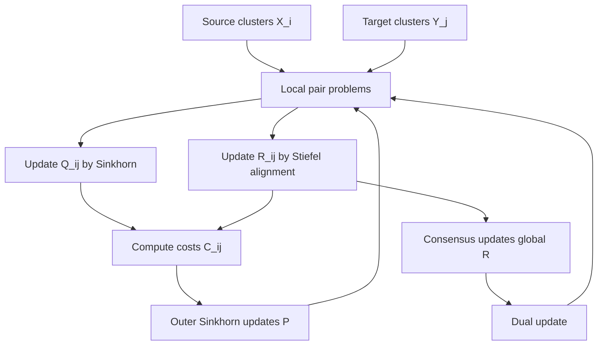

# HiWA 精读笔记：Hierarchical Optimal Transport for Multimodal Distribution Alignment

> 论文：John Lee, Max Dabagia, Eva L. Dyer, Christopher J. Rozell, **Hierarchical Optimal Transport for Multimodal Distribution Alignment**, NeurIPS 2019.
>
> 本文只精读第一篇 HiWA，不展开 Taco。Taco 可以等你之后继续问时作为第二卷。
>
> 重要说明：你上传的材料中有论文正文、官方 MATLAB 代码、Python 代码和 `HiWA_summary.pdf`，但我没有看到单独的 Supplementary Material 证明文件。因此本文对定理证明采取“正文忠实 + 标准理论补全”的方式：论文正文明确给出的定理和 proof sketch 严格保留；正文省略的中间步骤，我用 Optimal Transport（最优传输）、Procrustes perturbation（Procrustes 扰动理论）、Birkhoff polytope（Birkhoff 多面体）和矩阵分析补足。凡是补全推导，不冒充作者补充材料原文。

---

## 0. Obsidian 编译检查

本文件已经按 Obsidian 阅读视图整理：

- 行内公式使用 `$...$`。
- 块级公式使用独立的 `$$...$$`。
- 所有代码块均标明语言并正确闭合。
- Mermaid 图使用 `mermaid` 代码块。
- 不保留 ChatGPT 专用引用标记。
- 复杂公式不放入 Markdown 表格。

---

## 1. 总览：HiWA 到底解决什么问题

### 1.1 一句话概括

HiWA 要解决的是一种 **unsupervised multimodal distribution alignment（无监督多模态分布对齐）** 问题：

> 给定两个相关但坐标系不同的数据集 $X$ 和 $Y$，它们都具有 cluster structure（簇结构）或 multi-subspace structure（多子空间结构）。我们既不知道簇和簇之间如何对应，也不知道点和点之间如何对应，还不知道整体坐标变换。HiWA 希望同时恢复这三件事。

这三件事分别由三个变量表示：

- $P$：cluster correspondence matrix（簇对应矩阵），表示源域第 $i$ 个簇和目标域第 $j$ 个簇的匹配强度。
- $Q_{ij}$：point-wise transport plan（点级运输计划），表示第 $i$ 个源簇和第 $j$ 个目标簇内部点之间如何分配质量。
- $R$：global orthogonal transformation（全局正交变换），表示源域到目标域的整体旋转或反射。

论文的核心公式可以先粗略写成：

$$
\min_{P,R,\{Q_{ij}\}}
\sum_{i,j}P_{ij}
\sum_{k,l}Q_{ij}(k,l)
\|RX_i(k)-Y_j(l)\|_2^2.
\tag{0.1}
$$

这个公式背后的思想是：

1. $P$ 负责“哪一簇对哪一簇”。
2. $Q_{ij}$ 负责“簇内部哪一点对哪一点”。
3. $R$ 负责“整体坐标系怎么对齐”。

---

### 1.2 摘要关键英文原句与译注

#### 原句 1

> "Optimal transport (OT)-based approaches pose alignment as a divergence minimization problem: the aim is to transform a source dataset to match a target dataset using the Wasserstein distance as a divergence measure under alignment constraints."

译注：基于 Optimal Transport（最优传输）的对齐方法，把 alignment（对齐）看成 divergence minimization problem（散度最小化问题）。目标是找一个变换，使源数据变换后尽量接近目标数据，而“接近程度”用 Wasserstein distance（Wasserstein 距离）来度量。

#### 原句 2

> "We introduce a hierarchical formulation of OT which leverages clustered structure in data to improve alignment in noisy, ambiguous, or multimodal settings."

译注：作者提出的是 hierarchical formulation of OT（最优传输的层级形式）。关键词是 clustered structure（簇结构）。作者认为，复杂数据通常不是一个单峰分布，而是由多个簇或多个子空间组成。利用这种结构，可以缓解 noisy（噪声）、ambiguous（歧义）和 multimodal（多模态）带来的局部极小值。

#### 原句 3

> "To solve this numerically, we propose a distributed ADMM algorithm that exploits the Sinkhorn distance."

译注：求解层面，作者提出 distributed ADMM（分布式交替方向乘子法）并使用 Sinkhorn distance（Sinkhorn 距离）。ADMM 用来把不同簇对的局部优化并行化，Sinkhorn 用来高效求熵正则化 OT。

#### 原句 4

> "When the transformation between two datasets is unitary, we provide performance guarantees..."

译注：理论部分主要分析 unitary transformation（酉变换）。在实数空间中，可以把它理解为 orthogonal transformation（正交变换）。因此论文里的理论保证和算法求解都围绕 Stiefel manifold（Stiefel 流形）展开。

---

## 2. 覆盖清单：本文是否覆盖论文内容

| 论文部分 | 本笔记位置 | 覆盖内容 |
|---|---|---|
| Abstract | 第 1 节 | 动机、方法、理论、实验、结论 |
| Introduction | 第 3 节 | alignment 背景、OT 难点、cluster 结构动机 |
| Background and related work | 第 4 节 | transfer learning、low-rank model、OT、hierarchical OT |
| Preliminaries and notation | 第 5 节 | 经验测度、Wasserstein、transport polytope、Birkhoff polytope |
| Hierarchical Wasserstein Alignment | 第 6 节 | 公式 $1$ 到 $5$ 的重排与推导 |
| Distributed ADMM approach | 第 7、8 节 | Sinkhorn、StiefelAlignment、ADMM、Algorithm 1 |
| Parameters / consensus / initialization | 第 8 节 | 熵参数、ADMM 参数、共识更新、初始化稳健性 |
| Theoretical guarantees | 第 9 节 | Theorem 4.1、Theorem 4.2、Lemma 4.3 |
| Synthetic experiments | 第 10 节 | Figure 1 全部子图、指标、结论 |
| Neural decoding example | 第 11 节 | Figure 2、神经解码任务、HiWA/WA/DAD 比较 |
| Conclusion | 第 12 节 | 总结、局限、future directions |
| Official code | 第 13 节 | MATLAB/Python 文件结构和公式对应 |
| Reproduction | 第 14 节 | 复现路线、环境、坑点、最小代码 |

---

## 3. Introduction：为什么需要 HiWA

### 3.1 Distribution alignment（分布对齐）

论文从一个一般的分布对齐问题出发：

$$
\min_{T\in\mathcal T}D\bigl(T(\mu)\mid\nu\bigr).
\tag{1}
$$

其中：

- $\mu$：source distribution（源分布）。
- $\nu$：target distribution（目标分布）。
- $T\in\mathcal T$：待学习的 transformation（变换）。
- $D(\cdot\mid\cdot)$：概率分布之间的 divergence（散度或差异度量）。

如果把 $T$ 理解成“把一个点云移动到另一个点云的坐标变换”，那么式 $1$ 就是：

> 在某个变换类中找一个变换，让变换后的源分布最接近目标分布。

### 3.2 这个问题为什么不适定

Alignment problems are ill-posed（对齐问题不适定），主要有三个原因。

第一，变换类 $\mathcal T$ 太大。若允许任意非线性映射，问题会过拟合；若限制太强，又可能无法对齐真实数据。

第二，点对应未知。若已知 $x_k$ 对应 $y_k$，问题会变成普通 least squares 或 Procrustes；但无监督 setting 下没有这种对应。

第三，多模态结构导致局部极小。若数据由多个簇组成，普通全局 OT 可能把一个簇匹配到错误簇，尤其是在对称结构中。

HiWA 的策略是：

$$
\text{全局复杂对齐}
\quad\Longrightarrow\quad
\text{簇间粗对齐}+\text{簇内细对齐}+\text{全局正交共识}.
\tag{2}
$$

---

## 4. Background and Related Work：相关工作

### 4.1 Transfer learning and distribution alignment

论文把 HiWA 放在 transfer learning（迁移学习）和 distribution alignment（分布对齐）的大背景里。常见分布差异度量如下。

| 方法 | 英文 | 思想 | 局限 |
|---|---|---|---|
| 最小二乘 | Euclidean least squares | 点对应已知时直接最小化平方误差 | 需要已知样本对应 |
| KL 散度 | Kullback-Leibler divergence | 比较概率密度比 | 支撑集不重叠时不稳定 |
| MMD | Maximum Mean Discrepancy | 在 RKHS 中比较分布嵌入 | 依赖核函数，几何解释较弱 |
| Wasserstein | Wasserstein distance | 计算搬运质量的最小代价 | 计算复杂、样本复杂度高 |

作者选择 Wasserstein，是因为它天然利用底层空间的几何结构，适合点云配准和跨域对齐。

### 4.2 Low-rank and union of subspaces

论文强调许多数据有 low-rank structure（低秩结构）或 union of subspaces structure（子空间并结构）。

若第 $i$ 个簇近似落在 $d$ 维子空间上，则可以写成：

$$
X_i\approx A_iZ_i,
\qquad
A_i\in\mathbb R^{D\times d},
\qquad
A_i^\top A_i=I_d.
\tag{3}
$$

其中：

- $D$ 是 ambient dimension（环境维数）。
- $d$ 是 intrinsic dimension（内在维数）。
- $A_i$ 是子空间基。
- $Z_i$ 是低维坐标。

如果整个数据集由多个这种簇组成：

$$
X=\bigcup_{i=1}^{S}X_i,
\qquad
X_i\subset\operatorname{span}(A_i).
\tag{4}
$$

这就是 HiWA 的数据几何假设。

### 4.3 Optimal Transport

离散测度写成：

$$
\mu=\sum_{i=1}^{m}a_i\delta_{x_i},
\qquad
\nu=\sum_{j=1}^{n}b_j\delta_{y_j},
\tag{5}
$$

其中：

$$
a_i,b_j\ge 0,
\qquad
\sum_i a_i=1,
\qquad
\sum_j b_j=1.
\tag{6}
$$

运输计划 $Q$ 满足：

$$
Q\mathbf 1_n=a,
\qquad
Q^\top\mathbf 1_m=b,
\qquad
Q_{ij}\ge 0.
\tag{7}
$$

二阶平方 Wasserstein 距离是：

$$
W_2^2(\mu,\nu)
=
\min_{Q\in U(a,b)}
\sum_{i=1}^{m}\sum_{j=1}^{n}
Q_{ij}\|x_i-y_j\|_2^2.
\tag{8}
$$

直觉：$Q_{ij}$ 表示从 $x_i$ 搬多少质量到 $y_j$，$\|x_i-y_j\|_2^2$ 是单位质量的搬运代价。

### 4.4 Hierarchical OT 与 OT Procrustes

论文把两个已有方向结合起来：

- **OT Procrustes**：用 OT 解决点对应未知，同时学习全局变换。
- **Hierarchical OT**：在层级结构或块结构上做最优传输。

HiWA 的贡献是：第一次将 hierarchical OT 用于同时学习簇对应、点对应和全局变换的分布对齐问题。

---

## 5. Preliminaries and Notation：符号与预备知识

### 5.1 数据与簇

论文考虑两个带簇结构的数据集：

$$
\{X_i\in\mathbb R^{D\times n_{x,i}}\}_{i=1}^{S},
\qquad
\{Y_j\in\mathbb R^{D\times n_{y,j}}\}_{j=1}^{S}.
\tag{9}
$$

约定：

- $X_i(k)$ 是 $X_i$ 的第 $k$ 列。
- $Y_j(l)$ 是 $Y_j$ 的第 $l$ 列。
- 每一列是一个 $D$ 维嵌入坐标。
- $n_{x,i}$ 是源域第 $i$ 个簇的样本数。
- $n_{y,j}$ 是目标域第 $j$ 个簇的样本数。

### 5.2 经验测度 Empirical measure

源簇 $X_i$ 的经验测度是：

$$
\mu_i
=
\frac{1}{n_{x,i}}
\sum_{k=1}^{n_{x,i}}\delta_{X_i(k)}.
\tag{10}
$$

目标簇 $Y_j$ 的经验测度是：

$$
\nu_j
=
\frac{1}{n_{y,j}}
\sum_{l=1}^{n_{y,j}}\delta_{Y_j(l)}.
\tag{11}
$$

这里 $\delta_x$ 是 Dirac measure（Dirac 测度），表示质量集中在点 $x$ 上。

### 5.3 Uniform transport polytope

论文定义 uniform transport polytope（均匀运输多面体）：

$$
U(m,n)
=
\left\{
Q\in\mathbb R_+^{m\times n}:
Q\mathbf 1_n=\frac{1}{m}\mathbf 1_m,
\quad
Q^\top\mathbf 1_m=\frac{1}{n}\mathbf 1_n
\right\}.
\tag{12}
$$

这表示：$m$ 个源点和 $n$ 个目标点都带均匀质量。

### 5.4 Birkhoff polytope

当 $m=n=S$ 时，$U(S,S)$ 是缩放后的 Birkhoff polytope：

$$
\mathcal B_S:=U(S,S).
\tag{13}
$$

若 $P\in\mathcal B_S$，则：

$$
P\mathbf 1_S=\frac{1}{S}\mathbf 1_S,
\qquad
P^\top\mathbf 1_S=\frac{1}{S}\mathbf 1_S.
\tag{14}
$$

它可理解为簇级别的运输计划。若 $P$ 接近 $\frac{1}{S}$ 倍的置换矩阵，就代表簇之间接近一一匹配。

---

## 6. Hierarchical Wasserstein Alignment：核心方法

### 6.1 层级目标函数

论文从一般的分布对齐转向簇级结构：

$$
\min_{P\in\mathcal B_S,\;T\in\mathcal T}
\sum_{i=1}^{S}\sum_{j=1}^{S}
P_{ij}W_2^2\bigl(T(\mu_i),\nu_j\bigr).
\tag{15}
$$

解释：

- 外层 $P$ 决定 cluster-level correspondence（簇级对应）。
- 内层 $W_2^2$ 决定 point-wise correspondence（点级对应）。
- $T$ 决定全局空间变换。

这就是 nested OT（嵌套最优传输）结构。

### 6.2 为什么选择 Stiefel manifold

论文假设不同簇大致在低维子空间上，而且源域和目标域之间保留了子空间夹角结构。因此使用 isometric transformation（等距变换）足够。

在实数情形中，等距线性变换由正交矩阵表示：

$$
R^\top R=I_D.
\tag{16}
$$

Stiefel manifold 定义为：

$$
V_{k,d}
=
\{R\in\mathbb R^{k\times d}:R^\top R=I_d\}.
\tag{17}
$$

本文用的是 $V_{D,D}$，即正交群 $O(D)$。

### 6.3 具体 HiWA 目标

将 $T$ 设为 $R$ 后，得到论文公式：

$$
\min_{P,R,\{Q_{ij}\}}
\sum_{i,j}P_{ij}C_{ij}(R,Q_{ij})
\tag{18}
$$

约束为：

$$
P\in\mathcal B_S,
\qquad
R\in V_{D,D},
\qquad
Q_{ij}\in U(n_{x,i},n_{y,j}).
\tag{19}
$$

其中：

$$
C_{ij}(R,Q_{ij})
=
\frac{1}{D}
\sum_{k,l}
Q_{ij}(k,l)
\|RX_i(k)-Y_j(l)\|_2^2.
\tag{20}
$$

### 6.4 式 $20$ 的完整展开

令 $x_k=X_i(k)$，$y_l=Y_j(l)$。则：

$$
\|Rx_k-y_l\|_2^2
=
(Rx_k-y_l)^\top(Rx_k-y_l).
\tag{21}
$$

展开：

$$
\|Rx_k-y_l\|_2^2
=
x_k^\top R^\top R x_k
+
y_l^\top y_l
-
2y_l^\top R x_k.
\tag{22}
$$

由于 $R^\top R=I_D$，所以：

$$
\|Rx_k-y_l\|_2^2
=
\|x_k\|_2^2+\|y_l\|_2^2-2y_l^\top R x_k.
\tag{23}
$$

代入 $C_{ij}$：

$$
C_{ij}(R,Q)
=
\frac{1}{D}
\left[
\sum_{k,l}Q_{kl}\|x_k\|^2
+
\sum_{k,l}Q_{kl}\|y_l\|^2
-
2\sum_{k,l}Q_{kl}y_l^\top R x_k
\right].
\tag{24}
$$

因为 $Q$ 的边缘固定，前两项在固定数据下与 $R$ 无关。第三项写成矩阵形式：

$$
\sum_{k,l}Q_{kl}y_l^\top R x_k
=
\operatorname{tr}(R^\top Y_jQ^\top X_i^\top).
\tag{25}
$$

因此固定 $Q$ 时，最小化 $C_{ij}$ 等价于：

$$
\max_{R\in V_{D,D}}
\operatorname{tr}(R^\top Y_jQ^\top X_i^\top).
\tag{26}
$$

这就是后面 StiefelAlignment 的来源。

### 6.5 熵正则化

精确 OT 要解线性规划，代价高。论文加入 entropic regularization（熵正则化）：

$$
\min_{P,R,\{Q_{ij}\}}
\sum_{i,j}
\left(
P_{ij}C_{ij}(R,Q_{ij})
+
H_{\varepsilon_2}(Q_{ij})
\right)
+
H_{\varepsilon_1}(P).
\tag{27}
$$

其中：

$$
H_\varepsilon(M)
=
\varepsilon
\sum_{a,b}M_{ab}\log M_{ab}.
\tag{28}
$$

当 $\varepsilon_1,\varepsilon_2\to 0$ 时，回到未正则的原始问题。较大的 $\varepsilon$ 会让运输计划更平滑，也更容易数值优化，但会引入偏差。

---

## 7. Sinkhorn 与 Procrustes 推导

### 7.1 Sinkhorn 子问题

考虑熵正则 OT：

$$
\min_{Q\in U(a,b)}
\langle C,Q\rangle
+
\gamma\sum_{i,j}Q_{ij}(\log Q_{ij}-1).
\tag{29}
$$

拉格朗日函数：

$$
\mathcal L(Q,\alpha,\beta)
=
\sum_{i,j}C_{ij}Q_{ij}
+
\gamma\sum_{i,j}Q_{ij}(\log Q_{ij}-1)
+
\sum_i\alpha_i\left(a_i-\sum_jQ_{ij}\right)
+
\sum_j\beta_j\left(b_j-\sum_iQ_{ij}\right).
\tag{30}
$$

对 $Q_{ij}$ 求偏导：

$$
\frac{\partial\mathcal L}{\partial Q_{ij}}
=
C_{ij}+\gamma\log Q_{ij}-\alpha_i-\beta_j.
\tag{31}
$$

令其为零：

$$
Q_{ij}
=
\exp\left(\frac{\alpha_i}{\gamma}\right)
\exp\left(-\frac{C_{ij}}{\gamma}\right)
\exp\left(\frac{\beta_j}{\gamma}\right).
\tag{32}
$$

定义：

$$
u_i=e^{\alpha_i/\gamma},
\qquad
v_j=e^{\beta_j/\gamma},
\qquad
K_{ij}=e^{-C_{ij}/\gamma}.
\tag{33}
$$

得到：

$$
Q=\operatorname{diag}(u)K\operatorname{diag}(v).
\tag{34}
$$

由边缘约束：

$$
Q\mathbf 1=b,
\qquad
Q^\top\mathbf 1=a,
\tag{35}
$$

得到迭代：

$$
u=a\oslash(Kv),
\qquad
v=b\oslash(K^\top u).
\tag{36}
$$

这里 $\oslash$ 表示 elementwise division（逐元素除法）。

### 7.2 为什么局部温度是 $\varepsilon_2/P_{ij}$

固定 $P_{ij}$ 与 $R$ 后，局部 $Q_{ij}$ 子问题是：

$$
\min_{Q_{ij}\in U}
P_{ij}\langle C_{ij}(R),Q_{ij}\rangle
+
\varepsilon_2
\sum_{k,l}Q_{ij}(k,l)\log Q_{ij}(k,l).
\tag{37}
$$

若 $P_{ij}>0$，除以 $P_{ij}$ 得到等价问题：

$$
\min_{Q_{ij}\in U}
\langle C_{ij}(R),Q_{ij}\rangle
+
\frac{\varepsilon_2}{P_{ij}}
\sum_{k,l}Q_{ij}(k,l)\log Q_{ij}(k,l).
\tag{38}
$$

因此局部 Sinkhorn 正则参数为：

$$
\gamma_{ij}=\frac{\varepsilon_2}{P_{ij}}.
\tag{39}
$$

这就是官方 MATLAB 代码中 `sh_gamma/Pij` 的来源。

### 7.3 Orthogonal Procrustes

经典问题：

$$
\min_{R\in O(D)}\|Y-RX\|_F^2.
\tag{40}
$$

展开：

$$
\|Y-RX\|_F^2
=
\|Y\|_F^2+\|RX\|_F^2
-
2\operatorname{tr}(Y^\top RX).
\tag{41}
$$

因为 $R^\top R=I$，所以 $\|RX\|_F=\|X\|_F$。于是式 $40$ 等价于：

$$
\max_{R\in O(D)}
\operatorname{tr}(R^\top YX^\top).
\tag{42}
$$

若：

$$
YX^\top=U\Sigma V^\top,
\tag{43}
$$

则最优解为：

$$
R^*=UV^\top.
\tag{44}
$$

这就是 Algorithm 1 中 `STIEFELALIGNMENT(A)` 的数学内容。

---

## 8. Distributed ADMM Approach

### 8.1 为什么要引入局部变量 $R_{ij}$

原问题难点在于所有簇对共享同一个 $R$。作者引入每个簇对自己的局部旋转 $R_{ij}$，并要求它们最终一致：

$$
R_{ij}=\widetilde R,
\qquad
\forall i,j.
\tag{45}
$$

于是可以并行解决每个局部簇对问题，再通过 consensus step（共识步骤）聚合。

### 8.2 增广拉格朗日

使用 scaled dual variable（缩放对偶变量）$L_{ij}$，可写成：

$$
\mathcal L_\rho
=
\sum_{i,j}
\left[
P_{ij}C_{ij}(R_{ij},Q_{ij})
+
\frac{\rho}{2D}
\|R_{ij}-\widetilde R+L_{ij}\|_F^2
+
H_{\varepsilon_2}(Q_{ij})
\right]
+
H_{\varepsilon_1}(P)
+
\text{const}.
\tag{46}
$$

### 8.3 $R_{ij}$ 的局部更新

固定 $Q_{ij}$、$P_{ij}$、$\widetilde R$、$L_{ij}$，需要解：

$$
\min_{R_{ij}\in O(D)}
P_{ij}C_{ij}(R_{ij},Q_{ij})
+
\frac{\rho}{2D}
\|R_{ij}-\widetilde R+L_{ij}\|_F^2.
\tag{47}
$$

由前面展开可知，它等价于：

$$
R_{ij}^{t+1}
=
\operatorname{StiefelAlignment}
\left(
2P_{ij}Y_jQ_{ij}^\top X_i^\top
+
\rho(\widetilde R^t-L_{ij}^t)
\right).
\tag{48}
$$

官方代码里由于对数据做了 $1/\sqrt D$ 缩放，出现的是：

```matlab
T = mu/D*(Rg - L(:,:,k));
R = ClosedFormRotationSolver(2*Pij*YY*Q'*XX' + T);
```

### 8.4 $Q_{ij}$ 更新

固定 $R_{ij}$ 后，构造代价：

$$
C_{kl}
=
\frac{1}{D}
\|R_{ij}X_i(k)-Y_j(l)\|_2^2.
\tag{49}
$$

然后调用 Sinkhorn：

$$
Q_{ij}
=
\operatorname{Sinkhorn}\left(
\frac{\varepsilon_2}{P_{ij}},
C
\right).
\tag{50}
$$

### 8.5 $P$ 更新

所有局部簇对代价 $C_{ij}$ 得到后，外层簇对应矩阵通过 Sinkhorn 更新：

$$
P
=
\operatorname{Sinkhorn}(\varepsilon_1,\;[C_{ij}]).
\tag{51}
$$

这里 $[C_{ij}]$ 是 $S\times S$ 的 cluster cost matrix（簇代价矩阵）。

### 8.6 全局共识更新

固定 $R_{ij}$ 和 $L_{ij}$，更新全局 $R$：

$$
\widetilde R^{t+1}
=
\arg\min_{R\in O(D)}
\sum_{i,j}
\|R_{ij}^{t+1}-R+L_{ij}^{t}\|_F^2.
\tag{52}
$$

等价于：

$$
\widetilde R^{t+1}
=
\operatorname{Proj}_{O(D)}
\left(
\frac{1}{S^2}
\sum_{i,j}(R_{ij}^{t+1}+L_{ij}^{t})
\right).
\tag{53}
$$

### 8.7 对偶变量更新

$$
L_{ij}^{t+1}
=
L_{ij}^{t}+R_{ij}^{t+1}-\widetilde R^{t+1}.
\tag{54}
$$

---

## 9. Algorithm 1 逐行解释

### 9.1 主算法伪代码

```text
Input: ε1, ε2, μ, {Xi}, {Yj}
Initialize R, P, Λij
while not converged:
    for all cluster pairs (i,j) in parallel:
        initialize Qij
        while local not converged:
            update Rij by StiefelAlignment
            update Qij by Sinkhorn
        end
    update P by cluster-level Sinkhorn
    update global R by StiefelAlignment consensus
    update dual variables Λij
end
```

逐行含义：

1. 输入熵正则参数、ADMM 参数和两个簇化数据集。
2. 初始化全局正交矩阵 $R$、簇对应 $P$ 和对偶变量。
3. 外循环对应 ADMM。
4. 对所有 $(i,j)$ 簇对并行处理。
5. 初始化 $Q_{ij}$ 为均匀运输计划。
6. 内循环交替更新 $R_{ij}$ 与 $Q_{ij}$。
7. 用 StiefelAlignment 更新局部正交变换。
8. 用 Sinkhorn 更新簇内点对应。
11. 用簇对代价矩阵更新 $P$。
12. 汇总所有局部旋转，更新全局 $R$。
13. 更新对偶变量。

### 9.2 变量流向图



### 9.3 参数解释

| 参数 | 英文 | 作用 |
|---|---|---|
| $\varepsilon_1$ | cluster entropy parameter | 控制簇级 $P$ 的平滑程度 |
| $\varepsilon_2$ | point entropy parameter | 控制点级 $Q_{ij}$ 的平滑程度 |
| $\rho$ 或 $\mu$ | ADMM penalty parameter | 控制局部 $R_{ij}$ 和全局 $R$ 的共识强度 |
| `maxiter` | maximum iterations | 控制外层迭代次数 |
| `tol` | tolerance | 控制停止标准 |
| `sh_gamma` | Sinkhorn regularization | 代码中的 Sinkhorn 熵正则参数 |

### 9.4 Robustness against initial conditions

论文特别说明：作者故意把 $R_{ij},Q_{ij}$ 的更新放在 $P$ 之前。这样当 ADMM 参数较小时，早期迭代更多受数据驱动，而不是被随机初始化的 $P$ 锁死。

这点很重要：HiWA 的稳健性不只来自目标函数，也来自更新顺序设计。

---

## 10. Theoretical Guarantees：理论保证

### 10.1 理论部分的共同假设

理论部分简化假设：

1. 每个簇样本数相同，均为 $n$。
2. 真实簇对应是对角的：

$$
P^*=\frac{1}{S}I_S.
\tag{55}
$$

3. 每个簇严格低秩。
4. 真实变换是 unitary / orthogonal。
5. 详细证明在 supplementary material 中；当前上传材料未包含该文件。

---

### 10.2 Theorem 4.1：Correspondence disambiguity criterion

#### 定理陈述

定义最优簇对代价：

$$
\widehat C_{ij}^*
=
\min_{R\in V_{D,D},\;Q_{ij}\in\mathcal B_n}
C_{ij}(R,Q_{ij}).
\tag{56}
$$

如果对所有 $i\ne j$ 有：

$$
\widehat C_{ij}^*
+
\widehat C_{ji}^*
-
\widehat C_{ii}^*
-
\widehat C_{jj}^*
>
B_{x,i}(\delta)+B_{y,i}(\delta)+B_{x,j}(\delta)+B_{y,j}(\delta),
\tag{57}
$$

其中

$$
B_{z,k}(\delta)
=
c_{z,k}n^{-2/d_{z,k}}
+
\sqrt{\frac{\log(1/\delta)}{2n}},
\tag{58}
$$

且

$$
c_{z,k}
=
1458
\left(
2+
\frac{1}{3^{d_{z,k}/2-2}-1}
\right),
\tag{59}
$$

则问题 $18$ 以至少 $1-\delta$ 的概率得到唯一全局最优簇对应：

$$
P^*=\frac{1}{S}I_S.
\tag{60}
$$

#### 直觉

式 $57$ 左边是正确匹配和错误匹配之间的 cost margin（代价间隔）。右边是有限样本 Wasserstein 估计误差预算。只要真实几何间隔大过采样误差，簇对应就能被恢复。

#### 证明重建第一步：Birkhoff 多面体上的置换比较

理想情况下，簇级问题是：

$$
\min_{P\in\mathcal B_S}\langle C,P\rangle.
\tag{61}
$$

由于 Birkhoff polytope 的极点是置换矩阵，比较任意置换 $\pi$ 与恒等置换即可。置换 $\pi$ 的代价是：

$$
J(\pi)=\frac{1}{S}\sum_i C_{i,\pi(i)}.
\tag{62}
$$

恒等置换代价是：

$$
J(\operatorname{id})=\frac{1}{S}\sum_i C_{ii}.
\tag{63}
$$

差值为：

$$
S\bigl(J(\pi)-J(\operatorname{id})\bigr)
=
\sum_i\left(C_{i,\pi(i)}-C_{ii}\right).
\tag{64}
$$

对称化：

$$
2S\bigl(J(\pi)-J(\operatorname{id})\bigr)
=
\sum_i
\left(
C_{i,\pi(i)}+C_{\pi(i),i}
-
C_{ii}
-
C_{\pi(i),\pi(i)}
\right).
\tag{65}
$$

如果对所有 $i\ne j$：

$$
C_{ij}+C_{ji}-C_{ii}-C_{jj}>0,
\tag{66}
$$

则任意非恒等置换都比恒等置换代价高。因此 $I_S/S$ 是唯一最优。

#### 证明重建第二步：有限样本扰动

实际观察到的是经验测度，所以 cost matrix 存在扰动。Wasserstein concentration bound 给出：

$$
|\widehat C_{ij}-C_{ij}|
\lesssim
B_{x,i}(\delta)+B_{y,j}(\delta).
\tag{67}
$$

为了让扰动后仍保持式 $66$，需要 margin 大于四个误差项之和，于是得到式 $57$。

#### 学习重点

Theorem 4.1 的意思不是“正确簇必须完全重合”，而是：

> 正确匹配要比错误匹配明显更便宜，且便宜的程度要超过有限样本噪声。

---

### 10.3 Theorem 4.2：Cluster-based alignment perturbation bounds

#### 定理陈述

给定正确点级对应 $Q_{ii}$，定义聚合矩阵：

$$
X=[X_1Q_{11},X_2Q_{22},\dots,X_cQ_{cc}],
\qquad
Y=[Y_1,Y_2,\dots,Y_c].
\tag{68}
$$

定义全局结构失真：

$$
\varepsilon^2
=
\|Y^\top Y-X^\top X\|_F.
\tag{69}
$$

若 Theorem 4.1 成立，$X$ 满行秩，且：

$$
\varepsilon\|X^\dagger\|
\le
\frac{1}{\sqrt 2}
\left(\|X\|\|X^\dagger\|\right)^{-1/2},
\tag{70}
$$

则：

$$
\min_{P\in\mathcal B_c,\;R\in V_{D,D}}
\sum_{i,j}P_{ij}C_{ij}(R)
\le
\left(\|X\|\|X^\dagger\|+2\right)^2
\|X^\dagger\|^2
\varepsilon^4
+
D_0.
\tag{71}
$$

其中：

$$
D_0
=
\sum_{i=1}^{c}
\operatorname{tr}
\left(
X_i
\left(\frac{1}{n}I-Q_{ii}Q_{ii}^\top\right)
X_i^\top
+
\left(\frac{1}{n}-1\right)
Y_iY_i^\top
\right).
\tag{72}
$$

#### 定理含义

Theorem 4.1 说明“簇匹配能否恢复”。Theorem 4.2 说明“簇匹配恢复后，全局对齐误差由什么控制”。核心是 Gram matrix（Gram 矩阵）：

$$
X^\top X,
\qquad
Y^\top Y.
\tag{73}
$$

Gram 矩阵保存了点之间的内积结构，也就是整体角度和距离结构。若两个 Gram 矩阵接近，则存在好的正交对齐。

#### 推导：把 Wasserstein 目标改写为 Procrustes 目标

对某个正确匹配簇 $i$：

$$
C_{ii}(R,Q_{ii})
=
\frac{1}{D}
\sum_{k,l}
Q_{ii}(k,l)\|Rx_{ik}-y_{il}\|^2.
\tag{74}
$$

展开得：

$$
D C_{ii}(R,Q_{ii})
=
\frac{1}{n}\operatorname{tr}(X_iX_i^\top)
+
\frac{1}{n}\operatorname{tr}(Y_iY_i^\top)
-
2\operatorname{tr}(R^\top Y_iQ_{ii}^\top X_i^\top).
\tag{75}
$$

另一方面：

$$
\|Y_i-RX_iQ_{ii}\|_F^2
=
\operatorname{tr}(Y_iY_i^\top)
+
\operatorname{tr}(X_iQ_{ii}Q_{ii}^\top X_i^\top)
-
2\operatorname{tr}(R^\top Y_iQ_{ii}^\top X_i^\top).
\tag{76}
$$

比较式 $75$ 和式 $76$，可得：

$$
D C_{ii}(R,Q_{ii})
=
\|Y_i-RX_iQ_{ii}\|_F^2
+
D_i.
\tag{77}
$$

其中 $D_i$ 是只依赖数据和 $Q_{ii}$ 的常数。对 $i$ 求和：

$$
D\sum_i C_{ii}(R,Q_{ii})
=
\|Y-RX\|_F^2+D_0.
\tag{78}
$$

然后调用 Procrustes perturbation bound：

$$
\min_{R\in O(D)}\|Y-RX\|_F
\le
(\|X\|\|X^\dagger\|+2)\|X^\dagger\|\varepsilon^2.
\tag{79}
$$

平方并代回式 $78$，得到式 $71$。

### 10.4 Angular shift 与 spectral shift

论文进一步定义块误差：

$$
\varepsilon_{ij}
=
\|Y_i^\top Y_j-Q_{ii}^\top X_i^\top X_jQ_{jj}\|_F.
\tag{80}
$$

设奇异值分解为：

$$
X_iQ_{ii}=A_i\Sigma_{x,i}V^\top,
\qquad
Y_i=B_i\Sigma_{y,i}V^\top.
\tag{81}
$$

则：

$$
\varepsilon_{ij}
=
\left\|
\Sigma_{y,i}B_i^\top B_j\Sigma_{y,j}
-
\Sigma_{x,i}A_i^\top A_j\Sigma_{x,j}
\right\|_F.
\tag{82}
$$

这说明误差来自两部分：

- **Angular shift（角度漂移）**：$B_i^\top B_j$ 与 $A_i^\top A_j$ 不一致。
- **Spectral shift（谱漂移）**：$Y$ 和 $X$ 的奇异值谱不一致。

---

### 10.5 Lemma 4.3：Uninformative alignment

#### 引理陈述

给定簇 $X_i,Y_j$ 和点级对应 $Q_{ij}$，令 $\widetilde U,\widetilde V$ 是矩阵

$$
Y_jQ_{ij}^\top X_i^\top
\tag{83}
$$

对应非零奇异值的左右奇异向量。定义：

$$
\mathcal T(U^0,V^0)
=
\{R\in\mathbb R^{D\times D}:R^\top R=I,\;RV^0=U^0\}.
\tag{84}
$$

则：

$$
\min_{R\in\mathcal T(U^0,V^0)}C_{ij}(R)
\ge
\min_{R\in V_{D,D}}C_{ij}(R).
\tag{85}
$$

等号成立条件是先验方向与内在奇异方向具有一致的 principal angles（主角）。

#### 证明思路

因为：

$$
C_{ij}(R)=\text{const}-\frac{2}{D}\langle R,M\rangle,
\qquad
M=Y_jQ_{ij}^\top X_i^\top,
\tag{86}
$$

所以最小化 $C_{ij}$ 等价于最大化 $\langle R,M\rangle$。若

$$
M=U\Sigma V^\top,
\tag{87}
$$

由 von Neumann trace inequality（冯·诺依曼迹不等式）：

$$
\max_{R\in O(D)}\langle R,M\rangle
=
\sum_r\sigma_r(M).
\tag{88}
$$

无约束最优解必须把右奇异子空间映射到左奇异子空间。若额外要求 $RV^0=U^0$，只有当这个先验约束和最优奇异方向一致时，最优值才不下降。

#### 直接后果

如果数据的子空间是 equally-spaced（等距）或 mutually orthogonal（两两正交），则外部角度信息无法帮助区分正确对齐。这是 HiWA 的 worst-case geometry（最坏几何结构）。

---

## 11. Numerical Experiments：实验精读

## 11.1 Synthetic low-rank Gaussian mixture dataset

### 数据生成

论文对每个簇执行以下过程：

1. 生成低维高斯参数 $\mu_i\in\mathbb R^d$ 和 $\Sigma_i\succeq 0$。
2. 从该高斯分布采样 $n$ 个点。
3. 投影到 $D>d$ 的随机子空间 $V_i\in\mathbb R^{D\times d}$。
4. 对源域施加真实正交变换 $R^*$ 生成目标域。

### 指标 1：alignment error

$$
\operatorname{err}_{align}
=
\frac{\|\widehat R X-R^*X\|_F^2}{\|R^*X\|_F^2}.
\tag{89}
$$

### 指标 2：correspondence error

$$
\operatorname{err}_{corr}
=
\sum_{i,j}
|\widehat P_{ij}-P^*_{ij}|.
\tag{90}
$$

### Figure 1(a)(b)：average case vs worst case

设置：

- $S=5$；
- $d=2$；
- $D=6$；
- $n\in\{25,100\}$；
- random subspaces：随机从 Grassmann manifold 取子空间；
- equally-spaced subspaces：人为构造等距子空间。

结论：随机子空间明显优于等距子空间。这支持 Lemma 4.3：等距结构是最坏情况，因为几何信息无法帮助打破歧义。

### Figure 1(c)(d)：样本数和维度影响

设置：

- $d\in\{2,3,4,5\}$；
- $n\in\{12,25,50,100,200\}$；
- $S=5$；
- 调整 $D$ 保持平均子空间相关性大致一致。

结论：

- $n$ 增大，误差下降。
- $d$ 增大，问题更难。
- 实验表现好于未正则 Wasserstein 的理论 $O(n^{-1/d})$ 直觉，作者认为可能得益于 Sinkhorn 的更优样本复杂度。

### Figure 1(e)(f)：消融与方法比较

比较方法：

| 方法 | 说明 |
|---|---|
| HiWA | 已知簇，但簇对应未知 |
| HiWA-SSC | 先用 Sparse Subspace Clustering 估计簇，再用 HiWA |
| WA | 不使用簇结构的 Wasserstein Alignment |
| SA | Subspace Alignment |
| CORAL | Correlation Alignment |
| ICP | Iterative Closest Point |

官方代码确认：

- `figure1e.m`：$S=2,d=2,D=2,N=50$，较简单低维场景。
- `figure1f.m`：$S=5,d=2,D=6,N=50$，更复杂场景。

结论：

- HiWA 最强。
- HiWA-SSC 接近 HiWA，说明即使簇需要估计，层级结构仍然有效。
- WA 明显弱于 HiWA，说明全局 OT Procrustes 会陷入局部极小。
- SA / CORAL 在复杂场景中表现差，因为它们无法解决簇置换歧义。
- ICP 对初始化敏感。

---

## 11.2 Neural population decoding example

### 任务背景

论文将 HiWA 应用于 neural decoding（神经解码）：从 macaque primary motor cortex（猕猴初级运动皮层）神经活动中预测 reaching direction（伸手方向）。

关键困难是：神经信号随时间 drift（漂移），因此需要跨天或跨条件对齐。

### 数据流程

1. spike sorting；
2. binning；
3. factor analysis 降到 3D；
4. 将神经低维表示作为 source distribution；
5. 将运动方向的 3D 表示作为 target distribution；
6. 使用 HiWA 对齐。

### Figure 2(a)

图 2(a) 展示 distribution alignment 如何把 neural activity 的低维嵌入对齐到 movement pattern。

### Figure 2(b)

比较 HiWA、WA、DAD 随每簇样本数下降的表现。

结果：

- HiWA 即使每簇样本数降到 8，仍保持 $>70\%$ cluster correspondence accuracy。
- DAD 样本多时可竞争，但样本少时快速下降。
- WA 因局部极小，无法稳定找到正确簇对应。

### Figure 2(c)

论文研究八种 reaching direction subsets。

- 当只有两个方向时，全局几何太对称，几乎无用。
- 当有三个方向时，全局几何开始有用，但若仍有对称性，还需要局部不对称或少量监督信息。

结论：层级结构能帮助解决 globally symmetric movement distributions（全局对称运动分布）中的歧义。

---

## 12. Conclusion：结论与局限

论文结论：

> HiWA 是一种基于 Wasserstein 距离的层级分布对齐方法，具备高效数值算法和理论保证。它在合成低秩高斯混合数据和真实神经解码数据上都优于忽略层级结构的方法。

论文提出的 future directions：

1. 扩展到 non-rigid transformations（非刚性变换）。
2. 应用于更高维神经数据。
3. 减少对外部行为协变量的依赖。

本文补充的局限理解：

- 正交变换假设较强。
- 簇结构需要已知或可估计。
- 理论主要覆盖 balanced clusters 与 unitary transformation。
- 对称子空间是最坏情况。
- Sinkhorn 和 ADMM 参数会影响数值稳定性。

---

## 13. 代码映射

### 13.1 MATLAB：`HiWA.m`

| 代码位置 | 功能 | 数学对象 |
|---|---|---|
| 第 40--63 行 | 默认参数与参数读取 | $\varepsilon_1,\varepsilon_2,\rho$ |
| 第 65--79 行 | 初始化 | $R_g,P,L,R,C$ |
| 第 81--97 行 | 低秩投影与缩放 | $A_iA_i^\top X_i$、$B_jB_j^\top Y_j$ |
| 第 104--111 行 | 并行局部求解 | $R_{ij},Q_{ij},C_{ij}$ |
| 第 114 行 | 外层 Sinkhorn | 更新 $P$ |
| 第 117--118 行 | 全局 Stiefel 投影 | 更新 $R_g$ |
| 第 121 行 | 对偶变量更新 | $L\leftarrow L+R-R_g$ |
| 第 162--188 行 | `WAsolver` | 局部交替优化 |
| 第 191--195 行 | `ClosedFormRotationSolver` | $R=UV^\top$ |
| 第 198--214 行 | `Sinkhorn` | 点级 $Q_{ij}$ |
| 第 217--227 行 | `SinkhornC` | 簇级 $P$ |

### 13.2 Python：`PyHiWA/src/hiwa.py`

| 模块 | 功能 | 数学对象 |
|---|---|---|
| `_closed_form_rotation_solver` | SVD 投影 | Procrustes |
| `_sinkhorn` | 点级 Sinkhorn | $Q_{ij}$ |
| `_sinkhorn_clusters` | 簇级 Sinkhorn | $P$ |
| `HiWA.fit` | 主训练过程 | Algorithm 1 |
| `_subspace_alignment_solver` | 局部簇对问题 | $R_{ij},Q_{ij}$ |

### 13.3 MATLAB 与 Python 的一个重要差异

- MATLAB：样本按列存储，即 $D\times n$。
- Python：通常样本按行存储，即 $n\times D$。

移植公式时最容易在这里出错。

---

## 14. 复现准备

### 14.1 推荐复现顺序

1. 先跑 `hiwa-matlab/code/demo.m` 或 `PyHiWA/HiWA-Demo.ipynb`。
2. 再跑 `figure1ab.m`，理解 average case 和 worst case。
3. 再跑 `figure1cd.m`，理解样本数和维度影响。
4. 最后跑 `figure1e.m`、`figure1f.m`，比较不同 baseline。

### 14.2 MATLAB 最小示例

```matlab
clearvars;
addpath('toolbox/');

S = 5;
d = 2;
D = 6;
N = 50;
Nvar = 0.0;
delta = 0.01;

HiWAparam.maxiter = 200;
HiWAparam.tol = 1e-3;
HiWAparam.mu = 2e-2;
HiWAparam.shorn.gamma = 2e-1;
HiWAparam.shorn.maxiter = 1000;
HiWAparam.WAparam.miter = 100;
HiWAparam.WAparam.sh_gamma = 1e-1;
HiWAparam.WAparam.sh_miter = 150;
HiWAparam.WAparam.tol = 1e-2;
HiWAparam.display = 10;

rng(1);
[A,B,X,Y,XX,YY,Rgt,Lx,Ly] = GenerateSyntheticSubspaceData(S,D,d,N,Nvar,delta,0);
HiWAparam.Rgt = Rgt;

[Rg,P,diagnostic] = HiWA(A,X,B,Y,HiWAparam);

rMSE = norm(Rgt*XX - Rg*XX,'fro')^2 / norm(Rgt*XX,'fro')^2;
disp(rMSE);
disp(P);
```

### 14.3 Python 最小示例

```python
from sklearn.decomposition import PCA
from src.hiwa import HiWA

model = HiWA(
    dim_red_method=PCA(n_components=2),
    normalize=True,
    maxiter=300,
    tol=1e-1,
    mu=5e-3,
    shorn_maxiter=1000,
    shorn_gamma=2e-1,
    sa_maxiter=100,
    sa_tol=1e-2,
    sa_shorn_maxiter=150,
    sa_shorn_gamma=1e-1,
)

model.fit(X, X_labels, Y, Y_labels)
X_aligned = model.transform(X)

print(model.Rg)
print(model.P)
```

### 14.4 常见坑点

- MATLAB 与 Python 的样本方向相反。
- `HiWA.m` 假设簇已知；`HiWASSC.m` 是无监督聚类版本。
- Figure 1(e)(f) 需要额外下载 `SSC_ADMM_v1.1`。
- Sinkhorn 的 $\gamma$ 太小会导致 `exp(-C/gamma)` 下溢。
- PCA 或其他降维方式如果破坏簇结构，HiWA 会失败。
- 等距子空间和高维近正交子空间是理论最坏情形。

---

## 15. 迁移和改进时最值得修改的模块

### 15.1 变换类

原始 HiWA 使用：

$$
R\in V_{D,D}.
\tag{91}
$$

可改为：

- affine transform（仿射变换）；
- low-rank linear map（低秩线性映射）；
- kernel map（核映射）；
- neural projector（神经网络投影）。

但一旦不再正交，Theorem 4.2 的 Procrustes 理论不能直接使用。

### 15.2 簇结构

原始 HiWA 用 hard clusters。若簇边界模糊，可以改为 soft groups：

$$
\mu_i=\sum_k a_k^{(i)}\delta_{x_k}.
\tag{92}
$$

这就是 Taco/GCOT 的方向。

### 15.3 OT 类型

若样本数、质量或簇数不平衡，可考虑：

- Unbalanced OT（非平衡最优传输）；
- Partial OT（部分最优传输）；
- Gromov-Wasserstein（Gromov-Wasserstein 距离）；
- Fused Gromov-Wasserstein（融合 Gromov-Wasserstein）。

### 15.4 计算效率

若簇数 $S$ 很大，$S^2$ 个簇对会很慢。可考虑：

- 先筛候选簇对；
- mini-batch Sinkhorn；
- GPU log-domain Sinkhorn；
- sparse transport；
- low-rank cost approximation。

---

## 16. 最终学习总结

HiWA 的核心不是单个公式，而是一个三层结构：

$$
\boxed{
\text{cluster correspondence }P
+
\text{point transport }Q_{ij}
+
\text{global orthogonal map }R
}
\tag{93}
$$

你应该真正掌握下面四句话：

1. 普通 OT alignment 容易在多模态结构中陷入局部极小。
2. HiWA 用簇级 OT 先处理粗对应，再用簇内 OT 处理细对应。
3. Stiefel manifold 上的正交变换让问题保持几何可解释性，也使 Procrustes 闭式解可用。
4. 理论保证说明：簇间 margin、Gram 结构失真和子空间对称性决定 HiWA 的成功或失败。

---

## 17. 参考资料

1. Lee, J., Dabagia, M., Dyer, E. L., Rozell, C. J. **Hierarchical Optimal Transport for Multimodal Distribution Alignment**. NeurIPS 2019.
2. Cuturi, M. **Sinkhorn Distances: Lightspeed Computation of Optimal Transport**. NeurIPS 2013.
3. Genevay, A., Chizat, L., Bach, F., Cuturi, M., Peyré, G. **Sample Complexity of Sinkhorn Divergences**. AISTATS 2019.
4. Weed, J., Bach, F. **Sharp asymptotic and finite-sample rates of convergence of empirical measures in Wasserstein distance**. Bernoulli 2019.
5. Arias-Castro, E., Javanmard, A., Pelletier, B. **Perturbation bounds for Procrustes, classical scaling, and trilateration, with applications to manifold learning**. JMLR 2020.
6. Boyd, S., Parikh, N., Chu, E., Peleato, B., Eckstein, J. **Distributed Optimization and Statistical Learning via the Alternating Direction Method of Multipliers**. Foundations and Trends in Machine Learning 2011.

---

## 18. 自检清单

- [x] 未使用旧式圆括号或方括号公式分隔符。
- [x] 块级公式均使用独立 `$$...$$`。
- [x] 代码块均闭合并标注语言。
- [x] Mermaid 图使用 `mermaid` 代码块。
- [x] 未保留 ChatGPT 专用引用标记。
- [x] 表格列数一致。
- [x] 复杂公式没有放在表格中。
- [x] 覆盖 HiWA 论文的摘要、引言、背景、方法、优化、理论、实验、结论与官方代码。
