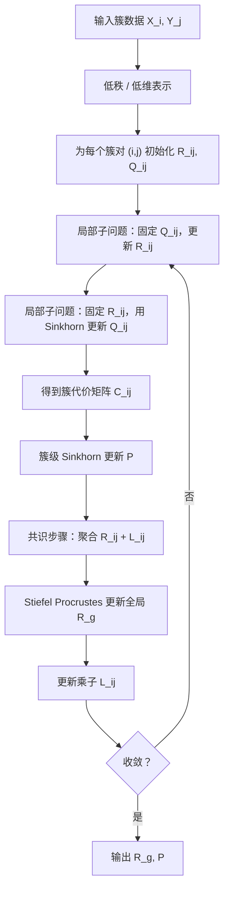
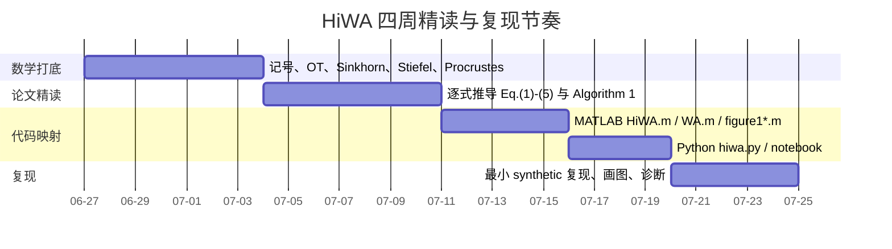

# HiWA 深度精读笔记

## 执行摘要

这篇 NeurIPS 2019 论文提出 **Hierarchical Wasserstein Alignment**，简称 **HiWA**。它解决的不是“两个带标签数据怎么配准”这种相对简单的问题，而是一个更难的 **无监督分布对齐** 问题：给定两个相关但不在同一坐标系统、而且都具有**多模态 / 多簇 / 多子空间结构**的数据集，如何一边估计它们之间的全局变换，一边恢复簇与簇之间的对应关系。作者的核心判断是：如果数据天然具有 cluster / subspace structure，那么直接在全数据上做一次 OT Procrustes 容易陷入局部极小；更合理的策略是先在**簇层**匹配，再在**簇内点层**匹配，最后通过一个**全局正交变换**把局部信息“熔合”起来。论文将这种思想写成一个**层级最优传输**问题，并给出一个基于 **Sinkhorn + distributed ADMM** 的数值解法。作者还在unitary / orthogonal 变换假设下给出了理论保证：什么时候簇对应可识别、全局对齐误差如何受几何扰动控制，以及什么样的子空间几何是最坏情形。实验上，HiWA 在合成低秩高斯混合数据和神经运动解码任务上都优于不利用簇结构的 Wasserstein alignment 基线。

对你来说，这篇论文最重要的价值不只是“学会一个算法”，而是学会一种范式：**把复杂对齐问题拆成结构层级**。数学上，它把经验测度、Wasserstein 距离、Birkhoff polytope、Stiefel manifold、Orthogonal Procrustes、Sinkhorn 正则化、ADMM 共识优化这些对象组织成一个统一体系；工程上，它把这些对象落实成若干非常清晰的模块：簇级 OT、簇内 OT、局部旋转 $R_{ij}$、全局旋转 $R_g$、以及乘子 $L_{ij}$。如果你之后要看 Taco，那基本就是把 HiWA 从“数据集 $X$ 与 $Y$ 的对齐”迁移到了“文本表示与几何表示的对齐”。因此，先吃透 HiWA，是后续理解 Taco 的最佳入口。

下面这份笔记按“问题—数学—算法—理论—代码—复现—迁移”的顺序写，目标是让你在**不逐行追代码**的前提下，把这个方法的数学骨架、实现流程与复现实验路径真正掌握住。凡是论文正文能精确给出的定理、公式、实验设置，我都尽量保留；凡是正文只给 proof sketch、而完整证明被留在 supplementary 的地方，我会明确标注“补充证明未提供”。

下表给出四个最值得记住的“英文原词锚点”。这些短语都来自原文，但我只保留非常短的片段，便于你对照论文，不做长段引文。

| 中文抓手   | English anchor                   |
| ------ | -------------------------------- |
| 层级最优传输 | “hierarchical formulation of OT” |
| 分布式求解  | “distributed ADMM algorithm”     |
| 多簇结构   | “clustered structure”            |
| 最坏几何情形 | “worst-case dataset geometry”    |

## 论文问题与核心思想

论文从一个非常一般的 transfer learning / distribution alignment 目标出发：给定源分布 $\mu$ 和目标分布 $\nu$，在某个变换类 $\mathcal T$ 中寻找一个变换 $T$，使得 $T(\mu)$ 与 $\nu$ 在某个概率散度 $D(\cdot\mid\cdot)$ 下尽量接近：
$$
\min_{T\in\mathcal T} D(T(\mu)\mid \nu).
$$
作者强调，这类问题本质上是病态的，因为可选的变换空间通常很大；如果再加上无监督、样本顺序未知、分布又是多模态的，单纯依赖一个“全局”散度去学习变换，极容易出现多解、局部极小或错误对齐。最优传输之所以吸引人，是因为 Wasserstein 距离天然考虑了底层空间几何，不需要像某些散度那样依赖核估计去构造重叠支撑；但直接把 OT 用在“同时学几何变换 + 学点对应”的问题上，仍然很难。

HiWA 的关键洞见是：如果数据不是单团块，而是由多个 cluster / subspace 组成，那么全局对齐问题其实有一个天然的分层结构。你不应该一次性把所有点混在一起对齐，而应该先问“哪些簇对应哪些簇”，再问“已配对簇内部的点怎样最优传输”，再把这些局部信息通过一个全局变换整合起来。论文把这一点形式化为一个**双层 OT**：外层用一个矩阵 $P$ 表示簇与簇的对应强度，内层用每一对簇的 Wasserstein 距离表示簇内点的细粒度匹配。这样做的直觉是：粗层信息先把搜索空间大幅缩小，细层信息再去修正局部对应，整个优化面会比“全局一次对齐”更不容易掉进伪极小值。

论文关注的特别情形是：两个数据集之间的真实变换接近 **unitary / orthogonal**。这时作者把变换类 $\mathcal T$ 收缩到 Stiefel manifold 上，也就是正交矩阵集合。这样带来的好处很大。数学上，正交变换保距离、保角度，意味着你并不是在任意扭曲源空间，而是在寻找一个“刚性”旋转/反射，把源空间转到目标空间。算法上，这使得每一步的 $R$-子问题退化成闭式的 **Orthogonal Procrustes**，可以直接用一次 SVD 求解。理论上，这又允许作者把全局对齐误差与**Gram 矩阵扰动**联系起来，得到清晰的 perturbation bound。

从实验设计也能看出作者最关心什么。合成实验不是随便造点云，而是用**低秩高斯混合 + 子空间嵌入**专门考察两件事：一是“簇间几何是否有助于 disambiguation”，二是“维度和样本量如何影响对齐”。真实数据实验则选了一个典型的脑机接口场景：把神经活动的低维嵌入对齐到运动分布，从而实现跨日或跨条件的运动方向解码。作者的主张不是“HiWA 最终一定最优”，而是“只要 clustered structure 在两个域中都存在且大体一致，那么明确利用它，比忽略它要稳得多”。

## 数学设定与关键公式推导

### 记号与对象

为了精读这篇论文，最先要彻底固定记号。论文设源数据集有 $S$ 个簇，记为 $\{X_i\}_{i=1}^S$，目标数据集也有 $S$ 个簇，记为 $\{Y_j\}_{j=1}^S$。每个簇都是一个矩阵：
$$
X_i\in\mathbb R^{D\times n_{x,i}},\qquad
Y_j\in\mathbb R^{D\times n_{y,j}},
$$
这里 $D$ 是 ambient / embedding dimension，列向量是样本坐标。第 $i$ 个簇对应的经验测度写成
$$
\mu_i=\frac1{n_{x,i}}\sum_{k=1}^{n_{x,i}}\delta_{X_i(k)},
\qquad
\nu_j=\frac1{n_{y,j}}\sum_{l=1}^{n_{y,j}}\delta_{Y_j(l)}.
$$
其中 $\delta_x$ 是集中在点 $x$ 的 Dirac 质量。这个写法非常重要，因为后面的 Wasserstein 距离、传输矩阵 $Q_{ij}$，全都不是“抽象概率论对象”，而是建立在这些离散经验测度上的。

下面这张表把论文主记号、几何意义和代码变量统一起来。代码变量来自你上传 zip 中的官方 MATLAB / Python 实现。它们不是论文正文的一部分，但和公式是一一对应的。路径我按压缩包中的相对路径原样列出，便于你后面直接打开。

| 数学记号                          | 含义                       | MATLAB 变量          | Python 变量                           | 主要文件                                                                        |
| ----------------------------- | ------------------------ | ------------------ | ----------------------------------- | --------------------------------------------------------------------------- |
| $(X_i,Y_j)$                 | 第 $i,j$ 个簇的数据矩阵        | `X{i}`, `Y{j}`     | 按 `X_labels`,`Y_labels` 切片后的子矩阵     | `hiwa-matlab/code/toolbox/HiWA.m`, `PyHiWA/src/hiwa.py`                     |
| $\mu_i,\nu_j$               | 簇的经验分布                   | 由 `X{i},Y{j}` 隐式定义 | 同左                                  | 同上                                                                          |
| $Q_{ij}$                    | 簇内点对点 OT coupling        | `Q`                | `Q`                                 | `HiWA.m` 内部 `WAsolver`, `PyHiWA/src/hiwa.py` 的 `_subspace_alignment_solver` |
| $P$                         | 簇级 correspondence matrix | `P`                | `self.P`                            | `HiWA.m`, `hiwa.py`                                                         |
| $R_{ij}$                    | 每对簇的局部旋转                 | `R(:,:,k)`         | `R[:,:,i,j]`                        | `HiWA.m`, `hiwa.py`                                                         |
| $R_g$ 或 $\widetilde R$    | 全局共识旋转                   | `Rg`               | `Rg`, `self.Rg`                     | `HiWA.m`, `hiwa.py`                                                         |
| $L_{ij}$ 或 $\Lambda_{ij}$ | ADMM 乘子                  | `L(:,:,k)`         | `L[:,:,i,j]`                        | `HiWA.m`, `hiwa.py`                                                         |
| $C_{ij}$                    | 簇对代价                     | `C(k)` / `C(i,j)`  | `C[i,j]`                            | `HiWA.m`, `hiwa.py`                                                         |
| $A_i,B_j$                   | 已知簇子空间基                  | `A{i}`, `B{j}`     | `X_transform`,`Y_transform` 诱导的低维投影 | `GenerateSyntheticSubspaceData.m`, `HiWA.m`, `hiwa.py`                      |

### 从普通分布对齐到层级最优传输

如果忽略簇结构，那么最自然的想法是直接写
$$
\min_{T\in\mathcal T} W_2^2(T(\mu),\nu).
$$
但 HiWA 不这么做。它将问题拆成“先簇，再点”，写成
$$
\min_{P\in B_S,\;T\in\mathcal T}
\sum_{i=1}^S\sum_{j=1}^S P_{ij}\,
W_2^2\!\bigl(T(\mu_i),\nu_j\bigr),
$$
其中 $B_S:=U(S,S)$ 是 $S$ 阶 Birkhoff polytope，也就是所有 $S\times S$ 双随机矩阵的集合。这里 $P_{ij}$ 越大，表示簇 $i$ 和簇 $j$ 越应当被视为“对应”；$P$ 是软匹配，不是硬排列，这给优化留出了容错空间。

内层 Wasserstein 距离在离散均匀经验测度情形下写成
$$
W_2^2(\mu_i,\nu_j)
=
\min_{Q\in U(n_{x,i},n_{y,j})}
\sum_{k=1}^{n_{x,i}}\sum_{l=1}^{n_{y,j}}
Q(k,l)\,\|X_i(k)-Y_j(l)\|_2^2.
$$
这里的 $Q$ 是一个非负矩阵，它满足固定边缘和约束，代表从源簇各点向目标簇各点搬运概率质量的计划。你可以把 $Q$ 理解成“簇内点对应”的软版本：不像 ICP 那样要求一一硬对应，而是允许一个点的质量分散到多个点上。对学生来说，最重要的一点是：**Wasserstein 距离不是先验给你对应，再去加总距离；它是把“找对应”本身也放进优化里了。**

### Stiefel 约束与正交 Procrustes 结构

论文随后把一般的 $T$ 收缩成一个方阵正交变换
$$
R\in V_{D,D}:=\{R\in\mathbb R^{D\times D}:R^\top R=I\}.
$$
因为这里是方阵情形，$V_{D,D}$ 就是正交群 $O(D)$。将 $T$ 换成 $R$ 后，问题化成
$$
\min_{P,R,\{Q_{ij}\}}
\sum_{i,j} P_{ij}\, C_{ij}(R,Q_{ij})
\quad
\text{s.t. } P\in B_S,\ R\in V_{D,D},\ Q_{ij}\in U(n_{x,i},n_{y,j}),
$$
其中
$$
C_{ij}(R,Q_{ij})
:=
\frac1D\sum_{k,l}Q_{ij}(k,l)\,
\|R X_i(k)-Y_j(l)\|_2^2.
$$
论文把它视为“作用在第 $i$ 个簇上的 Stiefel 变换下，第 $i$ 个源簇与第 $j$ 个目标簇的 pairwise cluster divergence”。这里 $\frac1D$ 只是尺度归一项，不改变主导结构。

为什么 $R$-子问题会变成 Procrustes？因为在固定 $Q_{ij}$ 时，
$$
\sum_{k,l}Q_{ij}(k,l)\|RX_i(k)-Y_j(l)\|_2^2
$$
展开以后，和 $R$ 有关的只剩一个 trace 项。更具体地，利用正交性 $R^\top R=I$，可将其等价为
$$
\min_{R\in V_{D,D}} -2\,\mathrm{tr}\!\bigl(R^\top Y_j Q_{ij}^\top X_i^\top\bigr),
$$
或者等价地
$$
\max_{R\in V_{D,D}} \mathrm{tr}(R^\top M),
\qquad
M:=Y_jQ_{ij}^\top X_i^\top.
$$
这个经典问题的闭式解是：对 $M=U\Sigma V^\top$ 做 SVD，然后取
$$
R^\star=UV^\top.
$$
这正是论文 Algorithm 1 里的 `STIEFELALIGNMENT`，也正是 MATLAB 与 Python 代码中 `ClosedFormRotationSolver` / `_closed_form_rotation_solver` 的实现。

### 熵正则、Sinkhorn 与“双层 Sinkhorn”

原始 Wasserstein 计算代价高，而且经验 Wasserstein 的样本复杂度也依赖维数。论文因此在簇级 $P$ 和簇内 $Q_{ij}$ 上都加了 entropic regularization，把 Wasserstein 距离替换成 Sinkhorn 型目标：
$$
\min_{P,R,\{Q_{ij}\}}
\sum_{i,j}\Bigl(
P_{ij}C_{ij}(R,Q_{ij}) + H_{\varepsilon_2}(Q_{ij})
\Bigr)
+H_{\varepsilon_1}(P).
$$
论文在正文中把
$$
H_\varepsilon(P)=\varepsilon\sum_{i,j}P_{ij}\log P_{ij}
$$
称为 negative entropy function。注意这是一个**符号约定**问题：有些文献把 Shannon entropy 写成 $-\sum p\log p$，而这里直接把 $\sum p\log p$ 乘上正参数加进目标里。两种写法差一个负号或常数项，本质上都在鼓励 coupling 变得更平滑、更不那么尖锐。作者明确指出，当 $\varepsilon_1,\varepsilon_2\to 0$ 时，这个正则化问题会回到未正则化版本；$\varepsilon$ 取大时，优化更平滑、更稳定，但会引入偏差。

为什么加熵以后会出现 Sinkhorn？因为对固定成本矩阵 $C$，离散熵正则 OT 子问题
$$
\min_{Q\ge 0}\ \langle Q,C\rangle + \varepsilon \sum_{k,l}Q_{kl}\log Q_{kl}
\quad\text{s.t.}\quad
Q\mathbf 1=p,\ Q^\top\mathbf 1=q
$$
的最优解具有 Gibbs 形式
$$
Q^\star = \mathrm{diag}(a)\,K\,\mathrm{diag}(b),
\qquad
K=\exp(-C/\varepsilon),
$$
其中 $a,b$ 通过边缘和约束确定。把约束代回去就得到迭代缩放：
$$
a \leftarrow p/(Kb),\qquad
b \leftarrow q/(K^\top a).
$$
这正是 Algorithm 1 里的 `SINKHORN` 子程序，也是你上传的官方代码中 `Sinkhorn` 与 `SinkhornC` 的核心更新。HiWA 实际上做了两次 Sinkhorn：**内层**在每个簇对上算 $Q_{ij}$，**外层**在簇成本矩阵 $C$ 上算 $P$。这就是我所说的“双层 Sinkhorn”。

### ADMM 分解与局部—全局共识

到这里仍然有个难点：目标对 $P,R,Q_{ij}$ 是多线性的，而且 $R$ 落在非凸的 Stiefel manifold 上。论文的办法是给每个簇对 $(i,j)$ 各自引入一个局部旋转 $R_{ij}$，再要求它们最终都与一个全局变量 $\widetilde R$ 一致：
$$
R_{ij}=\widetilde R,\qquad \forall i,j.
$$
于是问题被改写为
$$
\min_{P,\widetilde R,\{R_{ij},Q_{ij}\}}
\sum_{i,j}\Bigl(P_{ij}C_{ij}(R_{ij},Q_{ij})+H_{\varepsilon_2}(Q_{ij})\Bigr)+H_{\varepsilon_1}(P)
\quad\text{s.t. }R_{ij}=\widetilde R.
$$
从结构上看，这一步非常聪明。它把原本“所有簇对共享一个 $R$”的强耦合问题，拆成许多近乎独立的局部问题，再靠 ADMM 共识步骤把它们粘回去。

对应的增广拉格朗日写成
$$
L_\mu
=
\sum_{i,j}\Bigl(
P_{ij}C_{ij}(R_{ij},Q_{ij})
+\langle \tfrac{\mu}{D}\Lambda_{ij},\,R_{ij}-\widetilde R\rangle
+\tfrac{\mu}{2D}\|R_{ij}-\widetilde R\|_F^2
+H_{\varepsilon_2}(Q_{ij})
\Bigr)
+H_{\varepsilon_1}(P).
$$
然后每一轮迭代做四件事。第一，在固定 $P,\widetilde R,\Lambda$ 的情况下，对每个簇对 $(i,j)$ 交替更新 $R_{ij}$ 和 $Q_{ij}$。第二，在新的簇代价矩阵 $C$ 上做一次簇级 Sinkhorn，更新 $P$。第三，把所有 $R_{ij}$ 与乘子项平均起来，做一次全局 Procrustes，得到新的 $\widetilde R$。第四，更新乘子 $\Lambda_{ij}$。这就是 Algorithm 1 的全部思想。论文还特别强调：这种拆分使得每个 $(i,j)$ 的更新能并行执行，所以复杂度主要取决于**最大簇大小的平方**，而不是全数据总样本数的立方级别。

下面这张 mermaid 图把 HiWA 的计算流画成一个你可以直接和 MATLAB / Python 代码对照的流程图。



## ADMM 算法与代码映射

### 论文伪代码如何落到官方实现

论文的 Algorithm 1 极其值得精读，因为它和官方代码结构非常接近。主循环从随机初始化 $R$、均匀初始化 $P$、零初始化乘子开始；然后每轮先做局部更新，再做全局更新。MATLAB 主文件 `hiwa-matlab/code/toolbox/HiWA.m` 里，初始化发生在大约第 66–79 行：`Rg` 对应全局旋转，`P` 对应簇级 coupling，`L` 对应拉格朗日乘子，`R` 对应所有局部旋转；`C` 是簇代价矩阵。随后第 104 行开始进入“Distributed ADMM”，第 108–111 行用 `parfor` 对所有簇对并行调用 `WAsolver`；第 114 行用 `SinkhornC` 更新簇级 $P$；第 118 行用 `ClosedFormRotationSolver(mean(reshape(R+L,...)))` 更新全局 $R_g$；第 121 行执行乘子更新。Python 文件 `PyHiWA/src/hiwa.py` 的 `fit` 方法几乎逐行复刻了这套流程，只是没有 MATLAB 的 `parfor` 并行。

特别要注意官方实现中的一个“论文到代码”的关键转换：论文在数学上直接写 $X_i,Y_j$ 是需要对齐的簇，但代码中并不直接把原始簇送进局部求解器，而是先做了低秩投影。MATLAB 在 `HiWA.m` 中用
$$
X_i \mapsto A_iA_i^\top X_i,\qquad
Y_j \mapsto B_jB_j^\top Y_j,
$$
Python 则通过 `X_transform @ X_transform.T @ X.T` 的方式，把低维嵌入再拉回高维坐标系。这正好对应了论文的“各簇落在低维子空间上”的建模前提：你真正对齐的是簇的低秩几何结构，而不只是未经处理的原始散点。这个细节在理解适用条件时很关键。

### 路径索引与作用说明

下面列出你上传 zip 中最关键的相关路径。它们构成了一个完整的“论文—算法—实验—Python 入口”的学习链条。

```text
最优传输/hiwa-matlab/README.md
最优传输/hiwa-matlab/HiWA_summary.pdf
最优传输/hiwa-matlab/code/demo.m
最优传输/hiwa-matlab/code/figure1ab.m
最优传输/hiwa-matlab/code/figure1cd.m
最优传输/hiwa-matlab/code/figure1e.m
最优传输/hiwa-matlab/code/figure1f.m
最优传输/hiwa-matlab/code/toolbox/HiWA.m
最优传输/hiwa-matlab/code/toolbox/WA.m
最优传输/hiwa-matlab/code/toolbox/HiWASSC.m
最优传输/hiwa-matlab/code/toolbox/GenerateSyntheticSubspaceData.m
最优传输/hiwa-matlab/code/results/*.mat
最优传输/hiwa-matlab/code/third party tools/CORAL.m
最优传输/hiwa-matlab/code/third party tools/SA.m
最优传输/hiwa-matlab/code/third party tools/ICP.m
最优传输/PyHiWA/README.md
最优传输/PyHiWA/HiWA-Demo.ipynb
最优传输/PyHiWA/src/hiwa.py
最优传输/PyHiWA/src/utils.py
最优传输/PyHiWA/data/sg_demo.npz
最优传输/PyHiWA/data/mihi_demo.mat
```

### 公式—变量—代码 的对应表

这张表是你后面读代码时最有用的“导航页”。

| 论文公式/步骤 | 数学含义 | MATLAB 实现 | Python 实现 | 你读代码时该看什么 |
|---|---|---|---|---|
| $\min_{P,T}\sum_{ij}P_{ij}W_2^2(T(\mu_i),\nu_j)$ | 总体层级目标 | `HiWA.m` 主函数框架 | `HiWA.fit()` 主循环 | 看初始化与四步迭代结构 |
| $C_{ij}(R,Q_{ij})$ | 某一簇对的局部代价 | `WAsolver` 返回 `distance` | `_subspace_alignment_solver` 返回 `dist` | 看局部 alternating minimization |
| $R^\star=UV^\top$ | Stiefel / Procrustes 闭式解 | `ClosedFormRotationSolver` | `_closed_form_rotation_solver` | 核心是一次 SVD |
| $Q=\mathrm{diag}(a)K\mathrm{diag}(b)$ | 内层 Sinkhorn coupling | `Sinkhorn` | `_sinkhorn` | 看 `a,b` 交替缩放 |
| $P=\mathrm{diag}(a)K\mathrm{diag}(b)$ | 外层簇级 coupling | `SinkhornC` | `_sinkhorn_clusters` | 注意这里输入是簇代价矩阵 `C` |
| $R_{ij}=\widetilde R$ 共识 | ADMM 拆分思想 | `R(:,:,k)`, `Rg`, `L(:,:,k)` | `R[:,:,i,j]`, `Rg`, `L[:,:,i,j]` | 看局部—全局变量如何交互 |
| $\widetilde R\leftarrow \operatorname{Proj}_{V_{D,D}}(\text{mean}(R_{ij}+L_{ij}))$ | 全局旋转更新 | `ClosedFormRotationSolver(mean(...))` | 同名 SVD 更新 | 理解“共识平均” |
| $L_{ij}\leftarrow L_{ij}+R_{ij}-R_g$ | 乘子更新 | `L = L + R - Rg` | `L = L + R - Rg[...,None,None]` | 标准 ADMM 结构 |
| 无簇基线 WA | 只做全局 Wasserstein alignment | `WA.m` | 无独立类，但可从局部求解器抽象 | 用来理解“为什么 HiWA 比 WA 稳” |
| 完全无监督 HiWA-SSC | 用 SSC 先估计簇 | `HiWASSC.m` | Python demo 中用给定标签，无 SSC 版本 | 看簇估计误差如何进入整体误差 |

### 读代码时最需要懂的三件事

第一，`HiWA.m` 不是“把论文所有数学都写一遍”，而是把论文的 **Algorithm 1** 直接模块化。你真正该读到透的，不是每一行 MATLAB 语法，而是以下三层嵌套关系：外层 ADMM 循环；中层对所有簇对并行求局部对齐；内层在某个簇对里交替优化 $R_{ij}$ 与 $Q_{ij}$。只要这三层掌握了，代码就不会看乱。

第二，`WA.m` 是最好的对照基线。它去掉了 HiWA 的簇层结构，只保留“全局变换 + 点级 Sinkhorn”这套思路。你读 HiWA 前先看 `WA.m`，再回到 `HiWA.m`，会立刻明白 HiWA 比 WA 多了什么：多的是 $P$、多的是 $R_{ij}$ 的局部化、多的是 ADMM 共识，而不是多了某个神秘 trick。这个对理解论文动机非常有帮助。

第三，Python 版不是简单重写，它更像“面向使用”的封装。`PyHiWA/src/hiwa.py` 把低维嵌入、归一化、拟合、变换都包含进一个 `HiWA` 类里；`HiWA-Demo.ipynb` 则把 synthetic 和 neural 两个例子串起来，形成最容易上手的入口。对你后面想改方法、接自己数据来说，Python 版更适合；对你现在想严格对照论文公式来说，MATLAB 版更直观。两者结合使用最好。

## 理论结果与证明思路

### Correspondence Disambiguity Criterion

论文的第一个核心理论结果，是关于簇对应何时可识别的。它在等样本数、真对应为对角 $P^\star=I_S/S$ 的简化设定下，给出了一个**充分条件**：如果每一对真实匹配簇，相比任意错误交叉匹配，都有足够大的 Wasserstein 代价间隔，那么 HiWA 的全局最优解会恢复正确簇对应。正式地，论文写道：若各簇严格低秩，且内禀维度 $d_{x,i}, d_{y,j} > 4$，并定义
$$
\widehat C_{ij}^\star
:=
\min_{R\in V_{D,D},\,Q_{ij}\in B_n}
C_{ij}(R,Q_{ij}),
$$
则当对任意 $i\neq j$ 都满足
$$
\widehat C_{ij}^\star+\widehat C_{ji}^\star-\widehat C_{ii}^\star-\widehat C_{jj}^\star
>
B_{x,i}(\delta)+B_{y,i}(\delta)+B_{x,j}(\delta)+B_{y,j}(\delta),
$$
HiWA 会以至少 $1-\delta$ 的概率恢复 $P^\star=I_S/S$。这里右边的 $B_{z,k}(\delta)$ 是一个有限样本误差项，其主导速率来自 Wasserstein 经验测度浓缩，大致形如
$$
n^{-2/d_{z,k}}+\sqrt{\log(1/\delta)/(2n)}.
$$
论文正文给出了该项的显式常数；但对理解最重要的不是常数，而是**“代价间隔必须压过有限样本波动”**这一结构。

这个定理的 proof sketch 分两步。第一步，在理想无限样本或无扰动情形，把问题先看成 Birkhoff polytope 上的 OT 最优化，证明若
$$
C_{ij}+C_{ji}-C_{ii}-C_{jj}>0
$$
对任意 $i\neq j$ 都成立，则对角对应在簇级 OT 中是稳定的。第二步，再利用 Wasserstein 距离关于经验测度的有限样本浓缩结果，把理想判据改写成经验判据，于是右边多出那些 $B_{z,k}(\delta)$ 误差项。论文主文只给了这两步的解释性 sketch，而完整推导留在 supplementary；你上传的文件包里没有看到对应的证明 PDF，所以这里我们只能做到**定理原义 + 证明骨架**，不能逐行重建。

你读这个定理时一定要抓住两个层面的含义。第一，它本质上是个 **identifiability condition**：不是算法神奇，而是数据本身必须“可辨”。如果错配代价和正配代价差不多，任何算法都难以稳定恢复真实对应。第二，它说明 HiWA 特别适合“簇间可分、簇内结构稳定”的问题；一旦簇结构模糊、不同簇长得太像，簇级 OT 的信息量就会迅速下降。

### Cluster-Based Alignment Perturbation Bound

第二个核心结果是全局对齐误差界。其设定比第一个定理更强：不仅假设 Theorem 4.1 的条件成立，还假设每个真实配对簇内部的点对应 $Q_{ii}$ 已知。定义聚合矩阵
$$
X=[X_1Q_{11},X_2Q_{22},\dots,X_cQ_{cc}],\qquad
Y=[Y_1,Y_2,\dots,Y_c],
$$
并设
$$
\varepsilon^2 := \|Y^\top Y - X^\top X\|_F.
$$
如果 $X$ 满行秩，且 $\varepsilon\|X^\dagger\|$ 足够小，则有
$$
\min_{P\in B_c,\;R\in V_{D,D}} \sum_{i,j}P_{ij}C_{ij}(R)
\;\le\;
(\|X\|\|X^\dagger\|+2)^2\|X^\dagger\|^2\varepsilon^4 + D_0,
$$
其中
$$
D_0
=
\sum_{i=1}^c
\operatorname{tr}\!\Bigl(
X_i\bigl(I/n-Q_{ii}Q_{ii}^\top\bigr)X_i^\top
+\bigl(1/n-1\bigr)Y_iY_i^\top
\Bigr)
$$
是一个数据依赖常数项。

这个定理的数学核心其实非常漂亮。它把“跨域几何是否一致”压缩到一个量
$$
\|Y^\top Y - X^\top X\|_F
$$
上，也就是**Gram 矩阵的扰动**。为什么是 Gram 矩阵？因为正交变换不会改变内积结构，所以如果两个域在真实对应下本来就近似共享同一个 Gram 结构，那么一个正交矩阵应当能把它们对得很好；反过来，如果 Gram 结构差很多，那么无论用多好的正交 Procrustes，也只能有限逼近。论文的 proof sketch 明确说，它是把 Arias-Castro 等人关于 Procrustes 的 perturbation result 适配到自己的 hierarchical Wasserstein 目标上。这里主文依然只有 sketch，完整推导在 supplementary 中。

这一节还有一个特别值得你记住的进一步分解。论文把全局扰动分解成簇对间的块扰动
$$
\varepsilon_{ij}
=
\|Y_i^\top Y_j - Q_{ij}^\top X_i^\top X_jQ_{jj}\|_F
=
\|\Sigma_{y,i}B_i^\top B_j\Sigma_{y,j}
-
\Sigma_{x,i}A_i^\top A_j\Sigma_{x,j}\|_F.
$$
然后指出这里面有两类可解释误差：其一是 **angular shift**，来自不同簇子空间主角的变化；其二是 **spectral shift**，来自奇异值谱的变化。这个分解对你以后做方法改造尤其关键，因为它告诉你“对齐失败”并不只有一种原因：可能是簇之间的角度关系变了，也可能是每个簇内部的尺度/谱变了，还可能两者都有。

### Uninformative Alignment 与最坏几何情形

论文最后一个非常有洞察力的理论结论是 Lemma 4.3。它研究的是：即使你额外知道一些外部几何方向信息，这些信息在什么情况下对对齐**没有帮助**。结论是：如果这些外部方向和簇对自身的奇异向量几何完全匹配，那么受限正交变换集合上的最优值，不会比全正交集合上的最优值更差；也就是说，这些外部几何约束并没有增加任何有用判别力。

这个引理的重要后果有两个。第一，**等间距子空间**是最坏情形。在这种对称几何里，各簇之间的相对角度信息对 disambiguation 帮助很小，簇级外部几何很难打破对称。第二，高维空间里子空间容易彼此近似正交，这会使很多“角度信息”退化成几乎没信息的状态，所以高维对齐通常更难。论文在后面的 Figure 1(a)(b) 和理论讨论里正是围绕这个点展开：随机间距子空间相比等间距子空间，更容易被 HiWA 正确对齐。

从你的数学训练角度看，这一部分非常值得反复想。因为它实际上揭示了：HiWA 的有效性不是来自某个神秘优化技巧，而是来自**几何可辨性**。如果几何本身是高度对称的，你再复杂的层级 OT 也不可能凭空创造信息。这个认识以后会直接指导你判断一个新任务到底适不适合套 HiWA。

## 实验复现与最小可运行流程

### 合成数据是怎样生成的

论文的合成实验不是随便采样二维高斯。官方 MATLAB 文件 `GenerateSyntheticSubspaceData.m` 的逻辑是：先为每个簇随机生成一个 $d$-维子空间基 $A_i\subset\mathbb R^{K}$；再生成一个 ground-truth 旋转 $R_{\text{gt}}$；然后把 $A_i$ 旋转成 $B_i=R_{\text{gt}}A_i$；接着在每个簇的内禀 $d$-维坐标里随机生成高斯分布参数 $(\mu_i,\Sigma_i)$，采样得到点，再嵌入到各自子空间中，最后可选择叠加噪声 $\delta$。因此，每个簇本质上是“低维高斯 + 高维子空间嵌入”的组合，整个数据集就是一个 low-rank Gaussian mixture / union-of-subspaces 模型。论文正文也明确说 synthetic 部分就是这样构造的。

Figure 1(a)(b) 要比较两种几何：随机间距子空间和等间距子空间。MATLAB 脚本 `figure1ab.m` 的主干调用 `GenerateSyntheticSubspaceData` 生成随机案例；而最坏情形分支则在同一脚本底部定义了一个内部函数 `GenerateEquallySpacedSyntheticSubspaceData`，它在一个假设 $K=S+d-1$ 下，把每个簇子空间改造成“等间距窗口式”排列。这个实现细节能让你真正明白论文所说的 “equally-spaced subspaces” 不是空泛概念，而是一个非常具体的构造。

### Figure 1 的复现脚本与官方参数

你上传的 MATLAB 脚本已经把 Figure 1 各子图拆开了。下面这张表把它们整理成“要跑什么、用什么设置、看什么输出”的形式。

| 子图 | 脚本 | 主要含义 | 关键参数 |
|---|---|---|---|
| Figure 1(a)(b) | `figure1ab.m` | 随机间距 vs 等间距子空间；比较 alignment error 和 correspondence error 的累计分布 | `S=5, d=2, K=6, N∈{25,50,100}`, `num_trials=20` |
| Figure 1(c)(d) | `figure1cd.m` | 研究内禀维数 $d$ 与样本量 $n$ 对误差的影响 | `S=5`, `d∈{2,3,4,5}`, `K∈{6,11,17,22}`, `N∈{12,25,50,100,200}` |
| Figure 1(e) | `figure1e.m` | 低维简单情形下比较 HiWA、HiWA-SSC、WA、CORAL、SA、ICP | `S=2, d=2, D=2, N=50`, `num_trials=50` |
| Figure 1(f) | `figure1f.m` | 更高维、更难的情形下比较同样方法 | `S=5, d=2, D=6, N=50`, `num_trials=50` |

这些脚本里对 HiWA 的核心超参数也给得很清楚。以 `figure1e.m` / `figure1f.m` 为例，HiWA 使用
$$
\texttt{maxiter}=300,\quad
\texttt{tol}=10^{-1},\quad
\mu=5\times 10^{-3},\quad
\varepsilon_1\approx 0.2,\quad
\varepsilon_2\approx 0.1,
$$
其中 `shorn.gamma = 0.2` 对应外层簇级 Sinkhorn，`WAparam.sh_gamma = 0.1` 对应内层簇内 Sinkhorn；内层局部交替步数 `WAparam.miter=100`，内层 Sinkhorn 迭代次数 `WAparam.sh_miter=150`。这些设置与论文正文“用 Sinkhorn + ADMM 求解”的叙述一致。

### MATLAB 最小复现流程

如果你的目标是**先跑通，再理解**，我建议 MATLAB 侧按下面顺序。先打开 `hiwa-matlab/code/demo.m` 看一遍基础示例；然后优先跑 `figure1e.m`，因为它是最小难度、最容易看出 HiWA 相对 WA / ICP / SA 优势的设置；接着跑 `figure1f.m`，看高维难例；最后再跑 `figure1ab.m` 与 `figure1cd.m`，从“随机 vs 最坏几何”和“样本量 / 维数”两个方向把理论与实验对应起来。你上传包中已经包含 `code/results/*.mat` 结果文件，因此即便暂时不重算，也能先加载结果、复画图、理解度量。

对 MATLAB 复现来说，有一个现实问题你必须知道：`HiWA-SSC` 分支依赖外部的 **SSC_ADMM_v1.1** 工具包，`figure1e.m` 和 `figure1f.m` 的文件头部已经把这个前置要求写出来了。因此如果你只想先复现 HiWA 主方法，完全可以先跳过 `HiWA-SSC`，只跑已知簇的 HiWA 和若干 baseline；等你真正研究“完全无监督聚类 + 对齐”时，再补这个依赖。这个取舍非常合理。

### Python 最小复现流程

Python 版最适合你做“方法感受”和后续改造。官方 `PyHiWA/HiWA-Demo.ipynb` 已经提供两个完整入口：一个是 synthetic Gaussian demo，另一个是 motor cortex demo。对 synthetic 例子，notebook 会从 `data/sg_demo.npz` 载入源/目标数据和标签，实例化
$$
\texttt{hiwa.HiWA(dim\_red\_method=Isomap(n\_components=2), normalize=True)},
$$
然后调用 `fit` 再 `transform`。对神经数据例子，则先做因子分析和若干预处理，再调用同一个 `HiWA` 类。这个 notebook 有一个很好的教育意义：它把论文里“先低维嵌入，再做层级 OT”的思想变成了实际可执行的管道。

不过你得特别注意 Python README 里作者给的经验提醒：**dimensionality reduction technique is critically important**。这和论文理论完全一致。HiWA 并不是在任意表示空间里都稳定；它假设你找到的低维嵌入能保留两个数据域之间可对齐的 cluster / subspace structure。如果低维嵌入本身已经把这种结构破坏掉，那么后面所有 OT 和 ADMM 都是在“坏几何”上努力，自然很容易失败。这个经验建议虽然来自代码 README，不是理论定理，但它和论文结论是完全同向的。

### 你复现时应该期待看到什么

如果一切正常，Figure 1(a)(b) 应该展示：随机间距子空间的 alignment error 与 correspondence error 曲线整体优于等间距子空间；这正是 Lemma 4.3 所谓“最坏几何”的经验体现。Figure 1(c)(d) 则展示：随着样本量 $n$ 增大，误差中位数下降；维数 $d$ 增大通常会使问题更难。Figure 1(e)(f) 应该呈现 HiWA 最稳，HiWA-SSC 次之，WA 再次之，SA / CORAL / ICP 在更难情形里明显落后。论文图注和实验段落明确给出了这一整体结论。

如果你想设置一个真正“最小可交付”的复现目标，我建议先不碰神经数据，也不追求论文全部图完全一致，而是只完成这三步：一，能在 MATLAB 或 Python 生成一个带簇标签的合成源/目标数据；二，能跑出 $R_g$ 与 $P$，并把源数据旋转到目标数据附近；三，能比较 HiWA 与 WA，在相同 synthetic 数据上看到 HiWA 更稳定。这三步一旦完成，你就已经真正掌握了论文方法的可执行核心。

## 方法落地、可修改方向与学习计划

### 先判断数据是否适合 HiWA

把 HiWA 用到新的问题上之前，最关键的不是改参数，而是先做“适用性体检”。第一，源域和目标域是否都存在可解释的 cluster / subspace structure。第二，这些簇在两个域中是否大致共享相同的相对几何；至少不能在一个域里是五个分离子空间，另一个域里完全被揉成一团。第三，你是否有一个能保留这种结构的低维表示。第四，你是否接受“全局变换近似正交”的假设。如果这四项里有两项明显不成立，那 HiWA 即便能跑，也很可能只是在输出一个数值上收敛、但几何上无意义的结果。这个判断完全呼应论文的理论与代码经验。

### 诊断量、复杂度与数值稳定性

HiWA 最重要的诊断量不是最终图好不好看，而是三类中间量。第一类是全局旋转残差
$$
\|R_g^{(t)}-R_g^{(t-1)}\|_F,
$$
这是 MATLAB `diagnostic.Rg_norm` 和 Python `diagnostics['Rg_norm']` 跟踪的收敛判据。第二类是簇级耦合 $P$ 与簇代价矩阵 $C$。如果 $P$ 迟迟不向“接近置换/对角”的结构集中，而 $C$ 里又没有明显的对角优势，那往往说明数据几何本身不够可辨。第三类是数值稳定性：如果 Sinkhorn 内部出现 NaN，通常是 $\gamma$ 太小、代价尺度太大、或者输入表示未做足够归一化。官方 Python 版默认 `normalize=True`，就是在防这种问题。

复杂度方面，论文抽象层面给出的卖点是：利用 Sinkhorn 和分布式 ADMM 后，复杂度可以做到对**最大簇大小二次**增长，而不是对总样本数做全局高开销求解。更细一点地看，每次外层迭代有 $S^2$ 个局部簇对子问题；每个局部子问题主要成本来自一个 $n_i\times n_j$ 的 Sinkhorn 和一个 $D\times D$ 的 SVD。因此一个粗略但很有用的心智模型是：
$$
\text{每轮成本}\approx O\!\bigl(S^2 n_{\max}^2 + S^2D^3 + S^2\bigr),
$$
其中第一项通常最关键。这个表达是根据论文复杂度描述与算法结构作出的工程级总结，不是正文里逐项列出的正式定理。

### 如果你想改方法，哪些方向最自然

HiWA 原始版本把变换限制在正交群上，这既是它的优势，也是它的边界。如果你的新任务明显存在尺度变化、剪切或更一般的 domain shift，那么第一个自然修改就是把
$$
R^\top R=I
$$
放宽为一般仿射变换，甚至浅层非线性映射。但你必须知道，一旦这样改，Procrustes 闭式解就没了，Theorem 4.2 也不再直接适用。论文结论本来就只在 unitary / orthogonal 设定下建立。

第二个自然方向是把**平衡 OT**改成 **unbalanced OT**。HiWA 的正文写法默认 $Q_{ij}$ 和 $P$ 满足严格边缘和约束，适合“质量守恒”的匹配结构。如果你的两个域存在样本丢失、簇体量显著不等、或者有一部分质量根本不该被匹配，那么把 transport polytope 改成 KL-relaxed marginal penalty 形式，通常是更合理的。这会让算法更鲁棒，但簇级可识别定理需要重写。这里的建议来自对原模型约束结构的直接分析。

第三个方向是从**硬簇 / 已知簇**过渡到**软簇 / 自适应簇**。HiWA 主论文假设簇已知，HiWA-SSC 用外部 SSC 管道先估簇，再对齐；这说明作者已经承认“簇估计误差”是关键瓶颈。你后面看 Taco 就会发现，Taco 走的是软 group assignment 路线。对你而言，一个非常合理的研究切口，就是在 HiWA 框架中考察“簇先验不准确时，软簇是否比硬簇更稳”。这既承接第一篇，也自然通向第二篇。

第四个方向是优化 Sinkhorn 与代价尺度。官方代码里，外层簇级 $\gamma$ 和内层点级 $\gamma$ 是分别设置的，而且局部子问题里实际用的是 `sh_gamma / Pij`。这意味着当某个簇对权重很小的时候，局部 Sinkhorn 的有效温度会变大，耦合更平滑；当 $P_{ij}$ 变大时，局部耦合会更尖锐。这个机制很值得你在新任务里当作调参抓手：如果你发现 $P$ 太平、局部匹配过于弥散，可以尝试降低内层熵；如果匹配剧烈震荡、数值不稳，则相反。

### 建议的学习与实现时间表

下面这条时间线是“以读懂为主、复现为辅”的版本，适合你现在的阶段。



为了让这条时间线可执行，我把你最该完成的事项整理成一张 checklist。

| 阶段 | 你至少要完成什么 | 完成标志 |
|---|---|---|
| 数学预备 | 会手推离散熵正则 OT 的 Sinkhorn 形式；会解释 Stiefel / Procrustes | 不看论文也能写出 $Q=\mathrm{diag}(a)K\mathrm{diag}(b)$ |
| 论文理解 | 能口头解释 $P,Q_{ij},R_{ij},R_g,L_{ij}$ 各自角色 | 能把 Algorithm 1 用中文讲顺 |
| 代码映射 | 知道每个公式在什么文件里出现 | 能自己打开 `HiWA.m` 跟着主循环走一遍 |
| 最小复现 | 跑出一个合成例子，比较 HiWA 与 WA | 能展示对齐前后散点图和 $P$ 矩阵 |
| 方法迁移准备 | 能判断你的新数据是否满足 HiWA 假设 | 能回答“簇结构在哪、为何近似正交” |

### 和导师讨论时最值得问的问题

最后这张表是你读完 HiWA 后最应该带去问导师的问题。它们不是泛泛而谈，而是直接对应你后面会不会走弯路。

| 问题 | 为什么重要 |
|---|---|
| 我们后续问题中的“簇/子空间结构”具体指什么 | 这是 HiWA 成立的前提，不先说清会导致方法选型错误 |
| 目标任务里源域与目标域之间，老师预期是近似正交、仿射，还是明显非线性 | 决定是否还能保留 Stiefel 约束与 Procrustes 闭式解 |
| 我们需要先复现 HiWA 的 synthetic，还是直接迁移到应用数据 | 影响你是先做方法验证还是先做工程适配 |
| 在老师看来，创新点更可能放在簇估计、OT 本身，还是变换模型 | 直接决定你之后读文献的方向 |
| 如果簇标签不存在，是否希望我先研究 HiWA-SSC，还是参考 Taco 的 soft group | 对应“硬簇 vs 软簇”两条不同路线 |
| 我们最后更看重理论可解释性，还是大规模实验效果 | 决定你是否要把精力放在 theorem / proof 还是训练流水线 |
| 新任务是否允许不平衡样本或部分不可匹配质量 | 若是，就要考虑 unbalanced / partial OT，而非原始 HiWA |

从学习路径上说，你现在最该达到的状态不是“已经会改论文”，而是**已经完全能解释为什么 HiWA 要分层、为什么要正交、为什么要在 $P$ 和 $Q_{ij}$ 上都做 Sinkhorn、为什么 ADMM 里必须引入 $R_{ij}$ 与全局共识**。一旦这四个“为什么”真的掌握住，后面的 Taco、复现、乃至方法改造，都会顺很多。