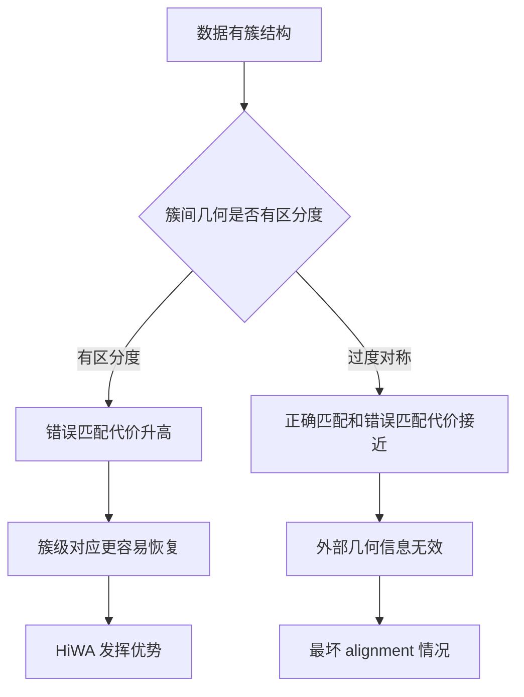

# 第十一章 Lemma 4.3 最坏几何结构

## 1. 本章位置

前面两个理论结果分别回答了两个问题：

1. **Theorem 4.1**：什么时候能恢复正确簇对应 $P^*=I_S/S$；
2. **Theorem 4.2**：如果簇对应正确，那么整体正交对齐误差如何被全局几何扭曲量控制。

本章的 **Lemma 4.3** 回答第三个问题：

> 什么情况下，虽然数据确实有簇结构，但这些簇结构对 alignment 没有帮助？

论文称这种情况为：

$$
\text{uninformative alignment}
$$

可以翻译成：

> 无信息量对齐，或者说：几何结构无法帮助消歧的对齐。

---

## 2. 为什么还需要 Lemma 4.3？

HiWA 的优势来自“簇结构”。

普通 Wasserstein Alignment 大致是：

```text
把所有点混在一起做整体对齐。
```

HiWA 则是：

```text
先在簇级别判断谁对应谁，再在簇内部做点级运输。
```

这隐含了一个前提：

> 不同簇之间的几何关系必须有区分度。

如果不同簇之间的关系都差不多，那么簇结构虽然存在，却无法帮助判断对应关系。

---

## 3. 什么叫“簇结构有信息量”？

假设源数据里有三个簇：

$$
X_1,X_2,X_3.
$$

如果它们之间的关系是：

```text
X_1 和 X_2 很近；
X_1 和 X_3 很远；
X_2 和 X_3 距离中等。
```

目标数据里也有类似关系：

```text
Y_1 和 Y_2 很近；
Y_1 和 Y_3 很远；
Y_2 和 Y_3 距离中等。
```

那么这些相对关系就能帮助我们判断：

$$
X_1 \leftrightarrow Y_1,
\quad
X_2 \leftrightarrow Y_2,
\quad
X_3 \leftrightarrow Y_3.
$$

这叫簇结构有信息量。

---

## 4. 什么叫“簇结构没有信息量”？

如果三个簇刚好形成完全对称的结构，例如等边三角形：

```text
X_1, X_2, X_3 两两距离都一样。
```

目标数据中也是：

```text
Y_1, Y_2, Y_3 两两距离也都一样。
```

那就无法从簇间几何关系判断：

```text
X_1 应该对应 Y_1，还是 Y_2，还是 Y_3？
```

每一种匹配在几何上都看起来差不多。

这就是 Lemma 4.3 要说明的“最坏几何结构”。

---

## 5. 子空间版本的直觉

论文讨论的是 clustered subspace structure，也就是：

> 每个簇可以近似看作落在一个低维子空间中。

例如：

$$
X_i \subset \mathcal U_i,
\quad
Y_j \subset \mathcal V_j.
$$

这时，簇与簇之间的关系不只是“距离”，还包括“子空间夹角”。

两个子空间之间的夹角通常用 **principal angles** 描述。

可以先粗略理解为：

> principal angles 衡量两个子空间之间的相对方向关系。

如果不同子空间之间的 principal angles 都不一样，那么它们之间的关系有区分度。

如果所有子空间之间的 principal angles 都一样，或者都近似正交，那么这些角度关系就不能帮助判断对应关系。

---

## 6. Lemma 4.3 的正式对象

论文考虑一对簇：

$$
X_i,Y_j\in\mathbb R^{D\times n}.
$$

假设已知点级运输计划：

$$
Q_{ij}\in U(n,n).
$$

然后看这个矩阵：

$$
Y_jQ_{ij}^\top X_i^\top.
$$

这是我们前面在 Procrustes 推导中见过的核心矩阵。

对它做奇异值分解，取非零奇异值对应的左右奇异向量：

$$
\widetilde U,\widetilde V\in\mathbb R^{D\times r}.
$$

这里：

- $\widetilde U$ 表示目标侧被当前簇对激活的主要方向；
- $\widetilde V$ 表示源侧被当前簇对激活的主要方向；
- $r$ 是非零奇异值的个数。

这些方向可以理解成：

> 当前簇对自身真正关心的内在对齐方向。

---

## 7. 外部几何信息是什么？

论文接着假设，我们额外知道一些外部方向信息：

$$
U^0,V^0.
$$

这可以理解成：

> 从其他簇、其他子空间、或者全局几何中得到的辅助方向信息。

如果这些外部信息有用，那么它应该能帮助我们进一步限制 $R$。

于是论文定义了一个受约束的正交变换集合：

$$
\mathcal T(U^0,V^0)
=
\{R\in V_{D,D}:RV^0=U^0\}.
$$

这个集合表示：

> 所有满足“把外部方向 $V^0$ 映射到 $U^0$”的正交矩阵。

也就是说，原来 $R$ 可以在整个 Stiefel 流形 $V_{D,D}$ 上选；现在我们加了外部方向约束，只允许 $R$ 在 $\mathcal T(U^0,V^0)$ 中选。

显然：

$$
\mathcal T(U^0,V^0)\subseteq V_{D,D}.
$$

---

## 8. 为什么受约束后的最优值不会更小？

这是最基本的优化事实。

如果我们本来是在大集合上最小化：

$$
\min_{R\in V_{D,D}}C_{ij}(R),
$$

现在改成在更小的集合上最小化：

$$
\min_{R\in\mathcal T(U^0,V^0)}C_{ij}(R),
$$

那么后者不可能比前者更小。

因为可选范围变小了。

所以一定有：

$$
\min_{R\in\mathcal T(U^0,V^0)}C_{ij}(R)
\ge
\min_{R\in V_{D,D}}C_{ij}(R).
$$

这就是 Lemma 4.3 公式中的不等式部分。

注意：这一步不深，它只是说“约束越多，最优值通常不会更好”。

---

## 9. Lemma 4.3 真正关键的是等号条件

不等式本身很自然。真正重要的是：什么时候会等号成立？

等号成立表示：

$$
\min_{R\in\mathcal T(U^0,V^0)}C_{ij}(R)
=
\min_{R\in V_{D,D}}C_{ij}(R).
$$

这句话的意思是：

> 加了外部方向约束以后，最优代价完全没有变。

换句话说，外部几何信息没有提供任何额外帮助。

论文给出的等号条件可以理解为：

$$
\langle \widetilde U,U^0\rangle
=
\langle \widetilde V,V^0\rangle.
$$

这里的内积不是普通两个向量的内积，而是子空间方向之间的相容关系。直观来说，它要求：

> 外部方向之间的角度关系，和当前簇对自身的内在方向关系完全匹配。

如果外部信息只是重复了当前簇对已经拥有的角度结构，那么它不会改变最优解，也不会增加区分能力。

---

## 10. 这句话为什么说明“外部信息无用”？

假设没有外部信息时，最优代价是：

$$
\min_{R\in V_{D,D}}C_{ij}(R).
$$

加入外部信息后，最优代价变成：

$$
\min_{R\in\mathcal T(U^0,V^0)}C_{ij}(R).
$$

如果外部信息真的有用，它应该能排除错误方向，让某些错配的代价上升。

也就是说，我们希望对于错误簇对：

$$
\min_{R\in\mathcal T(U^0,V^0)}C_{ij}(R)
>
\min_{R\in V_{D,D}}C_{ij}(R).
$$

这样外部几何就帮助区分了正确匹配和错误匹配。

但是 Lemma 4.3 告诉我们，有些几何结构下会出现等号：

$$
\min_{R\in\mathcal T(U^0,V^0)}C_{ij}(R)
=
\min_{R\in V_{D,D}}C_{ij}(R).
$$

这说明：

> 即使加入了外部几何方向，错误簇对的代价也没有被抬高。

因此外部几何无法帮助消歧。

---

## 11. 等距子空间为什么是最坏情况？

如果一个数据集中的子空间是 equally-spaced subspaces，也就是子空间之间“等距”或“等角”，那么每个子空间和其他子空间的关系都差不多。

这会导致：

```text
不同簇之间没有独特的角度指纹。
```

如果没有独特指纹，那么外部几何关系无法告诉我们：

```text
这个簇更像哪个目标簇。
```

因此论文说：

> equally-spaced subspaces 是 alignment 的 worst-case scenario。

也就是说，它是 HiWA 最不容易发挥优势的一类几何配置。

---

## 12. 为什么高维空间中更容易出现这种问题？

在高维空间里，很多随机低维子空间之间会近似正交。

也就是说，对于许多不同的子空间：

$$
\mathcal U_i,\mathcal U_j,
$$

它们之间的相关性可能都很小，夹角都接近 $90^\circ$。

于是会出现：

```text
所有子空间彼此都差不多正交。
```

这意味着：

```text
簇间角度结构变得相似，无法提供有效区分信息。
```

这就是论文说高维 alignment 更难的原因之一。

不是因为高维本身必然失败，而是因为高维中子空间之间可能都近似正交，从而缺少可利用的几何差异。

---

## 13. 和 Theorem 4.1 的关系

Theorem 4.1 需要一个 margin 条件：

$$
\widehat C^*_{ij}
+
\widehat C^*_{ji}
-
\widehat C^*_{ii}
-
\widehat C^*_{jj}
>
\text{有限样本误差上界}.
$$

左边表示：

```text
错误交换匹配代价 - 正确匹配代价。
```

如果簇结构有信息量，那么错误匹配代价会明显更高，margin 就大。

但如果子空间等距、等角、过度对称，那么错误匹配和正确匹配可能差不多贵。

这时左边 margin 很小，Theorem 4.1 的条件就难以满足。

因此 Lemma 4.3 解释了：

> Theorem 4.1 的恢复条件什么时候会失败。

---

## 14. 和 Theorem 4.2 的关系

Theorem 4.2 关注：

$$
\varepsilon^2=\lVert Y^\top Y-X^\top X\rVert_F.
$$

这个量衡量全局 Gram 结构是否一致。

Lemma 4.3 则强调：

> 即使 Gram 结构一致，如果这种结构本身太对称，也未必能帮助判断对应关系。

也就是说：

- Theorem 4.2 关心“结构是否被保持”；
- Lemma 4.3 关心“被保持的结构是否有区分能力”。

这两个问题不一样。

一个结构可以被很好地保持，但如果它过于对称，仍然可能没有消歧能力。

---

## 15. 和实验 Figure 1 的关系

论文后面的合成实验比较了两类情况：

```text
randomly-spaced subspaces：随机间隔子空间，平均情况；
equally-spaced subspaces：等距子空间，最坏情况。
```

实验结果显示：

> HiWA 在随机间隔子空间上的 alignment error 和 correspondence error 都优于等距子空间情况。

这正好验证了 Lemma 4.3 的直觉：

> 子空间之间越有差异，簇结构越有帮助；子空间越等距、越对称，簇结构越难提供有效信息。

---

## 16. 本章核心图式



普通文字版结构说明：

```text
数据有簇结构并不自动保证 HiWA 成功。
关键要看簇间几何是否有区分度。
如果有区分度，错误匹配代价会被抬高，P 更容易恢复正确。
如果过度对称，正确匹配和错误匹配代价接近，簇结构就变成无信息量结构。
```

---

## 17. 本章最重要的一句话

> Lemma 4.3 说明了 HiWA 的适用边界：只有当簇之间的几何关系具有区分度时，层级结构才有帮助；如果所有簇之间等距、等角、过度对称，那么外层簇级 OT 无法可靠判断谁对应谁，这就是 alignment 的最坏几何结构。

---

## 18. 复习时只需要记住的三件事

### 第一，约束越多，最优值不会更小

$$
\mathcal T(U^0,V^0)\subseteq V_{D,D}.
$$

所以：

$$
\min_{R\in\mathcal T(U^0,V^0)}C_{ij}(R)
\ge
\min_{R\in V_{D,D}}C_{ij}(R).
$$

### 第二，等号意味着外部信息没有帮助

$$
\min_{R\in\mathcal T(U^0,V^0)}C_{ij}(R)
=
\min_{R\in V_{D,D}}C_{ij}(R).
$$

这表示：

```text
加了外部几何约束，最优代价没有变化。
```

所以外部几何无法帮助消歧。

### 第三，等距子空间是最坏情况

如果所有子空间之间的关系都差不多，那么簇间几何没有独特指纹。

这会导致：

```text
正确匹配和错误匹配难以区分。
```

这就是 Lemma 4.3 的核心。

---

## 19. 下一章学习方向

理论部分到这里可以先收束。后面更适合进入实验部分：

# 第十二章 合成实验 Figure 1 解读

下一章要回答：

> 论文如何用实验验证前面的理论直觉？

重点包括：

- randomly-spaced subspaces 和 equally-spaced subspaces 的区别；
- 为什么等距子空间表现更差；
- sample size $n$ 和 subspace dimension $d$ 如何影响结果；
- HiWA、WA、SA、CORAL、ICP 的比较说明了什么。
