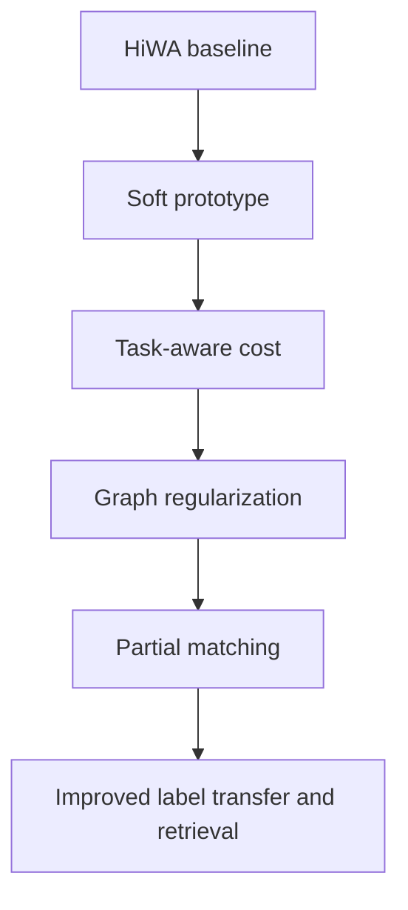

# HiWA 猕猴神经元实验创新方向文献调研
---

## 1. 我们项目的真实目标

你现在的项目目标不是单纯精读 TACO，也不是单纯复现 TACO，而是：

> 以 HiWA 论文中的猕猴神经元实验为核心对象，先复现实验结果，再在 HiWA 方法上提出可验证的创新，使跨域神经元对齐、标签迁移、检索或解码指标得到提升。/

因此，真正要解决的问题是：

1. **复现层面**：能不能跑通 HiWA 对猕猴神经元活动数据的对齐流程，并复现论文中的 accuracy、label transfer、retrieval 或 decoding 指标。
2. **方法创新层面**：能不能在 HiWA 的层次化最优传输框架上加一个合理的新模块，而不是完全推倒重来。
3. **论文表达层面**：创新点必须能够被清楚地讲成一个科研问题：HiWA 原方法忽略了什么？新方法补上了什么？为什么这会提升神经元对齐结果？

从你目前的学习进度来看，最合适的策略不是提出一个巨大新模型，而是在 HiWA 的原有结构上做一个小而清晰的增强：

> 保留 HiWA 的层次结构和 Sinkhorn / ADMM 求解框架，在簇表示、传输代价、结构正则、任务监督或非平衡匹配上加入新的约束。

---

## 2. HiWA 原方法可以被创新的关键位置

HiWA 的核心思想可以理解为：数据不是一个均匀整体，而是具有簇结构。先对簇和簇进行粗粒度对齐，再在对应簇内部进行细粒度传输。它适合神经元数据，因为神经元活动往往具有潜在功能群、试次结构、任务结构或低维流形结构。

但是，这也暴露出几个可创新位置。

### 2.1 簇划分过硬

HiWA 依赖聚类结构。如果簇划分是硬分配，那么一个神经元或一个样本只能属于某个簇。这在神经科学中可能太强，因为神经元可能同时参与多个功能群。例如，一个运动皮层神经元既可能与方向编码有关，也可能与速度或时间阶段有关。

可创新点：将 hard cluster 改成 soft group assignment 或 multi-prototype representation。

### 2.2 对齐目标偏几何，任务信息使用不足

HiWA 主要依靠几何分布匹配。如果最终评价指标是标签迁移、分类、检索或神经解码，那么只追求几何相似可能不够。两个域的分布整体接近，不代表任务相关结构被正确对齐。

可创新点：加入 task-aware cost、label-aware cost、contrastive loss 或 decoding loss。

### 2.3 对局部拓扑保护不够显式

神经元活动数据常常具有局部流形结构：相似任务状态、相似时间片段、相似行为变量对应的神经活动应保持邻域关系。普通 OT 可能将局部邻域打散。

可创新点：加入 graph regularization、Laplacian regularization、GW / supervised GW 或 topology-preserving OT。

### 2.4 默认两域质量完全守恒

经典 OT 假设两边总质量完全匹配。但在真实神经数据中，不同个体、不同 session 或不同实验条件下，可能存在不对应的神经元群、噪声样本、缺失模式或 outlier。

可创新点：引入 partial OT 或 unbalanced OT，让模型允许“不匹配”。

### 2.5 对试次时间结构利用不足

猕猴神经元实验往往包含 trial、time bin、movement direction、velocity 等结构。如果只把样本当成静态点云，可能浪费了时序信息。

可创新点：加入 cross-trial consistency、temporal alignment 或 latent dynamics regularization。

---

## 3. 可参考论文总览

下面的表格先给出文献地图，后面再逐篇展开。

| 方向 | 代表论文 | 核心方法 | 对 HiWA 的启发强度 |
|---|---|---|---|
| HiWA 原始框架 | Lee et al., 2019 | 层次化 OT、簇间 OT、簇内 OT、ADMM | 基线 |
| 神经数据潜空间整合 | Yuan et al., 2024 | OT 对齐异质神经数据的潜在时空模式 | 很强 |
| 神经试次对齐 | Cho et al., 2023 | cross-trial latent alignment 和 time warping | 中到强 |
| 神经 GW 对齐 | Wang and Goldfeld, 2023 | neural entropic GW estimation | 中到强 |
| 可扩展结构对齐 | Vedula et al., 2024 | 将 GW/QAP 转成可扩展 LAP 思路 | 强 |
| 标签约束 GW | Ryu et al., 2024 | labeled GW 用标签辅助跨模态匹配 | 很强 |
| 监督 GW | Cang et al., 2024 | supervised GW 保留指定距离或约束 | 很强 |
| 类别感知 OT | Nguyen et al., 2024 | class-aware OT 和高阶矩匹配 | 强 |
| 对比学习 + OT | Katageri et al., 2023 | contrastive separation + OT alignment | 强 |
| 部分 OT | Lu et al., 2023 | coupling-weighted partial OT 防止负迁移 | 强 |
| 图拓扑 OT | Zhang et al., 2022 | graph topology induced OT regularizer | 强 |
| 多原型 OT | Wu et al., 2023 | multi-prototype + denoised OT | 中到强 |
| 非平衡 GW | Riahi et al., 2023 | unbalanced GW 处理部分匹配 | 中到强 |
| 非平衡 OT | Arase et al., 2023 | null alignment / unbalanced alignment | 中 |
| 单细胞对齐综述 | Stanojevic et al., 2022 | 多组学整合与模态对齐综述 | 背景参考 |
| 单细胞 benchmark | Diaz-Mejia et al., 2025 | 跨数据集细胞标签预测与 batch alignment | 指标参考 |

---

## 4. 逐篇论文分析与迁移思路

### 4.1 Lee et al., 2019：Hierarchical Optimal Transport for Multimodal Distribution Alignment

#### 解决的问题

普通 OT 直接在两个点云之间求传输，容易受噪声、多模态结构和局部错配影响。HiWA 的思想是利用数据的簇结构，先做簇级别匹配，再做簇内匹配，从而降低模糊匹配风险。

#### 方法中心

HiWA 的直觉是：

1. 每个 domain 先被分成若干 cluster。
2. 外层 OT 负责 cluster-to-cluster 的质量匹配。
3. 内层 OT 负责 matched clusters 内部的 sample-to-sample 匹配。
4. 如果还需要寻找刚性或正交变换，则结合 Procrustes / ADMM 进行迭代。

可以把它粗略理解为：

$$
\text{HiWA} = \text{cluster-level OT} + \text{within-cluster OT} + \text{global transform estimation}.
$$

#### 亮点

HiWA 的亮点不是单纯用了 OT，而是把 OT 放进层次结构中，使它更适合多模态分布。

#### 局限

1. cluster assignment 通常较硬。
2. 代价函数主要由几何距离决定。
3. 对任务标签、时间结构、图结构和异常样本的处理不够显式。
4. 如果簇划分不稳定，外层传输也会受影响。

#### 对 HiWA 项目的启发

这篇就是你的基线。所有创新都应该围绕它展开，而不是替代它。最稳妥的论文路线是：

> 先复现 HiWA，再设计一个带有 soft prototype / task-aware / topology-preserving / partial-unbalanced 模块的 HiWA 变体，并做 ablation study。

---

### 4.2 Yuan et al., 2024：Optimal Transport for Latent Integration with Application to Heterogeneous Neuronal Activity Data

#### 解决的问题

不同个体、不同实验 session 或不同神经记录条件下，神经活动数据具有强烈异质性。直接比较原始神经活动会受到个体差异和实验噪声影响。

#### 方法中心

这篇论文的核心是：先学习每个主体或数据集的 latent spatiotemporal representation，再用 OT 把这些 latent patterns 对齐到共同空间中，从而提取跨主体共享的动态模式。

#### 亮点

1. 明确面向神经活动数据，而不是一般图像或文本。
2. 不是只做静态点云匹配，而是关注 task-specific dynamic patterns。
3. 适合小样本主体数量的神经科学实验。

#### 对 HiWA 项目的启发

这篇对你的项目很重要。它提示我们：HiWA 不一定只能在原始神经响应空间中做对齐，也可以先构造 latent representation。

可迁移方案：

1. 对每个 session / monkey 的神经活动先做 PCA、autoencoder、factor analysis 或 supervised latent encoder。
2. 在 latent space 中运行 HiWA，而不是直接在 raw firing rate 上运行。
3. 在 latent representation 中加入任务变量，例如 movement direction、velocity 或 time bin。
4. 比较 `Raw-HiWA` 与 `Latent-HiWA`。

可能提升的指标：

1. label transfer accuracy。
2. cross-session retrieval。
3. neural decoding accuracy。
4. 对噪声和个体差异的鲁棒性。

创新性评价：中到强。它不是简单调参，而是改变 HiWA 的输入表示层。如果你能证明 latent space 比 raw space 更适合 HiWA，就可以形成一个清楚的结果。

---

### 4.3 Cho et al., 2023：Neural Latent Aligner

#### 解决的问题

复杂自然行为下，神经数据跨 trial 可能存在时间错位。即使两个 trial 表达相同任务内容，神经活动峰值也可能提前或滞后。

#### 方法中心

该论文提出 Neural Latent Aligner，通过跨 trial 对齐学习行为相关的神经表示，并使用可微 time warping 处理 temporal misalignment。

#### 亮点

1. 把神经表示学习和对齐结合起来。
2. 对齐目标不是纯几何，而是跨试次一致的行为相关结构。
3. 对自然行为神经数据特别有启发。

#### 对 HiWA 项目的启发

HiWA 的猕猴实验如果包含 trial 和 time bin，那么你可以加入 temporal consistency。

可迁移方案：

1. 每个 trial 内部建立时间邻接图。
2. 外层 HiWA 对齐不同 trial / session 的整体结构。
3. 内层 OT 代价加入时间平滑项。
4. 对明显时间错位的数据，先做简单 temporal alignment，再运行 HiWA。

候选正则项：

$$
\mathcal{L}_{\mathrm{time}}
=
\sum_{i,j} P_{ij}\, |t_i - t_j|.
$$

如果两个样本有相似任务阶段，传输代价降低；如果时间阶段差异很大，传输代价升高。

可能提升的指标：

1. decoding accuracy。
2. time-resolved label transfer。
3. trial-level retrieval。

创新性评价：中。这个方向很合理，但需要数据中确实有时间结构，并且你能设计清楚的 ablation。

---

### 4.4 Wang and Goldfeld, 2023：Neural Entropic Gromov-Wasserstein Alignment

#### 解决的问题

普通 OT 需要两域处于可比较的特征空间。但很多异质数据的特征维度、坐标含义或表示方式并不一致。GW 不直接比较点坐标，而是比较域内点对距离结构，因此更适合异构空间对齐。

#### 方法中心

该论文研究 entropic GW 的神经估计，把 EGW alignment 扩展到更大规模和更高维场景。

#### 亮点

1. GW 适合处理不同表示空间之间的结构对齐。
2. entropic regularization 让问题更可计算。
3. neural estimation 提供了可扩展思路。

#### 对 HiWA 项目的启发

如果猕猴神经元实验中两个 domain 的神经元数量、坐标系统或响应分布差异较大，普通 OT 只看跨域距离可能不够稳。可以尝试把 HiWA 的内层或外层距离改成结构距离。

可迁移方案：

1. 保留 HiWA 的层次结构。
2. 外层 cluster matching 使用普通 OT。
3. 内层 sample matching 加入 GW cost，保护局部 pairwise relationship。
4. 得到 `HiWA-GW` 或 `Structure-aware HiWA`。

候选目标：

$$
\mathcal{L}_{\mathrm{GW}}
=
\sum_{i,i',j,j'} |d_X(i,i') - d_Y(j,j')|^2 P_{ij}P_{i'j'}.
$$

这个公式不要求 $x_i$ 和 $y_j$ 在完全同一个坐标系中，只要求它们的内部关系可比较。

可能提升的指标：

1. retrieval。
2. cross-domain nearest-neighbor consistency。
3. 对 domain-specific distortion 的鲁棒性。

创新性评价：强，但计算量更大。建议先在小规模数据或簇内局部 GW 上尝试。

---

### 4.5 Vedula et al., 2024：Scalable Unsupervised Alignment of General Metric and Non-metric Structures

#### 解决的问题

GW / QAP 类型的结构对齐通常计算困难，直接求解很难扩展到大数据。

#### 方法中心

这篇论文将结构对齐问题从难解的 quadratic assignment 角度转化为更可扩展的 linear assignment 思路，并扩展到 metric 和 non-metric structures。

#### 亮点

1. 关注可扩展结构对齐。
2. 不局限于欧式距离，也可处理非度量 dissimilarity。
3. 应用中包括 single-cell multiomics 和 neural latent spaces。

#### 对 HiWA 项目的启发

如果你直接把 GW 加入 HiWA，可能很慢。这篇提供了一个重要提醒：创新不能只讲理论，还要考虑能不能跑。

可迁移方案：

1. 在 HiWA 中只对 cluster prototype 做结构对齐，而不对所有样本做全量 GW。
2. 在每个 cluster 内用近似结构对齐，而不是全局结构对齐。
3. 用 kNN graph 的局部结构代替完整 pairwise distance matrix。

推荐实验路线：

1. `HiWA`：原始方法。
2. `HiWA-GW-full`：完整结构项，小规模测试。
3. `HiWA-GW-local`：局部结构项，主实验使用。

可能提升的指标：retrieval 和 neighborhood preservation。

创新性评价：强。它可以帮助你把结构保护做成可运行版本。

---

### 4.6 Ryu et al., 2024：Labeled Gromov-Wasserstein for Cross-modality Matching

#### 解决的问题

跨模态匹配中，仅靠结构相似可能会产生错误匹配。如果数据有 perturbation label 或 condition label，就应该让标签信息参与 GW 对齐。

#### 方法中心

该论文把 label information 放进 GW 框架，使跨模态匹配既保留结构，又尊重已知标签或条件。

#### 亮点

1. 不是无监督硬对齐，而是 label-aware alignment。
2. 适合跨模态、跨实验条件的数据。
3. 兼顾结构信息和标签信息。

#### 对 HiWA 项目的启发

这篇非常适合你的项目，因为猕猴神经元实验往往有 task label，例如方向、速度区间、时间阶段或行为条件。

可迁移方案：

把 HiWA 的传输代价改成：

$$
C_{ij}
=
C_{ij}^{\mathrm{geom}}
+
\alpha C_{ij}^{\mathrm{task}}
+
\beta C_{ij}^{\mathrm{struct}}.
$$

其中：

1. $C_{ij}^{\mathrm{geom}}$ 是原本的几何距离。
2. $C_{ij}^{\mathrm{task}}$ 衡量任务标签是否一致。
3. $C_{ij}^{\mathrm{struct}}$ 衡量局部结构是否一致。

对于无标签 target，可以使用 source classifier 产生 pseudo-label，再逐步更新。

可能提升的指标：

1. label transfer accuracy。
2. decoding accuracy。
3. class-wise matching precision。

创新性评价：很强。这个方向和 HiWA 不冲突，而且很容易讲成“任务感知层次最优传输”。

---

### 4.7 Cang et al., 2024：Supervised Gromov-Wasserstein Optimal Transport

#### 解决的问题

普通 GW 只鼓励整体 pairwise distance preservation，但某些应用中存在必须保留或必须禁止的匹配约束。supervised GW 通过约束模式来控制匹配。

#### 方法中心

该论文引入 supervised GW，在 cost tensor 中加入应用诱导的约束，使模型能够强制保留某些距离结构或匹配模式。

#### 亮点

1. GW 从完全无监督变成可注入先验的结构对齐。
2. 对部分重叠数据和稳定匹配更友好。
3. 在单细胞 RNA 数据上展示了用途。

#### 对 HiWA 项目的启发

这篇可以转化为 `Constraint-aware HiWA`。

可迁移的约束包括：

1. 同一 movement direction 的样本更应该匹配。
2. 相邻 time bin 的样本不应该被传到相距很远的状态。
3. 已知 trial condition 不一致的样本降低匹配权重。
4. 如果已有一小部分 anchor neurons / anchor samples，可以作为弱监督锚点。

候选模型名称：

> Supervised-Structure HiWA, 简写为 SS-HiWA。

可能提升的指标：label transfer 和稳定性。

创新性评价：强。它比单纯加分类 loss 更有 OT 味，也更容易和 HiWA 的数学结构结合。

---

### 4.8 Nguyen et al., 2024：Class-aware Optimal Transport with Higher-Order Moment Matching

#### 解决的问题

普通 UDA 方法可能对齐整体分布，但没有对齐每个类别的条件分布，导致 class mismatch。该论文提出 class-aware OT，让 target samples 对齐到 source class-conditional distributions。

#### 方法中心

它把源域每个类别看成一个 class-conditional distribution，然后用 OT 学习 target 样本到这些类别分布的匹配，同时用高阶矩匹配增强类别区域对齐。

#### 亮点

1. 明确处理 label shift 和 class-conditional mismatch。
2. 不只是全局分布对齐，而是类别感知对齐。
3. 高阶矩匹配可以减少只匹配均值带来的不足。

#### 对 HiWA 项目的启发

这篇可以直接启发 `Class-aware HiWA`。

可迁移方案：

1. 先按任务标签或伪标签构造 source class prototypes。
2. 外层 HiWA 不只对齐 cluster，还对齐 class-conditional cluster。
3. 内层 OT 在同一类别或相近类别之间进行更强匹配。
4. 用高阶统计量描述每个簇，而不只用 centroid。

候选代价：

$$
C_{ij}^{\mathrm{class}}
=
-\log p(y_i = \hat{y}_j).
$$

其中 $\hat{y}_j$ 是 target 样本的伪标签或 soft label。

可能提升的指标：label transfer accuracy。

创新性评价：强。尤其适合你的目标，因为你的最终指标很可能不是纯 alignment loss，而是标签迁移和解码性能。

---

### 4.9 Katageri et al., 2023：Synergizing Contrastive Learning and Optimal Transport for Domain Adaptation

#### 解决的问题

单独用 OT 对齐分布时，可能把不同类别压在一起，导致类别边界变差。对比学习可以增强类间分离和类内紧致，再用 OT 做跨域对齐。

#### 方法中心

该论文将 contrastive learning 与 OT alignment 结合：contrastive module 先学习更可分的表示，OT module 再进行分布对齐。

#### 亮点

1. OT 负责跨域匹配。
2. contrastive learning 负责 representation separation。
3. 避免对齐过程中发生 over-alignment。

#### 对 HiWA 项目的启发

这是一个非常自然的创新方向：`Contrastive-HiWA`。

可迁移方案：

1. 在运行 HiWA 前训练一个 encoder。
2. 使用同一 task label / movement direction 的样本作为 positive pair。
3. 不同 task label 的样本作为 negative pair。
4. HiWA 在 encoder 输出的 embedding 上运行。
5. 也可以把 contrastive loss 和 HiWA loss 联合训练。

候选目标：

$$
\mathcal{L}
=
\mathcal{L}_{\mathrm{HiWA}}
+
\lambda_{\mathrm{con}}\mathcal{L}_{\mathrm{contrastive}}.
$$

可能提升的指标：

1. label transfer。
2. retrieval。
3. cluster purity。
4. class-wise accuracy。

创新性评价：强，而且实验上容易做 ablation。缺点是需要小心避免引入过多深度学习训练复杂度。

---

### 4.10 Lu et al., 2023：Coupling-weighted Partial Optimal Transport for Domain Alignment

#### 解决的问题

完全对齐源域和目标域可能造成 negative transfer。如果源域中有目标域不存在的类别或噪声样本，强行匹配会伤害分类效果。

#### 方法中心

该论文使用 partial OT，让模型只对齐可信部分，并通过 coupling weight 自适应降低不可靠匹配的影响。

#### 亮点

1. 不强迫所有样本匹配。
2. 能缓解 negative transfer。
3. 对开放集、部分重叠或噪声域适应有价值。

#### 对 HiWA 项目的启发

真实神经数据里非常可能存在“无对应成分”：

1. 某些神经元只在一个 monkey / session 中出现。
2. 某些 trial 噪声很大。
3. 某些 cluster 没有可靠对应。
4. 某些 task condition 在两个域中的分布不同。

可迁移方案：

1. 外层 cluster OT 改成 partial OT。
2. 内层 cluster matching 中加入质量截断。
3. 对低置信度 coupling 设置阈值，只用高置信匹配做 label transfer。

候选模型名称：

> Partial-HiWA 或 Robust-HiWA。

可能提升的指标：

1. outlier robustness。
2. label transfer stability。
3. retrieval precision。

创新性评价：强。它与神经数据的不完全对应问题高度契合。

---

### 4.11 Zhang et al., 2022：Graph Topology induced Optimal Transport for GNN Fine-tuning

#### 解决的问题

在图数据迁移中，普通表示约束忽略了节点之间的拓扑关系。该论文通过 graph topology induced OT regularizer 保留局部图结构知识。

#### 方法中心

利用邻接关系构造结构先验，让 OT 不只是匹配节点表示，还要尊重图拓扑。

#### 亮点

1. 把 graph prior 放进 OT。
2. 保护局部邻域结构。
3. 避免迁移时破坏图模型的结构知识。

#### 对 HiWA 项目的启发

神经活动数据可以自然构造图：

1. 样本图：根据神经活动向量建立 kNN graph。
2. 时间图：相邻 time bin 相连。
3. 任务图：相同 movement direction 或相近 velocity 相连。
4. 神经元图：根据神经元响应相关性建图。

然后加入图正则：

$$
\mathcal{L}_{\mathrm{graph}}
=
\sum_{i,i'} A^X_{ii'} \left\|\sum_j P_{ij}y_j - \sum_{j'}P_{i'j'}y_{j'}\right\|^2.
$$

直觉是：如果 $x_i$ 和 $x_{i'}$ 在源域中相邻，那么它们被传输后的目标表示也应该相邻。

可能提升的指标：

1. neighborhood preservation。
2. retrieval。
3. trial trajectory consistency。
4. downstream decoding。

创新性评价：很强。这个方向非常适合做成你项目的核心创新之一。

---

### 4.12 Wu et al., 2023：MProto: Multi-Prototype Network with Denoised Optimal Transport

#### 解决的问题

一个类别内部可能有多个模式。只用一个 prototype 表示一个类别，会忽略 intra-class variance。该论文用多个 prototype 表示一个实体类型，并用 denoised OT 处理噪声标注。

#### 方法中心

1. 每个类别有多个 prototype。
2. token-to-prototype assignment 被看作 OT 问题。
3. denoised OT 用于过滤噪声。

#### 亮点

1. multi-prototype 能表达类内多样性。
2. OT 用于软分配，而不是硬分类。
3. 对噪声具有鲁棒性。

#### 对 HiWA 项目的启发

TACO 里你已经注意到 soft group / prototype 的思想。这篇进一步说明：多原型 + OT 是一种成熟的可迁移思路。

可迁移方案：

1. 用多个 soft prototypes 表示每个 HiWA cluster。
2. 每个样本不是硬属于一个簇，而是以权重属于多个 prototype。
3. 外层传输从 cluster-to-cluster 变成 prototype-to-prototype。
4. 内层传输使用 prototype assignment 作为先验。

候选模型名称：

> Multi-Prototype HiWA, 简写为 MP-HiWA。

可能提升的指标：

1. accuracy。
2. label transfer。
3. cluster stability。
4. 对噪声和边界样本的鲁棒性。

创新性评价：中到强。它很适合承接你从 TACO 中看到的 soft group assignment 思路。

---

### 4.13 Riahi et al., 2023：EMPOT with Unbalanced Gromov-Wasserstein

#### 解决的问题

某些结构只与另一个结构部分匹配，例如蛋白复合体中的一个子结构。普通全量匹配会把不存在对应关系的部分也强行匹配。

#### 方法中心

EMPOT 使用 unbalanced GW 做 partial alignment，然后根据 coupling 估计刚体变换。

#### 亮点

1. 处理 partial structure matching。
2. 结合 unbalanced GW 和 rigid transform。
3. 对部分重叠数据很有启发。

#### 对 HiWA 项目的启发

猕猴神经元实验中的两个神经群体未必完全对应。这篇说明可以把“部分匹配”和“结构保护”同时做。

可迁移方案：

1. 外层 cluster matching 使用 unbalanced OT。
2. 内层 matching 使用 local GW。
3. 只用高可信 coupling 估计 Procrustes 变换。
4. 低可信 cluster 作为 unmatched component 输出。

可能提升的指标：

1. robust retrieval。
2. outlier rejection。
3. cross-session matching precision。

创新性评价：中到强。数学上漂亮，但实现难度略高。

---

### 4.14 Arase et al., 2023：Unbalanced OT for Unbalanced Word Alignment

#### 解决的问题

在文本对齐中，有些词没有对应词。如果强行匹配所有词，会产生错误对齐。

#### 方法中心

该论文比较 balanced OT、partial OT 和 unbalanced OT，强调 null alignment 的重要性。

#### 亮点

虽然任务是 word alignment，但思想很通用：对齐问题中“不匹配”本身也是信息。

#### 对 HiWA 项目的启发

神经元或神经活动样本也可能有 null alignment。你可以在论文中明确提出：

> HiWA assumes all mass should participate in alignment, but neural recordings across subjects or sessions may contain non-overlapping functional components. Therefore, allowing null alignment can reduce negative transfer.

可迁移方案：

1. 在外层 cluster matching 中允许 unmatched mass。
2. 把 unmatched cluster 作为 outlier 或 domain-specific component。
3. 分析 unmatched mass 是否对应低解码贡献或噪声 trial。

创新性评价：中。作为 Robust-HiWA 的理论动机非常好。

---

### 4.15 Stanojevic et al., 2022：Computational Methods for Single-Cell Multi-Omics Integration and Alignment

#### 解决的问题

单细胞多组学整合需要对齐不同模态、不同特征维度、不同统计性质的数据。虽然它不是神经电生理论文，但它与跨域对齐问题高度相似。

#### 方法中心

这是一篇综述，系统讨论 single-cell integration / alignment 的方法谱系，包括 manifold alignment、network methods、translation-style methods 等。

#### 亮点

1. 提供了跨模态生物数据整合的大图景。
2. 强调异质数据 alignment 的核心挑战。
3. 很适合作为你项目的背景参考。

#### 对 HiWA 项目的启发

它提醒我们，HiWA 的神经元对齐可以类比为 single-cell alignment：

1. cell type 对应 neuron functional type。
2. batch effect 对应 session / subject difference。
3. modality mismatch 对应不同记录条件或不同神经群体。
4. label transfer 对应 cell type annotation transfer。

你可以从单细胞领域借鉴评价指标：

1. label transfer accuracy。
2. batch mixing。
3. neighbor conservation。
4. biological / task signal preservation。

创新性评价：背景参考强，直接方法创新中等。

---

### 4.16 Diaz-Mejia et al., 2025：Benchmarking and Optimizing Organism-wide Single-cell RNA Alignment Methods

#### 解决的问题

很多 single-cell alignment 方法难以公平比较，因为评价指标不统一。该论文提出 K-Neighbors Intersection score，同时考虑 batch effect 和 cell-type label prediction。

#### 方法中心

通过标准化 benchmark 和统一评价指标，比较不同 alignment 方法在跨数据集标签预测上的表现。

#### 亮点

1. 强调 alignment 不能只看分布混合，也要看标签预测。
2. 指标设计兼顾 batch removal 和 biological label preservation。
3. 对你的实验评价体系很有启发。

#### 对 HiWA 项目的启发

你的项目也需要建立一套指标，不然创新很难说服人。

建议指标组：

1. `Accuracy`：对齐后标签迁移准确率。
2. `Retrieval@k`：源样本在目标域中检索到同标签样本的比例。
3. `Decoding R2 / classification accuracy`：对齐后神经解码性能。
4. `Neighbor preservation`：对齐前后的 kNN 邻域一致性。
5. `Unmatched mass ratio`：如果使用 partial / unbalanced OT，报告未匹配质量比例。
6. `Cluster purity`：软分组或原型学习后的任务标签纯度。

创新性评价：指标参考很强。即使不采用它的方法，也应该借鉴它的 benchmark 思维。

---

## 5. 最值得优先尝试的创新方向

### 5.1 方向一：Task-aware Soft-Prototype HiWA

这是目前最推荐的方向。

#### 核心想法

把 HiWA 的 hard cluster 改成 soft prototype，并让任务标签或伪标签影响 prototype matching。

候选总目标：

$$
\mathcal{L}
=
\mathcal{L}_{\mathrm{HiWA}}
+
\lambda_{\mathrm{task}}\mathcal{L}_{\mathrm{task}}
+
\lambda_{\mathrm{proto}}\mathcal{L}_{\mathrm{proto}}.
$$

这里的 $\mathcal{L}_{\mathrm{HiWA}}$ 是原始层次 OT 目标，$\mathcal{L}_{\mathrm{task}}$ 约束任务标签一致性，$\mathcal{L}_{\mathrm{proto}}$ 约束软原型稳定性。

#### 为什么适合你

1. 和 TACO 的 soft group 思想衔接自然。
2. 和 HiWA 的层次结构不冲突。
3. 能直接服务 accuracy / label transfer 指标。
4. 实验实现难度中等。

#### 实验设计

1. `HiWA`：原始基线。
2. `Soft-HiWA`：只加 soft prototype。
3. `Task-HiWA`：只加 task-aware cost。
4. `Task-aware Soft-HiWA`：两者都加。

如果第 4 个最好，就说明两个模块互补。

---

### 5.2 方向二：Graph-Regularized HiWA

#### 核心想法

在 HiWA 的传输过程中保留局部邻域结构。

候选总目标：

$$
\mathcal{L}
=
\mathcal{L}_{\mathrm{HiWA}}
+
\lambda_{\mathrm{graph}}\mathcal{L}_{\mathrm{graph}}.
$$

#### 图的构造方式

可以尝试三种图：

1. **响应图**：根据 firing rate 或 latent feature 的 kNN 建图。
2. **任务图**：同一 movement direction 或相似 velocity 的点相连。
3. **时间图**：相邻 time bin 相连。

#### 为什么适合你

神经元数据的价值不只是点的位置，而是点之间的关系。图正则可以防止 OT 把局部流形打散。

#### 可能提升

1. retrieval。
2. neighbor preservation。
3. decoding accuracy。
4. 对噪声的鲁棒性。

---

### 5.3 方向三：Partial / Unbalanced HiWA

#### 核心想法

允许一部分 cluster 或样本不参与匹配，避免把无对应结构强行对齐。

候选思想：

$$
\min_P \langle C, P \rangle
+ \varepsilon H(P)
+ \tau_X D(P\mathbf{1} \mid a)
+ \tau_Y D(P^T\mathbf{1} \mid b).
$$

这里 $D$ 可以是 KL divergence，用来软化边缘质量约束。

#### 为什么适合你

真实神经记录经常存在不完全对应。Partial / unbalanced 版本可以让方法更像真实科研问题，而不是理想玩具问题。

#### 可能提升

1. outlier robustness。
2. label transfer stability。
3. high-confidence matching precision。

---

### 5.4 方向四：Contrastive Latent HiWA

#### 核心想法

先用对比学习得到更适合任务的 latent representation，再运行 HiWA。

候选总目标：

$$
\mathcal{L}
=
\mathcal{L}_{\mathrm{contrastive}}
+
\lambda_{\mathrm{align}}\mathcal{L}_{\mathrm{HiWA}}.
$$

#### 为什么适合你

如果原始 firing rate 空间噪声较大，HiWA 在 raw space 上对齐可能不稳定。contrastive learning 可以先把 task-relevant structure 拉出来。

#### 风险

1. 需要训练 encoder，复杂度更高。
2. 如果标签太少，contrastive pair 构造会不稳定。
3. 如果目标域无标签，需要伪标签策略。

---

## 6. 推荐的最终项目路线

### 6.1 第一阶段：纯复现

目标：先确认 HiWA 原论文实验能跑通。

建议记录：

1. 数据格式。
2. 预处理流程。
3. 聚类方式。
4. Sinkhorn 参数。
5. ADMM 参数。
6. 指标计算方式。
7. 随机种子和重复实验次数。

输出结果：

1. `HiWA_reproduction.md`
2. `baseline_results.csv`
3. `figures/baseline_alignment.png`

### 6.2 第二阶段：做小创新

优先选择：Task-aware Soft-Prototype HiWA。

理由：

1. 与 TACO 中 soft group 的启发一致。
2. 与 HiWA 原框架兼容。
3. 能直接解释为什么提升 label transfer。
4. 实现难度可控。

### 6.3 第三阶段：做结构增强

在第二阶段成功后，再加入 graph regularization。

推荐顺序：

1. `Soft-HiWA`
2. `Task-aware Soft-HiWA`
3. `Graph Task-aware Soft-HiWA`
4. `Partial Graph Task-aware Soft-HiWA`

不要一开始就把所有模块都加进去，否则很难判断到底哪个模块有效。

---

## 7. 可以写成论文创新点的表述

### 7.1 创新点一：软原型层次最优传输

原始 HiWA 依赖固定聚类结构，可能无法表达神经元功能群的重叠性。我们引入 soft prototype assignment，使样本可以以不同权重属于多个功能原型，从而缓解硬聚类误差对层次传输的影响。

### 7.2 创新点二：任务感知传输代价

原始 HiWA 主要依据几何距离构造传输代价，可能发生 task-irrelevant alignment。我们将任务标签、伪标签或解码损失引入传输代价，使对齐结果更服务于 label transfer 和 neural decoding。

### 7.3 创新点三：局部拓扑保持

神经群体活动通常位于低维流形上。我们通过 kNN graph、temporal graph 或 task graph 构造图正则，鼓励对齐前后的局部邻域关系保持一致。

### 7.4 创新点四：允许不完全匹配

跨个体或跨 session 的神经数据可能存在 domain-specific components。我们引入 partial / unbalanced OT，允许部分质量不匹配，从而减少 negative transfer。

---

## 8. 最推荐的实验矩阵

| 实验组 | Soft prototype | Task-aware cost | Graph regularization | Partial / unbalanced | 目的 |
|---|---|---|---|---|---|
| HiWA | 否 | 否 | 否 | 否 | 原始基线 |
| Soft-HiWA | 是 | 否 | 否 | 否 | 检查软分组是否有效 |
| Task-HiWA | 否 | 是 | 否 | 否 | 检查任务代价是否有效 |
| TSP-HiWA | 是 | 是 | 否 | 否 | 主创新候选 |
| Graph-TSP-HiWA | 是 | 是 | 是 | 否 | 检查拓扑保护是否进一步提升 |
| Robust-Graph-TSP-HiWA | 是 | 是 | 是 | 是 | 检查不完全匹配鲁棒性 |

其中 TSP 可以解释为 Task-aware Soft-Prototype。

---

## 9. 建议优先读的论文顺序

### 第一优先级

1. Lee et al., 2019：HiWA 原始论文。
2. Yuan et al., 2024：OT for latent integration in neuronal activity data。
3. Ryu et al., 2024：Labeled GW。
4. Cang et al., 2024：Supervised GW。
5. Zhang et al., 2022：Graph topology induced OT。

### 第二优先级

1. Katageri et al., 2023：Contrastive learning + OT。
2. Nguyen et al., 2024：Class-aware OT。
3. Lu et al., 2023：Partial OT。
4. Wu et al., 2023：Multi-prototype + denoised OT。

### 第三优先级

1. Wang and Goldfeld, 2023：Neural EGW。
2. Vedula et al., 2024：Scalable structure alignment。
3. Stanojevic et al., 2022：single-cell alignment 综述。
4. Diaz-Mejia et al., 2025：single-cell alignment benchmark。

---

## 10. 当前最稳的科研判断

如果你的时间有限，最建议不要走太大太复杂的路线。最稳的是：

> 复现 HiWA，然后提出 Task-aware Soft-Prototype HiWA，并用 graph regularization 作为增强实验。

这个方向的优点是：

1. 理论上和 HiWA 有直接关系。
2. 方法上能吸收 TACO 的 soft group 思想。
3. 评价上能直接服务 accuracy、label transfer 和 retrieval。
4. 实验上可以逐层 ablation，不会变成不可解释的大模型。
5. 论文叙述上很清楚：从 hard cluster 到 soft prototype，从 geometry-only alignment 到 task-aware alignment。

最终可以形成这样的主线：

普通文字版结构说明：

1. 先复现 HiWA baseline。
2. 再把硬簇改成软原型。
3. 接着加入任务感知代价。
4. 如果有效，再加入图结构正则。
5. 最后尝试 partial / unbalanced matching 处理不完全对应。

---

## 11. 参考资料

1. John Lee, Max Dabagia, Eva L. Dyer, Christopher J. Rozell. *Hierarchical Optimal Transport for Multimodal Distribution Alignment*. 2019. https://arxiv.org/abs/1906.11768
2. Yubai Yuan, Babak Shahbaba, Norbert Fortin, Keiland Cooper, Qing Nie, Annie Qu. *Optimal Transport for Latent Integration with An Application to Heterogeneous Neuronal Activity Data*. 2024. https://arxiv.org/abs/2407.00099
3. Cheol Jun Cho, Edward F. Chang, Gopala K. Anumanchipalli. *Neural Latent Aligner: Cross-trial Alignment for Learning Representations of Complex, Naturalistic Neural Data*. 2023. https://arxiv.org/abs/2308.06443
4. Tao Wang, Ziv Goldfeld. *Neural Entropic Gromov-Wasserstein Alignment*. 2023. https://arxiv.org/abs/2312.07397
5. Sanketh Vedula, Valentino Maiorca, Lorenzo Basile, Francesco Locatello, Alex Bronstein. *Scalable Unsupervised Alignment of General Metric and Non-metric Structures*. 2024. https://arxiv.org/abs/2406.13507
6. Jayoung Ryu, Charlotte Bunne, Luca Pinello, Aviv Regev, Romain Lopez. *Cross-modality Matching and Prediction of Perturbation Responses with Labeled Gromov-Wasserstein Optimal Transport*. 2024. https://arxiv.org/abs/2405.00838
7. Zixuan Cang, Yaqi Wu, Yanxiang Zhao. *Supervised Gromov-Wasserstein Optimal Transport*. 2024. https://arxiv.org/abs/2401.06266
8. Tuan Nguyen, Van Nguyen, Trung Le, He Zhao, Quan Hung Tran, Dinh Phung. *A Class-aware Optimal Transport Approach with Higher-Order Moment Matching for Unsupervised Domain Adaptation*. 2024. https://arxiv.org/abs/2401.15952
9. Siddharth Katageri, Arkadipta De, Chaitanya Devaguptapu, VSSV Prasad, Charu Sharma, Manohar Kaul. *Synergizing Contrastive Learning and Optimal Transport for 3D Point Cloud Domain Adaptation*. 2023. https://arxiv.org/abs/2308.14126
10. Xugang Lu, Peng Shen, Yu Tsao, Hisashi Kawai. *Neural Domain Alignment for Spoken Language Recognition Based on Optimal Transport*. 2023. https://arxiv.org/abs/2310.13471
11. Jiying Zhang, Xi Xiao, Long-Kai Huang, Yu Rong, Yatao Bian. *Fine-Tuning Graph Neural Networks via Graph Topology induced Optimal Transport*. 2022. https://arxiv.org/abs/2203.10453
12. Shuhui Wu, Yongliang Shen, Zeqi Tan, Wenqi Ren, Jietian Guo, Shiliang Pu, Weiming Lu. *MProto: Multi-Prototype Network with Denoised Optimal Transport for Distantly Supervised Named Entity Recognition*. 2023. https://arxiv.org/abs/2310.08298
13. Aryan Tajmir Riahi, Chenwei Zhang, James Chen, Anne Condon, Khanh Dao Duc. *EMPOT: Partial Alignment of Density Maps and Rigid Body Fitting Using Unbalanced Gromov-Wasserstein Divergence*. 2023. https://arxiv.org/abs/2311.00850
14. Yuki Arase, Han Bao, Sho Yokoi. *Unbalanced Optimal Transport for Unbalanced Word Alignment*. 2023. https://arxiv.org/abs/2306.04116
15. Stefan Stanojevic, Yijun Li, Lana X. Garmire. *Computational Methods for Single-Cell Multi-Omics Integration and Alignment*. 2022. https://arxiv.org/abs/2201.06725
16. Juan Javier Diaz-Mejia et al. *Benchmarking and Optimizing Organism-wide Single-cell RNA Alignment Methods*. 2025. https://arxiv.org/abs/2503.20730

---

## 12. Obsidian 自检记录

- [x] 未使用圆括号式行内公式分隔符。
- [x] 未使用方括号式块级公式分隔符。
- [x] 块级公式均使用单独成行的 `$$`。
- [x] 未保留 ChatGPT 专用引用标记。
- [x] 代码块与 Mermaid 代码块均已闭合。
- [x] Markdown 表格列数一致。
- [x] 复杂公式未放入表格。
- [x] 文件使用 UTF-8 编码保存。
