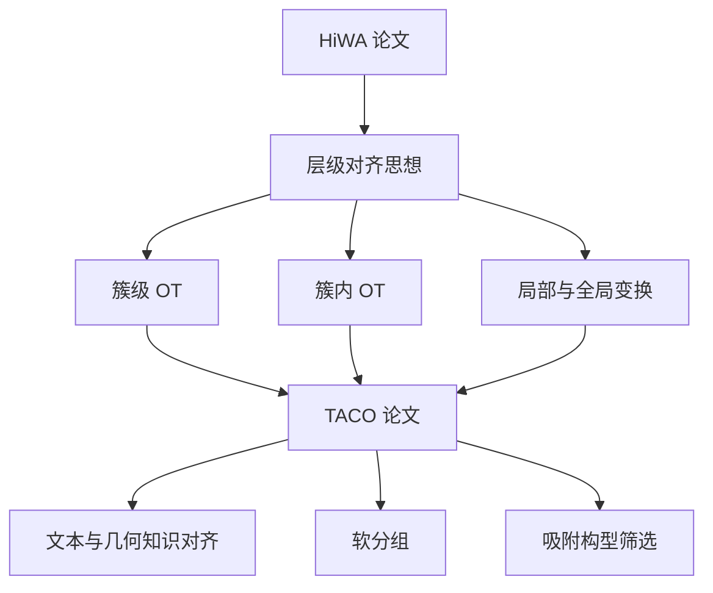

# 最优传输论文学习进展文档

## 1. 当前学习阶段概述

这一阶段的学习围绕两篇论文展开：

1. **HiWA 论文**：围绕 Hierarchical Wasserstein Alignment，即层级 Wasserstein 对齐方法展开。
2. **TACO / AI for Chemistry 论文**：即《Learning Geometric Knowledge from Text for Effective Geometry-Free Adsorption Configuration Screening》，围绕从文本中学习几何知识，并用于 geometry-free adsorption configuration screening 的任务展开。

目前的学习已经不是停留在“看懂论文在做什么”的层面，而是逐步进入了“把论文方法拆成数学对象、优化变量、算法模块和代码实现”的阶段。尤其是在 HiWA 论文中，已经初步建立起了从最优传输、Procrustes、Sinkhorn 到 ADMM 的整体理解框架；而在 TACO 论文中，也已经意识到它并不是一个完全陌生的算法体系，而是在新的化学任务背景下，对 HiWA 思想进行迁移、改造和复用。

换句话说，当前学习进展可以概括为：

> 已经从“读论文原文”推进到“理解论文结构与算法思想”，下一步应当进入“对照代码复现论文方法”的阶段。

---

## 2. 已完成的主要学习内容

### 2.1 HiWA 论文的学习进展

HiWA 论文是这一阶段学习的基础。通过逐章精读，已经学习并梳理了以下核心内容。

#### 2.1.1 问题背景

HiWA 关注的是两个数据集之间的无监督对齐问题。它不是简单地对两个点云做一一匹配，而是试图在没有标签对应关系的情况下，建立两个分布之间的结构性对齐。

从最优传输角度看，两个数据集可以被看成两个经验测度：

$$
\mu_X = \sum_i a_i \delta_{x_i}, \qquad \mu_Y = \sum_j b_j \delta_{y_j}
$$

其中 $\delta_{x_i}$ 和 $\delta_{y_j}$ 表示 Dirac 测度，$a_i$ 与 $b_j$ 表示样本权重。HiWA 的核心问题就是：如何在保持数据结构的前提下，把 $X$ 对齐到 $Y$。

#### 2.1.2 层级结构的理解

HiWA 的关键不是直接做全局点对点匹配，而是引入层级结构：

1. **簇级别对齐**：先判断 $X$ 中的簇和 $Y$ 中的簇之间如何对应。
2. **簇内点级别对齐**：在已经建立簇对应之后，再处理簇内部点之间的传输关系。
3. **局部旋转与全局旋转融合**：每个簇对有局部正交变换，同时这些局部变换需要通过全局共识约束统一起来。

这说明 HiWA 的思想不是“直接暴力匹配”，而是把复杂的全局问题拆成多个局部问题，再通过全局约束重新组合。

#### 2.1.3 关键变量的理解

目前已经对 HiWA 中几个核心变量形成了基本认识：

- $P$：簇级别的传输矩阵，用来描述簇与簇之间的软对应关系。
- $Q_{ij}$：第 $i$ 个源簇与第 $j$ 个目标簇之间的簇内点级传输矩阵。
- $R_{ij}$：局部正交变换，描述某一对簇之间的局部旋转或对齐方式。
- $R_g$：全局正交变换，用来让各个局部变换达成共识。
- $L_{ij}$：ADMM 中的乘子变量，用来协调局部变量和全局变量之间的约束。

这些变量的意义已经不再只是公式符号，而是可以对应到算法流程中的具体模块。

#### 2.1.4 数学工具的学习

围绕 HiWA，已经学习了以下数学工具：

1. **经验测度**  
   将有限样本点表示成离散概率测度，这是使用最优传输处理数据集对齐问题的基础。

2. **Wasserstein 距离**  
   用来衡量两个分布之间的最小传输代价，是整个方法的数学核心。

3. **Birkhoff polytope**  
   用来理解传输矩阵、双随机矩阵以及软匹配结构。

4. **Sinkhorn 算法**  
   用熵正则化近似求解最优传输问题，使原本较难直接求解的 OT 问题变得可计算。

5. **Orthogonal Procrustes 问题**  
   用来理解在固定匹配关系时，如何求解最佳正交变换。

6. **Stiefel manifold**  
   用来理解正交矩阵约束的几何意义。

7. **ADMM 方法**  
   用来把局部变量和全局变量的优化问题拆开求解，再通过乘子变量实现约束协调。

目前已经能够理解：HiWA 的算法不是单一技巧，而是由 OT、Sinkhorn、Procrustes 和 ADMM 共同组成的复合优化框架。

---

### 2.2 TACO / AI for Chemistry 论文的学习进展

第二篇论文是老师写的 AI for Chemistry 论文《Learning Geometric Knowledge from Text for Effective Geometry-Free Adsorption Configuration Screening》。这篇论文一开始看起来和 HiWA 差别很大，因为它进入了化学吸附构型筛选、文本表示、几何知识学习等新的任务语境。

但是经过逐步阅读后，已经形成了一个重要判断：

> TACO 并不是完全脱离 HiWA 的新东西，而是在化学任务中复用了类似的最优传输与分组对齐思想。

#### 2.2.1 任务理解

这篇论文关注的是 adsorption configuration screening，也就是吸附构型筛选。传统上，这类任务往往需要显式几何信息，例如吸附位点、原子结构、构型坐标等。但这篇论文试图从文本中学习几何知识，从而进行 geometry-free 的构型筛选。

这里的关键转变是：

- HiWA 中对齐的是两个数据集或两个点云结构。
- TACO 中对齐的是文本表示、几何知识、吸附构型之间的关系。

也就是说，TACO 把“几何结构对齐”的问题迁移到了“文本表示如何携带几何知识”的问题中。

#### 2.2.2 Encoder 的理解

在阅读过程中，已经专门讨论过 encoders 的含义。Encoder 可以理解为“编码器”，作用是把原始输入转换成向量表示。

例如：

- 文本 encoder：把自然语言描述转成向量。
- 分子或结构 encoder：把化学结构、材料信息或构型信息转成向量。
- 几何知识 encoder：把与几何相关的信息压缩成模型可处理的表示。

所以 encoder 的本质不是神秘的新东西，而是一个“表示转换器”：它负责把人类能读懂的文本、化学对象或几何关系，转成模型能计算的向量。

#### 2.2.3 Soft group assignment 的理解

这部分是当前理解发生突破的地方。

起初 TACO 中的 soft group assignment 看起来像一个陌生模块，但后来已经意识到：

> soft group assignment 本质上是在创造新的软簇，然后后续对不同簇之间的对应关系或最优传输求解，可以继续使用类似 HiWA 的框架。

这意味着 TACO 的方法与 HiWA 的关系非常紧密：

- HiWA 中已经有簇级别对齐和簇内点级别对齐。
- TACO 中通过 soft group assignment 构造软分组。
- 构造分组之后，后续仍然可以使用类似最优传输、局部对应和全局协调的思想。

因此，TACO 中的一部分操作可以看成是对 HiWA 框架的迁移：从固定或已有的簇结构，变成模型自己学习出来的软簇结构。

#### 2.2.4 当前对 TACO 的阶段性判断

目前对 TACO 的理解可以概括为：

1. 它的任务背景比 HiWA 更复杂，因为进入了 AI for Chemistry 场景。
2. 它的输入形式更复杂，因为涉及文本、吸附构型和几何知识。
3. 它的核心思想并不是完全陌生的，而是与 HiWA 中的层级对齐、软匹配、最优传输思想高度相关。
4. 目前真正需要补强的不是“知道它在干什么”，而是“把论文模块和代码变量对应起来”。

---

## 3. 当前已经形成的总体理解

### 3.1 从 HiWA 到 TACO 的迁移关系

这两篇论文之间的关系可以这样理解：

普通文字版结构说明：

HiWA 提供了层级对齐的基本框架，包括簇级别 OT、簇内 OT、局部变换和全局共识；TACO 将这一类思想迁移到化学任务中，通过文本表示和软分组机制学习几何知识，最终服务于吸附构型筛选。

### 3.2 学习状态的变化

这段时间的学习状态经历了几个阶段：

#### 阶段一：先把论文读下来

最开始的重点是理解论文每一节在讲什么，包括摘要、引言、方法、实验和理论部分。这个阶段主要解决的是“论文大概在干嘛”的问题。

#### 阶段二：拆解数学对象

随后开始重点理解 Wasserstein、经验测度、Procrustes、Sinkhorn、ADMM 等工具。这个阶段开始把论文从自然语言拆成数学结构。

#### 阶段三：把不同论文联系起来

在学习 TACO 时，开始发现它与 HiWA 的方法高度相关。尤其是 soft group assignment 和 HiWA 的分层簇对齐之间存在明显联系。这个阶段不再把每篇论文孤立地看，而是开始建立研究方向内部的方法谱系。

#### 阶段四：准备进入代码

现在最重要的下一步，是把论文中的公式、变量和算法流程对应到代码文件、函数、矩阵变量和训练流程中。这一步会决定是否真正掌握论文，而不只是“听懂了讲解”。

---

## 4. 当前掌握较好的内容

目前已经比较清楚的内容包括：

1. **HiWA 的核心目标**  
   它要解决的是两个分布或数据集之间的无监督结构对齐问题。

2. **为什么要分层**  
   因为直接做全局匹配太复杂，分层之后可以先处理簇级对应，再处理簇内点级对应。

3. **为什么用最优传输**  
   因为 OT 可以自然描述两个分布之间的软匹配关系，而不是强行建立硬匹配。

4. **为什么用 Sinkhorn**  
   因为原始 OT 求解成本较高，Sinkhorn 通过熵正则化使计算更稳定、更可实现。

5. **为什么用 Procrustes**  
   因为在匹配关系确定后，需要求解一个最佳正交变换来对齐两个点集。

6. **为什么用 ADMM**  
   因为局部簇对齐和全局一致性之间存在耦合，ADMM 适合把这个问题拆开交替求解。

7. **TACO 与 HiWA 的关系**  
   TACO 中的 soft group assignment 可以理解为在化学任务中构造新的软簇结构，然后利用类似 HiWA 的对齐思想进行后续处理。

---

## 5. 仍然需要继续补强的地方

虽然已经形成整体理解，但仍有一些地方需要在下一阶段继续补强。

### 5.1 数学公式到代码的对应

现在能够大致理解 $P$、$Q_{ij}$、$R_{ij}$、$R_g$、$L_{ij}$ 的数学意义，但还需要进一步明确：

- 它们在代码中分别叫什么变量名。
- 它们的维度分别是多少。
- 它们在哪里初始化。
- 它们在哪个循环中被更新。
- 它们的更新公式和论文中的哪一个公式对应。

### 5.2 算法流程的执行顺序

目前对算法模块已经有理解，但还要进一步确认代码中的真实执行顺序：

1. 数据如何读入。
2. 簇结构如何生成。
3. 代价矩阵如何计算。
4. Sinkhorn 在哪里被调用。
5. Procrustes 在哪里被求解。
6. ADMM 的主循环在哪里。
7. 收敛条件如何判断。
8. 最终输出如何评价。

### 5.3 TACO 的工程细节

TACO 的任务背景更复杂，因此后续尤其需要搞清楚：

- 文本输入具体是什么格式。
- encoder 的输入与输出维度是什么。
- soft group assignment 在代码中如何实现。
- 几何知识是如何被表示和注入模型的。
- 训练目标函数由哪些部分组成。
- 最终 adsorption configuration screening 的评价指标是什么。

---

## 6. 下一步学习计划：进入代码阶段

下一阶段的核心目标是：

> 从“看懂论文”转向“看懂代码”，把论文中的数学对象、算法模块和实验结果逐一落实到具体实现上。

### 6.1 第一阶段：先跑通代码

第一步不急着逐行理解，而是先保证代码能运行。

需要完成：

1. 找到论文对应的代码仓库或老师提供的代码文件。
2. 阅读 `README`，确认环境要求、依赖库、数据格式和运行命令。
3. 配置运行环境。
4. 运行最小 demo。
5. 记录运行过程中的报错、输入文件、输出结果和日志。

这一阶段的目标不是理解所有细节，而是先把完整流程跑起来。

### 6.2 第二阶段：建立“论文公式—代码变量”对照表

代码跑通后，需要建立一张自己的变量对照表。重点不是追求漂亮，而是要能帮助自己理解。

建议记录以下内容：

| 论文符号 | 数学含义 | 代码变量名 | 维度 | 更新位置 | 对应公式 |
|---|---|---|---|---|---|
| $P$ | 簇级传输矩阵 | 待补充 | 待补充 | 待补充 | 待补充 |
| $Q_{ij}$ | 簇内传输矩阵 | 待补充 | 待补充 | 待补充 | 待补充 |
| $R_{ij}$ | 局部正交变换 | 待补充 | 待补充 | 待补充 | 待补充 |
| $R_g$ | 全局正交变换 | 待补充 | 待补充 | 待补充 | 待补充 |
| $L_{ij}$ | ADMM 乘子变量 | 待补充 | 待补充 | 待补充 | 待补充 |

这张表会成为后续读代码的主线。

### 6.3 第三阶段：按模块读代码

不要从第一行开始机械阅读，而是按模块拆解。

#### 模块一：数据输入与预处理

需要弄清楚：

- 输入数据是什么。
- 样本点、簇标签或软分组如何表示。
- 数据是否归一化。
- 距离矩阵或代价矩阵如何计算。

#### 模块二：Sinkhorn / OT 求解

需要弄清楚：

- Sinkhorn 函数在哪里。
- 输入的代价矩阵是什么。
- 熵正则参数是多少。
- 输出的传输矩阵是否对应 $P$ 或 $Q_{ij}$。
- 是否有归一化、截断或数值稳定技巧。

#### 模块三：Procrustes / 正交变换

需要弄清楚：

- 代码在哪里调用 SVD。
- 求得的是局部 $R_{ij}$ 还是全局 $R_g$。
- 正交约束如何保证。
- 是否处理了反射问题。

#### 模块四：ADMM 主循环

需要弄清楚：

- 主循环的迭代次数是多少。
- 每次迭代更新哪些变量。
- 乘子变量 $L_{ij}$ 如何更新。
- 惩罚参数如何设置。
- 收敛标准是什么。

#### 模块五：实验与评价

需要弄清楚：

- 论文中的图和表分别由哪些脚本生成。
- 评价指标是什么。
- 随机种子如何设置。
- 是否能复现论文中的主要结果。

### 6.4 第四阶段：做最小复现

最小复现是代码学习的关键。建议先不要直接复现完整论文，而是构造一个非常小的 toy example。

例如：

1. 构造两个二维点云。
2. 对其中一个点云施加旋转和平移。
3. 使用 OT 找到软匹配。
4. 使用 Procrustes 求出旋转矩阵。
5. 观察对齐前后的图像变化。

最小复现的意义在于：它能把抽象公式变成可视化结果。

### 6.5 第五阶段：回到 TACO 代码

在 HiWA 代码理解稳定之后，再进入 TACO 代码会更自然。

TACO 代码学习建议按以下顺序推进：

1. 先看数据读取部分，弄清楚文本、材料、吸附构型如何输入。
2. 再看 encoder 部分，弄清楚每类输入如何变成向量。
3. 接着看 soft group assignment，确认软分组如何计算。
4. 然后看 loss function，弄清楚模型到底在优化什么。
5. 最后看 evaluation，弄清楚筛选效果如何被衡量。

---

## 7. 接下来可以采用的学习提问模板

为了更高效地学习代码，后续可以按照下面的方式提问。

### 7.1 代码整体理解模板

> 这是一段论文对应代码。你先不要逐行解释，而是告诉我：它在论文算法中对应哪一部分？输入是什么？输出是什么？核心变量有哪些？

### 7.2 变量对应模板

> 请帮我把这段代码中的变量和论文里的 $P$、$Q_{ij}$、$R_{ij}$、$R_g$、$L_{ij}$ 对应起来，并说明每个变量的维度。

### 7.3 函数解释模板

> 这个函数我看不懂。请你按“函数目的—输入—输出—数学公式—逐行解释—我需要记住什么”的结构讲。

### 7.4 报错解决模板

> 代码运行报错如下。请先判断这是环境问题、数据路径问题、维度问题还是算法实现问题，然后告诉我怎么改。

### 7.5 复现论文模板

> 我想复现论文中的这个实验。请你告诉我需要运行哪个文件、需要准备什么数据、输出应该是什么，以及如何判断复现成功。

---

## 8. 阶段性总结

目前的学习进展可以总结为三句话：

第一，HiWA 已经基本完成从论文文字到数学框架的理解，核心概念包括 Wasserstein、经验测度、Sinkhorn、Procrustes、Stiefel manifold 和 ADMM。

第二，TACO 的方法已经不再被看成完全陌生的新算法，而是被理解为在 AI for Chemistry 场景下，对 HiWA 式层级对齐、软匹配和软分组思想的迁移与改造。

第三，下一步最重要的任务不是继续泛泛读论文，而是进入代码，把论文公式、变量、算法流程和实验结果一一对应起来，最终形成“能读、能跑、能改、能复现”的掌握状态。

---

## 9. 下一阶段的具体产出目标

下一阶段建议形成四个实际产出：

1. **代码运行记录**  
   记录环境配置、运行命令、报错和解决方法。

2. **论文公式—代码变量对照表**  
   把 $P$、$Q_{ij}$、$R_{ij}$、$R_g$、$L_{ij}$ 等变量对应到代码实现。

3. **算法流程图**  
   画出从输入数据到输出结果的完整流程。

4. **最小 toy example 复现**  
   用一个简单二维点云例子复现 OT + Procrustes + 对齐流程。

完成这四个产出后，就可以认为已经从“读懂论文”进入了“具备复现和改造能力”的阶段。
