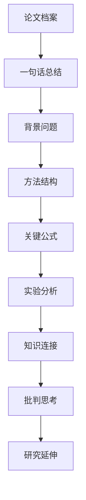
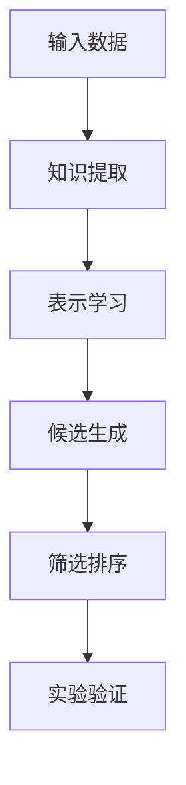

# 读论文的方法论笔记

> 目标：不是“看懂一篇论文”，而是训练科研工作者的论文阅读能力：识别问题、拆解方法、理解公式、审查实验、形成自己的研究问题，并沉淀到个人知识库中。

---

## 1. 核心观念：读论文不是线性阅读

很多人读论文容易陷入一个误区：从标题开始，逐字逐句往后读，遇到不懂的公式就卡住。科研式读论文不是这样。

一篇论文应该被反复阅读，每一遍都有不同任务：

1. 第一遍看问题：这篇论文到底想解决什么？
2. 第二遍看结构：作者的方法由哪些模块组成？
3. 第三遍看公式：每个公式在优化什么、约束什么、表达什么直觉？
4. 第四遍看实验：实验是否真的支撑作者的结论？
5. 第五遍看延伸：这篇论文能不能变成自己的研究问题？

论文不是一本教材。教材通常按知识顺序组织，论文则按“说服审稿人”的逻辑组织。因此读论文时，不能只问“这一句是什么意思”，还要问“作者为什么要这样写”。

---

## 2. 科研式读论文的总流程

可以把读论文分成九个步骤。



文字版结构如下：

1. 建立论文档案。
2. 写出一句话总结。
3. 理解背景问题和研究动机。
4. 拆解方法框架。
5. 精读关键公式与算法。
6. 审查实验设计与结果。
7. 和已有知识建立连接。
8. 形成批判性评价。
9. 提炼可延伸的研究问题。

---

## 3. 第一遍：读问题，不读细节

第一遍阅读时，不要试图看懂所有公式，也不要急着理解所有实验表格。第一遍的目标是抓住论文的“问题骨架”。

### 3.1 需要回答的问题

- 这篇论文研究什么问题？
- 这个问题为什么重要？
- 传统方法如何处理这个问题？
- 传统方法有什么不足？
- 作者提出了什么新思路？
- 输入是什么？
- 输出是什么？
- 最核心的贡献是什么？

### 3.2 一句话总结模板

```md
这篇论文关注的是……问题。传统方法通常……，但存在……困难。作者提出……方法，通过……实现……，最终在……任务上证明了方法的有效性。
```

例如：

```md
这篇论文关注的是吸附构型筛选问题。传统方法通常依赖大量几何结构搜索和昂贵计算，但存在计算成本高、候选空间巨大等困难。作者提出一种从文本中学习几何知识的方法，通过把化学文本知识转化为构型筛选信号，实现 geometry-free 的吸附构型预筛选，最终在相关吸附体系上证明了方法的有效性。
```

这句话不要求一开始完全准确，但必须先写出来。之后每读一遍论文，都可以回头修改这句话。

---

## 4. 第二遍：读方法主线

第二遍阅读的重点是方法结构，而不是局部细节。

你需要把论文方法拆成几个模块，并弄清楚每个模块的输入、输出和作用。

### 4.1 方法拆解问题

- 方法分成几个模块？
- 每个模块解决什么子问题？
- 每个模块的输入是什么？
- 每个模块的输出是什么？
- 模块之间如何连接？
- 哪一步是论文的真正创新？
- 哪一步是已有技术的应用？
- 如果删除某个模块，方法还能成立吗？

### 4.2 方法结构笔记模板

```md
## 方法框架

### 模块一：

- 输入：
- 输出：
- 作用：
- 关键思想：
- 我的问题：

### 模块二：

- 输入：
- 输出：
- 作用：
- 关键思想：
- 我的问题：

### 模块三：

- 输入：
- 输出：
- 作用：
- 关键思想：
- 我的问题：

## 模块之间的关系

- 模块一为模块二提供……
- 模块二把……转化为……
- 模块三最终用于……
```

### 4.3 方法图示模板



Mermaid 图只用来表示结构，不要把复杂公式直接塞进节点里。复杂公式应放在正文中单独解释。

---

## 5. 第三遍：读公式和算法

公式不是用来背的，而是用来表达作者的建模思想。读公式时，最重要的是把它翻译成人话。

### 5.1 读公式的标准顺序

每遇到一个关键公式，按照下面顺序处理：

1. 这个公式想解决什么问题？
2. 公式中的变量分别是什么？
3. 每一项分别代表什么意义？
4. 这个公式在鼓励什么？
5. 这个公式在惩罚什么？
6. 约束条件限制了什么？
7. 它和前一个公式有什么关系？
8. 它和后面的算法或实验有什么关系？

### 5.2 公式笔记模板

```md
## 公式编号：

$$
在这里写公式
$$

### 公式目标

这个公式想要……

### 变量解释

- $x$：表示……
- $y$：表示……
- $\theta$：表示……

### 直觉解释

这个公式可以理解为：在……条件下，寻找一个……，使得……尽可能小或尽可能大。

### 数学结构

- 优化目标：
- 约束条件：
- 损失项：
- 正则项：

### 和上下文的关系

- 前文提出了……问题。
- 这个公式把问题转化为……
- 后文通过……来求解或验证它。

### 我的疑问

- ……
```

### 5.3 公式翻译能力

看到公式时，要训练自己说出类似下面的话：

- 这个损失函数在惩罚预测结果和真实结果之间的偏差。
- 这个约束保证了解的结构不会偏离物理可行区域。
- 这个正则项防止模型过拟合。
- 这个优化目标是在多个候选结构中寻找能量更低或匹配度更高的构型。
- 这个距离函数衡量两个分布、结构或表示之间的差异。

例如在最优传输中，一个典型问题可以写成：

$$
\min_{\pi \in \Pi(\mu, \nu)} \int c(x,y) \, d\pi(x,y)
$$

它的直觉解释是：

在所有满足边缘分布为 $\mu$ 和 $\nu$ 的运输方案 $\pi$ 中，寻找一个总运输成本最小的方案。其中 $c(x,y)$ 表示把质量从 $x$ 运到 $y$ 的代价。

这里真正重要的不是记住符号，而是理解：

- $\mu$ 和 $\nu$ 是两个分布；
- $\pi$ 是一个匹配或运输方案；
- $c(x,y)$ 是匹配成本；
- 优化目标是在所有合法匹配中找成本最低者。

---

## 6. 第四遍：读实验和结果

实验部分不是简单地看“方法比 baseline 高多少”，而是要判断实验是否支撑作者的核心主张。

### 6.1 实验阅读问题

- 作者提出了哪些 claim？
- 每个 claim 由哪个实验支持？
- 数据集是什么？
- baseline 是谁？
- 评价指标是什么？
- 主实验说明了什么？
- 消融实验说明了什么？
- 可视化结果说明了什么？
- 是否有失败案例？
- 是否有作者没有讨论的漏洞？

### 6.2 实验分析模板

```md
## 实验分析

### 实验目标

这个实验想证明……

### 数据集

- 数据来源：
- 数据规模：
- 任务形式：
- 可能的问题：

### Baseline

- Baseline 1：
- Baseline 2：
- Baseline 3：

### 评价指标

- 指标一：表示……
- 指标二：表示……

### 主实验结论

作者通过……说明……

### 消融实验结论

消融实验说明……模块对结果有……影响。

### 我的判断

- 实验支撑较强的地方：
- 实验支撑不足的地方：
- 可能需要补充的实验：
```

### 6.3 把实验读成证据链

建议用下面的方式整理：

```md
## Claim-Evidence 表

| 作者主张 | 对应实验 | 证据强度 | 我的评价 |
|---|---|---|---|
| 方法比传统方法更有效 | 主实验表格 | 中 / 强 | 需要看 baseline 是否公平 |
| 某模块是必要的 | 消融实验 | 中 / 强 | 需要看删去模块后的下降幅度 |
| 方法具有可解释性 | 可视化实验 | 弱 / 中 | 可视化通常只能辅助说明 |
```

注意：表格中不要放复杂公式。如果要解释公式，放在表格外面。

---

## 7. 第五遍：读贡献、不足和延伸

科研式阅读的最后一步，是把论文转化成自己的问题。

### 7.1 贡献分析

读完论文后，要明确区分以下几种贡献：

- 问题贡献：提出了一个新的研究问题。
- 方法贡献：提出了一个新的模型、算法或框架。
- 理论贡献：给出了新的定理、界、收敛性或解释。
- 数据贡献：构建了新的数据集或 benchmark。
- 实验贡献：在重要任务上取得了新的效果。
- 应用贡献：把已有方法成功迁移到新的应用领域。

### 7.2 不足分析

常见不足包括：

- 假设过强；
- 实验场景有限；
- baseline 不够充分；
- 缺少理论保证；
- 方法可解释性不足；
- 对噪声或分布偏移不够鲁棒；
- 计算成本没有充分讨论；
- 只在少量数据集上验证；
- 消融实验不够完整。

### 7.3 延伸问题模板

```md
## 可能的研究延伸

### 延伸一：方法改进

能否把……替换为……，从而提升……？

### 延伸二：理论分析

能否证明……在某些条件下具有……性质？

### 延伸三：应用迁移

能否把这个方法从……任务迁移到……任务？

### 延伸四：和已有知识结合

能否把本文方法和……结合，例如 Wasserstein 距离、Sinkhorn 算法、Procrustes 对齐、经验测度或图神经网络？
```

---

## 8. 和已有知识建立连接

真正有效的论文阅读，不是把每篇论文孤立存放，而是把它接入自己的知识网络。

你可以每读一篇论文，就问：

- 它和我学过的哪个概念有关？
- 它和哪篇论文的问题相似？
- 它的方法能不能被另一篇论文的方法替代？
- 它的实验设置和其他论文是否可比较？
- 它有没有使用我熟悉的数学结构？

### 8.1 针对当前项目的连接方向

对于“最优传输”和“AI for Chemistry”相关论文，可以重点建立以下连接：

- 经验测度：样本、结构、构型或分子表示能否看成经验分布？
- Wasserstein 距离：两个结构分布或表示分布之间是否存在运输距离？
- Sinkhorn 算法：如果有匹配或传输问题，是否可以用熵正则化近似求解？
- Procrustes 对齐：如果涉及几何结构对齐，是否有旋转、平移或尺度对齐问题？
- 图神经网络：分子、晶体、吸附位点是否可以建模成图？
- 文本知识：自然语言中的化学知识如何变成可计算约束？
- 几何筛选：候选构型之间如何定义相似性、合理性或能量偏好？

### 8.2 知识连接模板

```md
## 和已有知识的连接

### 和 HiWA 的关系

- 相似点：
- 不同点：
- 可以借鉴的思想：

### 和 Wasserstein 的关系

- 是否涉及分布：
- 是否涉及匹配：
- 是否可以定义运输成本：

### 和 Sinkhorn 的关系

- 是否需要近似求解匹配问题：
- 是否可以加入熵正则项：

### 和 Procrustes 的关系

- 是否涉及结构对齐：
- 是否需要处理旋转、平移或尺度：

### 和 AI for Chemistry 的关系

- 化学对象：
- 任务目标：
- 物理约束：
- 可解释性问题：
```

---

## 9. 和 AI 助手交流的最佳模板

为了让 AI 更好地辅助读论文，每次提问时最好给出四类信息：

1. 当前读到哪里；
2. 自己已经理解了什么；
3. 自己卡在哪里；
4. 希望 AI 输出什么形式的结果。

### 9.1 通用提问模板

```md
我现在学习的论文是：

当前阅读位置：

我目前理解的是：

我卡住的地方是：

请你按照以下方式帮助我：

1. 先用通俗语言讲背景和动机；
2. 再说明这一节在整篇论文中的位置；
3. 然后拆解核心概念、方法或公式；
4. 如果有公式，请逐项解释变量和意义；
5. 如果有实验图，请说明它想证明什么；
6. 联系我之前学过的 HiWA、Wasserstein、Sinkhorn、Procrustes 或经验测度；
7. 最后生成 Obsidian 兼容 Markdown 笔记；
8. 附上自测问题和可以继续研究的问题。
```

### 9.2 老师讲课模式

适合刚开始读一章或一节。

```md
请你像老师上课一样讲这一节。先不要急着讲公式，先讲问题背景、研究动机、直觉图景和这一节在全文中的作用。讲完后再告诉我哪些概念需要后面重点补。
```

### 9.3 公式推导模式

适合卡在数学部分。

```md
请你逐行解释这个公式。要求包括：变量含义、每一项的直觉、优化目标、约束条件、它和前后文的关系，以及一个尽量简单的小例子。
```

### 9.4 审稿人模式

适合训练批判性思维。

```md
请你作为审稿人评价这一节。指出它的创新点、不足、潜在漏洞、实验是否充分，以及如果我是作者应该如何回应审稿人的质疑。
```

### 9.5 组会汇报模式

适合把论文讲给老师或同学听。

```md
请你把这一节整理成 5 分钟组会汇报稿。要求包括：研究问题、方法直觉、关键公式、实验结论、我的理解和可以讨论的问题。
```

### 9.6 Obsidian 笔记模式

适合沉淀知识库。

```md
请你生成 Obsidian 兼容 Markdown 笔记。要求：公式使用 $...$ 和 $$...$$，不要使用 ChatGPT 专用引用标记；代码块正确闭合；如果有 Mermaid 图，请使用 mermaid 语言标记的代码块；最后附小结、自测题和后续问题。
```

---

## 10. 一篇论文的标准 Obsidian 笔记结构

推荐每篇论文建立一个文件夹，而不是只写一个长文件。

```md
论文阅读/
├── AI for Chemistry/
│   └── 论文标题/
│       ├── 00-论文总览.md
│       ├── 01-问题背景.md
│       ├── 02-方法框架.md
│       ├── 03-关键公式.md
│       ├── 04-实验分析.md
│       ├── 05-批判性思考.md
│       └── 06-研究延伸.md
├── Optimal Transport/
│   ├── Wasserstein.md
│   ├── Sinkhorn.md
│   ├── Procrustes.md
│   └── 经验测度.md
└── Research Ideas/
    ├── 文本知识与几何约束.md
    ├── OT for Adsorption Screening.md
    └── 论文启发问题池.md
```

### 10.1 单篇论文总览模板

```md
# 论文标题

## 基本信息

- 标题：
- 作者：
- 会议 / 期刊：
- 年份：
- 领域：
- 关键词：

## 一句话总结

这篇论文……

## 研究问题

## 背景动机

## 现有方法不足

## 核心方法

## 主要贡献

## 实验结论

## 我的理解

## 我的疑问

## 可延伸方向
```

---

## 11. 每次读完一节后的自测问题

读完一节后，可以用下面的问题检查自己是否真的理解。

### 11.1 基础理解

- 这一节在讲什么？
- 它解决了全文中的哪个子问题？
- 作者为什么要在这里引入这个概念？
- 这一节和前一节有什么关系？
- 这一节为后一节做了什么铺垫？

### 11.2 方法理解

- 这一节的输入是什么？
- 这一节的输出是什么？
- 核心操作是什么？
- 如果不用这个方法，可以用什么替代？
- 这个方法的关键假设是什么？

### 11.3 公式理解

- 每个变量代表什么？
- 公式优化什么？
- 公式约束什么？
- 哪一项最重要？
- 如果去掉某一项，会发生什么？

### 11.4 批判理解

- 这一节最强的地方是什么？
- 这一节最弱的地方是什么？
- 作者有没有跳过某个关键解释？
- 有没有更自然的建模方式？
- 这一节能不能产生新的研究问题？

---

## 12. 读论文时常见的错误

### 12.1 一开始就钻公式

错误做法：

```md
我必须先看懂所有公式，才能继续往下读。
```

更好的做法：

```md
我先知道这个公式服务于哪个问题，再决定是否需要精读推导。
```

### 12.2 只看作者说什么，不看作者证明了什么

论文中有些话是作者的主张，有些话才是实验或理论真正支持的结论。读论文时要区分 claim 和 evidence。

### 12.3 只总结，不批判

普通读者会说：“作者提出了一个方法，实验效果很好。”

科研工作者要继续问：

- 为什么这个方法有效？
- 是真的有效，还是数据集刚好适合？
- baseline 是否公平？
- 有没有没有讨论的失败情况？
- 方法能不能推广？

### 12.4 只存笔记，不建立连接

如果每篇论文都只是一个孤立的 Markdown 文件，知识库会变成资料仓库，而不是研究系统。

更好的做法是不断建立链接：

```md
相关概念：[[Wasserstein 距离]]、[[Sinkhorn 算法]]、[[Procrustes 对齐]]、[[经验测度]]
相关论文：[[HiWA]]、[[Taco]]
相关问题：[[文本知识如何转化为几何约束]]
```

---

## 13. 每周论文学习复盘模板

每周可以进行一次复盘，把读过的论文和形成的问题整理起来。

```md
# 每周论文复盘

## 本周读过的论文

1. 
2. 
3. 

## 本周真正理解的概念

- 
- 
- 

## 本周仍然模糊的概念

- 
- 
- 

## 本周最有价值的方法

- 方法名称：
- 来自论文：
- 可以解决的问题：
- 可能迁移到哪里：

## 本周产生的研究问题

1. 
2. 
3. 

## 下周计划

- 精读：
- 补充背景：
- 复现或实验：
- 写作输出：
```

---

## 14. 最终目标：从读懂论文到提出问题

读论文的最高目标不是“我看懂了”，而是：

```md
我能够用自己的语言说明这篇论文的问题、方法、公式、实验、贡献、不足，并基于它提出新的研究问题。
```

一个科研工作者读完论文后，至少应该留下四类产物：

1. 一页纸总结；
2. 结构化 Obsidian 笔记；
3. 批判性问题清单；
4. 可延伸研究想法。

如果一篇论文没有留下任何问题，它往往还没有真正进入你的研究系统。

---

## 15. 最小可执行流程

如果时间有限，每篇论文至少完成下面五件事：

```md
## 最小可执行论文阅读流程

1. 写一句话总结。
2. 画出方法流程图。
3. 精读 1 到 3 个关键公式。
4. 分析 1 张最重要的实验表或实验图。
5. 写出 3 个批判性问题和 3 个延伸问题。
```

这五件事做完，才算真正读过一篇论文。

---

## 16. 自检清单

读完一篇论文后，用下面清单检查。

```md
## 论文阅读自检清单

- [ ] 我能用一句话说明这篇论文解决什么问题。
- [ ] 我能说清楚传统方法的不足。
- [ ] 我能画出作者的方法流程。
- [ ] 我能解释关键公式中的主要变量。
- [ ] 我能说出每个关键公式的直觉意义。
- [ ] 我能指出实验验证了哪些 claim。
- [ ] 我能区分作者的主张和实验真正证明的内容。
- [ ] 我能说出这篇论文最强的贡献。
- [ ] 我能说出这篇论文最明显的不足。
- [ ] 我能把它和已有知识建立连接。
- [ ] 我能提出至少 3 个后续研究问题。
```

---

## 17. 对当前项目的建议

对于当前正在学习的 AI for Chemistry 论文，可以采用下面的固定节奏：

1. 先讲问题背景，不急着公式。
2. 再拆方法流程，明确输入输出。
3. 然后读关键概念，例如文本知识、几何知识、吸附构型、筛选信号。
4. 接着读公式，逐项解释变量与意义。
5. 再读实验，判断实验是否支持作者 claim。
6. 最后连接到 HiWA、Wasserstein、Sinkhorn、Procrustes、经验测度等已有知识。

每一章都可以形成一份 Obsidian 笔记，并在最后追加：

```md
## 本章小结

## 我真正理解了什么

## 我还不懂什么

## 和已有知识的连接

## 自测问题

## 可继续研究的问题
```

---

## 18. 一句话原则

读论文时始终记住：

> 先抓问题，再看方法；先看结构，再看公式；先问证据，再谈贡献；最后一定要把论文转化成自己的问题。
