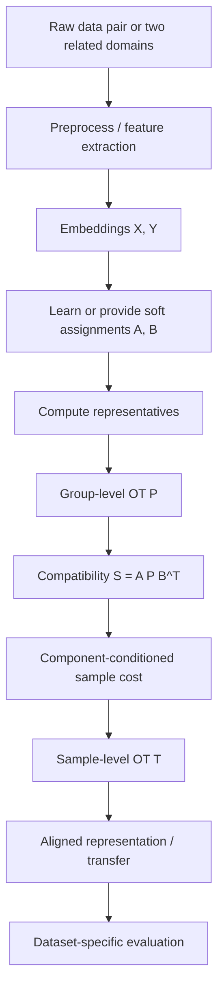

# CC-HiWA 三数据集统一实验协议

## 1. 为什么要统一协议

老师要求至少三个数据集，这意味着我们的目标不是证明一个局部现象，而是证明方法具有一般性。

但三个不同领域数据集很容易把研究拖散。因此必须先把所有任务统一成同一种数学接口：

$$
\mathcal{D}=(X,Y,A,B,\mathcal{E})
$$

其中：

- $X\in\mathbb{R}^{n\times d}$：源域或模态 X 的 embedding；
- $Y\in\mathbb{R}^{m\times d}$：目标域或模态 Y 的 embedding；
- $A\in\mathbb{R}^{n\times K}$：X 的 soft component assignment；
- $B\in\mathbb{R}^{m\times L}$：Y 的 soft component assignment；
- $\mathcal{E}$：只用于最终评价的 labels / pair ids / task targets。

训练和对齐阶段不使用 $\mathcal{E}$ 中的测试标签。

## 2. 三个数据集建议

| 编号 | 数据集 | 领域 | 对齐对象 | 主要评价 | 当前状态 |
|---|---|---|---|---|---|
| D1 | 当前 HiWA 猕猴神经—运动 | 神经科学 | neural latent ↔ movement latent | direction accuracy, movement $R^2$ | 已跑通 |
| D2 | 10x PBMC Multiome RNA–ATAC | 单细胞多组学 | RNA embedding ↔ ATAC embedding | cell type transfer, ARI/NMI | 待接入 |
| D3 | 小型图像—文本数据集 | 视觉语言 | image embedding ↔ text embedding | retrieval Recall@K | 待接入 |

选择逻辑：

- D1 保留项目积累和 ROCA 证据；
- D2 证明方法不是神经专用；
- D3 更接近 TACO 的 text-modal setting。

## 3. 统一方法流程

## 4. CC-HiWA 核心公式

### 4.1 Representatives

$$
r_k^X=
\frac{\sum_i a_{ik}^X x_i}{\sum_i a_{ik}^X}
$$

$$
r_l^Y=
\frac{\sum_j a_{jl}^Y y_j}{\sum_j a_{jl}^Y}
$$

### 4.2 Group-level cost

第一版使用代表点距离：

$$
C_{kl}^{group}=\|r_k^X-r_l^Y\|^2
$$

如果存在正交映射 $R$，则使用：

$$
C_{kl}^{group}=\|Rr_k^X-r_l^Y\|^2
$$

### 4.3 Group-level OT

$$
P=\operatorname{Sinkhorn}(C^{group})
$$

### 4.4 Component compatibility

$$
S=A P B^\top
$$

其中 $S_{ij}$ 表示样本 $x_i$ 和 $y_j$ 在组件层面上的兼容程度。

### 4.5 Component-conditioned sample cost

$$
C_{ij}^{CC}
=
C_{ij}^{base}
-
\beta \log(S_{ij}+\epsilon)
$$

其中：

$$
C_{ij}^{base}=\|Rx_i-y_j\|^2
$$

如果某个数据集不需要正交映射，则令 $R=I$ 或先使用 embedding space distance。

### 4.6 Sample-level OT

$$
T=\operatorname{Sinkhorn}(C^{CC})
$$

## 5. 数据集 D1：HiWA 猕猴神经—运动

### 输入

- $X$：神经 latent representation；
- $Y$：movement representation；
- $A,B$：soft group assignments；
- evaluation labels：movement direction labels、movement velocity。

### 方法配置

- baseline：HiWA；
- baseline：Soft-HiWA；
- stabilization：ROCA；
- main：CC-HiWA + optional ROCA。

### 指标

| 指标 | 含义 | 是否用于训练/选择 |
|---|---|---|
| direction accuracy | nearest-neighbor direction label consistency | 否，只最终评价 |
| movement $R^2$ | aligned neural XY 与 movement XY 的连续拟合程度 | 否，只最终评价 |
| branch stability | ROCA 是否选择高 accuracy branch | 否，只最终评价 |
| transport entropy | transport 是否过分分散 | 可作无标签诊断 |

### 特别说明

ROCA 只在 D1 中作为 3D orientation stabilization 使用。不要把 ROCA 强行推广到所有数据集。

## 6. 数据集 D2：PBMC RNA–ATAC

### 输入

- $X$：RNA embedding；
- $Y$：ATAC embedding；
- $A,B$：cell state / topic / cluster soft assignments；
- evaluation labels：cell type labels 或 paired cell ids。

### 可行数据源

- 10x Genomics PBMC Multiome；
- Seurat / Signac tutorial data；
- scGLUE benchmark 相关数据。

### 指标

| 指标 | 含义 |
|---|---|
| cell type transfer accuracy | 通过 alignment 从 RNA 向 ATAC 或反向转移 cell type |
| macro F1 | 类别不平衡时更稳 |
| ARI/NMI | 对齐后邻域或聚类结构是否保留 cell type |
| modality mixing | 两模态在共同空间中是否混合 |
| paired-cell retrieval | 如果有同细胞配对，检查最近邻是否找回配对 |

### 注意

标签只用于最终评价。soft assignments 可以来自无监督聚类、topic model、NMF/GMM 或 embedding 中的 prototype learning。

## 7. 数据集 D3：图像—文本

### 输入

- $X$：image embeddings；
- $Y$：text embeddings；
- $A,B$：semantic component assignments；
- evaluation labels：image-caption pair ids 或 class/category。

### 可选数据

- Flickr8k / Flickr30k 小规模版本；
- MS-COCO subset；
- 已预提取 CLIP embedding 的小样本数据。

### 指标

| 指标 | 含义 |
|---|---|
| image-to-text Recall@K | 图像检索文本 |
| text-to-image Recall@K | 文本检索图像 |
| median rank | 正确配对排名 |
| component consistency | 对齐后语义组件是否一致 |

### 注意

为了控制工程成本，第一版可以直接使用预训练 embedding，不训练图像/文本编码器。

## 8. Baseline 设计

所有数据集尽量使用统一 baseline：

| 方法 | 说明 |
|---|---|
| Direct OT | 不使用组件，直接做 sample-level OT |
| HiWA / hard component OT | 使用 hard groups |
| Soft-HiWA | 使用 soft groups，但不做 component-conditioned sample cost |
| CC-HiWA | 使用 $S=A P B^\top$ 控制 sample-level OT |
| CC-HiWA + ROCA | 仅适用于 D1 这类 3D orientation-sensitive setting |

## 9. 选择与调参规则

为了避免泄漏：

- 不用测试 accuracy / R² / Recall@K 选超参数；
- 先在 development split 或小规模 synthetic sanity check 上确定 $\beta$ 候选；
- 主实验固定 $\beta$ 网格后报告全表，不只报最优；
- 数据集之间尽量共享一套默认参数；
- 若某数据集必须调整参数，必须说明原因。

第一版建议：

$$
\beta\in\{0,0.1,0.25,0.5,1.0\}
$$

其中 $\beta=0$ 退化为不使用 component compatibility 的 sample OT。

## 10. 成功标准

最低成功标准不是每个数据集都大幅提升，而是：

1. CC-HiWA 能在三个数据集上用同一个接口运行；
2. 至少两个数据集显示任务指标改善或稳定性改善；
3. 失败数据集有可解释诊断；
4. 所有标签只用于最终评价；
5. 能明确说明 TACO 的 group-conditioned 思想如何迁移。

强成功标准：

1. 三个数据集均优于 direct OT 和 hard/soft baseline；
2. 指标提升不是只出现在单个随机 seed；
3. component compatibility $S$ 能解释部分成功案例；
4. ROCA 在 D1 中作为稳定化模块提升 branch stability，但论文主方法不依赖 ROCA。

## 11. 失败标准

如果出现以下情况，需要降级或重设主线：

- CC-HiWA 只能在 D1 有效，在 D2/D3 完全失败；
- 提升只来自测试标签选参；
- $\beta$ 对结果极端敏感，无法固定；
- component compatibility 与最终匹配无关；
- 三个数据集需要完全不同的算法分支，无法称为统一方法；
- 相比简单 baseline 没有任何稳定优势。

## 12. 下一步执行顺序

1. 实现 `cc_hiwa.py` 的通用核心函数；
2. 在合成 paired-components 数据上做单元测试；
3. 在当前 D1 数据上接入 CC-HiWA 最小版；
4. 准备 D2 PBMC 数据接入脚本；
5. 准备 D3 图像—文本 embedding 接入脚本；
6. 统一输出 JSON / figures / notes；
7. 再决定是否进入完整 seeds 和论文图表制作。

