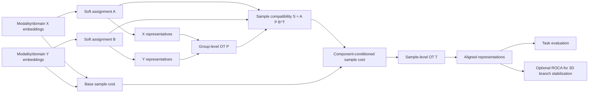

# CC-HiWA 研究骨干与 TACO 迁移总纲

## 1. 最终研究骨干

当前项目不应再被表述为“ROCA-HiWA 的局部改进”，也不应只表述为“把 HiWA 的硬分组改成软分组”。

更合适的研究骨干是：

> 提出一个受 TACO 启发的 Component-Conditioned Hierarchical Wasserstein Alignment，简称 CC-HiWA。该方法用 soft components、prototype-level transport 和 group-conditioned sample transport，对不同领域的多模态表示进行统一对齐。

一句话版本：

> CC-HiWA 是一个通用的组件条件层级最优传输对齐框架。

它要回答的问题是：

> 当两个模态或两个数据域 $X,Y$ 具有潜在组件结构，但没有已知一一对应关系时，能否利用 soft components 先建立组级对应，再约束样本级传输，从而提升跨模态语义/任务一致性？

## 2. 为什么不能只做 ROCA

ROCA-HiWA 的发现很重要，但它解决的是一个局部稳定性问题：

$$
O(3)=SO(3)\cup \{\text{reflection branch}\}
$$

在当前神经—运动 3D 对齐中，det=+1 和 det=-1 分支会带来不同的方向语义。ROCA 用 soft representatives 的有向体积无标签选择分支。

这条线的价值是：

- 机制清楚；
- 证据链强；
- 可以作为 3D alignment 的稳定化模块。

但它的问题是：

- 主要针对 $d=3,K=4$；
- 强依赖有向四面体结构；
- 不适合直接解释 RNA–ATAC、图像—文本等非 3D 对齐任务；
- 难以单独支撑“通用方法”论文。

因此，ROCA 的最终定位应该是：

> CC-HiWA 在 3D 神经—运动场景中的 orientation stabilization module。

而不是整篇论文唯一主角。

## 3. TACO 里真正要迁移的亮点

TACO 对我们有五个关键启发。

### 3.1 Soft assignment

原始 HiWA 更偏 hard cluster：

$$
x_i \in G_k
$$

TACO 启发我们用 soft assignment：

$$
a_i^X=(a_{i1}^X,\ldots,a_{iK}^X)
$$

这表示一个样本可以同时属于多个 latent components。

跨领域解释：

| 领域 | soft assignment 的含义 |
|---|---|
| 神经—运动 | 一个神经状态可能混合多个运动方向、速度或时间阶段 |
| RNA–ATAC | 一个细胞可能处于连续分化或过渡状态 |
| 图像—文本 | 一个样本可能同时包含多个语义主题 |

### 3.2 Soft prototype / representative

每个 component 需要有组级代表：

$$
r_k^X=\frac{\sum_i a_{ik}^X x_i}{\sum_i a_{ik}^X}
$$

$$
r_l^Y=\frac{\sum_j a_{jl}^Y y_j}{\sum_j a_{jl}^Y}
$$

代表点不是最终画图用的装饰，而是组级结构的可计算载体。

ROCA 的成功说明：

> representatives 可以携带跨域几何/语义结构。

但 RGCA 的弱结果也说明：

> 只把代表点轻微加到 group cost 上还不够，真正关键在 sample-level group conditioning。

### 3.3 Prototype-level / group-level OT

TACO 的核心不是直接在所有样本之间乱匹配，而是先估计组件对应：

$$
P_{kl}
$$

其中 $P_{kl}$ 表示源组件 $k$ 与目标组件 $l$ 的匹配强度。

在 CC-HiWA 中：

$$
P=\operatorname{OT}(C^{group})
$$

其中 $C^{group}$ 可以来自：

- representative distance；
- component distribution distance；
- task-free structure distance；
- 或者上述几者组合。

### 3.4 Group-conditioned sample transport

这是下一阶段的真正主方法核心。

定义样本级 component compatibility：

$$
S_{ij}=a_i^X P (a_j^Y)^\top
$$

其中：

- $a_i^X$ 是源样本 $x_i$ 的 soft assignment；
- $a_j^Y$ 是目标样本 $y_j$ 的 soft assignment；
- $P$ 是 group-level OT。

然后样本级 cost 不再只是几何距离：

$$
C_{ij}^{base}=\|Rx_i-y_j\|^2
$$

而是：

$$
C_{ij}^{CC}
=
C_{ij}^{base}
-
\beta\log(S_{ij}+\epsilon)
$$

解释：

- 如果两个样本所属组件通过 $P$ 强烈对应，则 $S_{ij}$ 大，cost 被降低；
- 如果两个样本几何上接近但组件语义不兼容，则 $S_{ij}$ 小，cost 被提高；
- 这就是 TACO-style GCOT 在 HiWA 中最值得迁移的部分。

### 3.5 Task-aware evaluation / inference

TACO 不是为了对齐而对齐，而是为了让文本路径吸收几何知识并服务下游预测。

CC-HiWA 也不能只报告 transport cost。每个数据集都要有任务指标：

| 数据集 | 下游评价 |
|---|---|
| 神经—运动 | direction accuracy, movement $R^2$, decoding |
| RNA–ATAC | cell type transfer, ARI/NMI, label transfer F1 |
| 图像—文本 | retrieval Recall@K, matching accuracy |

论文主张应当是：

> component-conditioned alignment improves semantic or task consistency, not merely geometric closeness.

## 4. 方法模块总览

## 5. 主方法与辅助模块边界

| 名称 | 地位 | 是否主方法 | 说明 |
|---|---|---|---|
| HiWA | baseline | 否 | 硬簇层级 OT |
| Soft-HiWA | intermediate baseline | 否 | 软分组但没有真正 group-conditioned sample cost |
| RGCA | negative/weak exploration | 否 | 代表点弱引导 group cost，提升太小 |
| ROCA | stabilization module | 部分 | 3D 神经—运动场景中用于无标签选择 determinant branch |
| CC-HiWA | main method | 是 | soft components + group OT + group-conditioned sample OT |

## 6. 三数据集策略

为了支撑“一般方法”，至少需要三个不同领域数据集：

| 数据集 | 领域 | 对齐对象 | CC-HiWA 作用 | ROCA 是否需要 |
|---|---|---|---|---|
| 当前 HiWA 猕猴神经—运动 | 神经科学 | neural latent ↔ movement latent | 验证神经—行为对齐和已有主线 | 需要 |
| 10x PBMC Multiome RNA–ATAC | 单细胞多组学 | RNA embedding ↔ ATAC embedding | 验证非神经多模态对齐 | 通常不需要 |
| 小型图像—文本数据集 | 视觉语言 | image embedding ↔ text embedding | 验证语义跨模态对齐，更接近 TACO text-modal 场景 | 通常不需要 |

这样论文不会被理解为神经专用方法。

## 7. 暂时不能声称什么

当前还不能声称：

- CC-HiWA 已经完成；
- 已经在三个数据集验证；
- 已经显著优于所有 baseline；
- TACO 被完整复现；
- ROCA 是通用对齐模块；
- RGCA 是有效主方法。

当前可以声称：

- 已经复现并理解 HiWA 神经—运动实验；
- 已经实现 Soft-HiWA / ROCA / RGCA 探索；
- ROCA 在当前 3D 神经—运动设置中证据强；
- RGCA 说明浅层 representative guidance 不是主线；
- 下一步应实现真正的 group-conditioned sample transport。

## 8. 下一步最小可执行目标

下一阶段不要继续调 RGCA。应当直接实现 CC-HiWA 最小版：

输入：

$$
X\in \mathbb{R}^{n\times d},\quad Y\in \mathbb{R}^{m\times d}
$$

$$
A\in \mathbb{R}^{n\times K},\quad B\in \mathbb{R}^{m\times L}
$$

输出：

- representatives $R_X,R_Y$；
- group transport $P$；
- sample compatibility $S=A P B^\top$；
- component-conditioned cost $C^{CC}$；
- sample transport $T$；
- aligned representation or evaluation-ready coupling。

第一版先不追求端到端训练，不加入标签 loss，不做复杂神经网络。

原则：

> 先做一个清楚、可复现、可跨数据集调用的 CC-HiWA 核心，再考虑每个领域的编码器和下游任务。

