# Full TACO-style architecture gap audit

_Purpose: establish what the current Soft-GCOT HiWA implementation has already transferred from Taco, what it deliberately does not implement, and the smallest safe path to learn modality-specific latent representations._

---

## 🔎 Decision summary

The current repository should remain frozen as the **fixed-representation Soft-GCOT HiWA v1** baseline. It is not a failed implementation: it contains the soft-group empirical measures, group transport $P$, group-pair sample transports $Q_{ij}$, orthogonal alignment, and HiWA's ADMM consensus.

Its present limitation is upstream of GCOT: it receives precomputed feature matrices and cannot learn which information in the two modalities should be retained for alignment. The two exploratory joint modules update only prototypes or assignment matrices over those fixed features. They therefore cannot substantially change the latent geometry that determines $P$, $Q_{ij}$, and $R$.

The next research direction is a **representation-learning extension**, developed first only on MiHiA:

```mermaid
flowchart LR
    accTitle: Alternating representation and GCOT training
    accDescr: Raw or fixed input features are encoded into learned latent views. A frozen inner Soft-GCOT solve produces transport plans and an orthogonal map, which are then held fixed while the encoders are updated.

    source_input["Source features X"] --> source_encoder["Source encoder E_X"]
    target_input["Target features Y"] --> target_encoder["Target encoder E_Y"]
    source_encoder --> source_latent["Latent Z_X"]
    target_encoder --> target_latent["Latent Z_Y"]
    source_latent --> solver["Fixed inner Soft-GCOT solver"]
    target_latent --> solver
    solver --> plans["P, Q_ij, R, Pi"]
    plans --> trainer["Frozen-plan encoder update"]
    source_latent --> trainer
    target_latent --> trainer
    trainer --> source_encoder
    trainer --> target_encoder

    classDef input fill:#dbeafe,stroke:#2563eb,stroke-width:2px,color:#1e3a5f
    classDef process fill:#fef9c3,stroke:#ca8a04,stroke-width:2px,color:#713f12
    classDef state fill:#dcfce7,stroke:#16a34a,stroke-width:2px,color:#14532d
    class source_input,target_input input
    class source_encoder,target_encoder,solver,trainer process
    class source_latent,target_latent,plans state
```

This is a new research branch, not a replacement for the existing baseline. It must begin with a regression check showing that frozen identity encoders reproduce the current solver's result.

## 🧭 What Taco actually contributes

The project-local Taco paper has three distinct layers: modality-specific encoders, GCOT alignment in the encoded feature space, and a downstream adsorption-energy prediction path. During its fine-tuning stage, Taco keeps the geometric encoder and GCOT alignment modules fixed, while adapting the semantic encoder and prediction head.[^1]

This distinction matters. Taco is not simply an unconstrained end-to-end differentiation through every Sinkhorn and ADMM update. Its transferable lesson is that a modality encoder and a task-relevant head can be trained around a structured, possibly fixed, alignment module.

| Layer | Taco paper | Current repository | Status for the next branch |
| --- | --- | --- | --- |
| Modality encoder | EquiformerV2 geometry encoder and RoBERTa-based semantic encoder | None; the solver receives precomputed matrices | Missing |
| Shared latent representation | Encoder tokens in a common feature dimension | Fixed neural and movement features | Partial, but not learnable |
| Soft prototypes | Separate learnable prototypes and row-softmax memberships | `learn_soft_groups` | Present |
| Soft group measures | Assignment-weighted empirical measures | Full-support column-normalized weights | Present |
| Group transport | Doubly stochastic $P$ | `sinkhorn_groups` | Present |
| Instance transport | One weighted $Q_{ij}$ per group pair | `sinkhorn_weighted` | Present |
| Orthogonal alignment | Stiefel-constrained projector | Local and global rotations with ADMM consensus | Present, via HiWA |
| Prediction head | Energy regression head | Post-hoc nearest-neighbour / regression evaluation only | Missing |
| Task-driven representation update | Fine-tunes semantic encoder with task loss after alignment | No encoder parameters exist | Missing |
| Differentiation through OT | Not required for the proposed fine-tuning interpretation | Not available | Not required for MVP |

> ⚠️ **Important correction:** calling the current implementation “TACO-faithful” remains appropriate only for its transfer of the **GCOT soft-group structure into HiWA**. It must not be described as a full reproduction of Taco's encoder-plus-prediction architecture.

## 🧩 Current repository boundary

The current code has a coherent, intentionally limited contract.

| Component | Current implementation | Consequence |
| --- | --- | --- |
| `src/cc_hiwa/soft_groups.py` | K-means-initialized prototypes optimized for reconstruction, entropy, and L2 on fixed standardized features | Learns group structure, not new representations |
| `src/cc_hiwa/soft_hiwa.py` | NumPy/SciPy full-support GCOT plus local/global orthogonal ADMM | Solves alignment only after features are fixed |
| `src/cc_hiwa/joint_soft_gcot.py` | Holds $P$ and $R$ fixed and updates prototypes | Cannot move individual feature embeddings |
| `src/cc_hiwa/transport_consistent_joint.py` | Holds $P$, $Q$, and $R$ fixed and updates prototypes | Transport-consistency signal reaches only prototypes |
| MiHiA runners | Evaluate direction accuracy and movement $R^2$ after fitting | No task loss shapes representation learning |
| `requirements.txt` | NumPy, SciPy, scikit-learn, Matplotlib | No PyTorch/autograd runtime exists yet |

The observed negative joint results are therefore informative: prototype motion changed assignments slightly while the full sample coupling and global rotation remained nearly unchanged. That is consistent with the code boundary above, rather than evidence that representation learning itself cannot help.

## 🧠 Minimum research model

The MVP should introduce trainable encoders but retain the verified NumPy solver as a non-differentiable inner block.

For two input views $X$ and $Y$, define:

$$
Z_X = E_X(X;\theta_X),
\qquad
Z_Y = E_Y(Y;\theta_Y),
$$

where both latent matrices have dimension $d$. At each outer iteration, detach $Z_X,Z_Y$ and call the existing full-support solver to obtain:

$$
P,\;\{Q_{ij}\},\;R,\;\Pi,
\qquad
\Pi = \sum_{i,j} P_{ij}Q_{ij}.
$$

Then hold those quantities fixed while updating the encoders using:

$$
L_{\mathrm{MVP}}
= \lambda_{\mathrm{align}}L_{\mathrm{align}}
+ \lambda_{\mathrm{rec}}L_{\mathrm{rec}}
+ \lambda_{\mathrm{var}}L_{\mathrm{var}}
+ \lambda_{\mathrm{cov}}L_{\mathrm{cov}}.
$$

The required losses are:

| Term | Definition | Role |
| --- | --- | --- |
| $L_{\mathrm{align}}$ | $\sum_{a,b}\Pi_{ab}\lVert (Z_X)_aR-(Z_Y)_b\rVert^2$ | Makes the representation respond directly to the current sample coupling |
| $L_{\mathrm{rec}}$ | Modality-specific decoder reconstruction loss | Prevents information-free alignment |
| $L_{\mathrm{var}}$ | Minimum-variance penalty for every latent dimension | Prevents constant-vector collapse |
| $L_{\mathrm{cov}}$ | Off-diagonal latent covariance penalty | Avoids redundant latent dimensions |

No label-based task loss should be used in the first MiHiA MVP. Direction labels and movement labels remain evaluation-only, preserving the current anti-leakage protocol. A later task-aware version may use source-side labels only if a separate protocol explicitly authorizes it.

## ⚙️ Alternating training protocol

The proposed method avoids differentiating through Sinkhorn and ADMM.

1. Initialize small source and target encoders close to identity projections.
2. Encode the fixed MiHiA input matrices into $Z_X,Z_Y$.
3. Detach the latents and solve full-support Soft-GCOT to obtain $P,Q,R,\Pi$.
4. Freeze $P,Q,R,\Pi$ and perform a limited number of PyTorch encoder/decoder updates with $L_{\mathrm{MVP}}$.
5. Re-encode the inputs and repeat steps 3--4 for at most three outer iterations.
6. Evaluate only after training using the existing MiHiA evaluation path.

This directly addresses the earlier failure mode: the alignment term now moves $Z_X$ and $Z_Y$ for every sample, not merely a small set of prototypes.

## 🛠️ Minimal implementation plan

The following files should be added in a new branch. None should alter the frozen solver or historical result artifacts.

| Path | Responsibility |
| --- | --- |
| `src/representation/encoders.py` | Small MLP encoder and identity encoder for regression mode |
| `src/representation/decoders.py` | Linear/MLP modality-specific reconstruction decoders |
| `src/representation/regularizers.py` | Variance and covariance anti-collapse losses |
| `src/cc_hiwa/solver_adapter.py` | Converts detached Torch tensors to NumPy, runs `SoftHiWA`, returns $P,Q,R,\Pi$ as fixed Torch tensors |
| `src/cc_hiwa/alternating_representation.py` | Alternating outer-loop trainer and structured diagnostics |
| `experiments/hiwa/run_representation_soft_gcot_mvp.py` | Separate 96-by-96 MiHiA MVP runner |
| `tests/test_representation_mvp.py` | Identity-regression, no-leakage, and anti-collapse tests |

The existing `SoftHiWA`, `joint_soft_gcot`, and `transport_consistent_joint` modules should remain untouched. They are baselines and negative controls, not scaffolding to overwrite.

## ✅ Required regression and safety checks

The MVP is allowed to proceed only if each check passes.

| Check | Required evidence | Failure response |
| --- | --- | --- |
| Frozen regression | Identity/frozen encoders reproduce current fixed Soft-GCOT outputs within a declared tolerance | Stop; fix adapter semantics |
| Solver validity | Global and primal residuals meet the existing convergence rule | Stop; do not train encoders against invalid plans |
| Latent health | Non-zero variance, adequate effective rank, non-collapsed prototypes, non-empty groups | Stop; adjust only anti-collapse objective |
| Coupling response | $P$, $Q$, $R$, or $\Pi$ changes materially across outer iterations | If unchanged, stop this objective rather than grid-searching weights |
| Evaluation discipline | Pair IDs and labels absent from encoder and GCOT fitting inputs | Stop and repair protocol before reporting results |
| Baseline protection | Historical JSON/results unchanged; a separate runner emits new files | Stop if baseline artifacts are overwritten |

The first run should use only MiHiA, the existing 96-by-96 deterministic subset, and three new seeds. It should not include ROCA, sparse support, PAMAP2, Paderborn, or any hyperparameter grid.

## ⚠️ Principal technical risks

| Risk | Why it matters | Mitigation in MVP |
| --- | --- | --- |
| Latent collapse | Alignment alone has a trivial constant representation solution | Decoders plus variance/covariance penalties |
| Circular self-training | Incorrect early $\Pi$ can reinforce itself | Limit outer iterations; compare against frozen baseline; inspect coupling changes |
| Solver scale sensitivity | Latent scaling changes Sinkhorn costs and ADMM behaviour | Standardize detached latents inside the adapter and log scales |
| No task signal | Reconstruction plus OT may learn an unhelpful shared representation | Treat downstream metrics as a gate, not a tuning target; add task loss only in a later protocol |
| Runtime growth | Full-support $Q_{ij}$ is expensive | Keep the 96-by-96 subset for MVP and do not claim scalability |
| Misstating Taco | Taco's paper has a specific chemistry task and selective fine-tuning schedule | Describe this as a TACO-inspired representation-learning extension, not a reproduction |

## 🎯 Stop conditions and next decision

Stop the MVP branch immediately if any of the following occurs in all three initial seeds:

- latent variance or effective rank collapses;
- soft groups become empty or almost uniform without a clear data reason;
- the inner solver repeatedly fails convergence;
- $P,Q,R,\Pi$ remain numerically unchanged after encoder updates;
- evaluation degrades materially while no structural diagnostic improves.

If the encoder branch instead passes regression, avoids collapse, and produces a material coupling response without harming MiHiA evaluation, then it becomes the appropriate common backbone for PAMAP2 and a future synchronized industrial multi-sensor task.

## 📌 Recommended immediate action

Do not yet implement the full MVP and do not start another dataset. First create a small PyTorch-enabled development branch with only the identity regression test and solver adapter. That isolates the highest-risk interface -- passing learned latent features into the frozen NumPy solver -- before adding encoders, decoders, or a new optimization objective.

---

## References

[^1]: Project-local source: [Learning Geometric Knowledge from Text for Effective Geometry-Free Adsorption Configuration Screening](../../papers/_TPAMI__Learning_Geometric_Knowledge_from_Text_for_Effective_Geometry_Free_Adsorption_Configuration_Screening%20(2).pdf), Methodology sections III.A--III.E, especially the encoder, GCOT, and prediction-head descriptions.
