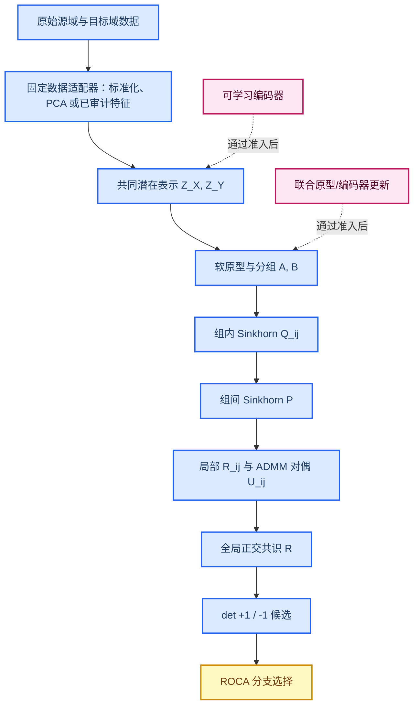

# GC-HiWA v2：TACO/HiWA 机制审计与分层合同

*更新日期：2026-07-23。本文界定 GC-HiWA v2 从 HiWA 与 TACO-faithful Soft-GCOT 中继承什么、明确不继承什么，并根据冻结机制实验决定哪些模块只能作为后续增强。*

---

## 🧭 修订结论

GC-HiWA v2 的主方法不应被定义为“编码器 + 联合优化 + OT”的大杂烩。当前可信主干是：**固定且可追溯的数据适配、软分组、双层熵正则 OT、局部正交旋转、ADMM 全局共识和 ROCA 分支选择。**

可学习编码器、联合原型更新和端到端可微反馈都保留在架构中，但降级为有明确准入门槛的后续优化。原因不是它们没有理论吸引力，而是目前实验没有给出稳定、独立的增益证据。

## 🧩 从 HiWA 与 TACO 继承的必要机制

| 机制 | 来源 | v2 中的地位 | 合同要求 |
|---|---|---|---|
| 分层结构 | HiWA | 核心 | 同时维护组级对应和组内样本对应，不能退化为只做全局 OT。 |
| 软分组与加权群经验测度 | TACO-faithful Soft-GCOT | 核心 | 每个样本有归一化软归属；每组都导出归一化的局部边缘分布。 |
| 内层传输 \(Q_{ij}\) | HiWA / GCOT | 核心 | 对每个组对使用熵正则 Sinkhorn，并记录行、列边缘误差。 |
| 外层传输 \(P\) | HiWA / GCOT | 核心 | 在组代价上求熵正则 OT，并记录有效组质量与边缘误差。 |
| 局部旋转与全局共识 | HiWA | 核心 | 局部 \(R_{ij}\)、全局 \(R\)、对偶变量 \(U_{ij}\) 必须完整更新；不能只报告最终 \(R\)。 |
| 独立的内外熵强度 | HiWA 数值结构 | 核心 | \(\varepsilon_{\mathrm{in}}\) 与 \(\varepsilon_{\mathrm{out}}\) 独立设定；不采用 \(\epsilon/P_{ij}\) 这类奇异规则。 |
| 完整支持与明确稀疏近似 | 当前 TACO-faithful 审计 | 核心 | full-support 是主基线；稀疏仅能作为显式标记的计算近似。 |
| 行列式分支处理 | ROCA 扩展 | 核心诊断 | 分别求解 \(\det(R)=+1\) 和 \(-1\) 的候选；ROCA 在候选完成后选择，不读评价标签。 |
| 收敛与边缘诊断 | HiWA / 当前审计 | 核心 | 必须共同报告全局、原始、对偶残差、正交误差和 OT 边缘误差。 |

## 🧠 分层架构

## 📐 修订后的数学合同

### 主干输入与表示

对原始数据先施加固定适配器 \(h_X,h_Y\)：

\[
Z^X=h_X(X^{\mathrm{raw}})\in\mathbb R^{N\times d},\qquad
Z^Y=h_Y(Y^{\mathrm{raw}})\in\mathbb R^{M\times d}.
\]

这里 \(h_X,h_Y\) 可以不同，但在一次冻结实验中必须在打开下游评价前确定。主干不要求 \(h_X,h_Y\) 可学习；若原始数据已同维且经过标准化，可采用恒等适配器。

在 \(Z^X,Z^Y\) 上学习软归属 \(A,B\)，并得到每个组的局部边缘 \(a^{(i)}, b^{(j)}\)。对固定 \(R\)，依次求

\[
Q_{ij}^{\star}=
\arg\min_{Q\in\mathcal U(a^{(i)},b^{(j)})}
\langle D_R,Q\rangle+\varepsilon_{\mathrm{in}}\Omega(Q),
\]

\[
P^{\star}=
\arg\min_{P\in\mathcal U(u,u)}
\sum_{i,j}P_{ij}G_{ij}+\varepsilon_{\mathrm{out}}\Omega(P),
\qquad u=\mathbf 1_K/K.
\]

然后在 ADMM 中更新 \(R_{ij}\)、全局 \(R\) 与 \(U_{ij}\)。v2 使用 \(P_{ij}\) 作为局部证据的共识权重；它是有动机的稳健化选择，必须与原始均匀共识单独消融，不能被表述为 HiWA 原文的默认更新。

### 后续增强的合同

可学习编码器 \(f_{\phi_X},f_{\phi_Y}\) 只有在启用增强时替代固定适配器。其表示损失必须包含防塌缩项：

\[
\mathcal L_{\mathrm{repr}}=
\lambda_{\mathrm{dec}}\mathcal L_{\mathrm{recon}}
+\lambda_{\mathrm{var}}\mathcal L_{\mathrm{var}}
+\lambda_{\mathrm{geom}}\mathcal L_{\mathrm{geom}}.
\]

联合交替优化在固定 \((Q,P,R)\) 后更新编码器和原型，再重新求解 \((Q,P,R)\)。这是有效的坐标式联合优化，但不是对 Sinkhorn/ADMM 的端到端反向传播。只有明确展开或隐式微分该求解链，才可称为可微 OT 反馈学习。

## 📊 增强模块的实证状态

| 模块 | 现有证据 | 现场复核 | 合同定位 |
|---|---|---|---|
| 联合原型更新 | 种子 110--112 中，固定 Soft-GCOT 与联合版本平均方向准确率均为 0.5035；联合版本平均 \(R^2\) 轻微下降。 | 既有结果可追溯到 `alternating_joint_soft_gcot_transport_consistent_joint_seeds_110_112.json`。 | 后续增强，不是默认。 |
| 可学习表示编码器 | 多个历史机制运行方向不一致：既有提高，也有大幅下降。 | 新种子 212：固定 Soft-GCOT 方向准确率 0.4375，表示学习版本 0.1979；结果保存在 `representation_mvp_reverification_seed212.json`。 | 不稳定探索模块；停止宣称其普遍提升。 |

重新启用任一增强模块的门槛是：在未用于设计的冻结种子与至少一个独立数据协议上，同时满足数值收敛、无塌缩、预先指定的主指标提升和不劣于固定主干的稳定性。单个漂亮种子不能通过该门槛。

## 🚫 有意不纳入主干的 TACO 特定机制

| 机制 | 为什么不放入当前 v2 主干 |
|---|---|
| 面向吸附能的预测头与监督回归损失 | 它依赖具体任务标签；当前目标是无监督对齐，加入会改变问题定义。 |
| Geometry-free inference | 它服务于“训练时有几何、推理时无几何”的化学应用设置；当前跨域对齐任务没有相同部署语义。 |
| 化学文本/几何专用编码器 | 这些是领域输入适配，不是层级 OT 的通用机制；可借鉴为数据适配器设计，但不能直接移植。 |

如果未来存在明确的**源域监督任务**与“目标域无某种模态”的部署需求，可在主干对齐冻结后单独增加任务头，并把它作为应用层消融，而不是反向改写无监督对齐结论。

## ✅ 最终实施顺序

1. 固定适配器 + Soft-GCOT/HiWA 核心 + ROCA：作为唯一默认主干。
2. 在有真值的合成基准上验证可识别条件、收敛和失败边界。
3. 只把通过合成门槛的主干送入真实数据；PAMAP2 需要多受试者，Indy-Loco 保留为适用边界。
4. 联合原型或可学习编码器仅作为预注册增强消融；若无稳定增益，保留负结果并不纳入主张。
5. 端到端可微版本最后考虑，且必须与坐标版本隔离报告。
