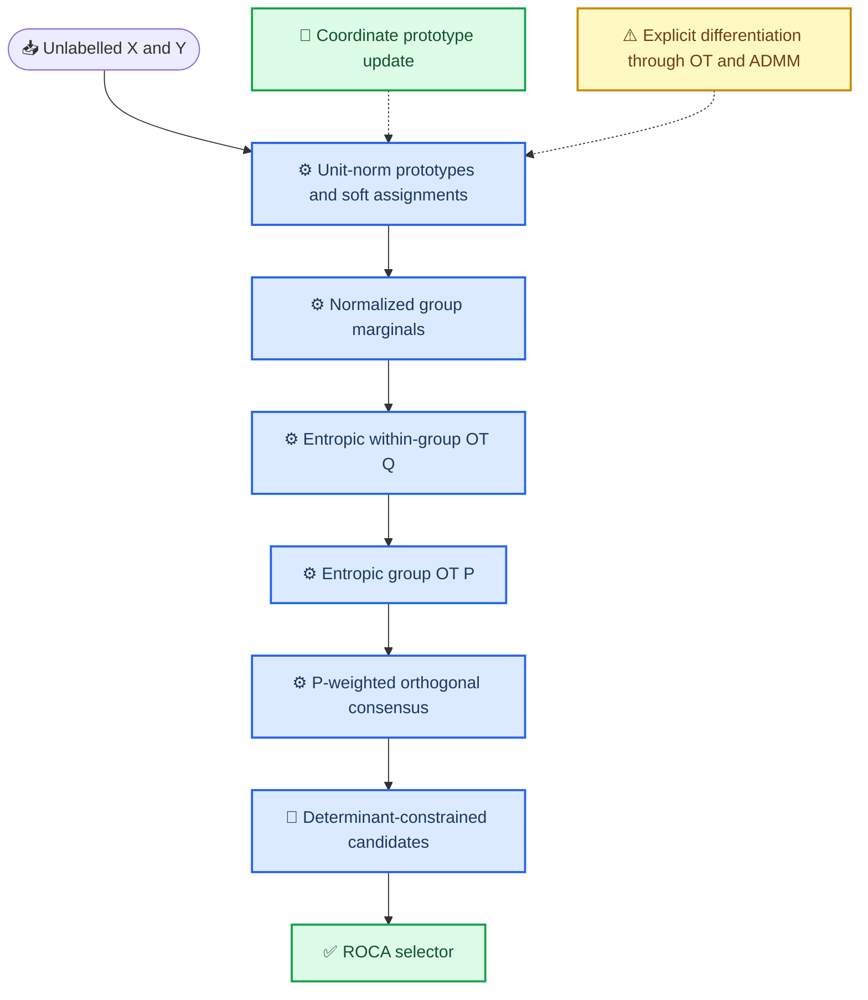

# GC-HiWA v2：修正数学合同与实现顺序

_本文件修正原 GC-HiWA 设计中的目标函数、数值边界与优化责任；更新于 2026-07-23_

---

## 🧭 设计结论

GC-HiWA v2 保留“软群组 + 群组条件 OT + 正交共识”的主线，但不再使用无界原型分离项、不再使用 `epsilon / P_ij` 的奇异正则，也不把“固定 OT 变量后更新原型”误称为端到端 OT 反馈。

模型分成两个可区分版本：

| 版本 | 原型更新方式 | 可主张内容 | 当前优先级 |
| --- | --- | --- | --- |
| `GC-HiWA-coordinate` | 仅由无监督原型目标更新；随后重新求 OT | 稳定的交替优化基线 | 首先实现与验证 |
| `GC-HiWA-differentiable` | 对 (C\to A,B\to Q,P,R) 的完整链路微分 | OT 反馈塑造原型 | 仅在基线通过合成检验后实现 |

当前代码已加入 `prototype_separation_loss`：它是尺度不变、下界为零的余弦 hinge 项。为了保持历史实验可复现，`JointPrototypeConfig.lambda_separation` 默认仍为 `0.0`；GC-HiWA v2 的新实验必须显式设置非零权重并记录其值。

## 🧠 数据编码器与联合优化

数据进入模型前必须有一个域适配层，但它有两个不同层次，不能混为一谈：**固定的数据适配/编码是主干的一部分；可学习编码器与联合优化是后续增强。** 当前主干可使用标准化、PCA 或经审计的固定特征提取器，把原始数据送入共同潜在维度；它不声称通过训练“学出”更好的跨域表示。

当需要处理不同原始维度或模态时，后续增强才使用两个域特异的可学习数据编码器。给定原始域

\[
X^{\mathrm{raw}}\in\mathbb R^{N\times p_X},\qquad
Y^{\mathrm{raw}}\in\mathbb R^{M\times p_Y},
\]

使用两个域特异的数据编码器把它们映射到共同维度为 \(d\) 的潜在空间：

\[
z_k^X=f_{\phi_X}(x_k^{\mathrm{raw}})\in\mathbb R^d,
\qquad
z_l^Y=f_{\phi_Y}(y_l^{\mathrm{raw}})\in\mathbb R^d.
\]

编码器可以是线性投影、PCA 初始化的浅层网络或模态特异的自编码器；它们的输出才是后续软分组、OT 与正交旋转的输入。这样，原始维度不同的模态或传感器通道才有一个可操作的共同表示空间。编码器本身**不接收目标域评价标签**，也不以最终 Accuracy 或 \(R^2\) 回传调参。

仅用跨域对齐损失训练编码器会产生平凡塌缩，例如全部样本编码为同一点。因此 v2 要求每个编码器同时受到域内信息保持约束：可用重建解码器 \(g_X,g_Y\)，或在无解码器时使用预先固定的方差、协方差和邻域几何保持项：

\[
\mathcal L_{\mathrm{repr}}=
\lambda_{\mathrm{dec}}\!\left[
\|g_X(z^X)-X^{\mathrm{raw}}\|^2+
\|g_Y(z^Y)-Y^{\mathrm{raw}}\|^2\right]
+\lambda_{\mathrm{var}}\mathcal L_{\mathrm{var}}
+\lambda_{\mathrm{geom}}\mathcal L_{\mathrm{geom}}.
\]

其中 \(\mathcal L_{\mathrm{var}}\) 防止潜在表示方差坍缩，\(\mathcal L_{\mathrm{geom}}\) 约束域内近邻关系不被随意破坏。对于同维、已经标准化的小数据，可把编码器固定为恒等映射或 PCA；这是一条明确的消融基线，而不是默认假设。

```mermaid
flowchart LR
    accTitle: GC HiWA v2 Joint Architecture
    accDescr: Domain-specific encoders map raw observations into a shared latent space. Joint alternating optimization connects representation preservation, soft prototypes, hierarchical transport, rotation consensus, and ROCA branch selection.

    raw_x["源域原始数据 X"] --> encoder_x["源域编码器 f_phiX"]
    raw_y["目标域原始数据 Y"] --> encoder_y["目标域编码器 f_phiY"]
    encoder_x --> latent_x["共享潜在表示 Z_X"]
    encoder_y --> latent_y["共享潜在表示 Z_Y"]
    latent_x --> soft_groups["软原型与分组 A, B"]
    latent_y --> soft_groups
    soft_groups --> transport["组间 P 与组内 Q_ij"]
    transport --> rotations["局部旋转与 P 加权共识 R"]
    rotations --> roca["ROCA：候选分支选择"]
    latent_x --> preserve["重建、方差与几何保持"]
    latent_y --> preserve
    transport --> alignment_loss["传输对齐损失"]
    rotations --> alignment_loss
    preserve --> joint_update["联合交替更新"]
    alignment_loss --> joint_update
    joint_update -.-> encoder_x
    joint_update -.-> encoder_y
    joint_update -.-> soft_groups

    classDef representation fill:#dbeafe,stroke:#2563eb,stroke-width:2px,color:#1e3a5f
    classDef alignment fill:#dcfce7,stroke:#16a34a,stroke-width:2px,color:#14532d
    classDef control fill:#fef9c3,stroke:#ca8a04,stroke-width:2px,color:#713f12

    class raw_x,raw_y,encoder_x,encoder_y,latent_x,latent_y,preserve representation
    class soft_groups,transport,rotations,alignment_loss alignment
    class roca,joint_update control
```

联合目标不再只是原型目标，而是

\[
\mathcal L_{\mathrm{v2}}=
\mathcal L_{\mathrm{repr}}
+\lambda_{\mathrm{proto}}\mathcal L_{\mathrm{proto}}
+\lambda_{\mathrm{align}}\mathcal L_{\mathrm{HiWA}}(Z^X,Z^Y,A,B,Q,P,R).
\]

这里 \(\mathcal L_{\mathrm{HiWA}}\) 是由内层 OT、外层 OT 和局部--全局正交一致性构成的无监督对齐目标。它不能被下游 Accuracy、\(R^2\) 或目标域标签替代；这些量只在冻结后评价。

### 两种严格区分的联合优化方式

| 版本 | 每轮更新 | 对 \(Q,P,R\) 的梯度 | 可以主张什么 | 当前状态 |
| --- | --- | --- | --- | --- |
| `GC-HiWA-coordinate` | 固定编码器/原型求 \(Q,P,R\)；固定传输计划更新原型和编码器；随后重算传输。 | 不反传穿过 Sinkhorn 或 ADMM；将固定计划视为当前坐标块。 | 无监督的联合**交替优化**。 | 首先需要完成的版本。 |
| `GC-HiWA-differentiable` | 同时更新编码器、原型与可微求解器参数。 | 显式展开或隐式微分 Sinkhorn/ADMM。 | 端到端的对齐反馈学习。 | 仅在 coordinate 版本通过验证后考虑。 |

前者已经是“联合优化”，因为表示、原型和传输在同一外循环内相互影响；但它不是端到端反向传播。后者才允许声称 OT 的梯度直接塑造编码器。ROCA 只在两个已经求解完成的行列式候选后做选择，不参与利用评价标签的训练。

### 现有证据与准入决定

可学习编码器和联合优化已经做过机制检验，但没有形成稳定增益，因此它们不属于当前主结论或默认配置：

| 模块 | 固定对照与结果 | 决定 |
| --- | --- | --- |
| 联合原型交替更新 | 在种子 110--112 上，固定 Soft-GCOT 的平均方向准确率为 0.5035，联合原型版本同为 0.5035；平均 \(R^2\) 从 0.6200 轻微降至 0.6192。 | 不作为默认模块。 |
| 表示编码器 + 固定计划交替更新 | 已有多次机制运行的结果方向不一致。现场复跑的未使用种子 212：固定 Soft-GCOT 为 0.4375，学习表示为 0.1979。 | 视为不稳定的探索模块；停止把它描述为改进。 |

因此 v2 的实施顺序是：先以固定、可追溯的数据适配器验证层级 OT 主干；只有当冻结合成基准显示主干可识别，且增强模块在独立种子和协议上同时满足数值收敛与预先定义的效应门槛时，才重新启用联合优化或可学习编码器。

## 🧮 变量与约束

令 (X=[x_1,\ldots,x_N]\in\mathbb R^{d\times N})、(Y=[y_1,\ldots,y_M]\in\mathbb R^{d\times M})。设群组数为 (K)，源/目标原型分别为

\[
C^X=[c_1^X,\ldots,c_K^X],\qquad C^Y=[c_1^Y,\ldots,c_K^Y],
\]

并在每次原型更新后投影到单位球面：

\[
\lVert c_i^X\rVert_2=\lVert c_j^Y\rVert_2=1.
\]

对标准化特征，以余弦相似度定义软群组：

\[
A_{ki}=\frac{\exp(\bar x_k^\top c_i^X/\tau)}{\sum_{r=1}^K\exp(\bar x_k^\top c_r^X/\tau)},
\qquad
B_{lj}=\frac{\exp(\bar y_l^\top c_j^Y/\tau)}{\sum_{r=1}^K\exp(\bar y_l^\top c_r^Y/\tau)}.
\]

群组边缘必须逐列归一化：

\[
a_k^{(i)}=\frac{A_{ki}}{\sum_{r=1}^{N}A_{ri}},
\qquad
b_l^{(j)}=\frac{B_{lj}}{\sum_{r=1}^{M}B_{rj}}.
\]

因此 (a^{(i)}\in\Delta_N)、(b^{(j)}\in\Delta_M)。每个群组对的传输满足

\[
Q_{ij}\mathbf 1_M=a^{(i)},
\qquad Q_{ij}^{\top}\mathbf 1_N=b^{(j)}.
\]

## ⚙️ 修正后的目标函数

定义负熵型 Sinkhorn 正则

\[
\Omega(T)=\sum_{r,s} T_{rs}(\log(T_{rs}+\epsilon)-1).
\]

这里 (epsilon) 仅用于数值保护；熵强度由正数 (arepsilon_{\mathrm{in}})、(arepsilon_{\mathrm{out}}) 控制。对给定正交变换 (R\in O(d))，群内 OT 为

\[
Q_{ij}^{\star}(R)=
\arg\min_{Q\in\mathcal U(a^{(i)},b^{(j)})}
\langle D_R,Q\rangle+\varepsilon_{\mathrm{in}}\Omega(Q),
\]

其中 (D_R(k,l)=\lVert Rx_k-y_l\rVert_2^2)。它等价于对 (D_R/\varepsilon_{\mathrm{in}}) 使用非均匀边缘 Sinkhorn；**不使用** `epsilon / P_ij`。

令

\[
G_{ij}(R)=\langle D_R,Q_{ij}^{\star}(R)\rangle+
\varepsilon_{\mathrm{in}}\Omega(Q_{ij}^{\star}(R)),
\]

外层群组匹配为

\[
P^{\star}(R)=
\arg\min_{P\in\mathcal U(u,u)}
\sum_{i,j}P_{ij}G_{ij}(R)+\varepsilon_{\mathrm{out}}\Omega(P),
\qquad u=\mathbf 1_K/K.
\]

原型基线目标定义为

\[
\mathcal L_{\mathrm{proto}}=
\lambda_{\mathrm{rec}}\mathcal L_{\mathrm{rec}}
+\lambda_{\mathrm{bal}}\left[\operatorname{KL}(\bar A\|u)+\operatorname{KL}(\bar B\|u)\right]
+\lambda_{\mathrm{conf}}\left[(\overline H(A)-h_0)^2+(\overline H(B)-h_0)^2\right]
+\lambda_{\mathrm{sep}}\mathcal L_{\mathrm{sep}},
\]

其中 (mathcal L_{\mathrm{rec}}) 是软原型重构损失，(overline H) 是样本平均分配熵，且

\[
\mathcal L_{\mathrm{sep}}=
\sum_{r<s}\big[\max(0,(c_r^X)^\top c_s^X-m)\big]^2+(X\rightarrow Y).
\]

该分离项有下界，并与单位范数投影共同防止原型无限发散。

## 🔁 共识与原型更新

对局部旋转 (R_{ij}\) 使用加权共识，其中 (w_{ij}=P_{ij}) 且 (sum_{ij}w_{ij}=1)。每个局部更新是带 ADMM 二次项的加权 Procrustes 子问题；全局更新为

\[
R\leftarrow\operatorname{Proj}_{O(d)}\left(
\sum_{i,j}w_{ij}(R_{ij}+U_{ij})
\right),
\qquad
U_{ij}\leftarrow U_{ij}+R_{ij}-R.
\]

若任务对定向敏感，必须分别求解 (det(R)=+1) 与 (-1) 两个候选，而不能让 SVD 投影隐式决定反射分支；ROCA 仅在两个完整候选完成后选择分支。

`GC-HiWA-coordinate` 的外层步骤为：

1. 仅用 (mathcal L_{\mathrm{proto}}) 更新并投影 (C^X,C^Y)
2. 由新原型重算 (A,B,a,b)
3. 交替求 (Q_{ij})、(P)、局部 (R_{ij}) 与全局 (R)，直至收敛

这不是端到端 OT 原型学习。若需要 OT 反馈，必须显式计算

\[
\nabla_C\,\mathcal L_{\mathrm{align}}(C)=
\frac{\partial\mathcal L_{\mathrm{align}}}{\partial(Q,P,R)}
\frac{\partial(Q,P,R)}{\partial(A,B)}
\frac{\partial(A,B)}{\partial C},
\]

并采用展开 Sinkhorn/ADMM、隐式微分或经过验证的可微替代。未实现该链路前，不得声称“OT 反向更新原型”。

## 🧪 实现验收门槛

| 层级 | 必须记录的量 | 通过条件 |
| --- | --- | --- |
| 软群组 | 每群质量、分配熵、原型范数、原型余弦 | 无空群；范数为 1；不出现统一或单群坍缩 |
| 群内 OT | 每个 (Q_{ij}) 的行/列边缘误差 | 小于预先固定的容差 |
| 外层 OT | (P) 的边缘误差与有效质量 | 小于预先固定的容差；不由零质量群主导 |
| ADMM | 原始、对偶、全局残差 | 共同满足收敛规则 |
| 合成验证 | 真正的 (R,P,Q) 或已知群结构 | 在加入真实数据前先恢复可识别真值 |
| 真实数据 | 预先冻结的下游评估 | 不以 Accuracy 或 \(R^2\) 回调参数 |

## 🎯 实现顺序

1. 为现有 Soft-GCOT 增加单位范数原型、有限分离项和完整日志
2. 验证上述目标在已知正交合成数据上不会坍缩，并检查边缘与共识
3. 只实现 `GC-HiWA-coordinate`，与固定软群组进行预注册消融
4. 只有在合成与真实协议均表明原型模块本身有稳定增益时，才实现可微 `GC-HiWA-differentiable`

这一定义保留 GC-HiWA 的研究方向，同时避免把数值收敛、分布对齐与下游任务恢复混为同一结论。
