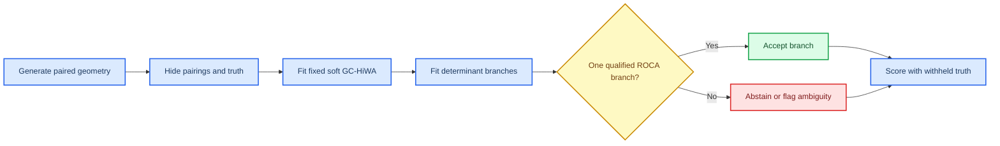

# GC-HiWA v2 固定主干的合成边界实验记录

_研究记录，2026-07-23。本文只报告本仓库可复现的合成数据实验；它用于检验模型合同，而不是替代真实跨域数据上的外部验证。_

---

## 🧭 结论摘要

在四个不对称群组、三维观测、全样本支持的冻结合成协议中，固定 Soft-GCOT / GC-HiWA 主干在其几何假设成立时可以恢复正确的正交对齐。更严格的独立种子复验中，理想旋转、理想镜像和噪声 0.20 都是 3/3 主干收敛；采用“健康检查 + 内部目标差距”的 ROCA 也都是 3/3 选中正确正交分支。

结论同样清楚地给出了适用边界。加性噪声从 0.05 增至 0.20 时，误差平滑增长且三种子均成功；一旦数据不再由全体样本共享的单一正交变换生成，结果会从“有偏”转为“不可靠”：出现不收敛、ROCA 弃权，或两个候选同时合格而无法判别。ROCA 只能判定正交解的分支，不能把非正交或混合几何变回正交几何。

> **解释边界：** 这些是小样本、冻结配置的探索性边界证据。局部熵系数的固定值在本轮审计中由历史代码的有效尺度换算得到，随后才冻结。因此，本文不能把同一批种子当作独立的确认性检验；下一步必须在未参与该选择的新种子上重跑。

## 🎯 要回答的问题与判定规则

本实验不把“输出一个旋转矩阵”当作成功。每次拟合必须同时接受以下检查：

1. 全局 ADMM 残差满足既定收敛判据
2. 每个局部 OT 子问题的边际误差不超过阈值
3. 恢复旋转与生成真值的 Frobenius 误差较小
4. 对于 ROCA，候选还必须具有非退化且与分支自洽的原型定向；若两个候选都健康，只有内部传输目标值的相对差距至少为 0.05 时才接受较低目标值的候选

## 🔬 冻结协议

### 数据生成

每个数据域包含四个不对称群组，每组 8 个样本，维度为 3。源域先由群组中心与组内扰动生成；目标域由源域经真旋转或真镜像得到，之后再选择性地加入一种合同扰动。目标域行顺序随机打乱。

- 拟合过程看不到真旋转、真实样本配对或真实群组标签
- 真值只在拟合完成后用于旋转误差、配对 MSE 与群组 ARI 的诊断
- `soft_transport_oracle_component` 只提供正确行列式分支，用来隔离软群组与群组共识；它不是可部署的无监督方法
- `soft_roca` 会实际拟合 `det(R)=+1` 与 `det(R)=-1` 两个分支，随后先检查候选健康性；当两者都健康时，使用候选各自的无监督传输目标值破除平局，或弃权

### 主干配置

| 项目 | 固定值 | 说明 |
| --- | ---: | --- |
| 软群组数 | 4 | 与合成生成结构一致；不是用真标签赋值 |
| 外层 Sinkhorn 熵 | 0.20 | 群组到群组的软传输 |
| 局部 Sinkhorn 熵 | 0.40 | 对所有局部子问题相同，不随 `P_ij` 改变 |
| 局部支持 | `full` | 不裁剪成员样本 |
| 全局迭代上限 | 100 | 其余迭代上限记录在结果 JSON |
| 共识 | `transport` | 用外层传输质量加权局部正交解 |
| ROCA 健康门槛 | 局部边际误差 ≤ 0.001 | 还需 ADMM 收敛及候选自身定向一致 |
| ROCA 平局门槛 | 相对目标差 ≥ 0.05 | 两个健康候选中仅接受内部目标更低者 |

`0.40` 是一次必要的合同迁移：历史实现把局部熵写成 `0.10 / P_ij`。在四个近等质量群组的理想条件下，其典型有效尺度约为 `0.10 / 0.25 = 0.40`。v2 删除了随 `P_ij` 变化的规则，但显式固定该数值；这避免了“低传输质量群组自动获得更大熵”的不透明耦合。

## 📊 已完成结果

### 理想正交几何与共识对照

| 条件 | 方法 | 成功 / 总数 | 平均旋转误差 | 平均配对 MSE | 结论 |
| --- | --- | ---: | ---: | ---: | --- |
| 理想旋转 | 均匀群组共识 | 1 / 3 | 0.9526 | 1.99815 | 不稳定 |
| 理想旋转 | 传输加权主干 | 3 / 3 | 0.0034 | 0.00010 | 正确恢复 |
| 理想旋转 | ROCA | 3 / 3 | 0.0034 | 0.00010 | 正确选中 `+1` 分支 |
| 理想镜像 | 均匀群组共识 | 2 / 3 | 0.9467 | 1.91657 | 不稳定 |
| 理想镜像 | 传输加权主干 | 3 / 3 | 0.0024 | 0.00009 | 正确恢复 |
| 理想镜像 | ROCA | 3 / 3 | 0.0024 | 0.00009 | 正确选中 `-1` 分支 |

这组对照支持一个结构性选择：不能把每个局部群组旋转简单等权平均。外层 OT 给出的传输质量应进入共识；否则即使群组都被正确识别，整体对齐也会发生不稳定。

理想旋转与镜像条件的完整逐种子记录保存在 [`gc_hiwa_boundary_benchmark_gc_hiwa_boundary_fixed_entropy_ideal_901_903.json`](../../experiments/results/gc_hiwa_boundary_benchmark_gc_hiwa_boundary_fixed_entropy_ideal_901_903.json)。图像导出已从版本库移除，可由该 JSON 重新生成。

_图 1：理想正交几何下的三种子汇总。图中仅将收敛候选纳入方法曲线；上表保留总成功数。_

### 加性噪声：平滑退化而非立即失效

| 噪声标准差 | 传输加权主干成功 | ROCA 接受且选对 | 平均旋转误差 | 平均配对 MSE |
| ---: | ---: | ---: | ---: | ---: |
| 0.05 | 3 / 3 | 3 / 3 | 0.0090 | 0.0022 |
| 0.10 | 3 / 3 | 3 / 3 | 0.0161 | 0.0089 |
| 0.20 | 3 / 3 | 3 / 3 | 0.0322 | 0.0357 |

在该协议与样本规模下，纯加性噪声没有破坏单一正交生成模型；误差会增大，但可恢复性仍存在。这一结论仅覆盖噪声至 0.20，不能外推到更高噪声或不同维度、样本量。

### 合同扰动：从误差上升到拒绝或不可靠

| 扰动类型 | 强度 | 主干成功 | ROCA 结果 | 主要现象 |
| --- | ---: | ---: | --- | --- |
| 混合正交变换 | 10% 样本 | 3 / 3 | 2 接受，1 弃权 | 旋转仍接近主分支，但配对 MSE 0.7520 |
| 混合正交变换 | 15% 样本 | 3 / 3 | 2 接受，1 弃权 | 配对 MSE 0.9371，无法对少数分支给出正确单一对齐 |
| 混合正交变换 | 25% 样本 | 0 / 1 | 1 弃权 | 强错配下直接失败 |
| 单群组中心位移 | 0.30 | 3 / 3 | 3 接受 | 有偏但仍可恢复，旋转误差 0.0657 |
| 单群组中心位移 | 0.50 | 2 / 3 | 2 接受，1 弃权 | 稳定性开始丢失 |
| 单群组中心位移 | 1.00 | 0 / 1 | 1 弃权 | 失败侧证据 |
| 非正交缩放 | 5% | 2 / 3 | 1 接受，1 弃权，1 歧义 | 已不可靠 |
| 非正交缩放 | 10% | 1 / 3 | 2 弃权，1 歧义 | 大多不收敛或无法判别 |
| 非正交缩放 | 30% | 0 / 1 | 1 弃权 | 失败侧证据 |

“接受”表示 ROCA 选到与生成器真分支相同的行列式分支；它不等于所有样本已被正确配对。尤其在混合变换条件中，单一旋转可以贴合多数机制，却必然无法同时解释少数机制，因此配对 MSE 是必要的第二指标。

轻度合同扰动的完整逐种子记录保存在 [`gc_hiwa_boundary_benchmark_gc_hiwa_boundary_fixed_entropy_mild_901_903.json`](../../experiments/results/gc_hiwa_boundary_benchmark_gc_hiwa_boundary_fixed_entropy_mild_901_903.json)。图像导出已从版本库移除，可由该 JSON 重新生成。

_图 2：轻度扰动筛查。非正交缩放的曲线缺失并不代表零误差，而是该条件下 ROCA 未产生可接受候选；详细弃权记录保存在 JSON。_

## 🧠 对 ROCA 的准确解释

ROCA 的任务是**候选分支判定**，不是重建任意跨域几何。它不再把两个候选的传输矩阵平均后再做一次判定；每个候选仅使用自己的群组传输、收敛状态、局部边际误差、原型定向和内部传输目标。

原型定向只能检查一个候选是否自洽，不能在两个都自洽的候选间提供新信息：不同群组置换可以让两个行列式分支各自形成一个定向一致的单纯形。因此，当前的 ROCA 用内部目标差距来破除这种平局。该规则在一组未参与规则发现的种子（1101–1103）上得到如下复验。

| 独立条件 | ROCA 正确选择 | 平均旋转误差 | 平均配对 MSE |
| --- | ---: | ---: | ---: |
| 理想旋转 | 3 / 3 | 0.0039 | 0.00012 |
| 理想镜像 | 3 / 3 | 0.0027 | 0.00011 |
| 噪声 0.20 | 3 / 3 | 0.0252 | 0.04160 |

因此存在三种合法输出：

- 恰有一个候选健康：接受该候选
- 两个候选健康且目标差距足够大：接受内部目标更低的候选
- 没有候选合格：弃权
- 两个候选都健康但目标差距不足：报告歧义，不伪造一个确定选择

这不改变模型失配边界。对混合变换 25% 和群组位移 1.0 的新种子筛查，两个分支均不健康，ROCA 正确弃权；但在非正交缩放 10% 的一个新种子中，仍会偶然找到一个近似对齐并接受它。结合此前 3 个种子中该条件仅 1 个主干收敛的结果，正确结论是：非正交 10% 已处于脆弱区，而不是“ROCA 已修复非正交性”。

## 🧪 编码器与联合优化的地位

它们不是当前主干的一部分，并非因为没有实现，而是因为已有独立机制检查没有显示稳定增益。

| 尝试 | 对照 | 结果 | 决策 |
| --- | --- | --- | --- |
| 联合更新软群组原型 | MiHiA，种子 110–112 | 固定 Soft-GCOT 与联合版方向准确率均值同为 0.5035；速度 $R^2$ 从 0.61996 微降至 0.61921 | 不纳入主干 |
| 残差数据编码器 | MiHiA，独立复核种子 212 | 固定主干方向准确率 0.4375；学习表示后为 0.1979，低于未对齐的 0.2708 | 不纳入主干 |

这些检查不足以证明“编码器或联合优化永远无效”，但足以拒绝把它们写成当前结果的提升来源。若未来要再次尝试，必须在本页已冻结的合成协议上预先定义训练预算、种子、成功指标和独立测试种子。

## 🗂️ 可复现产物

| 产物 | 用途 |
| --- | --- |
| `src/cc_hiwa/synthetic_boundary.py` | 合成数据、真值和扰动场景 |
| `src/cc_hiwa/soft_hiwa.py` | 固定熵 / 旧熵兼容模式与传输加权共识 |
| `src/cc_hiwa/roca_qualification.py` | 候选合格、弃权和歧义逻辑 |
| `experiments/synthetic/run_gc_hiwa_boundary_benchmark.py` | 冻结基准运行器 |
| `experiments/results/gc_hiwa_boundary_benchmark_gc_hiwa_boundary_fixed_entropy_ideal_901_903.json` | 理想条件全记录 |
| `experiments/results/gc_hiwa_boundary_benchmark_gc_hiwa_boundary_fixed_entropy_mild_901_903.json` | 轻度扰动全记录 |
| `experiments/results/gc_hiwa_boundary_benchmark_gc_hiwa_boundary_fixed_entropy_intermediate_901_903.json` | 中间强度全记录 |
| `experiments/results/gc_hiwa_boundary_benchmark_gc_hiwa_boundary_fixed_entropy_strong_seed901.json` | 强扰动失败侧筛查 |
| `experiments/results/gc_hiwa_boundary_benchmark_gc_hiwa_boundary_fixed_entropy_holdout_valid_1001_1005.json` | 固定主干的独立种子复验；该文件使用早期健康检查版 ROCA |
| `experiments/results/gc_hiwa_boundary_benchmark_gc_hiwa_boundary_roca_objective_holdout_1101_1103.json` | 目标差距版 ROCA 的独立正交复验 |
| `experiments/results/gc_hiwa_boundary_benchmark_gc_hiwa_boundary_roca_objective_misspecification_1201.json` | 目标差距版 ROCA 的新失配筛查 |
| `experiments/results/alternating_joint_soft_gcot_transport_consistent_joint_seeds_110_112.json` | 联合原型更新的对照 |
| `experiments/results/representation_mvp_reverification_seed212.json` | 数据编码器的独立机制复核 |

## ✅ 下一步：确认性而非继续调参

1. 冻结本页的 `full` 支持、`transport` 共识、固定局部熵 0.40 与 ROCA 健康加目标差距规则
2. 用未参与本页任何选择的种子，复现理想、噪声 0.20、混合 10%、群组位移 0.50、非正交 5% 五个锚点
3. 报告成功、弃权、歧义和不收敛的完整比例；不只报告条件性平均误差
4. 只有通过独立种子后，才把“主干适用区间”写入论文的结果结论
5. 随后才在同一冻结协议上单独评估编码器与联合优化；二者不能用来回填主干的适用性结论

## 🔎 运行与结果解释备注

- `intermediate_901_903` 的外层调度器在写完全部 24 条记录和图后报出 600 秒超时；文件内容完整，不能把该调度超时记为某个实验条件的算法失败。
- 所有强扰动条目当前只有种子 901，故只作为失败侧筛查，不能估计成功率。
- 本页的“成功”均指预先定义的数值诊断通过，不表示对真实数据域上的可迁移性已被证明。
