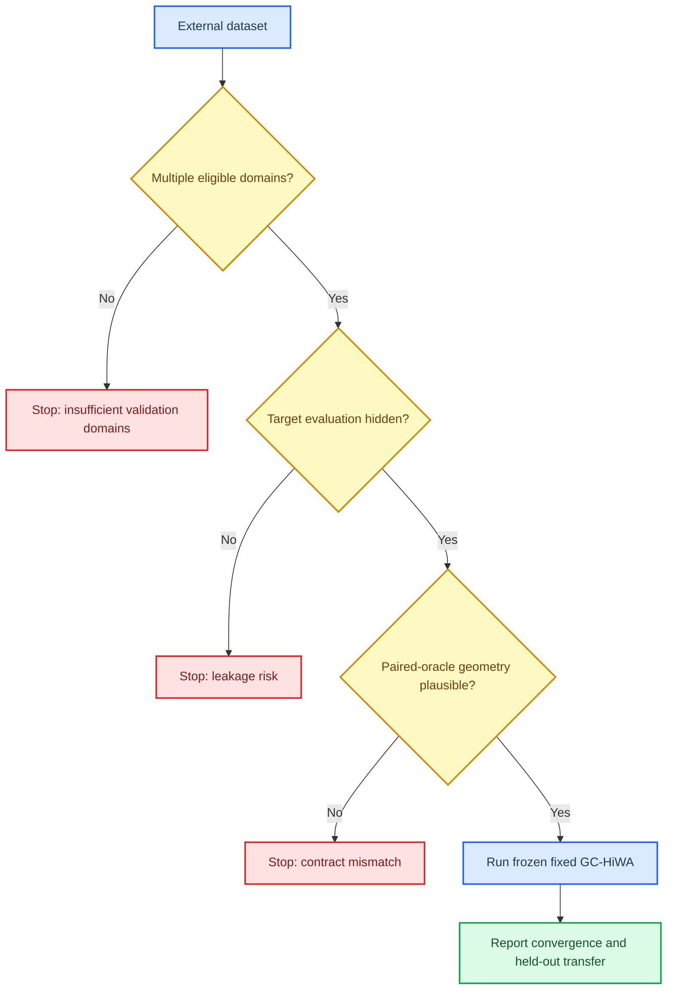

# GC-HiWA v2 外部数据适用性审计

_研究记录，2026-07-23。目的不是把每一个数据集都变成正结果，而是明确哪些真实数据合同支持、哪些合同拒绝使用固定 GC-HiWA 主干。_

---

## 🧭 可报告结论

当前真实数据**不能**作为“GC-HiWA 已在外部域成功”的证据。它们反而提供了三类有价值的边界信息：

1. Indy-Loco 的神经活动到行为映射，即使开放真实时间配对供 Procrustes 上界诊断，也没有得到有用的几何恢复；它不满足“共享近似正交几何”的前提。
2. PAMAP2 当前本地仅有一个可用于冻结时间协议的受试者，不能声称跨受试者泛化。
3. PBMC 与 Paderborn 的固定 Soft-GCOT 结果分别显示极低的配对检索和退化的任务迁移；数值收敛不是跨域对齐成功。

因此，合成实验证明的是一个**条件性能力**：当共享群组与近似正交几何真实存在时，固定主干可以恢复它。外部实验目前证明的是一个**适用性边界**：不能把该能力外推到缺少这些条件的模态转换、工况转换或单受试者数据。

## 🎯 外部数据进入主干前的判定流程

## 📊 审计证据

### Indy-Loco：几何前提被配对上界拒绝

同一 session 的神经活动分布与光标速度分布实验中，目标侧时间配对完全不参与拟合；它只被用于最终评估和一个明确的配对 Procrustes 上界。结果如下。

| 方法 | 速度 $R^2$ | 方向准确率 | 解释 |
| --- | ---: | ---: | --- |
| 未对齐 | -0.8030 | 0.0833 | 基线 |
| 硬分组全局 HiWA | -0.6772 | 0.1042 | 无有用恢复 |
| 软全局 GCOT | -0.6837 | 0.1146 | 无有用恢复 |
| 配对 Procrustes 上界 | -0.2818 | 0.2813 | 即使知道配对仍不足 |

配对上界仍为负 $R^2$ 是关键证据：失败不是单纯的无监督群组匹配问题。神经状态与行为速度之间的关系不适合被解释为同一表示空间上的全局正交对齐，因此不应继续为此协议调 Sinkhorn 或 ROCA。

跨 session 神经解码的独立试验也一致：源域无对齐 $R^2=-0.1110$，软 GCOT 为 $-0.1058$，而目标监督上界也只有 $0.1277$。它不能作为主干成功案例。

### PAMAP2：当前数据可用性不足以做跨主体结论

冻结的时间域适配协议要求每个受试者在六类活动上提供足够的连续窗口。实际审计中：

| 受试者 | 原始协议文件 | 是否合格 | 原因 |
| --- | --- | --- | --- |
| 101 | 存在 | 是 | 48 源训练、12 源验证、18 目标适配、18 目标测试窗口 |
| 102 | 缺失 | 否 | `protocol_file_missing` |

只有受试者 101 不构成跨主体研究。任何基于当前副本的“跨受试者提升”都无法成立；应先补齐原始协议文件或换用具备至少两个合格主体的版本。

### PBMC：收敛不等于多模态配对恢复

在 96 个共享数据细胞上，固定 Soft-GCOT 虽然报告收敛，但配对 Recall@1 仅为 0.0208，Recall@5 为 0.0417，细胞类型迁移准确率为 0.0729。该结果说明当前共享基因活动表示没有提供足以让正交群组模型恢复细胞配对的几何锚点。

### Paderborn：任务准确率的退化暴露了错误的迁移协议

速度变化条件下，未对齐的目标准确率已为 0.9375；固定 Soft-GCOT 不收敛，目标准确率降为 0.3229。此协议不应被用来声称“对齐改进故障诊断”：原始分类器已经几乎饱和，OT 后的劣化进一步表明此处的群组/正交合同不成立。

## 🧠 对主张范围的约束

这些外部结果大多早于 v2 的固定熵与传输加权共识合同，不能用于直接比较 v2 的绝对性能；但它们仍是有效的**前提审计证据**：配对上界、数据可用性和退化任务协议在运行任何新版主干之前就已经说明数据合同不合格。

当前唯一可以严谨写入论文的外部表述是：

> 固定 GC-HiWA 被定位为共享群组、共同维度和近似正交域偏移下的无监督对齐方法。对于跨模态神经—行为映射、缺少多主体数据的时间序列协议，或基础任务已饱和的工况分类，当前证据不支持其适用。

## ✅ 下一步的外部验证标准

一个新的外部数据集只有同时满足下列条件，才值得运行冻结主干并作为论文主结果候选：

1. 至少两个完整域，且目标评估标签或配对在拟合期间不可见
2. 相同语义群组在两域都有可比的无监督结构
3. 特征空间具有共同维度，或固定、可审计的适配器可以给出共同坐标
4. 若允许做配对上界诊断，该上界必须显示近似正交几何确有可恢复信号
5. 未对齐基线不能已经任务饱和；必须同时报告收敛、局部边际、配对/迁移和弃权率

达到这些条件之前，不启动编码器或联合优化：它们不能被用来掩盖数据合同不成立。

## 🔎 对应原始证据

| 文件 | 内容 |
| --- | --- |
| `experiments/results/indy_loco_neural_behavior_global_soft_gcot_smoke_seed1001_20260719.json` | 神经—行为配对上界和无监督对照 |
| `experiments/results/indy_loco_cross_session_global_rotation_log_sinkhorn_seed703_20260719.json` | 跨 session 神经解码试验 |
| `experiments/results/pamap2_multi_subject_eligibility_local_101_102_20260723.json` | PAMAP2 数据可用性审计 |
| `experiments/results/soft_gcot_pbmc_pbmc_shared_gene_activity_96_seed120.json` | PBMC 配对检索与迁移结果 |
| `experiments/results/paderborn_soft_gcot_speed_shift_96_seed130.json` | Paderborn 任务退化结果 |
