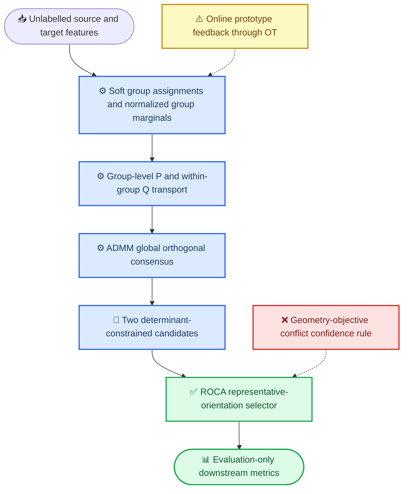

# GC-HiWA：结构、实现与证据的统一叙事

_将 GC-HiWA 的方法结构与当前可复查实验结果统一；更新于 2026-07-23_

---

## 🧭 核心定位

GC-HiWA 是在 HiWA 的层次 Wasserstein 对齐中引入软群组、非均匀群内 OT 与全局正交共识的结构。现有工作的正确表述不是“完整 GC-HiWA 已被验证”，而是：**Soft-GCOT 与 ADMM 主干已经实现；ROCA 是一个在固定开发协议下有效的无标签正交分支选择器；在线原型反馈与置信度扩展仍需分别验证。**

## 🧩 与 GC-HiWA 结构的对应关系

| GC-HiWA 模块 | 当前状态 | 当前证据 | 论文中的表述方式 |
| --- | --- | --- | --- |
| 软群组 (A,B) 与归一化边缘 (a^{(i)},b^{(j)}) | 已实现 | Soft-GCOT 全支撑基线已运行 | 已实现的群组条件对齐主干 |
| 外层群组传输 (P) 与群内传输 (Q_{ij}) | 已实现 | ADMM、Sinkhorn 边缘与局部/全局共识均有诊断 | 已实现的分层 OT 求解器 |
| 全局正交共识 (R) | 已实现 | 使用共同收敛标准验证 | 已实现；不应声称它必然恢复任务语义 |
| ROCA 行列式选择 | 已实现 | 固定 10 个开发实例中选中较优分支 8 次 | 固定协议下的无标签分支选择改进 |
| 目标冲突置信度规则 | 已实现并检验 | 跨子样本漏掉唯一 ROCA 错误 | 被否定的扩展，不作为最终方法 |
| 原型通过 OT 反向在线更新 | 尚未完成有效验证 | 当前公式缺少穿透 Sinkhorn/ADMM 的明确梯度路径 | 待验证机制，不列为已完成贡献 |

## 📊 已经得到的主结果

### 固定全支撑开发协议

| 方法 | 平均方向准确率 | 平均速度 \(R^2\) | 相对 Soft-GCOT 的准确率变化 |
| --- | ---: | ---: | ---: |
| Hard HiWA | 0.419 | 0.191 | -0.008 |
| Soft-GCOT HiWA | 0.427 | 0.195 | 基线 |
| Soft-GCOT HiWA + ROCA | **0.479** | **0.336** | **+0.052** |

该结果支持一个受限结论：在同一全支撑、四群组、温度路径 `(0.25, 0.35, 0.50)` 的固定开发协议中，ROCA 的无标签代表朝向规则能改善 Soft-GCOT 的正交分支选择。

### 必须同时报告的边界

五个新的无标签子样本中，ROCA 选择较优分支 `4/5`；但“几何符号与目标函数发生实质冲突”的置信度标记拒绝 `0/5`，并漏掉唯一错误。因此，该标记不能作为 GC-HiWA 的最终不确定性模块。

更重要的是，五个子样本中 Hard HiWA、Soft-GCOT 与 ROCA 的方向准确率非常接近，且速度 \(R^2\) 全部为负。这表明无配对神经--运动协议的主导问题是任务相关映射的可识别性，而不是继续调整群组或 ROCA 阈值。

## 🧮 应保留的数学主线

对源域 \(X\) 和目标域 \(Y\)，以软群组为基础构造

\[
a_k^{(i)} = \frac{A_{ki}}{\sum_r A_{ri}}, \qquad
b_l^{(j)} = \frac{B_{lj}}{\sum_r B_{rj}}.
\]

对于每个群组对，群内 OT 满足

\[
Q_{ij}\mathbf 1_M=a^{(i)}, \qquad Q_{ij}^{\top}\mathbf 1_N=b^{(j)},
\]

并以群组成本驱动外层 (P)。局部正交变换通过 ADMM 与全局 (R) 达成共识。论文应将该部分表述为**有明确边缘约束和数值诊断的群组条件 OT 求解器**，而不是把 OT 成本下降解释为下游任务恢复。

ROCA 位于求解器末端：在 (det(R)=-1) 与 (+1) 候选之间，利用经群组匹配后的代表单纯形有向体积符号选择分支。它不改变训练目标，也不读取下游标签。

## 🧪 需要修正的 GC-HiWA 设计表述

1. 不使用未加约束的负平方原型分离损失；它可能无下界。改用单位范数原型与有界的 cosine-hinge 分离项
2. 明确 Sinkhorn 正则的符号，并避免使用会在 (P_{ij}\to0) 时奇异的 `epsilon/P_ij` 形式
3. 全局共识更新按有效群组质量或 (P_{ij}) 加权，避免低质量群对左右 (R)
4. 若原型需要接受跨域 OT 的反馈，必须写明可微 Sinkhorn/ADMM 展开、隐式微分，或不声称端到端反馈的坐标下降方案
5. 不能仅以无监督 OT 成本或重构误差选择所有超参数后，推断下游 Accuracy、(R^2) 必然提高

## 🎯 统一后的贡献与非贡献

> **可主张的贡献：** 在严格不使用下游标签或样本配对的固定开发协议中，构建了带软群组边缘、分层 OT、ADMM 共识与无标签正交分支选择的 Soft-GCOT HiWA；ROCA 在该协议下改善了平均下游表现。

> **不能主张的内容：** 已解决一般无监督跨域任务对齐；已得到可靠的 ROCA 置信度；在线原型反馈已被验证；或无监督代价下降必然带来任务性能提升。

## 🔗 可复查证据

- [主论文式综述](ROCA-HiWA_论文式研究综述.md)
- [GC-HiWA v2 修正数学合同](GC-HiWA_v2_修正数学合同.md)
- [ROCA 跨子样本审计](../../experiments/results/roca_cross_subsample_1001_1005_solver0_audit.md)
- [ROCA 停止决策](ROCA_置信度分支停止决策_2026-07-20.md)
- [失败机制与验证协议](ROCA_失败机制与有效验证协议_2026-07-20.md)
