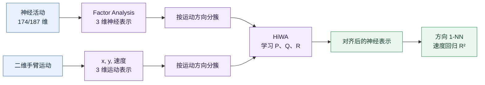

# HiWA 代码意义、复现结果与改进切口

_最优传输项目 · 2026-07-04 · 基于 HiWA 论文、官方 Python 代码与第一阶段复现实验_

---

## 📋 先读结论

1. **代码确实跑通了有意义的研究链路。** 它把猴脑神经活动与手臂运动映射到共同三维空间，再利用分层最优传输学习二者之间的对应关系。
2. **猴神经实验的核心连续指标已近似复现。** 速度预测的 $R^2$ 为 $0.6282\pm0.0042$，作者保存值为 $0.6307$；方向分类最好一次为 $51.85\%$，接近作者的 $52.65\%$，但多次运行均值只有 $45.46\%$。
3. **合成实验尚未稳定复现。** 10 个随机种子的方向准确率从 $25.75\%$ 到 $93.25\%$，标准差达到 $18.66$ 个百分点。这不是小噪声，而是明显的初始化敏感性。
4. **当前最清晰的研究切口有两个：** 一是让聚类从外部固定输入变成可学习、可表达不确定性的软结构；二是设计稳定初始化与多起点选择机制，降低结果方差。
5. **现在可以开始研究，但不能直接堆新模型。** 应先修复预处理坐标不一致、建立多种子基线，再判断改进究竟来自聚类、初始化还是别的环节。

> [!important] 研究定位
> 真正值得优化的不是“挑到一次更高的分数”，而是让方法在未知簇、不同随机种子、簇不平衡或缺失时仍能稳定工作。

## 🧠 这个任务到底在做什么

猴子完成不同方向的伸手动作时，实验同时记录：

| 数据 | 形状 | 含义 |
|---|---:|---|
| `Ytr` | $623\times174$ | 训练段神经元活动 |
| `Yte` | $803\times187$ | 测试段神经元活动 |
| `Xtr` | $623\times2$ | 训练段二维手臂运动 |
| `Xte` | $803\times2$ | 测试段二维手臂运动 |
| 标签 | 4 类 | 伸手方向编号 3、4、5、7 |

神经活动和运动信号不是同一种观测，维度也不同。代码的目标不是直接预测标签，而是先回答：

> 神经空间中不同运动模式形成的几何结构，能否经过一个共同变换，与真实运动空间中的结构对齐？

整体流程如下。

这里把二维运动 $(x,y)$ 扩成 $(x,y,\sqrt{x^2+y^2})$，第三维就是速度大小。神经活动则通过 Factor Analysis 压到三维，因此两边可以在同一维数中寻找正交变换。

## 🏗️ HiWA 代码里的 P、Q、R 分别是什么

设源域有簇 $X_1,\ldots,X_S$，目标域有簇 $Y_1,\ldots,Y_T$。

- $P_{ij}$：**簇级传输权重**，表示源簇 $X_i$ 应该与目标簇 $Y_j$ 对应多少。
- $Q_{ij}(k,l)$：**样本级传输权重**，表示在簇对 $(i,j)$ 内，源样本 $x_{ik}$ 与目标样本 $y_{jl}$ 的对应程度。
- $R$：**全局正交变换**，负责把整个源空间旋转或反射到目标空间。
- $R_{ij}$：代码在 ADMM 求解中使用的**局部簇对变换**，最后通过一致性约束与全局 $R$ 协调。
- $C_{ij}$：簇 $X_i$ 与 $Y_j$ 在当前变换下的匹配代价，外层传输 $P$ 就是依据这个代价矩阵更新。

可以把目标函数直观写成：

$$
\min_{P,\{Q_{ij}\},R}
\sum_{i,j} P_{ij}
\sum_{k,l} Q_{ij}(k,l)
\lVert R x_{ik}-y_{jl}\rVert_2^2,
$$

并满足 $P$、$Q_{ij}$ 的边缘分布约束以及 $R^\top R=I$。代码通过交替优化重复以下过程：

1. 固定变换，计算每对簇之间的内部最优传输 $Q_{ij}$ 与代价 $C_{ij}$；
2. 根据 $C$ 更新簇级对应 $P$；
3. 根据 $P$ 和 $Q$ 更新局部变换与全局变换 $R$；
4. 用相邻两轮全局旋转矩阵的 Frobenius 距离判断 $R$ 是否停止明显变化。

它的“分层”就在于：**外层匹配簇，内层匹配簇中的样本。**

## 📊 复现结果到底说明了什么

### 猴神经数据

| 指标 | 作者 Notebook 保存值 | 固定 5 个种子的复现结果 | 当前判定 |
|---|---:|---:|---|
| 对齐前方向准确率 | $24.40\%$ | $24.40\%$ | 与 Notebook 保存输出一致 |
| 对齐后方向准确率 | $52.65\%$ | $45.46\%\pm5.14\%$ | 最好 $51.85\%$，但不稳定 |
| 对齐后速度 $R^2$ | $0.6307$ | $0.6282\pm0.0042$ | 核心连续指标近似复现且稳定 |

速度 $R^2$ 很接近作者结果，说明以下主链路基本成立：数据读取、神经降维、运动三维化、HiWA 对齐、训练测试映射和速度回归。

> [!note] 数字核对说明
> 原 Notebook 的猴神经对齐前输出是 $24.40\%$；`neural_python_default_summary.json` 的参考字段误写为 $26.00\%$，后者实际是合成数据的对齐前结果。本文以 Notebook 输出和复现记录为准，保留原 JSON 不覆盖。

方向准确率的最好结果也接近作者值，但均值明显较低。这说明“算法有能力找到好解”，却不能保证每次都找到好解。研究上，**均值、标准差和成功率比最好一次更重要**。

![[HiWA猴神经复现图-2026-07-04.png]]

### 合成数据

| 实验 | 结果 | 能否当作正式复现 |
|---|---:|---|
| 作者保存结果 | $26.00\%\rightarrow94.75\%$ | 参考值 |
| 固定种子 2、300 轮 | $50.00\%$，残差 $2.0$ | 否，未收敛 |
| 10 种子、最多 50 轮 | 均值 $52.68\%$，范围 $25.75\%-93.25\%$ | 否，仅作敏感性诊断 |
| 最好诊断种子 9 | $93.25\%$，残差 $2.778$ | 否，分数高但未收敛 |

这组结果揭示了两个不能混淆的概念：

- **优化残差小**：相邻两轮全局旋转矩阵 $R_g$ 的变化较小；
- **下游准确率高**：最后找到的几何对应对标签任务有用。

两者并不等价。例如种子 4 的残差只有 $0.018$，准确率却只有 $38.50\%$；种子 9 的准确率达到 $93.25\%$，残差仍高达 $2.778$。因此不能只看收敛，也不能只看最好分数。

## 🧩 为什么 HiWA 严重依赖聚类

当前实现把簇标签当作已知输入。猴神经演示直接使用真实运动方向分簇，这在验证算法时合理，但在真实无标签任务中并不可用。

```mermaid
flowchart LR
    accTitle: 聚类误差在 HiWA 中的传播链
    accDescr: 错误簇数、错误边界和硬划分先污染簇分布，随后影响簇代价、簇对应、局部变换和全局变换，最终损害下游结果。

    A["K 选错或边界错"] --> B["簇内分布被混合"]
    B --> C["代价矩阵 C 偏移"]
    C --> D["簇对应 P 错配"]
    D --> E["局部 R_ij 学错"]
    E --> F["全局 R 被拉偏"]
    F --> G["方向与速度下降"]

    classDef risk fill:#fdecec,stroke:#b54c4c,color:#4a1717;
    classDef middle fill:#fff4df,stroke:#b9832f,color:#4a3314;
    classDef result fill:#f7e8f2,stroke:#9b4f7b,color:#452039;
    class A,B risk;
    class C,D,E,F middle;
    class G result;
```

具体有四种依赖：

1. **簇边界依赖。** 硬聚类把边界样本强制放进一个簇，错误样本会污染整个簇对的 $Q_{ij}$ 和 $C_{ij}$。
2. **簇数 $K$ 依赖。** $K$ 太小会合并不同模态，太大会把一个真实模态切碎；两者都会改变外层 $P$ 的含义。
3. **一对一和平衡假设依赖。** 当前外层传输偏向平衡的簇对应；如果两域簇数不同、某类缺失或比例差异大，就可能被迫产生错误匹配。
4. **标签泄漏风险。** 若真实标签参与了训练时分簇，实验只能证明“已知簇时能否对齐”，不能证明方法能自动发现真实结构。

原始工程已经尝试过 GMM 和 SSC，因此“先跑一个 K-means/GMM，再接 HiWA”更适合作为基线，不足以单独构成创新。更有价值的方向是让簇归属带有概率，并让聚类与对齐互相修正。

## 🎲 为什么初始化会不稳定

HiWA 同时优化 $P$、$Q$、$R$ 和多个 $R_{ij}$，这是一个[^1]非凸耦合问题。代码中的全局与局部旋转具有随机初值，交替优化一旦在早期建立了某种簇排列，就可能不断强化这个排列。

不稳定的主要来源是：

- **簇排列对称性：** 多个簇看起来相似时，早期的随机旋转会决定先匹配哪一对；
- **交替优化锁定：** 较差的 $R$ 产生较差的 $C$，较差的 $C$ 又产生错误的 $P$，错误的 $P$ 反过来更新 $R$；
- **低维表示不唯一：** Factor Analysis、Isomap 的符号、旋转和邻域连通性差异会改变优化起点；
- **环境未锁定：** 原项目没有固定依赖版本和完整 RNG 状态；旧版 SciPy、scikit-learn 的数值行为可能不同；
- **选择标准不充分：** ADMM 残差只衡量一致性，并不直接衡量语义匹配是否正确。

这不是一句“多跑几个种子”就能解决的问题。多起点可以诊断和缓解，但研究目标应是构造**有几何意义的初始化**，并设计不使用测试标签的选解标准。

## 🔬 可以精细改进的结构

| 优先级 | 结构位置 | 当前问题 | 最小改进实验 | 更强的研究版本 |
|---|---|---|---|---|
| P0 | 预处理/变换 | `fit()` 使用白化数据，`transform()` 未复用白化状态 | 保存均值与白化矩阵，并在测试集严格复用 | 研究对不同表示扰动的等变或不变对齐 |
| P0 | 评估协议 | 单次最好结果会掩盖高方差 | 固定 10–20 个种子，报告均值、标准差、成功率 | 稳定性—精度双目标评估 |
| P1 | $R$ 初始化 | 随机旋转容易进入差局部解 | 用全局 PCA/Procrustes 或簇原型构造确定性初值 | 学习式或谱方法初始化 |
| P1 | $P$ 初始化 | 均匀或随机对应缺少结构信息 | 用簇中心、协方差、簇间距离图初始化 $P$ | 图匹配与 OT 联合初始化 |
| P1 | 优化日程 | 固定熵正则可能过早形成硬匹配 | 从平滑到尖锐逐步退火 | 自适应熵正则与信赖域更新 |
| P2 | 簇归属 | 真实标签/硬簇是外部输入 | GMM、K-means、SSC 作无标签基线 | 可学习软原型，与 $P,Q,R$ 联合优化 |
| P2 | 防止簇坍缩 | 软聚类可能全部落入少数簇 | 加入簇质量、熵或容量约束 | 可辨识性与稳定性正则 |
| P3 | 簇数与缺失簇 | 默认两域有相同已知 $K$ | 人为制造错 $K$、缺失簇、不平衡簇 | 自适应 $K$、非平衡/部分最优传输 |
| P3 | 变换表达力 | 单一全局 $R$ 可能过强 | 比较全局 $R$ 与带一致性约束的簇局部变换 | 分层局部流形或轻量非线性映射 |

### 最推荐的第一条创新线

**稳定初始化 + 软聚类联合 HiWA。** 可以先做一个风险较低、证据链清晰的版本：

1. 用无标签 GMM 或 K-means 产生初始软归属；
2. 用簇原型和协方差构造 $P$、$R$ 的确定性初值；
3. 交替更新软簇归属与 HiWA 的 $P,Q,R$；
4. 加入簇平衡/熵约束，防止所有样本坍缩到同一簇；
5. 用无标签的传输代价、跨种子一致性和留出集稳定性选解；
6. 真实方向标签只在最后评价，不进入训练或选种子。

这条线同时正面回应老师提出的“自动分簇”，也对应当前复现中已经观察到的稳定性问题。但“联合后一定更好”目前仍是**待验证假设**，不能提前写成结论。

## 🧪 下一阶段的最小实验矩阵

| 实验组 | 聚类输入 | 初始化 | 目的 |
|---|---|---|---|
| A：上界 | 真实标签 | 官方随机初始化 | 已知正确簇时的性能上界 |
| B：传统基线 | K-means/GMM/SSC | 官方随机初始化 | 测量自动聚类造成的性能损失 |
| C：稳定初始化 | 与 B 相同 | 原型/Procrustes 初始化 | 单独验证初始化改进 |
| D：软聚类联合模型 | 可学习软归属 | 稳定初始化 | 验证主要创新 |
| E：困难场景 | 错 $K$、不平衡、缺失簇 | 稳定初始化 | 验证鲁棒性与方法边界 |

每组至少报告：

- 10–20 个固定随机种子的均值、标准差、最小值、最大值；
- 收敛率、迭代次数、最终残差和传输目标值；
- 方向准确率、速度 $R^2$；
- 聚类 ARI/NMI（只用于事后评价）；
- 簇对应准确性或 $P$ 的可解释性；
- 运行时间和失败案例。

> [!warning] 防止标签泄漏
> 自动聚类模型训练、超参数选择、初始化选择和早停都不能使用测试方向标签。标签只能在最终冻结方案后做评价。

## ⚠️ 当前代码与复现的已知问题

1. 合成 Notebook 使用了未定义的 `Rgt`，`sg_demo.npz` 中也没有该变量。
2. Python 实现 `fit(normalize=True)` 会对白化后的数据拟合，但 `transform()` 直接旋转原始输入，训练与变换坐标系可能不一致。
3. 原项目没有锁定 Python、NumPy、SciPy、scikit-learn 版本和完整随机状态。
4. Isomap 可能出现邻域图不连通警告，低维坐标会受版本和邻居数影响。
5. 当前环境没有 MATLAB/Octave，尚未用官方 MATLAB 实现做交叉验证。
6. 合成数据的 $94.75\%$ 尚未稳定复现，不能写成“已完成复现”。

## ✅ 事实、解释与研究假设

### 已验证事实

- 猴神经速度 $R^2$ 已接近作者保存值，并且 5 个种子下稳定。
- 猴神经方向准确率和合成方向准确率对随机种子明显敏感。
- 优化残差与下游方向准确率并非单调对应。
- 当前 Python 代码存在白化拟合与变换状态不一致风险。

### 当前解释

- 结果方差主要与非凸的 $P,Q,R$ 耦合、随机旋转和早期簇排列锁定有关。
- 固定硬聚类会把上游结构错误传递到 $C,P,R$，限制真实无标签场景的使用。

### 待验证假设

- H1：结构化初始化能显著降低跨种子方差，而不只提高最好一次分数。
- H2：软聚类与 HiWA 联合优化能提高自动分簇场景的平均性能。
- H3：非平衡或部分 OT 能改善缺失簇和簇比例不同的场景。
- H4：跨种子一致性与留出集传输代价可以成为比 ADMM 残差更可靠的无标签选解标准。

## 🔗 证据与复现入口

- [准确率、R 平方与稳定性的数学解释](./HiWA复现指标数学解释-准确率、R平方与稳定性-2026-07-05.md)
- [第一阶段复现记录](../../../Experiments/hiwa_python_reproduction/复现记录-2026-07-01.md)
- [复现说明与运行命令](../../../Experiments/hiwa_python_reproduction/README.md)
- [猴神经运行脚本](../../../Experiments/hiwa_python_reproduction/scripts/run_neural.py)
- [合成数据运行脚本](../../../Experiments/hiwa_python_reproduction/scripts/run_synthetic.py)
- [猴神经 5 种子汇总](../../../Experiments/hiwa_python_reproduction/results/neural_python_default_summary.json)
- [合成数据 10 种子诊断](../../../Experiments/hiwa_python_reproduction/results/synthetic_seed_screen_50iter.json)
- [HiWA 原论文](<../HiWA笔记/NeurIPS-2019-hierarchical-optimal-transport-for-multimodal-distribution-alignment-Paper(1).pdf>)

## 🚀 现在应当怎么做

建议顺序是：

1. 修复并验证白化状态在 `fit/transform` 间的一致性；
2. 建立真实标签、K-means、GMM、SSC 四条基线，并统一跑 10–20 个种子；
3. 单独加入结构化初始化，确认它是否降低方差；
4. 再实现软聚类—HiWA 联合优化；
5. 最后扩展到错 $K$、缺失簇和不平衡簇。

这样每一步都能回答一个清楚的问题，也能知道性能改善究竟来自哪里。第一篇可形成的研究故事应当是：**从依赖已知硬簇且初始化不稳的 HiWA，推进到无标签、软结构、稳定初始化的分层对齐方法。**

[^1]: 非凸耦合问题是什么呢？需要解释！
