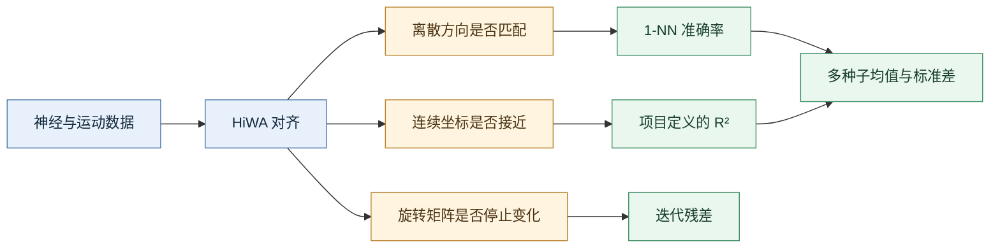

# HiWA 复现指标数学解释：准确率、R 平方与稳定性

_配套阅读笔记 · 2026-07-05 · 面向第一次接触机器学习评价指标的读者_

---

## 📋 这篇笔记解决什么问题

配套文档《HiWA 代码意义、复现结果与改进切口》中出现了这些数字：

- 对齐前方向准确率：$24.40\%$；
- 作者对齐后方向准确率：$52.65\%$；
- 我们 5 次运行的平均方向准确率：$45.46\%\pm5.14\%$；
- 最好一次方向准确率：$51.85\%$；
- 作者的 $R^2$：$0.6307$；
- 我们的 $R^2$：$0.6282\pm0.0042$。

本笔记不只给出定义，还要回答三个更实际的问题：

1. 这些数字是怎样从数据中算出来的？
2. 数字变大或变小分别代表什么？
3. 它们能够证明什么，又不能证明什么？

> [!important] 最先记住
> 准确率回答“方向类别猜对了多少”，$R^2$ 回答“连续运动坐标对得有多好”，标准差回答“换一个随机初值会不会变很多”。三者衡量的是不同事情，不能互相替代。

## 🧭 一张图看懂所有指标的位置

## 🎯 什么是方向准确率

### 最基本的数学定义

假设一共评价 $N$ 个样本。第 $i$ 个样本的真实方向是 $y_i$，模型给出的方向是 $\hat y_i$。定义指示函数：

$$
\mathbf{1}(\hat y_i=y_i)=
\begin{cases}
1, & \hat y_i=y_i,\\
0, & \hat y_i\neq y_i.
\end{cases}
$$

准确率为：

$$
\text{Accuracy}
=\frac{1}{N}\sum_{i=1}^{N}\mathbf{1}(\hat y_i=y_i)
=\frac{\text{预测正确的样本数}}{\text{总样本数}}.
$$

例如评价 100 个样本，其中 60 个方向匹配正确，则准确率为 $60/100=60\%$。它不关心错误样本“错得有多远”：方向 3 被错认成方向 4 或方向 7，都只记作一次错误。

### 本项目的方向准确率具体怎样算

这里没有训练一个常规分类器。作者代码采用 **1-nearest neighbor，1-NN，单最近邻**：

1. 把 803 个测试段神经表示当作参考点库，每个点带有真实方向标签；
2. 对 623 个训练段运动点中的每一个点，计算它到 803 个参考点的欧氏距离；
3. 找到距离最近的那个神经点；
4. 把最近神经点的方向标签作为该运动点的预测方向；
5. 检查预测方向是否与运动点的真实方向相同。

对第 $i$ 个运动查询点 $x_i$，最近神经点的下标为：

$$
j^*(i)=\arg\min_j\lVert x_i-z_j\rVert_2,
$$

其中 $z_j$ 是神经表示点。预测标签为 $\hat y_i=t_{j^*(i)}$，其中 $t_j$ 是神经点的方向标签。最后对 623 个查询点计算准确率。

> [!note] 为什么这样评价
> 如果神经空间和运动空间已经正确对齐，一个运动点附近的神经点应来自相同伸手方向。1-NN 准确率检测的正是“对齐后的局部邻域是否具有相同方向语义”。

### 24.40%、52.65% 和 51.85% 分别是多少个点

本实验准确率的分母是 $N=623$。

| 结果 | 近似正确数 | 数学含义 |
|---|---:|---|
| 对齐前 $24.40\%$ | $152/623$ | 152 个运动点最近的神经点方向一致 |
| 作者对齐后 $52.65\%$ | 约 $328/623$ | 约 328 个运动点方向一致 |
| 我们最好一次 $51.85\%$ | $323/623$ | 323 个运动点方向一致 |
| 我们 5 次平均 $45.46\%$ | 平均约 $283.2/623$ | 每次正确数不同，平均约 283 个 |
| 我们最差一次 $41.41\%$ | $258/623$ | 258 个运动点方向一致 |

平均正确数出现小数，不是说存在“0.2 个样本”，而是把 5 次运行的正确样本数相加后再除以 5。

### 四类任务中，25% 就一定是随机水平吗

如果四个方向完全均衡，并且等概率乱猜，期望准确率是 $1/4=25\%$。

但 623 个查询样本并不完全均衡：方向 3、4、5、7 分别有 177、161、150、135 个。如果永远猜样本最多的方向 3，准确率是：

$$
\frac{177}{623}\approx28.41\%.
$$

因此：

- $24.40\%$ 接近均匀乱猜的 $25\%$，而且低于多数类基线 $28.41\%$；
- $52.65\%$ 明显高于两个朴素基线，说明对齐后邻域包含更多方向信息；
- 但它仍表示约 $47.35\%$ 的查询没有匹配到相同方向，不能理解成“方向已经完全解码”。

### 提高了 28.25% 还是 28.25 个百分点

从 $24.40\%$ 提高到 $52.65\%$：

$$
52.65\%-24.40\%=28.25\text{ 个百分点}.
$$

相对提升率则为：

$$
\frac{52.65\%-24.40\%}{24.40\%}\approx115.8\%.
$$

所以严谨表达是“绝对提高约 28.25 个百分点”。我们的 5 次平均值从 $24.40\%$ 提高到 $45.46\%$，绝对提高约 21.06 个百分点。

## 📐 什么是 R 平方

### 标准直觉

$R^2$ 通常叫作决定系数。它比较预测误差与真实数据本身的波动：

$$
R^2=1-\frac{\sum_i(y_i-\hat y_i)^2}{\sum_i(y_i-\bar y)^2}.
$$

| $R^2$ | 直观含义 |
|---:|---|
| $1$ | 预测与真实值完全一致 |
| $0.8$ | 剩余平方误差约为基准波动的 $20\%$ |
| $0$ | 和只使用均值的朴素基准处于同一误差量级 |
| 小于 $0$ | 比朴素基准还差 |

$R^2$ 不像准确率那样天然限制在 0 到 1，它可以为负数。

### 本项目实际使用的 R² 不是普通库函数

作者的 `eval_R2` 先把对齐坐标 $A$ 和真实运动坐标 $M$ **分别中心化与白化**，得到 $\widetilde A$ 与 $\widetilde M$，然后计算：

$$
R^2_{\text{HiWA}}
=1-
\frac{
\sum_{d=1}^{2}\operatorname{mean}_i
(\widetilde M_{id}-\widetilde A_{id})^2
}{
\sum_{d=1}^{2}\operatorname{var}_i(\widetilde M_{id})
}.
$$

白化大致完成两件事：每一维减去自己的均值；消除尺度和协方差差异，使坐标轴具有可比较的波动尺度。

因此这里的 $R^2$ 更准确地说是：**分别白化后，对齐坐标与真实二维运动坐标之间的归一化重构分数。** 它不是训练回归器后直接调用 `sklearn.metrics.r2_score` 得到的数字。

> [!warning] 比较限制
> 只有使用相同样本、相同两维坐标、相同白化方法和相同公式时，$0.6307$ 才能与其他数字直接比较。不能拿它与另一篇论文中不同定义的 $R^2$ 直接比高低。

### 0.6307 到底意味着什么

根据公式：

$$
1-R^2=1-0.6307=0.3693.
$$

这表示白化后的坐标平方误差约为真实运动总波动量的 $36.93\%$。换句话说，按这一指标定义，对齐结果解释或保留了约 $63.07\%$ 的归一化变化。

我们的平均结果是 $0.6282$，对应剩余误差约 $37.18\%$。两者只差：

$$
0.6307-0.6282=0.0025,
$$

即约 0.25 个百分点，所以称为“数值上近似复现”。

### 为什么对齐前 R² 是负数

代码记录的对齐前结果约为 $R^2=-1.1413$。此时：

$$
1-R^2=2.1413.
$$

表示对齐前两个坐标系直接相比时，平方误差约为基准波动的 $214.13\%$。神经表示和运动坐标本来就不在同一坐标系中，因此出现负值并不奇怪。HiWA 对齐后升到约 $0.63$，说明连续坐标匹配发生了实质改善。

### “速度 R²”要怎样准确理解

数据中的 `Xte` 是二维运动信号，代码比较 `aligned[:, :2]` 与 `Xte`。三维运动表示的第三维由 $\sqrt{x^2+y^2}$ 构造，但最终 `eval_R2` 使用前两维。

因此可以沿用作者语境称它为“运动/速度解码 $R^2$”，但要知道数学上实际评价的是：**二维运动分量在白化后的匹配程度，而不是单独比较第三维速度大小。**

## 📊 什么是均值、标准差、最小值和最大值

### 五次运行分别发生了什么

| 种子 | 对齐后方向准确率 | 正确数 | 对齐后 $R^2$ |
|---:|---:|---:|---:|
| 0 | $41.57\%$ | $259/623$ | $0.6312$ |
| 1 | $50.24\%$ | $313/623$ | $0.6276$ |
| 2 | $41.41\%$ | $258/623$ | $0.6307$ |
| 3 | $42.22\%$ | $263/623$ | $0.6212$ |
| 4 | $51.85\%$ | $323/623$ | $0.6304$ |

方向准确率均值为：

$$
\bar a=\frac{a_1+a_2+a_3+a_4+a_5}{5}=45.46\%.
$$

它回答“如果不挑种子，随机运行一次大致处在什么水平”。当前汇总使用总体标准差：

$$
\sigma_a=
\sqrt{\frac{1}{5}\sum_{s=1}^{5}(a_s-\bar a)^2}
=5.14\text{ 个百分点}.
$$

它回答“不同随机初始化通常会偏离平均值多少”。方向准确率范围为 $41.41\%-51.85\%$，最大值与最小值相差 10.44 个百分点，对 623 个样本而言相差 65 次正确匹配，不能看作微小数值噪声。

### 为什么写成 45.46% ± 5.14%

“$\pm$”在这里是均值和标准差的简写。它不是说所有结果一定落在 $40.32\%-50.60\%$，也不自动等于置信区间。只有 5 次运行时，标准差估计仍较粗糙，正式实验应增加到至少 10–20 个预先固定种子。

### 为什么 R² 稳定、方向准确率却不稳定

我们的 $R^2$ 标准差只有 $0.0042$，方向准确率标准差却有 5.14 个百分点，因为两者观察不同性质：

- $R^2$ 看所有点的连续坐标平均误差，小幅局部变化可能被平均掉；
- 1-NN 看最近点属于哪个方向，两个候选点距离接近时，轻微旋转就可能使最近邻标签突然改变；
- 某些簇发生置换会严重影响方向标签，却可能仍保持相似的整体几何形状。

所以“$R^2$ 稳定”不能推出“方向对应稳定”。

## 🎲 什么是随机种子

随机种子是伪随机数生成器的起点。设定 `seed=0`，同一环境和代码通常会产生同一组随机初值；设定 `seed=1`，则会产生另一组初值。

种子本身没有科学上的“好坏”。它用于让某次实验可以重复、检查算法是否依赖偶然初值，并防止只展示碰巧成功的一次运行。

如果只报告种子 4 的 $51.85\%$，会让人以为方法稳定接近作者结果；列出 5 个种子后，才看到它也可能得到约 $41\%$。所以正式结论应以多种子分布为主，最好一次只能作为算法能力的补充证据。

## 🔄 什么是迭代残差与收敛

代码中的 `Rg_norm` 定义为相邻两轮全局旋转矩阵之差的 Frobenius 范数：

$$
d_t=\lVert R_g^{(t)}-R_g^{(t-1)}\rVert_F,
\qquad
\lVert A\rVert_F=\sqrt{\sum_{i,j}A_{ij}^2}.
$$

如果 $d_t$ 小于容差 `tol`，代码就认为全局旋转矩阵变化足够小，可以停止。小残差只说明“算法这几轮不再明显改变自己的全局旋转矩阵”，不能单独说明：

- 当前旋转是全局最优解；
- 簇对应 $P$ 具有正确语义；
- 方向准确率或 $R^2$ 一定高。

合成诊断中，种子 4 的残差为 $0.018$，准确率只有 $38.50\%$；种子 9 的准确率达到 $93.25\%$，残差却为 $2.778$，尚未满足停止条件。这说明“优化停止”和“任务表现好”是不同判断。

## 🧪 “复现成功”究竟分几个层次

| 层次 | 判断问题 | 当前状态 |
|---|---|---|
| 运行复现 | 数据能否读取、代码能否完整运行并输出结果？ | 已完成 |
| 数值近似复现 | 同一指标是否接近作者保存值？ | 猴神经 $R^2$ 已达到；最好方向准确率接近 |
| 稳定复现 | 多个预先固定种子是否都接近作者值？ | 方向准确率未达到 |
| 结论复现 | 在完整数据、参数网格和统计协议下，主要结论是否仍成立？ | 尚未完成 |

### 猴神经结果应怎样表述

推荐表述：

> 猴神经实验的连续运动 $R^2$ 得到数值上近似且跨 5 个种子稳定的复现；方向 1-NN 准确率最好一次接近作者保存值，但多种子均值较低、方差明显，尚未实现稳定复现。

不能表述为“已经完整复现论文全部结果”。

### 合成结果应怎样表述

10 个诊断种子的准确率均值为 $52.68\%$，标准差为 18.66 个百分点，范围为 $25.75\%-93.25\%$，作者保存值为 $94.75\%$。

种子 9 达到 $93.25\%$，但在限制迭代数内没有收敛。它只能证明“当前实现偶尔能进入接近作者分数的区域”，不能证明作者结果已被稳定复现。

## ✅ 以后读结果表时按什么顺序

1. **指标定义是什么？** 分子、分母和预处理分别是什么？
2. **评价对象有多少？** 这里准确率分母是 623，不是 803。
3. **朴素基线是多少？** 四类均匀猜测约 25%，多数类基线约 28.41%。
4. **平均表现如何？** 方向准确率均值是 45.46%。
5. **结果稳定吗？** 标准差 5.14 个百分点，范围超过 10 个百分点。
6. **有没有挑最好种子？** 最好一次不能替代多种子统计。
7. **收敛与任务效果是否一致？** 本项目中并不一致。
8. **能声明哪一级复现？** 运行、数值、稳定、结论复现必须分开。

## 🔗 对照材料

- [代码意义、复现结果与改进切口](./HiWA代码意义、复现结果与改进切口-2026-07-04.md)
- [神经解码实验 Figure 2 笔记](../HiWA笔记/第十三章%20神经解码实验%20Figure%202.md)
- [作者指标实现 `utils.py`](../../PyHiWA/src/utils.py)
- [作者演示 Notebook](../../PyHiWA/HiWA-Demo.ipynb)
- [我们的指标实现 `common.py`](../../../Experiments/hiwa_python_reproduction/scripts/common.py)
- [猴神经 5 种子完整结果](../../../Experiments/hiwa_python_reproduction/results/neural_python-default.json)
- [猴神经汇总结果](../../../Experiments/hiwa_python_reproduction/results/neural_python_default_summary.json)
- [合成数据 10 种子诊断](../../../Experiments/hiwa_python_reproduction/results/synthetic_seed_screen_50iter.json)

## 🚀 读完后应该得到的结论

- $52.65\%$ 表示约 328 个查询点方向匹配正确，不表示模型“整体正确了 52.65%”。
- $R^2=0.6307$ 表示按本项目的白化重构公式，剩余误差约为基准波动的 $36.93\%$。
- $45.46\%\pm5.14\%$ 表明平均性能有提升，但随机初始化会显著改变方向结果。
- 小残差只说明旋转矩阵停止明显变化，不保证找到了语义正确的对齐。
- 当前最可信的结论是：连续运动指标近似且稳定复现，方向指标只是最好种子接近，合成结果尚未稳定复现。
