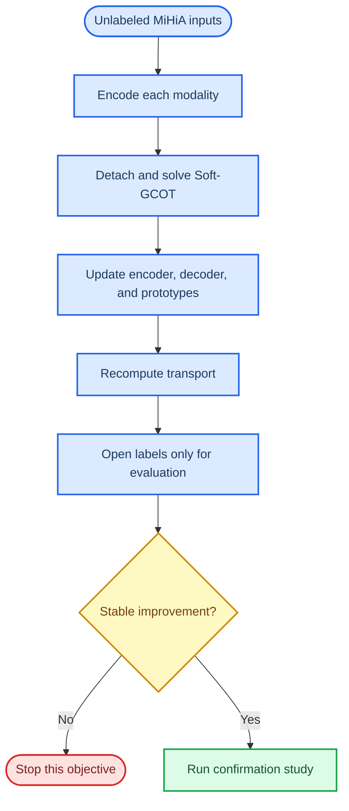

# MiHiA learnable-representation MVP: stop decision

_Date: 2026-07-13_  
_Scope: exploratory mechanism study on the fixed 96-by-96 MiHiA subset_

## 🧭 Decision

The detached, unlabeled representation-learning MVP is technically working but does not provide a stable improvement over the frozen Soft-GCOT HiWA baseline. Further tuning of this exact objective is stopped.

The result does **not** invalidate the frozen Soft-GCOT baseline, nor does it invalidate the broader TACO-style architecture. It only rejects the following restricted recipe on this MiHiA protocol:

> Random or identity-initialized encoders + unlabeled reconstruction/OT losses + frozen-then-recomputed transport plans, with direction labels and true neural--movement correspondences unavailable to training.

Every saved result uses labels only after fitting for direction-nearest-neighbour evaluation. No run uses direction labels, movement labels, or pair identifiers in the encoder, prototype, or OT updates.

## 📊 Confirmed results

| Variant | Seeds | Fixed Soft-GCOT mean | Learned-representation mean | Mean delta | Learned wins | Learned solver converged |
| --- | ---: | ---: | ---: | ---: | ---: | ---: |
| Raw-input MLP | 200 | 0.3438 | 0.2396 | -0.1042 | 0 / 1 | 0 / 1 |
| Standardized-input MLP | 201–205 | 0.3958 | 0.3188 | -0.0771 | 2 / 5 | 5 / 5 |
| Residual identity initialization | 206 | 0.4271 | 0.2604 | -0.1667 | 0 / 1 | 1 / 1 |
| Residual plus identity anchor | 207–210 | 0.3125 | 0.2891 | -0.0234 | 2 / 4 | 1 / 4 |
| Residual plus coupling reconstruction | 211 | 0.4271 | 0.1771 | -0.2500 | 0 / 1 | 1 / 1 |

The isolated positive examples are exploratory observations, not evidence of improvement:

- Standardized MLP seed 201: fixed 0.3854, learned 0.4375.
- Standardized MLP seed 203: fixed 0.3854, learned 0.5625.
- Residual anchored seed 210: fixed 0.3854, learned 0.6354.

Those gains coexist with large failures under the same configuration family, including 0.0729 and 0.1250 in the anchored residual study. Selecting the positive seeds or continuing to adjust weights based on direction accuracy would be post-hoc selection and is not valid evidence.

## 🔬 What was implemented and verified

1. `solver_adapter.py` wraps the existing full-support NumPy/SciPy Soft-GCOT solver as a detached inner solve.
2. The adapter has an exact regression test against direct `SoftHiWA`: group transport \(P\), rotation \(R\), aligned source, and global sample coupling \(\Pi\) agree numerically.
3. The MVP has modality-specific encoder/decoder modules, learnable soft prototypes, reconstruction, variance, covariance, group-balance, identity-anchor, and coupling-reconstruction losses.
4. Each outer round follows the same declared alternating rule: solve \(P,Q,R,\Pi\) on detached latents; fix them; update representation modules; recompute transport.
5. The full test suite passes: 55 tests.

## ⚠️ Interpretation

The solver adapter and alternating update are not the failure point: the learned solver frequently reaches the configured ADMM criterion, latent effective rank remains above one, and encoder parameters do change. The missing ingredient is a stable learning signal that says which information must remain useful across outer iterations.

The frozen baseline has a fixed representation and can therefore be evaluated under a label-free alignment protocol. A general TACO-style model is different: its representation modules need a legitimate task signal or a predeclared self-supervised task. In the present MiHiA protocol, direction labels and true pairs are intentionally evaluation-only, so they cannot supply that signal.

## 🧱 Next valid branch

Do not modify the frozen MiHiA baseline or continue optimizing the loss weights above. The next branch needs a dataset/protocol that explicitly permits a source-side downstream task head, while keeping target labels and pair IDs out of alignment training.

The suitable protocol is:

| Component | Training access | Purpose |
| --- | --- | --- |
| Source observations and source task labels | Allowed | Train a source task head and preserve useful latent structure |
| Target observations | Allowed without labels | Learn target encoder, prototypes, and OT alignment |
| Target task labels | Evaluation only | Measure transfer performance |
| Pair IDs | Evaluation only | Measure retrieval if the dataset supplies true pairs |

PAMAP2 is the first candidate for that protocol: source-position activity labels can train a source activity head, while target-position labels remain hidden until final evaluation. Before implementation, the protocol must be formally fixed so it is not confused with the current label-free MiHiA baseline.

## 📁 Evidence

- [Detached solver adapter](../../src/cc_hiwa/solver_adapter.py)
- [Alternating representation MVP](../../src/cc_hiwa/alternating_representation.py)
- [MiHiA experiment runner](../../experiments/hiwa/run_representation_soft_gcot_mvp.py)
- [All saved MVP outputs](../../experiments/results/)
- [Architecture gap audit](Full_TACO_style_architecture_gap_audit_2026-07-13.md)
