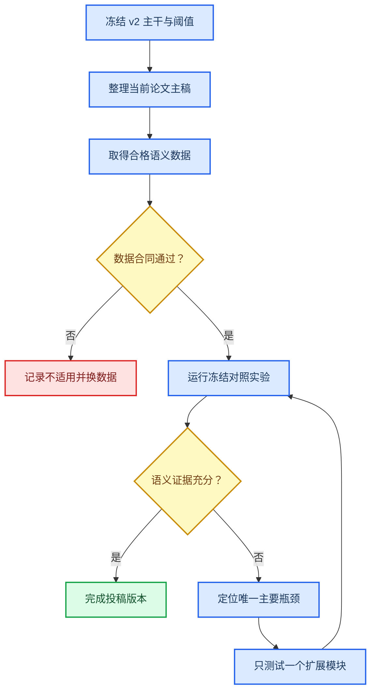

# OT-HiWA 项目进度总览：从问题、方法到下一步

_面向首次接触本项目的读者 · 更新于 2026-08-07_

---

## 📋 先说结论

当前项目已经完成了一个可以独立讲清楚、可以复现、也可以开始写论文的方法主线：**GC-HiWA v2——带适用性诊断和弃权机制的无监督坐标对齐方法**。

它解决的不是“所有跨域任务都能提升”这个过大的问题，而是一个更明确的问题：当两个数据域具有相同的群组几何结构，只是坐标系发生了某类允许的旋转时，能否在没有样本配对、没有目标标签的情况下恢复坐标变换；如果数据不满足这个条件，方法能否拒绝给出不可靠答案。

截至目前，我们已经做到：

- 建立了完整数学模型，包括软群组、组内与组间最优传输、局部—全局共识和结构化旋转约束
- 完成了 ROCA，用于处理正交变换中旋转与镜像分支的选择，并在证据不足时弃权
- 建立了适用性诊断，避免“算法数值收敛了，就误以为对齐成功”
- 在独立合成实验中实现 15/15 可恢复情形接受、25/25 预声明违例弃权，并对更隐蔽的谱伪装反例实现 5/5 弃权
- 在 Panoptic 多相机三维骨架上完成受控真实几何验证，11 次主要配置全部收敛，配对 Recall@1 为 1
- 完成冻结下游代理实验，证明恢复坐标后，源域模型可以在受控目标坐标中重新工作
- 审计了 Indy-Loco、PBMC、PAMAP2 和 Paderborn，明确了它们为什么不能作为当前方法的正向应用结果
- 检查了联合优化、数据编码器和自动群组数，没有发现稳定独立增益，因此没有把它们强行加入主模型
- 已有论文草稿、最终 PDF、完整研究笔记、实验代码、结果文件和一键证据审计器；完整测试为 114 项通过

> **最重要的判断：** 当前成果足以写一篇“方法、适用性诊断与受控几何验证”论文，但还不足以写成“真实跨设备动作识别已经取得提升”。后一个结论仍需要一个带真实语义标签、来自独立设备或视角的数据集完成冻结验证。

## 🎯 我们究竟在研究什么问题

### 最初的问题

假设有两个域：

$$
X=\{x_i\}_{i=1}^{n},\qquad Y=\{y_j\}_{j=1}^{m}.
$$

它们可能来自不同相机、设备、实验批次或坐标系统。我们看到了两批点，却不知道哪个 $x_i$ 对应哪个 $y_j$，也不允许在拟合时使用目标域标签。

我们希望找到一个变换 $R$，使变换后的源域 $Rx_i$ 与目标域具有一致的几何结构。对于三维姿态，$R$ 不是任意的 $57\times57$ 正交矩阵，而是所有关节共享同一个三维旋转：

$$
R=I_J\otimes R_3,\qquad R_3\in SO(3),
$$

其中 $J$ 是关节数。这个结构表达了真实物理含义：相机坐标系改变会同时旋转所有关节，而不会给每个关节施加彼此无关的高维变换。

### 真正困难的地方

困难不只是“求一个旋转”，而是以下四件事必须同时成立：

1. 没有已知样本配对，需要用最优传输估计哪些结构可能对应
2. 没有真实群组标签，需要用软群组表达每个样本对多个原型的隶属程度
3. 局部群组可能给出不同变换，需要通过共识机制恢复一个全局坐标变换
4. 数据可能根本不满足共同旋转假设，因此系统必须能够说“当前不适用”

### 当前研究问题的准确表述

> 给定两个无配对、无目标标签的数据域，在预先声明的结构化正交变换族内，联合估计软群组对应、局部传输和全局坐标变换；同时利用拟合、可行性、可识别性和多启动稳定性诊断，决定接受结果还是弃权。

这是一项**无监督坐标恢复**研究，不是没有条件限制的通用领域适配。

## ⚙️ 现在的方法是怎样工作的

```mermaid
flowchart LR
    accTitle: GC-HiWA v2 complete workflow
    accDescr: The method converts two unpaired domains into soft groups, estimates hierarchical transport and structured rotations, then accepts a qualified result or abstains with a reason.

    input["输入两个无配对域"] --> soft_group["计算旋转等变软群组"]
    soft_group --> local_ot["求解组内加权 OT"]
    soft_group --> group_ot["求解组间熵正则 OT"]
    local_ot --> consensus["局部与全局旋转共识"]
    group_ot --> consensus
    consensus --> structured["投影到结构化旋转族"]
    structured --> diagnose{"资格检查通过？"}
    diagnose -->|通过| branch["ROCA 检查候选分支"]
    diagnose -->|不通过| abstain["弃权并报告原因"]
    branch -->|唯一合格| accept["接受坐标变换"]
    branch -->|冲突或模糊| abstain

    classDef process fill:#dbeafe,stroke:#2563eb,stroke-width:2px,color:#1e3a5f
    classDef decision fill:#fef9c3,stroke:#ca8a04,stroke-width:2px,color:#713f12
    classDef success fill:#dcfce7,stroke:#16a34a,stroke-width:2px,color:#14532d
    classDef warning fill:#fee2e2,stroke:#dc2626,stroke-width:2px,color:#7f1d1d

    class input,soft_group,local_ot,group_ot,consensus,structured process
    class diagnose,branch decision
    class accept success
    class abstain warning
```

### 软群组

每个样本不是被硬分到某一个组，而是对多个原型具有不同权重。例如，样本 $x_i$ 对第 $k$ 个源原型的隶属度写成

$$
A^X_{ki}
=
\frac{\exp\!\left(-\lVert x_i-c_k^X\rVert^2/\tau\right)}
{\sum_{r=1}^{K}\exp\!\left(-\lVert x_i-c_r^X\rVert^2/\tau\right)}.
$$

这样做的价值是：群组边界附近的样本不会因为一次硬切分突然消失，而且每个局部 OT 都有明确、可检查的概率边际。

### 分层最优传输与共识

模型同时考虑两层对应关系：

- **组间 OT** 判断源原型与目标原型之间的质量如何分配
- **组内 OT** 判断两个群组内部的样本结构如何对应

每个群组对可以产生一个局部变换 $R_{k\ell}$。GC-HiWA 再通过局部—全局共识求一个共同变换 $R$。这一步的关键不是简单平均局部旋转，而是用组间传输质量和局部可行性共同决定哪些局部证据值得信任。

### ROCA 的作用

在一般正交群 $O(d)$ 中，候选可能属于两类：

$$
\det(R)=+1 \quad\text{或}\quad \det(R)=-1.
$$

$+1$ 对应正常旋转，$-1$ 包含镜像反射。早期方法容易因为优化初始化或局部极小值选择错误分支。ROCA 的目标不是重新做一次完整对齐，而是回答：

> 两个候选分支中，是否有且只有一个在几何、传输和收敛证据上合格？

ROCA 分别检查每个候选的收敛、局部边际误差、正交误差、单一变换拟合程度、原型定向和内部传输目标。如果只有一个候选合格，就接受它；如果都不合格或二者证据过于接近，就弃权。

对于三维姿态，物理主干直接限制在 $SO(3)$，ROCA 更多承担一般 $O(d)$ 问题和方法诊断中的分支审计角色。

### 适用性诊断

模型输出的不只是一个矩阵，还包括它是否可信。当前主要检查：

| 检查 | 回答的问题 |
|---|---|
| 局部 OT 边际误差 | 传输计划是否真满足声明的概率边际 |
| 正交误差 | 输出是否仍属于允许的正交变换族 |
| 单旋转拟合比 $\eta$ | 一个共同旋转是否足以解释所有局部结构 |
| 协方差谱差 | 两域是否至少满足正交变换的必要条件 |
| 可识别性间隔 | 数据是否包含足够方向信息来唯一确定旋转 |
| 多启动一致性 | 不同初始化是否收敛到同一个稳定解簇 |
| ROCA 候选间隔 | 行列式分支是否有足够证据被唯一选择 |

这些门槛共同构成“工程数学合同”。它们不是普适统计定理，但可以阻止大量明显不合格的结果被错误解释为成功。

## 🔎 我们是怎样一步步研究到这里的

| 阶段 | 研究问题 | 得到的认识 |
|---|---|---|
| HiWA/TACO 复现 | 分层 OT 和硬群组是否能完成跨域对齐 | 建立了基线与实验框架，但硬群组和任务指标容易掩盖几何问题 |
| Soft-GCOT | 能否用全支持软群组替代硬切分 | 完成软群组和全支持局部 OT；明确稀疏模式只是计算近似 |
| 联合优化 | 同时更新原型和传输是否更好 | 已实现并比较，没有稳定独立增益，不进入主干 |
| 数据编码器 | 学习表示后再对齐是否更好 | 在现有验证中反而下降，不能作为方法贡献 |
| ROCA | 如何处理旋转与镜像分支 | 建立候选资格、目标间隔和模糊弃权机制 |
| 适用性合同 | 如何识别“收敛但错误” | 加入谱差、拟合比、可识别性和多启动稳定性检查 |
| 合成边界 | 方法何时应恢复，何时应拒绝 | 建立独立种子、反例和冻结证据审计 |
| Panoptic | 真实三维坐标中能否恢复隐藏相机旋转 | 在同一采集系统的多个相机、主体和窗口上得到受控成功结果 |
| 外部数据审计 | 方法能否直接用于神经、组学、传感器和轴承数据 | 多数数据不满足共同正交几何或评估协议，负结果帮助限定适用范围 |

这条研究路线最重要的变化，是从“尽量让 OT 在所有任务上提高指标”，转向“先声明可恢复的几何条件，再让模型识别自己什么时候有资格输出”。

## 📊 目前已经确认的结果

### 合成数据：恢复与拒绝边界

独立冻结批次的结果如下：

| 条件 | 次数 | 核心资格结果 | ROCA 结果 | 正确解释 |
|---|---:|---:|---:|---|
| 理想旋转、噪声 0.05、噪声 0.10 | 15 | 15/15 接受 | 15/15 接受并选对分支 | 合同满足时可以恢复 |
| 混合旋转、群组平移、非正交变换、独立跨模态目标 | 25 | 25/25 弃权 | 25/25 弃权 | 声明的违例不会被强行解释为成功 |
| 协方差谱完全相同但实际非正交 | 5 | 5/5 弃权 | 5/5 弃权 | 单独通过谱检查并不足够 |

谱伪装反例尤其重要：其两域协方差谱差最大只有 $1.16\times10^{-15}$，看起来几乎完全一致，但不存在合法的单一正交真值。模型最终依靠收敛和单旋转拟合检查拒绝了全部五次运行。这证明当前诊断不是只依赖一个简单指标。

### Panoptic：受控真实几何

Panoptic 数据包含多相机三维骨架。拟合时隐藏真实相机外参和帧配对，只在最终评价时打开这些信息。

| 实验 | 结果 |
|---|---|
| 任意 $O(57)$ 高维旋转 | 100 轮未收敛，旋转误差 10.31，说明错误的变换族会失败 |
| 结构化 $I_{19}\otimes SO(3)$，三组相机配置 | 共 11 次全部收敛，最大旋转误差 0.0308，Recall@1 全部为 1 |
| 最终资格复查 | 旋转误差 0.00818，配对 MSE 为 $2.79\times10^{-7}$，可识别性间隔为 0.133 |
| 独立窗口多启动 | 稳定解簇能够保留一致结果，并拒绝偏离稳定簇的坏初始化 |

这说明方法不仅能在人工生成数据上恢复旋转，也能在真实三维骨架的受控相机坐标变化中工作。

### 冻结下游代理

我们还测试了“坐标恢复后，源域训练的模型能否在目标坐标中重新使用”。两个受控窗口的平衡准确率分别表现为：

| 窗口 | 源域留出 | 未对齐目标 | 对齐后目标 |
|---|---:|---:|---:|
| 主体 0，帧 141–339 | 0.864 | 0.333 | 0.864 |
| 主体 2，帧 10000–10099 | 0.822 | 0.667 | 0.811 |

这是一项有价值的端到端证据，但状态由源姿态自动定义，不是人工动作语义标签，因此不能把它写成“真实动作识别结果”。

### 工程与复现状态

| 项目 | 当前状态 |
|---|---|
| 核心实现 | 已完成并进入 `src/cc_hiwa/` |
| 合成与 Panoptic 运行器 | 已完成并进入 `experiments/` |
| 冻结结果 | 已保存在 `experiments/results/` |
| 自动证据审计 | 已完成，可检查论文引用的关键数字 |
| 回归测试 | 114 项全部通过 |
| 论文材料 | 已有 LaTeX 主稿、最终 PDF、完整研究笔记和质量审查清单 |
| GitHub 同步 | 当前主成果已同步到分支 `codex/pamap2-weak-pair-task-ot`，提交 `99dadda` |

## ⚠️ 做过但没有成为正向结果的工作

### 其他数据集为什么没有成功

| 数据或方向 | 做了什么 | 为什么不能作为正向应用结果 |
|---|---|---|
| Indy-Loco | 做了跨会话神经—速度对齐、全局 Soft-GCOT、任务感知 OT 和配对 Procrustes 上界 | 即使开放配对给 oracle，上界仍很弱；神经表示到瞬时速度不满足共同全局正交几何 |
| PBMC RNA–ATAC | 构造共享特征空间并测试硬／软对齐和配对检索 | 共享基因空间不等于近似正交几何，当前 paired recall 很低 |
| PAMAP2 | 设计时间安全切分、任务感知 OT、弱配对和多主体可用性审计 | 本地完整可用主体不足，已有单主体结果没有稳定收益，不能声称跨主体泛化 |
| Paderborn 轴承 | 审计工况与实体切分并运行 Soft-GCOT | 一种切分任务过于容易，另一种几乎没有可迁移信号，不能有效区分方法能力 |

这些实验并非无用失败。它们告诉我们：如果两个域根本不共享近似正交几何，继续调 Sinkhorn 温度、ADMM 惩罚或群组数，不会把问题变成可恢复的坐标对齐。

### 联合优化和数据编码器

联合更新软群组原型在已有 MiHiA 检查中没有改变方向准确率，速度 $R^2$ 还从约 0.61996 微降至 0.61921。残差数据编码器的独立复核中，固定主干方向准确率为 0.4375，学习表示后为 0.1979，甚至低于未对齐的 0.2708。

因此当前结论不是“编码器永远无效”，而是：**现有证据不足以证明它给 GC-HiWA 的坐标恢复带来稳定独立增益**。把它加入主干只会增加参数和解释难度。

### 自动群组数

我们比较了固定 $K=4$ 与事后知道真实 $K$ 的 oracle。首次小样本中 $K=5$ 看似有优势，但独立种子 2104–2108 中：

- 固定 $K=4$ 为 5/5 接受，平均旋转误差 0.0109
- oracle $K=5$ 为 4/5 接受，平均旋转误差 0.5429，并出现一次错误局部解

因此目前不加入截断 DP 或 DP-GMM。自动聚类会改变局部 OT 边际和 ROCA 的几何前提，却没有通过独立增益验证。

## 🧭 当前研究处在什么阶段

可以把当前状态理解为三个层级：

| 层级 | 状态 | 含义 |
|---|---|---|
| 方法与数学合同 | 已完成主体 | 问题、假设、目标函数、算法流程和弃权逻辑已经能完整叙述 |
| 机制与受控验证 | 已完成 | 合成边界、反例、Panoptic 和冻结代理支持当前有限结论 |
| 独立真实语义应用 | 尚未完成 | 还没有完成带人工动作标签的跨设备／跨视角冻结验证 |

因此，项目不是“没有结果”，也不是“已经全部完成”。更准确的说法是：

> 方法论文的核心闭环已经形成；应用论文最关键的外部语义证据还缺一块。

### 现在可以写论文吗

**可以写。** 但论文定位必须准确。

现在可以写成：

- 一种带适用性诊断的无监督结构化坐标对齐方法
- 一种将“恢复或弃权”作为统一输出的分层最优传输框架
- ROCA 对正交分支歧义的资格判定机制
- 合成边界、反例与受控真实相机几何验证

现在不能写成：

- 已经普遍提高跨域分类或回归性能
- 已经解决真实跨设备动作识别
- ROCA 在任意数据上都能选对旋转分支
- ADMM 数值收敛等于全局最优或语义迁移成功
- 当前门槛已经具有跨数据集的统计错误率保证

如果现在投稿，适合以方法与可靠性为核心；如果希望冲击更强调真实应用的论文，则应先补齐独立语义数据。

## 🚀 接下来最有价值的工作

### 优先级 1：完成真实语义动作数据的冻结验证

这是当前价值最高、最能改变论文强度的一步。优先接入 UWA3DII，或选择另一个同时满足以下条件的数据集：

1. 至少有两个设备、视角或坐标域
2. 各域维度和物理对象一致，存在合理的结构化旋转假设
3. 有人工语义标签，可评价动作识别而不仅是几何恢复
4. 拟合阶段可以完全隐藏目标标签和真实配对
5. 未对齐基线没有已经饱和

实验必须沿用已经冻结的主干、阈值和评价协议，避免看完测试结果再调规则。应报告 source-only、无对齐、HiWA/Soft-GCOT、GC-HiWA、oracle 上界、接受率、弃权率和下游指标。

### 优先级 2：把现有论文整理成可投稿版本

即使外部数据尚未到位，也可以立即推进以下工作：

- 用当前数学合同重写方法章节，统一符号和假设
- 将 ROCA 明确写成候选资格与弃权机制，而不是万能分支选择器
- 固定主表：合成恢复／弃权、谱伪装反例、Panoptic 多配置和下游代理
- 将 Indy-Loco、PBMC、PAMAP2、Paderborn 放入适用性边界或附录，而非包装成正结果
- 补齐与 HiWA、TACO、无监督 Procrustes、Gromov-Wasserstein 和 selective prediction 的文献定位
- 将 114 项测试和证据审计写入复现声明

### 优先级 3：加强理论，但控制范围

目前理论可以说明：在正确耦合与允许变换族假设下，结构化 Procrustes 解如何恢复真旋转；也能给出谱一致性是必要条件、原型定向何时能区分分支。

仍值得研究的理论问题是：

- 有限熵正则下，传输偏差如何影响旋转恢复误差
- 群组对应错误时，局部—全局共识的稳定性边界
- 可识别性间隔与最小群组结构之间的关系
- 多启动一致性如何转化为可解释的稳定性保证
- 资格门槛在预先声明数据分布族上的错误接受界

不建议一开始追求完整非凸 OT–ADMM 的普适全局收敛证明；这会非常重，而且不是当前论文成立的必要条件。

### 优先级 4：只在出现明确缺口时重启扩展模块

自动群组数、编码器和联合优化不是永久删除，而是进入候选扩展区。只有当真实语义实验显示“固定几何主干确实受某个明确瓶颈限制”时，才值得逐一重启，并遵循：

1. 一次只增加一个机制
2. 先在已知真旋转的合成数据上证明不破坏恢复
3. 再在冻结外部数据上比较独立增益
4. 同时报告收益、弃权率、稳定性和额外复杂度

## ⛔ 现在不建议做什么

- 不继续在已经证明几何合同不成立的 Indy-Loco 协议上盲目调 OT 参数
- 不因为某个单种子结果好看就加入自动群组数或编码器
- 不把 Panoptic 的坐标恢复写成真实动作识别
- 不把低 OT 目标值或 ADMM 收敛单独作为成功标准
- 不同时更换数据、编码器、群组数、损失和阈值，否则无法判断提升来自哪里
- 不在看到测试集结果后修改资格门槛

## 📍 建议的实际执行顺序

最实际的近期目标可以定义为：

> 在不修改 GC-HiWA v2 主干与资格门槛的前提下，完成一个合格的真实语义跨域数据集验证，并据此形成可投稿论文的最终主结果表。

如果短期内拿不到合格数据，则次优但仍有价值的目标是：完成当前方法论文版本，突出恢复—弃权合同、ROCA、反例和 Panoptic 受控证据，诚实保留真实语义泛化尚未验证这一限制。

## 📚 从哪里继续阅读

| 想了解的内容 | 文件 |
|---|---|
| 仓库结构与复现命令 | [GC-HiWA v2 仓库说明与复现指南](../GC-HiWA_v2_仓库说明与复现指南.md) |
| 完整数学模型与全部结果 | [GC-HiWA v2 完整研究笔记](GC-HiWA_v2_完整研究笔记_Obsidian.md) |
| 数学合同与 Panoptic 证据 | [数学合同、适用性诊断与 Panoptic 验证](GC-HiWA_v2_数学合同、适用性诊断与Panoptic验证_2026-07-23.md) |
| ROCA 的公式与算法 | [ROCA-HiWA 方法公式与算法流程](ROCA-HiWA方法公式与算法流程.md) |
| 自动群组数的停止结论 | [截断 DP 软群组的数学合同与准入实验](GC-HiWA_v3_截断DP软群组的数学合同与准入实验.md) |
| 其他数据为什么不合格 | [外部数据适用性审计](GC-HiWA_v2_外部数据适用性审计_2026-07-23.md) |
| 真实动作数据的冻结方案 | [真实语义动作验证的数据接入与冻结协议](真实语义动作验证的数据接入与冻结协议_2026-07-25.md) |
| 当前论文 PDF | [GC-HiWA v2 最终 PDF](../../Writing/GC-HiWA_v2_final.pdf) |

## ✅ 一句话总结

我们已经把一个早期的“分层 OT 对齐想法”发展成了一个有明确数学合同、能够恢复也能够拒绝、经过合成反例和真实受控几何验证的 GC-HiWA v2 方法；下一步最值得做的不是继续增加复杂模块，而是补齐独立真实语义数据，并把现有证据整理成定位准确的论文。
