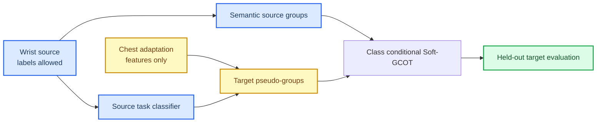

# PAMAP2 Class-Conditional Transport Stop Decision

## 🎯 Question

The frozen source-supervised representation MVP failed because unconstrained
Soft-GCOT could improve an unlabeled geometric objective while damaging activity
semantics. This branch tested one new, explicit mechanism rather than another
loss-weight sweep:

> Can source activity labels anchor source groups, while a source-trained task
> head supplies label-free target pseudo-groups that make cross-view Soft-GCOT
> preserve activity semantics?

The experiment uses the leakage-safe temporal protocol. Source wrist labels
are allowed in source group construction and source classifier fitting. Target
chest labels and synchronous pair IDs remain evaluation-only.[^1]

## 🧭 Contract

For $C=6$ activities, source assignments use smoothed one-hot labels. Target
assignments use the source classifier's softmax probabilities. The first
unlocked implementation still learned a doubly stochastic group transport
$P$. The semantic implementation fixes

$$
P = \frac{1}{C} I_C,
$$

because source group $c$ and target pseudo-group $c$ carry the same task
meaning by construction.

## 🧪 Pre-registered Fixed-Representation Check

The check used Subject 101, the six fixed activities, 200-sample windows, and
the temporal allocation of 48 source-train, 12 source-validation, 18 target
adaptation, and 18 target-test windows. No target labels or pair IDs entered
either solver call.

| Variant | Source validation | Target pseudo-label accuracy | Target accuracy after alignment | ADMM status |
| --- | ---: | ---: | ---: | --- |
| Learned group matching | 75.0% | not recorded in the first smoke test | 0.0% | converged, residual 0.073 |
| Semantic diagonal matching | 75.0% | 50.0% | 0.0% | not converged, residual 0.258 |

The unlocked variant produced a nearly uniform $6\times6$ group transport,
so it discarded the semantic group indices. The semantic-diagonal variant
preserved those indices but failed the solver's existing ADMM criterion and
still produced no target classification recovery. The 50.0% post-hoc target
pseudo-label accuracy shows that the source task head is not entirely devoid
of cross-view signal; however, that signal is not sufficient to make the
current fixed-representation, class-locked OT geometry solvable.

Machine-readable records are retained for the unlocked
[smoke test](../../experiments/results/pamap2_class_conditional_smoke_subject101_seed401_20260713.json)
and the semantic-locked
[diagnostic](../../experiments/results/pamap2_class_conditional_locked_diagnostic_subject101_seed401_20260713.json).

## 🛑 Stop Rule

Do not run additional seeds, temperature sweeps, smoothing sweeps, or ADMM
parameter searches for this fixed-representation class-conditional mechanism.
The two pre-defined alternatives identify a model-contract conflict, not a
single numerical setting:

- learned group matching loses the intended class semantics;
- locked group matching keeps semantics but conflicts with the current local
  orthogonal transport and ADMM consensus;
- neither variant recovers target activity recognition.

The implementation and tests remain in the repository as a negative control.
They must not be reported as evidence that class-conditional adaptation is
generally ineffective.

## 🔭 Consequence

The remaining next direction is not another target-unlabelled adjustment to
the same detached OT inner loop. A new research contract must be selected:

| Candidate contract | Additional information | Claim that changes |
| --- | --- | --- |
| Weakly supervised paired alignment | Synchronous window pairs during training | No longer unsupervised correspondence recovery |
| Joint differentiable task-aware transport | No target labels or pairs, but replaces detached inner solver | New end-to-end model rather than an extension of frozen Soft-GCOT |
| Different application protocol | New data and task structure | Changes empirical scope |

No candidate should be implemented until its allowed information and primary
claim are fixed in a separate protocol.

[^1]: UCI Machine Learning Repository. *PAMAP2 Physical Activity Monitoring*. https://archive.ics.uci.edu/dataset/231/pamap2%2Bphysical%2Bactivity%2Bmonitoring
