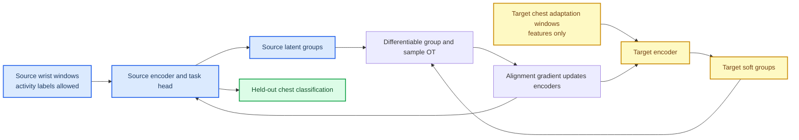

# PAMAP2 Differentiable Task-Aware OT MVP Stop Decision

## 🧭 Question

The detached Soft-GCOT and class-conditional transport branches reached a
clear limitation: their transport plans could not update the representation
that produced them. This MVP therefore replaced the detached inner solver
with an end-to-end differentiable, task-aware group and sample transport.

> Can source activity supervision plus target-unlabelled differentiable
> transport improve chest-position activity recognition beyond a source-task
> encoder, without using target labels or synchronous window pairs in fit?

The answer for the frozen Subject 101 temporal protocol is **no**. The
implementation is technically valid and the semantic transport is learned,
but it has a consistent negative paired effect on held-out target accuracy.

## 🔒 Information Contract

The `fit` interface accepts only source features, source activity labels,
target-adaptation features, and source-validation data. It has no argument for
target-test labels or synchronous pair IDs. Target group probabilities are
generated by the learned task head; source groups are source-label one-hot
assignments. The differentiable group plan and sample plan use log-domain
Sinkhorn normalization.

The source task objective is deliberately warmed up before the joint phase.
The joint phase uses source task loss, modality reconstruction, latent variance
and covariance protection, and normalized-latent transport geometry. The
normalization was introduced after the development run showed that raw
transport distances dominated the source task scale; it was selected from loss
magnitudes, not from target-test accuracy.

## 📐 Frozen Protocol

The experiment uses the leakage-safe temporal split for Subject 101: six
activities, 200-sample non-overlapping windows, 48 source-train windows, 12
source-validation windows, 18 target-adaptation windows, and 18 held-out
target-test windows. The source view is dominant wrist IMU and the target view
is chest IMU. The target-test block does not enter standardization, training,
transport fitting, checkpoint selection, or early stopping.[^1]

The direct task-only comparator uses the same MLP task architecture and
source-only feature scaling, but no target-adaptation data and no transport.
The differentiable transport model uses 100 source warm-up epochs followed by
200 joint epochs. Seed 501 is the development run; seeds 502 and 503 are
confirmation runs under the unchanged normalized protocol.

## 📊 Paired Result

| Seed | Task-only target accuracy | Differentiable task-aware OT target accuracy | Paired delta | Source validation accuracy in both models |
| --- | ---: | ---: | ---: | ---: |
| 501 | 50.0% | 38.9% | -11.1 pp | 75.0% |
| 502 | 55.6% | 22.2% | -33.3 pp | 75.0% |
| 503 | 50.0% | 33.3% | -16.7 pp | 75.0% |
| Mean | 51.9% | 31.5% | -20.4 pp | 75.0% |

The differentiable model is lower than task-only in all three paired runs.
The machine-readable [paired summary](../../experiments/results/pamap2_differentiable_task_aware_ot_summary_seeds501_503_20260713.json)
records the per-seed values and confirms a mean paired delta of
$-0.2037$ with $0/3$ positive deltas. The corresponding task-only and
normalized differentiable records are retained under
`experiments/results/`.

The result does not indicate an implementation failure. The group transport is
near diagonal under the source semantic contract, the sample Sinkhorn row and
column errors are below $2\times10^{-8}$ in the normalized development run,
source validation reaches 75.0%, and the accompanying unit tests exercise
transport marginal and gradient behavior. It instead shows that the current
source-task-plus-transport objective does not yield a beneficial target
representation for this small, strictly target-unlabelled temporal protocol.

## 🛑 Stop Rule

Do not run more seeds, transport-temperature sweeps, loss-weight grids, or
architecture-width searches for this exact MVP contract. The technical route
has been established and the frozen three-seed comparison is directionally
consistent: it does not justify further tuning against the same target test.

This is a stop decision for the present formulation, **not** a claim that
fully differentiable task-aware OT is generally ineffective. Any next branch
must explicitly change the research contract rather than silently add another
regularizer. Candidate directions are:

| Next contract | Newly allowed information or change | Consequence for the claim |
| --- | --- | --- |
| Weakly supervised paired alignment | Synchronous wrist--chest pairs during training | No longer unsupervised correspondence recovery |
| New target-unlabelled task protocol | A data/task split with stronger source-to-target task transfer | Changes empirical scope, not the current method conclusion |
| Different end-to-end objective | A pre-specified representation or task mechanism | Begins a new method hypothesis and requires a fresh baseline |

[^1]: UCI Machine Learning Repository. *PAMAP2 Physical Activity Monitoring*. https://archive.ics.uci.edu/dataset/231/pamap2%2Bphysical%2Bactivity%2Bmonitoring
