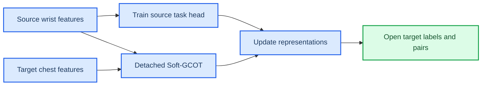

# PAMAP2 源域监督表示学习 MVP：资格通过，当前训练器停止调参

本记录区分两件事：PAMAP2 手腕—胸部同步 IMU 是否具有可对齐结构，以及当前“源域标签 + detached Soft-GCOT”训练器能否无监督地恢复该结构。两者不能混为一谈。

## 📌 固定协议

PAMAP2 是一个同步可穿戴传感数据集：9 位受试者佩戴手腕、胸部与脚踝三套 100 Hz IMU；原始文件逐行提供时间戳、活动标签和传感读数。[^1] 本轮只使用官方 `Protocol/subject101.dat`，并固定以下小规模协议：

| 项目 | 固定值 |
|---|---|
| 源视图 | 主侧手腕 IMU |
| 目标视图 | 胸部 IMU |
| 活动 | lying、sitting、standing、walking、running、cycling |
| 窗口 | 200 个采样点、无重叠 |
| 样本 | 每类 16 个窗口，共 96 对 |
| 特征 | 六通道加速度计与陀螺仪的时域统计量与 log-FFT 频带能量，48 维 |
| 组数 | 4 |

训练时的标签边界如下：

源域活动标签只进入 task-head 的交叉熵；胸部活动标签与同步 pair ID 不传入 trainer 或 Soft-GCOT solver，只在训练后用于 Accuracy、Macro-F1 和 paired retrieval 评价。该设定与“用有标签源佩戴位置适配无标签目标佩戴位置”的真实跨位置活动迁移问题一致。[^2]

## 📊 数据资格上界：通过

为判断数据是否值得继续，先在 48 对同步窗口上使用真实 pair ID 拟合映射，并在其余 48 对窗口上评价。这个诊断是有监督上界，**不是** Soft-GCOT 的无监督结果。

| Held-out 指标 | 随机 | 未对齐 | 正交 Procrustes | Ridge 线性 |
|---|---:|---:|---:|---:|
| Recall@1 | 2.1% | 6.3% | **33.3%** | 31.3% |
| Recall@5 | 10.4% | 37.5% | **81.3%** | **81.3%** |
| 对齐 MSE | — | 0.781 | 0.459 | **0.247** |

两视图的 held-out 成对距离相关性为 `0.789`。正交 Procrustes 大幅提升检索，且与正则化一般线性映射表现接近，说明固定特征下仍存在足够的共享几何；PAMAP2 不应因之前的无监督失败而被判定为“不适合”。

## 📉 当前源域监督 MVP：未通过

当前 MVP 的流程是：MLP encoder 产生 latent → detached full-support Soft-GCOT 得到 `P,Q,R,Pi` → 固定这些 transport evidence 更新 encoder、decoder、prototype 和 source-only task head。它没有让 target 标签或 pair ID 参与训练。

在未改变任何超参数的三个独立初始化中，目标胸部分类准确率如下：

| Seed | Source-only | Fixed Soft-GCOT | Source-supervised representation |
|---:|---:|---:|---:|
| 301 | 19.8% | **27.1%** | 21.9% |
| 302 | **19.8%** | 17.7% | 14.6% |
| 303 | **19.8%** | 9.4% | 1.0% |
| 平均 | **19.8%** | 18.1% | 12.5% |

随后只加入一个结构性诊断：先用源标签预热 task head，再运行原有交替训练。Seed 304 中，source task head 的最终源训练准确率只有 55.2%，目标准确率为 10.4%；这说明后续 alignment/reconstruction updates 又损坏了刚刚建立的源活动语义。该结果不是“再调一个权重”可以解释的积极信号。

同时，learned model 的 paired Recall@1 / Recall@5 为 `0.0% / 4.2%`，低于 fixed Soft-GCOT 的 `2.1% / 13.5%`。因此，当前训练器并未恢复数据资格诊断已经证明存在的共享几何。

## 🛑 语义保留改动也未通过

随后实施了唯一预先定义的结构性改动：同一个 source task head 同时约束对齐前的 `z_x` 与对齐后的 `z_x R^T`。使用全新 Seed 305，结果为：

| 指标 | Fixed Soft-GCOT | Dual-task representation |
|---|---:|---:|
| 目标 Accuracy | **29.2%** | 6.3% |
| 源原生 latent 训练 Accuracy | — | 80.2% |
| 源对齐 latent 训练 Accuracy | — | 49.0% |
| Paired Recall@5 | **13.5%** | 5.2% |

这排除了一个直接解释：不是 source head 完全没有学到活动语义，而是当前无标签 `P,Q,R,Pi` 轮次不能保持该语义跨越对齐坐标系。把 source 分类约束加在两个坐标系中仍无法让 detached transport 产生正确跨视图对应。

## 🛑 当前停止条件

停止继续调以下版本：

- 当前 source-supervised alternating trainer 的损失权重；
- source warm-up 步数；
- dual-task semantic-preservation 版本的更多种子；
- 当前 96 窗口、Subject 101 协议上的更多初始化种子。

理由是问题已定位为模型机制，而不是数据是否可用：当前对齐更新会破坏源任务表征，且没有把已知存在的配对几何恢复出来。继续在同一套损失上做参数扫描会产生选择偏差，不能构成研究进展。

## 🎯 下一项研究问题

PAMAP2 可以保留为第二个主候选数据集，但下一版必须先解决一个明确的机制问题：

> 在不使用目标标签或 pair ID 的前提下，什么额外的跨视图识别信号能够让 `P,Q,R,Pi` 恢复语义正确的对应，而不只是降低无标签几何代价？

下一轮不能再增加一个普通正则项。它应先形成单独的、预注册的模型假设，例如 class-conditional transport 的无标签目标近似、跨视图自监督锚点，或允许使用同步配对的弱监督任务；三者的科学问题与泄漏边界不同，必须先选择其一。开始前需要固定多受试者、跨时间窗口的训练/评价划分；不应立即加入 ROCA、更多数据集或大规模搜索。

[^1]: UCI Machine Learning Repository. *PAMAP2 Physical Activity Monitoring*. https://archive.ics.uci.edu/dataset/231/pamap2%2Bphysical%2Bactivity%2Bmonitoring
[^2]: J. W. Lockhart et al. *Activity Classification Using Unsupervised Domain Transfer from Body Worn Sensors*. arXiv:2304.10643, 2023. https://arxiv.org/abs/2304.10643
