# PAMAP2 Temporal Domain-Adaptation Protocol

## 🎯 Decision

The previous PAMAP2 representation MVP is frozen.  Its 96 synchronized
windows were useful for testing the learning mechanism, but they were not a
valid target-adaptation versus target-test split.  This document records the
replacement protocol that must be used before testing any new task-aware
alignment mechanism.

The protocol uses wrist IMU as the labelled source view and chest IMU as the
target view.  It deliberately separates all windows by their chronological
order within each activity.  No target-test window may enter scaling,
prototype learning, transport, encoder training, source validation, or model
selection.

## 🧭 Partition Contract

```mermaid
flowchart LR
    accTitle: PAMAP2 Temporal Split
    accDescr: Chronological windows within each activity are partitioned into labelled source training and validation, label-free target adaptation, and held-out paired target evaluation.

    raw["Protocol rows per activity"] --> source_train["Source wrist train<br/>labels allowed"]
    source_train --> source_validation["Source wrist validation<br/>labels allowed"]
    source_validation --> target_adaptation["Chest adaptation<br/>features only"]
    target_adaptation --> target_test["Paired chest test<br/>labels and pairs evaluation only"]

    classDef source fill:#dbeafe,stroke:#2563eb,stroke-width:2px,color:#1e3a5f
    classDef target fill:#fef9c3,stroke:#ca8a04,stroke-width:2px,color:#713f12
    classDef evaluation fill:#dcfce7,stroke:#16a34a,stroke-width:2px,color:#14532d

    class source_train,source_validation source
    class target_adaptation target
    class target_test evaluation
```



| Partition | View | Information allowed during fitting | Default windows per activity |
| --- | --- | --- | ---: |
| Source train | wrist | features and activity labels | 8 |
| Source validation | wrist | features and activity labels | 2 |
| Target adaptation | chest | features only | 3 |
| Target test | chest | none | 3 |

The held-out target test is matched to a held-out wrist view solely so that
paired retrieval can be evaluated after all training decisions are final.  Its
pair IDs and target labels are not exposed by the adaptation input.

## 🧪 First Protocol Audit

The audit uses Subject 101, six pre-specified activities, 200-sample
non-overlapping windows, and the fixed allocation above.  It is a baseline
audit only: no OT, Soft-GCOT, target labels, or pair IDs are used during
fitting.

| Metric | Result |
| --- | ---: |
| Source validation accuracy | 75.0% |
| Source-only chest-test accuracy | 50.0% |
| Label-free target-normalized chest-test accuracy | 50.0% |

The source-versus-target gap confirms a nontrivial cross-position task under
the new leakage-safe split.  It does not establish that Soft-GCOT will help;
the result only qualifies the dataset and split for a new, separately defined
model hypothesis.

The exact machine-readable record is
[`pamap2_temporal_protocol_subject101_20260713.json`](../../experiments/results/pamap2_temporal_protocol_subject101_20260713.json).

## 🔒 Boundaries

- Target activity labels remain evaluation-only.
- Synchronous pair IDs remain evaluation-only.
- Target-test features are excluded from all fit-time scalers.
- The existing source-supervised alternating trainer remains stopped; this
  protocol does not revive it or tune its loss weights.
- Any future class-conditional, pseudo-label, or weakly paired method must be
  introduced as a new experiment contract and compared against this exact
  split.

## ▶️ Reproduction

```powershell
python experiments/pamap2/audit_temporal_domain_adaptation_protocol.py `
  --tag pamap2_temporal_protocol_subject101_20260713
```

The raw protocol files are obtained from the official PAMAP2 distribution and
remain outside version control.[^1]

[^1]: UCI Machine Learning Repository. *PAMAP2 Physical Activity Monitoring*. https://archive.ics.uci.edu/dataset/231/pamap2%2Bphysical%2Bactivity%2Bmonitoring
