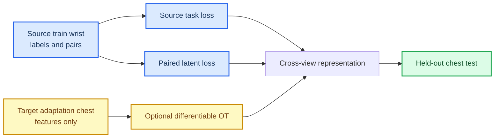

# PAMAP2 weak-pair alignment protocol decision

_Weakly supervised cross-view representation experiment, 2026-07-13_

---

## 🎯 Research question

The previous target-unlabelled task-aware OT MVP had no stable benefit. This
branch changes exactly one information condition: synchronized wrist--chest
windows from the labelled source-training time block are allowed to supervise
a paired latent-representation loss. Target-adaptation features remain
unlabelled, and the chronological target-test block remains isolated until
final evaluation.

> Can source-training synchronized pairs create a transferable cross-view
> representation without accessing target activity labels or target-test pairs?

This is **weakly supervised cross-view adaptation**, not unsupervised
correspondence recovery.

## 🔐 Data-access contract

The allowed and prohibited information is fixed below.

| Information | Permitted use |
| --- | --- |
| Source wrist activity labels | Source task loss and source-validation checkpoint selection |
| Source-training wrist--chest synchronized windows | Row-matched latent pair loss |
| Target-adaptation chest features | Unlabelled reconstruction and optional transport geometry |
| Target-test chest features, labels, and pairs | Final evaluation only |

The temporal split retains 48 source-training, 12 source-validation, 18
target-adaptation, and 18 target-test windows across six activities for
Subject 101. No test row contributes to scaling, representation fitting, or
model selection.[^1]

## 🧪 Frozen comparison

The source-only task baseline, the architecture-matched no-pair control, and
the weak-pair no-OT model use the same MLP dimensions, optimizer,
source-validation selection rule, three seeds, and held-out target test. The
matched no-pair control retains the encoder/decoder architecture, source
warm-up, and target-adaptation reconstruction but receives neither pair loss
nor OT loss. The weak-pair model adds normalized latent matching only between
the 48 synchronized source-training pairs. It does not use target activity
labels.

| Seed | Source-only task | Matched no-pair | Weak pair, no OT | Pair vs matched delta |
| --- | ---: | ---: | ---: | ---: |
| 601 | 50.0% | 11.1% | 83.3% | +72.2 pp |
| 602 | 50.0% | 0.0% | 72.2% | +72.2 pp |
| 603 | 50.0% | 33.3% | 66.7% | +33.3 pp |
| Mean | 50.0% | 14.8% | 74.1% | +59.3 pp |

All three seeds improve over both task-only and the architecture-matched
no-pair control. The
[machine-readable paired summary](../../experiments/results/pamap2_weak_pair_alignment_summary_seeds601_603_20260713.json)
preserves both comparisons and their per-seed deltas.

## ⚠️ OT diagnostic

For seed 601 only, adding the current differentiable group and sample OT
losses to the otherwise successful weak-pair configuration reduced target
accuracy from 83.3% to 5.6%. This is a diagnostic result, not a three-seed
claim. It does show that the present OT objective conflicts with the paired
representation signal rather than improving it.

The branch therefore establishes two separate findings:

- synchronized source-training pairs provide a useful legal cross-view
  learning signal in this protocol;
- the current group/sample transport loss is not ready to be combined with
  that signal.

## 🛑 Decision and next boundary

Freeze the weak-pair no-OT configuration as the positive weak-supervision
baseline. Do not add more seeds or weights to the current OT combination after
its strong negative diagnostic. Any future transport branch must state a new
mechanism for respecting known paired anchors, then compare against this
baseline under the same temporal split.

The immediate research question is now narrower and testable:

> Can an anchor-aware transport objective add value beyond weak paired latent
> alignment without moving or contradicting the known source-training pairs?

[^1]: UCI Machine Learning Repository. *PAMAP2 Physical Activity Monitoring*. https://archive.ics.uci.edu/dataset/231/pamap2%2Bphysical%2Bactivity%2Bmonitoring
