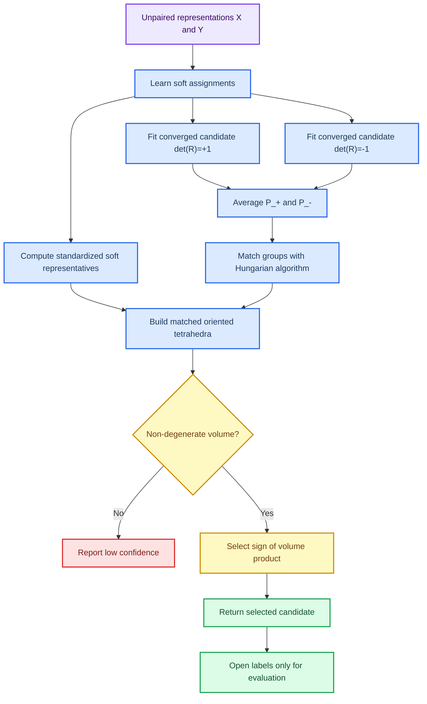

# ROCA-HiWA：用软代表元的有向几何解决无标签对齐中的手性歧义

_研究综述与阶段性论文草稿 · 2026-07-20_

---

## 📋 摘要

无标签表示对齐希望在没有样本一一配对、也没有目标标签的条件下，把两个数据域映射到可比较的几何空间。本文研究猕猴神经表示与运动表示的三维对齐。我们以 Hierarchical Wasserstein Alignment（HiWA）为基线，将软原型、软分配和组条件最优传输引入其中，得到 Soft-GCOT HiWA。实验发现，一个重要但容易被忽略的问题是：连续运动拟合良好并不保证离散方向语义正确。进一步分析表明，三维正交对齐可落在 $O(3)$ 的两个 determinant 分支；两个分支可能具有相近的运输代价和 $R^2$，却对应不同的方向语义。

为此，本文提出 ROCA-HiWA（Representative-Oriented Component-Aware Soft-HiWA）。该方法先在 $\det(R)=+1$ 与 $\det(R)=-1$ 下分别求解 Soft-GCOT 候选，再利用 soft representatives 构成的匹配有向四面体，以 signed volume 的符号在**不使用标签**的情况下选择手性一致的分支。当前最严格的公平验证采用 full support、共享分组和统一 ADMM 收敛判据，在 10 个独立 seed 上全部收敛。Soft-GCOT 相对 Hard HiWA 仅有小幅平均改进；加入 ROCA 后，平均 direction accuracy 从 0.4271 升至 0.4792，平均 movement $R^2$ 从 0.1947 升至 0.3364。ROCA 在其中 8/10 个 seed 选中事后 accuracy 更高的分支，因此现有证据支持其平均收益和几何机制，但不支持“无错 selector”或普适性结论。

**关键词：** 无标签对齐；最优传输；软原型；正交 Procrustes；手性；神经—运动表示

---

## 🎯 1. 问题：什么是无标签对齐，为什么它困难

### 1.1 任务设定

设源域为神经表示

$$
X=\{x_n\}_{n=1}^{N}\subset\mathbb R^d,
$$

目标域为运动表示

$$
Y=\{y_m\}_{m=1}^{M}\subset\mathbb R^d.
$$

两个域中的样本没有已知的一一配对关系。训练时也不使用方向标签；标签只在模型完全确定后，用于评估方向 accuracy。目标是学习全局正交变换 $R$，使变换后的 $RX$ 在整体分布和局部结构上与 $Y$ 相容。

正交约束为

$$
R^\top R=I.
$$

它保留长度和夹角，因此不会通过任意缩放或拉伸来“伪造”对齐。这一限制也意味着：若两个表示的真实关系并非近似正交，任何 HiWA 型方法都可能失效。

### 1.2 为什么不能直接比较样本

如果已知样本对 $(x_n,y_n)$，可以直接最小化 $\sum_n\lVert Rx_n-y_n\rVert^2$。本任务没有这样的配对；即使神经与运动来自同一实验，也不能把同步标签交给 OT 求解器，否则会把答案泄漏给模型。

最优传输（optimal transport, OT）提供了一种替代方式：它不指定“第 $n$ 个神经样本必须匹配第 $m$ 个运动样本”，而是学习一个质量运输方案，表示哪些样本之间更可能对应。HiWA 在此基础上进一步假设数据包含多个局部结构，并在组级和样本级同时对齐。

### 1.3 本文回答的具体问题

本文不把所有项目分支混在一起，而只回答以下三个问题：

1. 软分组能否以可比较、可收敛的方式接入 HiWA？
2. 为什么连续运动 $R^2$ 较好时，方向 accuracy 仍可能很低？
3. 能否在不使用方向标签的前提下，选择正确的三维正交手性分支？

---

## 📚 2. 从 Hard HiWA 到 Soft-GCOT HiWA

### 2.1 Hard HiWA：先分组，再进行两层对齐

Hard HiWA 先把每个域的样本分配到若干个互不重叠的组。它随后学习两类运输：

- **组级运输 $P$：**哪一个源组应主要对应哪一个目标组；
- **样本级运输 $Q_{kl}$：**在源组 $k$ 与目标组 $l$ 的内部，具体哪些样本应相互对应。

每一个组对还可以拥有局部正交变换 $R_{kl}$，同时所有局部变换通过 ADMM 与一个全局变换 $R$ 达成一致。直观地说，局部模型描述“这一对局部结构怎样对齐”，全局模型保证所有局部答案不会互相矛盾。

硬分组的局限是边界样本被迫完全属于某一组。若某个样本介于两种局部结构之间，这种硬决定会放大不稳定性。

### 2.2 Soft-GCOT：以概率而非单一类别描述局部结构

Soft-GCOT 保留 HiWA 的两层 OT 与局部—全局一致性，但把硬标签换为可学习的软分配。对源域，设 $K$ 个原型为 $C^X=\{c_k^X\}_{k=1}^K$。标准化后的样本 $\tilde{x}_n$ 到第 $k$ 个原型的归属强度为

$$
a_{nk}^{X}=
\frac{\exp\left(-\lVert\tilde{x}_n-c_k^X\rVert_2^2/\tau\right)}
{\sum_{h=1}^{K}\exp\left(-\lVert\tilde{x}_n-c_h^X\rVert_2^2/\tau\right)},
\qquad \sum_{k=1}^{K}a_{nk}^{X}=1.
$$

目标域的分配 $b_{ml}^{Y}$ 用相同方式定义。温度 $\tau$ 越小，分配越接近硬分组；$\tau$ 越大，样本可同时属于多个组。

原型通过“重构 + 熵正则 + 尺度约束”学习：

$$
\min_C\quad
\underbrace{\frac1N\sum_{n=1}^N
\left\lVert\tilde{x}_n-\sum_{k=1}^{K}a_{nk}c_k\right\rVert_2^2}_{\text{用原型重构表示}}
-\lambda_H\underbrace{\frac1N\sum_{n=1}^{N}H(a_n)}_{\text{避免过早变硬}}
+\lambda_2\underbrace{\lVert C\rVert_F^2}_{\text{限制原型尺度}},
$$

其中 $H(a_n)=-\sum_k a_{nk}\log a_{nk}$。这个目标不使用方向标签。

### 2.3 软组不是“一个中心”，而是一种加权分布

第 $k$ 个源 soft group 的标准化样本权重为

$$
\alpha_k^X(n)=\frac{a_{nk}^X}{\sum_{r=1}^{N}a_{rk}^X},
$$

从而对应加权经验测度

$$
\mu_k^X=\sum_{n=1}^{N}\alpha_k^X(n)\delta_{x_n}.
$$

这里 $\delta_{x_n}$ 表示集中在 $x_n$ 的单位质量。目标域的 $\beta_l^Y(m)$ 与 $\mu_l^Y$ 同理。**full support** 意味着每个 soft group 都保留全部样本，只是每个样本的权重不同；这是本研究的正式比较设置。

`sparse support` 会只保留高 membership 样本并重新归一化。它能减少计算量，但改变了 $\mu_k^X$、局部耦合和旋转更新，因此是近似方案，不是与 full support 等价的第四种方法。

---

## 🔬 3. Soft-GCOT 的数学模型与求解过程

### 3.1 两层运输计划

组级运输矩阵 $P\in\mathbb R_+^{K\times K}$ 满足均匀组边际：

$$
P\mathbf 1_K=\frac1K\mathbf 1_K,
\qquad
P^\top\mathbf 1_K=\frac1K\mathbf 1_K.
$$

因此 $P_{kl}$ 描述源组 $k$ 与目标组 $l$ 之间应交换多少组级质量。对于每个组对 $(k,l)$，样本级运输矩阵 $Q_{kl}\in\mathbb R_+^{N\times M}$ 满足

$$
Q_{kl}\mathbf1_M=\alpha_k^X,
\qquad
Q_{kl}^\top\mathbf1_N=\beta_l^Y.
$$

这正是软分组与传统硬分组最关键的数学差异：$Q_{kl}$ 的边际由连续权重决定，而不是由离散样本集合决定。

### 3.2 局部代价、全局一致性与概念目标

局部正交变换 $R_{kl}$ 下的点对代价为

$$
C_{kl}^{nm}=\lVert R_{kl}x_n-y_m\rVert_2^2.
$$

样本级 OT 的运输代价记为

$$
D_{kl}=\langle Q_{kl},C_{kl}\rangle.
$$

概念上，Soft-GCOT 同时最小化运输代价、熵正则和局部—全局旋转差异：

$$
\min_{P,\{Q_{kl},R_{kl}\},R}
\sum_{k,l}P_{kl}\langle Q_{kl},C_{kl}\rangle
+\mathcal E(P,\{Q_{kl}\})
+\frac{\mu}{2}\sum_{k,l}\lVert R_{kl}-R+\Lambda_{kl}\rVert_F^2,
$$

其中 $\mathcal E$ 代表组级和样本级的熵正则，$\Lambda_{kl}$ 是 ADMM 对偶变量，且 $R,R_{kl}\in O(d)$。实际实现不直接对整个式子求一次全局最优，而是在下列步骤间交替：

1. 固定旋转，用加熵 Sinkhorn 更新每个 $Q_{kl}$；
2. 用所有局部代价 $D_{kl}$ 更新组级 $P$；
3. 固定运输，用正交 Procrustes 更新每个 $R_{kl}$；
4. 汇总局部旋转，更新全局 $R$ 与 ADMM 对偶变量。

### 3.3 为什么“数值跑完”不等于“可以比较性能”

ADMM 至少需要同时满足全局稳定与局部—全局一致：

$$
r_{\mathrm{global}}=\lVert R^{(t)}-R^{(t-1)}\rVert_F,
\qquad
r_{\mathrm{primal}}=\max_{k,l}\lVert R_{kl}^{(t)}-R^{(t)}\rVert_F.
$$

只有两者都低于预设阈值时，才将运行标记为收敛。否则即使 Sinkhorn 边际误差很小，局部旋转仍可能没有形成一致的全局解；此时的 accuracy 与 $R^2$ 仅是诊断数值，不应被解释为方法优劣。

```mermaid
flowchart LR
    accTitle: Soft-GCOT fitting procedure
    accDescr: Each iteration alternates between local sample transport, group transport, local rotations, and a global consensus rotation. Only converged runs are eligible for performance comparison.

    input["Unpaired X and Y"] --> groups["Learn soft prototypes"]
    groups --> local_ot["Update weighted local Q_kl"]
    local_ot --> group_ot["Update group transport P"]
    group_ot --> local_rot["Update local rotations R_kl"]
    local_rot --> global_rot["Update global rotation R"]
    global_rot --> check{"Both residuals small?"}
    check -->|"No"| local_ot
    check -->|"Yes"| candidate["Converged Soft-GCOT candidate"]

    classDef data fill:#ede9fe,stroke:#7c3aed,stroke-width:2px,color:#3b0764
    classDef process fill:#dbeafe,stroke:#2563eb,stroke-width:2px,color:#1e3a5f
    classDef decision fill:#fef9c3,stroke:#ca8a04,stroke-width:2px,color:#713f12
    classDef output fill:#dcfce7,stroke:#16a34a,stroke-width:2px,color:#14532d

    class input data
    class groups,local_ot,group_ot,local_rot,global_rot process
    class check decision
    class candidate output
```



---

## 💡 4. ROCA：用无标签几何选择正确的手性分支

### 4.1 ROCA 的目标：它解决的不是“再优化一次 OT”

ROCA 是 **Soft-GCOT 拟合之后的无标签模型选择步骤**。它不改变 soft prototype 的学习目标，不修改 Sinkhorn OT，也不把方向标签输入训练过程。它要解决的是一个更具体的问题：当同一份无标签数据允许两个收敛的正交候选时，应该选择哪一个？

设两个 determinant-constrained Soft-GCOT 解为

$$
\Theta_s=\left(R_s,\{R_{kl,s}\},P_s,\{Q_{kl,s}\}\right),
\qquad s\in\{-1,+1\}.
$$

如果方向标签可用，理想但不允许的选择规则是

$$
s_{\mathrm{oracle}}=\arg\max_{s\in\{-1,+1\}}
\operatorname{Accuracy}(R_sX,Y;\text{direction labels}).
$$

该规则直接使用测试语义，因而造成标签泄漏，不能作为无监督方法。ROCA 的目标是构造一个只依赖于

$$
(X,Y,A^X,A^Y,P_{-1},P_{+1})
$$

的选择函数 $g$，输出 $\hat{s}=g(\cdot)$，使其尽可能与不可见的 $s_{\mathrm{oracle}}$ 一致。换言之，ROCA 不声称“让两个候选都变得更好”；它试图在已有候选中，**用可观察的几何结构恢复不可观察的手性信息**。

其设计目标有三点：

1. **无标签性：**选择时不访问方向类别、accuracy、$R^2$ 或任何目标行为监督；
2. **候选对称性：**两个 determinant 候选以相同协议拟合，选择规则不能预设偏好 $+1$ 或 $-1$；
3. **几何可解释性：**每一步都应对应一个可检查的对象：软代表元、组匹配、signed volume 和退化状态。

### 4.2 为什么 Soft-GCOT 本身不能消除这类歧义

在三维空间中，正交群为

$$
O(3)=\{R\in\mathbb R^{3\times3}\mid R^\top R=I\}.
$$

它分为两个互不连通的部分：

- $\det(R)=+1$：保持右手/左手坐标关系的纯旋转，即 $SO(3)$；
- $\det(R)=-1$：包含反射，会改变坐标系手性。

Soft-GCOT 的运输代价主要由欧氏距离组成。欧氏距离能衡量两个构型是否接近，却不能单独表达“这是原构型还是它的镜像”。因此，若数据中存在近似镜像的结构，$\det(R)=+1$ 与 $\det(R)=-1$ 的候选可能有相近的运输目标和连续 $R^2$。但方向语义对反射敏感：一个镜像映射可以使几何点云看起来合理，却把方向类别映射到错误的扇区。

这不是一个“多跑几轮迭代”能够自动解决的问题。历史诊断中，$R^2=0.6031$ 的候选 direction accuracy 只有 $0.4093$，而另一个候选 accuracy 为 $0.5746$、$R^2=0.5511$。因此，需要一个区别于运输目标的、无标签的分支选择准则。

### 4.3 第一步：在同一优化问题下显式构造双分支候选

对 Procrustes 更新中的矩阵 $M=U\Sigma V^\top$，对目标 determinant $s\in\{-1,+1\}$ 定义

$$
R_s=UD_sV^\top,
\qquad
D_s=\operatorname{diag}(1,\ldots,1,s\det(UV^\top)).
$$

这保证

$$
R_s^\top R_s=I,
\qquad
\det(R_s)=s.
$$

在本实现中，该约束同时作用于局部 $R_{kl,s}$ 和全局 $R_s$ 的 Procrustes 更新。除了 determinant sign 外，两个候选使用相同的数据、软分配、full-support 设置、迭代预算和收敛判据。这样，后续的差异可以归因于手性分支，而不是由不同的训练条件造成。

双候选不是把一个候选当作基线、另一个当作补丁；它是把原本隐式、易受初始化影响的 $O(3)$ 分支选择显式化。只有当两个候选都通过收敛资格时，ROCA 才有一个公平的选择问题。

### 4.4 第二步：从软分配得到稳定的组级几何锚点

对源域和目标域分别按坐标标准化，随后计算代表元：

$$
\tilde{x}_n=\frac{x_n-\bar{x}}{\operatorname{std}(X)},
\qquad
\tilde{y}_m=\frac{y_m-\bar{y}}{\operatorname{std}(Y)},
$$

$$
r_k^X=\frac{\sum_n a_{nk}^X\tilde{x}_n}{\sum_n a_{nk}^X},
\qquad
r_l^Y=\frac{\sum_m b_{ml}^Y\tilde{y}_m}{\sum_m b_{ml}^Y}.
$$

这些 $r_k^X,r_l^Y$ 不是用标签计算的类别中心，也不等同于一个 hard cluster 的均值。每个代表元由所有样本按 membership 加权形成：边界样本仍以较小权重贡献，因而它是 soft group 的组级几何锚点。正是这一点把 soft prototype 的作用从“可能改善分组”延伸为“提供可用于手性判断的连续结构”。

### 4.5 第三步：用运输质量匹配代表元，而不是用编号或标签匹配

原型的编号在两个域之间没有语义：源域的第 1 个原型并不天然对应目标域的第 1 个原型。直接按编号构造四面体会引入任意性；使用方向标签去匹配则违反无标签要求。

ROCA 使用两个候选的组级运输矩阵来定义与分支无关的匹配证据：

$$
\bar P=\frac{P_{-1}+P_{+1}}{2}.
$$

然后求解一对一匹配

$$
\pi=\arg\max_{\pi\in\mathfrak S_K}
\sum_{k=1}^{K}\bar P_{k,\pi(k)}
=\operatorname{Hungarian}(-\bar P),
$$

其中 $\mathfrak S_K$ 是 $K$ 个组的所有置换。平均 $P_{-1}$ 与 $P_{+1}$ 的目的，是不让 matching 因某一个待选分支而先入为主；Hungarian 匹配的目的，是把 OT 已经认为运输质量大的组对用作共同的几何对应关系。

### 4.6 第四步：以有向体积作为手性代理量

在 $d=3,K=4$ 时，四个不共面的代表元构成一个四面体。选第一个代表元为基点，定义

$$
X_{\mathrm{rep}}=
\left[r_2^X-r_1^X,\ r_3^X-r_1^X,\ r_4^X-r_1^X\right],
$$

$$
Y_{\mathrm{rep}}=
\left[r_{\pi(2)}^Y-r_{\pi(1)}^Y,\ r_{\pi(3)}^Y-r_{\pi(1)}^Y,\ r_{\pi(4)}^Y-r_{\pi(1)}^Y\right].
$$

其有向体积分别为

$$
v_X=\det(X_{\mathrm{rep}}),
\qquad v_Y=\det(Y_{\mathrm{rep}}).
$$

关键恒等式是：对任意 $3\times3$ 正交变换 $R$，

$$
\det(RX_{\mathrm{rep}})=\det(R)\det(X_{\mathrm{rep}}).
$$

若匹配后的目标代表元可由某个候选 $R_s$ 近似得到，即 $Y_{\mathrm{rep}}\approx R_sX_{\mathrm{rep}}$，则

$$
\operatorname{sign}(v_Xv_Y)
\approx
\operatorname{sign}\left\{\det(X_{\mathrm{rep}})\det(R_s)\det(X_{\mathrm{rep}})\right\}
=\det(R_s).
$$

这就是 ROCA 的目标与公式之间的直接联系：有向体积乘积的符号是所需 determinant sign 的无标签代理。最终规则为

$$
\boxed{
\hat{s}=\operatorname{sign}(v_Xv_Y)
=\operatorname{sign}\left\{\det(X_{\mathrm{rep}})\det(Y_{\mathrm{rep}})\right\}
}
$$

并选择候选 $\Theta_{\hat{s}}$。同号选择 $+1$，异号选择 $-1$。这个规则判断的是跨域结构的**相对手性**，而不是任何一个域本身“应当”有哪一种手性。

### 4.7 完整算法、输入输出与标签隔离

**输入：**无标签表示 $X,Y$；软分配 $A^X,A^Y$；两个收敛的 determinant-constrained Soft-GCOT 候选；$K=4,d=3$。

**输出：**选择符号 $\hat{s}$、相应全局旋转 $R_{\hat{s}}$、对应的组级/样本级运输方案，以及几何诊断量 $v_X,v_Y,v_Xv_Y$。

```text
1. 从 X、Y 学习或读取 A^X、A^Y。                         # 无标签
2. 对 s ∈ {-1,+1}，拟合相同设置下的 Soft-GCOT 候选 Θ_s。  # 无标签
3. 仅保留通过 ADMM 收敛资格的候选。                        # 数值资格
4. 计算 P_bar = (P_-1 + P_+1) / 2。                       # 无标签
5. 用 Hungarian(-P_bar) 得到代表元匹配 π。                # 无标签
6. 在标准化空间计算 r^X、r^Y、X_rep、Y_rep。              # 无标签
7. 若几何退化，报告低置信并停止自动选择。                  # 无标签
8. 否则令 s_hat = sign(det(X_rep) det(Y_rep))，选 Θ_s_hat。# 无标签
9. 选择完成后才计算 direction accuracy、R2 等评价指标。   # 标签仅在这里打开
```



### 4.8 退化、失败模式与适用边界

有向体积的前提是四面体确实具有可分辨的三维体积。理想的退化规则为

$$
|v_X|<\epsilon\quad\text{或}\quad |v_Y|<\epsilon.
$$

当前实现以乘积阈值

$$
|v_Xv_Y|\le10^{-10}
$$

触发数值退化异常。近共面时，极小的代表元扰动即可翻转体积符号，自动选择没有可信几何依据。标准化会改变体积尺度，因而“标准化前后的退化定义”仍需进一步统一。

还应区分三种不同的失败来源：

| 失败来源 | 含义 | ROCA 能否解决 |
| --- | --- | --- |
| Soft-GCOT 未收敛 | 局部与全局旋转没有达成一致 | 不能；应先修复或拒绝该运行 |
| 代表元退化/错配 | 软组无法提供稳定的有向几何 | 不能可靠解决；应报告低置信 |
| 两分支语义不同 | 两个候选都收敛，但只有一个手性正确 | 这正是 ROCA 要解决的问题 |

因此，ROCA 不是通用性能增强模块，也不能挽救不收敛或不适用的对齐任务。它是一个有明确前提的、基于软组几何的无标签 determinant selector。

---

## 📊 5. 实验设计与结果

### 5.1 为什么主结果采用这一协议

早期实验验证了想法，但并非全部满足当前的公平比较要求。为避免把不同分组、不同 support 或未收敛运行的差异误归因于方法，主结果使用以下冻结协议：

| 项目 | 主结果中的固定做法 |
| --- | --- |
| 数据与随机性 | 同一神经—运动任务；seeds 80–89 |
| 分组公平性 | Hard 标签由最终 soft assignments 的 `argmax` 导出 |
| 支持集 | Soft-GCOT 与 ROCA 两个候选均使用 full support |
| 收敛资格 | global 与 primal ADMM residual 均达阈值 |
| 评价隔离 | 方向标签仅在分支选定后计算 accuracy 与 $R^2$ |

三种方法在该协议下均为 10/10 收敛。[实验记录](Soft-GCOT_HiWA_full-support_ROCA公平验证_2026-07-12.md) 与原始 JSON 结果均已保存在仓库。

### 5.2 主结果

| 方法 | direction accuracy | movement $R^2$ | 结论 |
| --- | ---: | ---: | --- |
| Hard HiWA | 0.4188 | 0.1908 | 硬分组基线 |
| Soft-GCOT HiWA | 0.4271 | 0.1947 | 小幅平均提升 |
| Soft-GCOT HiWA + ROCA | 0.4792 | 0.3364 | 本协议下的最高平均值 |

Soft-GCOT 相对 Hard HiWA 的配对平均变化为：accuracy $+0.0083$，bootstrap 95% CI 为 $[+0.0042,+0.0135]$；$R^2$ 为 $+0.0039$，CI 为 $[+0.0025,+0.0052]$。这说明软分组在此协议下可比较，并且有小幅平均收益；它不是一个足以单独解释大幅性能跃升的模块。

ROCA 相对 Soft-GCOT 的 accuracy 平均变化为 $+0.0604$（CI $[+0.0083,+0.1271]$），$R^2$ 平均变化为 $+0.1456$（CI $[+0.0033,+0.4287]$）。然而 accuracy 的中位数变化只有 $+0.0104$，表明均值会受少数大提升 seed 影响。更直接地，ROCA 在 8/10 个 seed 中选择了事后 accuracy 较高的分支，在 seed 85、86 中选择错误。因此主结果只能表述为：**ROCA 在当前协议下呈现平均增益，但尚不是可靠到无错的无标签 branch selector。**

### 5.3 机制验证：支持解释，但不替代主表

下表来自较早的机制实验。它们对解释 ROCA 有价值，但部分运行早于统一的 full-support 与 ADMM 收敛协议，所以不与 5.2 的主结果混合统计。

| 实验 | 结果 | 支持的解释 |
| --- | --- | --- |
| 早期真实数据确认 | seeds 50–69 中 20/20 选中高 accuracy 候选 | 代表元规则在旧管线中稳定工作 |
| 单轴坐标翻转 | seeds 70–79、三种翻转下 30/30 符合预期 determinant | 规则不只是固定选择 $+1$ 或 $-1$ |
| 合成真值 | 1600 个条件中的 determinant recovery 为 0.995 | 有向体积机制可恢复已知手性 |
| 近退化结构 | 失败集中于 learned-soft + near-degenerate | 代表元质量与几何退化是关键边界 |

这些结果支持“ROCA 为什么可能有效”，但不支持把早期 20/20 直接写成当前方法的最终、普适准确率。

### 5.4 已经排除的简单解释

- 随机初始化的软分组不稳定；warm start 改善稳定性，但不是 ROCA 的核心贡献。
- 温度扫描、温度退火和 pure annealing 没有稳定提高 direction accuracy。
- 仅依据双向运输目标选择 determinant 分支并不可靠。
- sparse-support 结果不能反驳 full-support 方法，因为两者优化的加权测度不同。

---

## 🧪 6. 外部数据：数据如何构造、做了什么，以及学到了什么

主数据验证的是“同一实验中的神经表示与运动表示能否进行无标签正交对齐”。为了知道这一结论的适用范围，我们另外接入了三个性质不同的数据问题。它们不是把同一个实验机械重复三次：每个数据集检验当前方法的一项不同前提。

| 数据集 | 数据模态与问题 | 检验的前提 | 当前定位 |
| --- | --- | --- | --- |
| Indy–Loco | 两个记录日的神经活动与速度解码 | 跨 session 神经漂移是否可由无标签 OT 修复 | 明确的负向适用性结果 |
| PBMC Multiome | 同一批细胞的 RNA 与 ATAC | 两种生物组学模态能否在共同特征空间中近似正交对齐 | 已完成最小验证，未形成主证据 |
| Paderborn 轴承 | 不同转速下的振动信号与故障类别 | 无标签对齐能否处理工业工况变化 | 数据流程已建立，当前任务设计不合格 |

以下结果的共同原则是：目标标签、目标行为或成对 ID 只在最后的评价阶段读取；若 OT/ADMM 未收敛，则下游分数只作诊断，不作性能结论。

### 6.1 Indy–Loco：跨记录日的神经 decoder transfer

#### 数据集是什么

Indy–Loco 是猕猴到达运动的公开神经电生理数据。每个 recording session 同时包含排序后的 spike timestamps，以及手指、光标和目标的位置。它提供了一个比主任务更严格的场景：源日和目标日的神经元集合、记录状态和神经表征都会变化，而目标日的行为变量在适配阶段不可用。

本次 pilot 使用 `indy_20160915_01` 作为源 session，`indy_20160921_01` 作为目标 session。原始 session 分别包含 7,621 与 7,203 个时间 bin；以 50 ms 分箱、平滑并剔除平均发放率低于 0.5 Hz 的 unit 后，分别保留 223 与 220 个神经元。光标位置被转换为二维速度，但该速度与 spike train 在数据适配阶段被严格分开保存。[数据与协议审计](Indy_Loco_cross_session_pilot_2026-07-14.md)

#### 我们如何使用它

这个实验不是让 OT 直接看到神经—速度配对，而是一个 **source-trained decoder 的无标签目标域适配** 问题：

1. 源日与目标日神经活动各自标准化，并分别降到 8 维 PCA 表示；
2. 用源日神经 latent state 到二维 cursor velocity 训练 ridge decoder；
3. 对齐阶段只输入源日神经表示和目标日最早 60% 的神经 bin；目标日速度、轨迹和评分均不进入 OT；
4. 对齐后，将已训练的源 decoder 用于目标日最后 40% 的神经 bin，再打开目标速度计算 $R^2$ 和八方向 accuracy；
5. 每个分区均匀抽取 192 个 bin，使用 4 个 learned prototypes、temperature 0.5 与 full support。

target-supervised ridge decoder 只作为“目标日标签全部可用时的上界”诊断，不参与任何参数选择，也不是无监督基线。

#### 做了什么实验，结果是什么

固定 30 次外层迭代的三个 seed 结果如下：

| Seed | Source-only $R^2$ | Hard HiWA $R^2$ | Soft-GCOT $R^2$ | Target-supervised 上界 $R^2$ | Soft-GCOT 收敛？ |
| ---: | ---: | ---: | ---: | ---: | --- |
| 701 | -0.1110 | -0.0374 | 0.0176 | 0.1277 | 否 |
| 702 | -0.1110 | -0.1607 | -0.0723 | 0.1277 | 否 |
| 703 | -0.1110 | -0.2848 | 0.1174 | 0.1277 | 否 |
| 平均 | -0.1110 | -0.1610 | 0.0209 | 0.1277 | 0/3 |

数值上，Soft-GCOT 在三个 seed 中都高于 source-only，平均八方向 accuracy 也从 9.4% 升至 14.2%。但这不是成功结果：三个最终 primal residual 分别为 4.066、3.442、3.741，而配置的收敛阈值为 0.1。也就是说，局部旋转并未与全局旋转达成一致；此时的下游数值不能被解释为可复现的 decoder 改进。

为理解失败来自哪里，在 seed 703 上进行了若干预先固定的机制探针：

| 探针 | 想检验的机制 | 最终 primal residual | $R^2$ | 结论 |
| --- | --- | ---: | ---: | --- |
| Frozen uniform consensus，100 轮 | 更多迭代是否足够 | 3.1246 | 0.0486 | 不收敛 |
| transport-weighted consensus，100 轮 | 按当前 $P$ 加权局部旋转是否更合理 | 3.0837 | 0.0579 | 不收敛 |
| causal temporal signature | 无标签时序动态能否提供对应信号 | 3.5239 | 0.0666 | 不收敛 |
| source-supervised state anchor | 源侧任务状态能否锚定目标对齐 | 3.3020 | -0.1123 | 不收敛 |
| GlobalSoftGCOT | 去除局部旋转 ADMM 共识是否足够 | OT 边际误差 0.01497 | -0.0947 | 未合格 |

此外，还做了一个更接近主任务的同 session 检查：把同一 session 的神经 rates 与 cursor velocity 看作两份无配对分布，OT 期间隐藏时间戳，之后才评估。96 个 held-out bin 上，no-alignment、hard global OT、soft global OT 的 $R^2$ 分别为 -0.8030、-0.6772、-0.6837；即使使用显式 paired Procrustes oracle，$R^2$ 仍为 -0.2818。既然带配对的线性正交 oracle 都不成立，就不能期待无配对 OT 通过调参修复这一几何失配。

**Indy–Loco 的结论：**它验证了一个真实的跨日 decoding 缺口——source-only 为负、标签充分的目标 decoder 为正——但现有 Soft-GCOT/HiWA 的正交与局部共识假设不足以填补该缺口。该数据集是当前方法的适用边界，而不是第二个成功数据集。

### 6.2 PBMC Multiome：RNA 与 ATAC 的跨模态配对检索

#### 数据集是什么

PBMC Multiome 记录同一批外周血单个核细胞的两种测量：RNA 表达与 ATAC 染色质可及性。现有本地文件中，RNA 矩阵大小为 $9{,}631\times29{,}095$，ATAC 矩阵大小为 $9{,}631\times107{,}194$。两份文件有相同 cell IDs 和 `cell_type` 注释，但它们在对齐阶段均被屏蔽；cell ID 仅用于最终检验“一个 RNA 细胞能否检索回同一细胞的 ATAC”，cell type 仅用于额外的 transfer 评价。

这个数据集检验的是：两种高维生物组学测量能否经无监督共同表示后，满足近似正交对齐的前提。它比神经—运动任务更难，因为两种模态的测量机制本来就不同。

#### 我们如何构造共同表示

原始文件不提供可直接比较的 `X_pca`、`X_lsi`、`X_glue` 或 gene activity embedding。故我们没有分别做 RNA-SVD 与 ATAC-SVD 后直接对齐；那样会得到两个无共同坐标含义的空间。实际构造为：

1. 从 RNA 选择 2,000 个高变基因作为共享基因轴；
2. 将 ATAC peak 与同一染色体的 gene body $\pm2$ kb 区间相交，并把相关 peak 的可及性聚合为 gene activity；共得到 13,793 条 peak–gene 边；
3. 将 RNA 表达和 ATAC gene activity 拼接后共同拟合 20 维 PCA；
4. 在拼接后的 PCA 坐标上共同拟合一个 `StandardScaler`，避免分别缩放重新改变两个模态的坐标系；
5. 从共同细胞中确定性抽取 96 个细胞（seed 120），运行同 prototype Hard HiWA 与 full-support Fixed Soft-GCOT：4 组、既有温度路径和 Hard warm start。

该构造过程没有用 cell ID 或 cell type。

#### 做了什么实验，结果是什么

评价指标是 paired-cell retrieval：对每个 RNA 细胞，在对齐后的 ATAC 表示中寻找同一 cell ID。96 个细胞时随机检索的期望为 $R@1=1/96=0.0104$、$R@5=5/96=0.0521$。

| 方法 | 形式收敛 | 迭代数 | $R@1$ | $R@5$ | cell-type transfer | 运行时间 |
| --- | --- | ---: | ---: | ---: | ---: | ---: |
| 同 prototype Hard HiWA | 是 | 63 | 0.0000 | 0.0313 | 0.0729 | 7.31 s |
| Full-support Fixed Soft-GCOT | 是 | 54 | 0.0208 | 0.0417 | 0.0729 | 19.47 s |

Soft-GCOT 在 top-1 检索中找到 2/96 个正确配对，高于随机期望的 1/96；但 $R@5$ 低于随机期望，且 cell-type transfer 没有改善。这不构成稳定、可解释的跨模态对齐信号。

**PBMC 的结论：**共享 gene-activity 特征空间可以在无标签条件下构造，且两种方法均形式收敛；但 RNA–ATAC 的关系在这个最小实验中不表现为当前 HiWA 所假设的近似正交几何。因此该分支在此停止：不增加 seed、不调温度、不加入 ROCA，也不以它评价 Soft-GCOT 优劣。[最小验证记录](PBMC共同表示最小验证_2026-07-12.md)

### 6.3 Paderborn：跨转速轴承故障对齐

#### 数据集是什么

Paderborn 轴承数据记录不同工况下的同步振动、电流、转速、扭矩、径向载荷和温度；每个轴承状态与工况有 20 次、每次 4 秒的测量。此处使用三类状态：健康（K001/K002）、真实外圈损伤（KA04/KA15）和真实内圈损伤（KI04/KI14）。它提供一个与神经数据完全不同的工业检验：能否在源工况上训练故障分类器，在目标工况仅做无标签对齐后再评价？

#### 我们如何使用它

源工况为 `N15_M07_F10`（1500 rpm、0.7 Nm、1000 N），目标工况为 `N09_M07_F10`（900 rpm、0.7 Nm、1000 N）。每个域构造 96 个样本：每类取 4 条记录，每条记录切成 8 个不重叠窗口。每个窗口的 `vibration_1` 信号被转换为 log-FFT 幅值谱、压缩为 256 个频带均值，再在两个域合并后标准化并降到 20 维 PCA。

分组与对齐使用 4 个无监督组、同 prototype Hard HiWA 与 full-support Fixed Soft-GCOT。目标标签不参与特征构造、分组、对齐、参数选择或分支选择；它们只在最终的故障分类 accuracy 中读取。

#### 为什么我们做了两个任务设计

单纯报告一个跨转速分数会掩盖任务是否真的需要对齐，因此比较了两个必要诊断：

| 任务设计 | 未对齐 accuracy | Hard HiWA | Fixed Soft-GCOT | 结果含义 |
| --- | ---: | ---: | ---: | --- |
| 同一实体轴承，仅转速改变 | 0.9375 | 0.3333 | 0.3229（未收敛） | 原始 FFT 已能诊断，OT 没有必要 |
| 不同实体轴承，同时转速改变 | 0.3333 | 0.3333 | 0.3333（未收敛） | 落在三分类随机水平，任务混入实体差异 |

第二种设计中 Hard HiWA 在 31 次迭代后满足收敛条件（global residual 0.0937，primal residual 0.0738），但下游仍为随机水平；Soft-GCOT 达到 80 次迭代上限仍未形成共识（global/primal residual 约为 2.0）。

**Paderborn 的结论：**数据读取、信号字段、无标签特征构造和评价协议都已打通，但当前每个类别只放入一个源实体和一个目标实体。这个设计要么太容易、根本不需对齐，要么把实体泛化与工况迁移混在一起，不能作为方法优劣证据。后续若继续，必须预先定义实体级划分：每个类别在源域和目标域都纳入多个不同实体，并按实体严格切分。[最小验证记录](Paderborn跨工况最小验证_2026-07-12.md)

### 6.4 外部数据的总体结论

三个数据集没有提供可替代主结果的第二个“成功分数”，但它们给出了更有用的研究约束：

- Indy–Loco 表明当前方法不能仅凭无配对神经几何解决跨 session decoder drift；
- PBMC 表明共同特征空间可构造，但跨模态 RNA–ATAC 关系不满足当前正交对齐假设；
- Paderborn 表明在开始性能比较前，必须先保证任务同时具有真实的 domain shift、足够的类内实体变化和必要的对齐需求。

因此，外部实验并非“没有结果”，而是系统地排除了三类不应被误报为泛化成功的情形。这些边界反过来限定了 ROCA 的适用前提：ROCA 只能在 Soft-GCOT 已经得到两个可比较、已收敛候选时处理手性分支，不能修复表示本身不可正交对齐、任务设计不可识别或 ADMM 未收敛的问题。

---

## ⚠️ 7. 讨论、局限与下一步

### 7.1 当前可支持的结论

1. Soft-GCOT HiWA 已将软原型、软分配和组条件 OT 接入 HiWA，并在 full-support、统一残差协议下形成可比较基线。
2. 在当前神经—运动对齐任务中，连续几何拟合与离散方向语义可分离；$O(3)$ 的 determinant 歧义是一个重要不稳定来源。
3. ROCA 提供了一个明确、可解释且无标签的选择机制：由匹配 soft representatives 的有向体积确定 determinant 分支。
4. 公平的 10-seed 验证显示 ROCA 有平均增益，但也显示 selector 会犯错。

### 7.2 当前不能支持的结论

- Soft-GCOT 并未被证明在所有数据或所有 seed 上显著优于 Hard HiWA。
- ROCA 未被证明是无错、普适或高维通用的分支选择器。
- Indy–Loco 的未收敛数值不能被描述为成功的跨 session transfer。
- sparse support 不能作为 full support 的等价替代。

### 7.3 下一步研究

1. 固定 full support、共享分组和收敛门槛，扩展预先声明的多 seed 主对照，并逐 seed 保存残差、运输边际和 branch choice。
2. 用独立数据校准 ROCA 的低置信度判据；将“检测退化”与“保证选择正确”严格区分。
3. 为高维表示或 $K\neq4$ 设计新的有向结构规则，并先用已知真值的合成实验验证。
4. 若继续跨 session 神经迁移，应先建立能使对应关系可识别的新表示/自监督机制，而非继续对当前 OT 结构做参数扫描。

---

## 🔗 8. 可复现材料与关联记录

| 内容 | 位置 |
| --- | --- |
| ROCA 完整公式与伪代码 | [ROCA-HiWA 方法公式与算法流程](ROCA-HiWA方法公式与算法流程.md) |
| 公平的 full-support 主验证 | [Soft-GCOT HiWA full-support ROCA 公平验证](Soft-GCOT_HiWA_full-support_ROCA公平验证_2026-07-12.md) |
| Soft-GCOT 基线与收敛审计 | [TACO-faithful Soft-GCOT HiWA audit](TACO-faithful_Soft-GCOT_HiWA_audit_2026-07-11.md) |
| 历史结果与证据边界 | [Soft-GCOT 与 ROCA 成果总账](既有Soft-GCOT与ROCA成果总账-2026-07-11.md) |
| Indy–Loco 适用性审计 | [Indy–Loco cross-session pilot](Indy_Loco_cross_session_pilot_2026-07-14.md) |
| PBMC 最小验证状态 | [PBMC 共同表示审计](PBMC共同表示审计_2026-07-12.md) |
| Paderborn 最小验证状态 | [Paderborn 跨工况最小验证](Paderborn跨工况最小验证_2026-07-12.md) |

_本文汇总内部实验记录；所有数值结论均以文中明确的实验协议、随机 seed 范围和收敛资格为准。_
