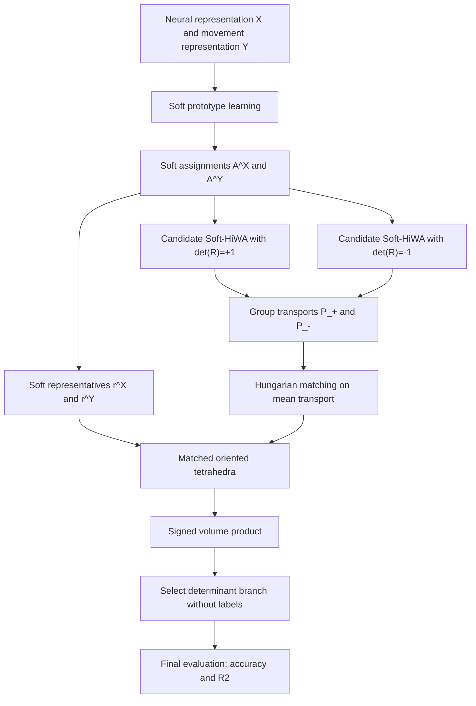

# ROCA-HiWA 方法公式与算法流程

## 1. 从 Soft-Prototype HiWA 到 ROCA-HiWA

最初的想法是参考 TACO 的 soft prototype / soft assignment / group-conditioned OT 思想，把 HiWA 的硬分组改成软分组。

早期实验说明：

- TACO 式 soft prototypes 可以产生有结构的自分组；
- Soft-Prototype HiWA 可以实现；
- soft random init 不稳定；
- soft warm start 更稳定，但最初没有明显提高 direction accuracy；
- temperature annealing 和 pure annealing 提高不了 direction accuracy；
- seed 7 诊断显示，连续运动几何 $R^2$ 可以较高，但离散方向 accuracy 可以很低。

这说明连续几何对齐和离散方向语义不是同一个问题。

后续诊断发现，HiWA / Soft-HiWA 实际优化的正交矩阵属于 $O(3)$，而不是只属于 $SO(3)$。于是问题从“soft assignment 是否直接提高 accuracy”转化为：

> soft cluster representatives 能不能提供一种无标签的几何手性信号，用于选择正确的 $O(3)$ determinant branch？

这就是 ROCA-HiWA 的核心。

## 2. $O(3)$ 与 $SO(3)$

正交群：

$$
O(3)=\{R:R^\top R=I\}
$$

特殊正交群：

$$
SO(3)=\{R:R^\top R=I,\det(R)=+1\}
$$

其中：

- $\det(R)=+1$ 是 orientation-preserving，也就是保持三维空间手性的纯旋转；
- $\det(R)=-1$ 包含 reflection，也就是改变手性的正交变换。

如果算法没有限制 determinant，它可能在两个分支之间随机落点，导致 direction accuracy 不稳定。

## 3. Determinant-constrained Procrustes

设 Procrustes 更新中的矩阵为：

$$
M=U\Sigma V^\top.
$$

对于 $s\in\{-1,+1\}$，构造：

$$
R_s=UD_sV^\top.
$$

其中：

$$
D_s=\operatorname{diag}(1,\ldots,1,s\det(UV^\top)).
$$

这样得到的 $R_s$ 满足：

$$
\det(R_s)=s.
$$

当前代码中，`SoftHiWA(determinant_sign=s)` 会在全局和局部 Procrustes 更新中使用这个约束，从而分别生成 $\det(R)=+1$ 和 $\det(R)=-1$ 两个候选。

## 4. Soft cluster representatives

源域 soft assignment 记为 $A^X=(a_{nk}^X)$，目标域 soft assignment 记为 $A^Y=(a_{ml}^Y)$。

源域代表点：

$$
r_k^X= \frac{\sum_n a_{nk}^Xx_n}
{\sum_n a_{nk}^X}.
$$

目标域代表点：

$$
r_l^Y= \frac{\sum_m a_{ml}^Yy_m}
{\sum_m a_{ml}^Y}.
$$

当前代码在计算 representatives 前会对每个域做逐坐标标准化：

$$
\tilde{x}_n=\frac{x_n-\bar{x}}{\operatorname{std}(X)}.
$$

然后在标准化空间中计算 representatives。

这些 representatives 是 TACO 式 soft prototype / soft assignment 思想在 HiWA 中的迁移：它们不是硬簇中心，而是由所有点按 soft membership 加权形成的组级几何锚点。

## 5. Group matching 与代码一致性

当前代码位置：

`Experiments/hiwa_python_reproduction/scripts/run_component_aware.py`

函数：

`_representative_orientation_selector`

当前 matching 不是直接用 representative distance，而是：

1. 对两个 determinant 候选分别得到 group transport matrix $P_{-1}$ 和 $P_{+1}$；
2. 计算平均 transport：

$$
\bar{P}=\frac{P_{-1}+P_{+1}}{2};
$$

3. 对 $-\bar{P}$ 做 Hungarian matching，也就是最大化 transport mass：

$$
\pi=\arg\max_{\pi}\sum_k \bar{P}_{k,\pi(k)}.
$$

因此公式必须写成：

$$
\pi=\operatorname{Hungarian}(-\bar{P}).
$$

这里不使用方向标签、accuracy 或 $R^2$。

## 6. 有向四面体选择规则

在 $K=4,d=3$ 时，四个 representatives 构成一个四面体。

源域有向四面体矩阵：

$$
X_{\mathrm{rep}} = [r_2^X-r_1^X,r_3^X-r_1^X,r_4^X-r_1^X].
$$

匹配后的目标域有向四面体矩阵：

$$
Y_{\mathrm{rep}} = [r_{\pi(2)}^Y-r_{\pi(1)}^Y, r_{\pi(3)}^Y-r_{\pi(1)}^Y, r_{\pi(4)}^Y-r_{\pi(1)}^Y].
$$

选择 determinant：

$$
\hat{s} = \operatorname{sign} \left( \det(X_{\mathrm{rep}}) \det(Y_{\mathrm{rep}}) \right).
$$

解释：

- 如果两个 matched 四面体手性相同，则 $\hat{s}=+1$；
- 如果两个 matched 四面体手性相反，则 $\hat{s}=-1$。

代码中的返回字段：

- `representative_orientation_sign`；
- `representative_source_oriented_volume`；
- `representative_target_oriented_volume`；
- `representative_orientation_product`；
- `representative_target_order`。

## 7. 退化检测

理想规则是：

$$
|\det(X_{\mathrm{rep}})|<\epsilon
$$

或：

$$
|\det(Y_{\mathrm{rep}})|<\epsilon
$$

则判定 representatives 退化，不应强行选择。

当前代码实际使用 product threshold：

$$
|\det(X_{\mathrm{rep}})\det(Y_{\mathrm{rep}})|\le 10^{-10}.
$$

如果触发，则抛出：

`ValueError("representative simplex orientation is numerically degenerate")`

合成实验发现：由于当前 representatives 在逐坐标标准化后计算，某些原始几何上的“近共面”可能在标准化空间中不再触发硬退化。这不是标签泄漏，但说明后续应进一步研究“标准化前后退化检测”的定义。

## 8. 完整算法伪代码

输入：

- neural representation $X$；
- movement representation $Y$；
- soft assignments $A^X,A^Y$；
- $K=4$；
- determinant candidates $\{-1,+1\}$。

输出：

- selected determinant $\hat{s}$；
- selected rotation $R_{\hat{s}}$；
- selected transport result；
- final evaluation metrics。

```text
1. Learn or load soft assignments A^X, A^Y.              # no labels
2. For s in {-1,+1}:
      Fit determinant-constrained Soft-HiWA candidate.   # no labels
      Save R_s and group transport P_s.                  # no labels
3. Compute mean transport:
      P_bar = (P_-1 + P_+1) / 2.                         # no labels
4. Hungarian matching:
      pi = Hungarian(-P_bar).                            # no labels
5. Compute soft representatives r^X_k and r^Y_l.         # no labels
6. Build oriented tetrahedra X_rep and Y_rep(pi).        # no labels
7. Compute:
      s_hat = sign(det(X_rep) det(Y_rep)).               # no labels
8. Select candidate with determinant s_hat.              # no labels
9. After selection only:
      compute direction accuracy, R2, confusion, etc.    # labels allowed for evaluation
```

## 9. Mermaid 流程图



## 10. 与 TACO 的关系

TACO 给我们的启发是：

- 使用 soft prototype 表示组级结构；
- 使用 soft assignment 避免硬分组过早固定；
- 使用 group-conditioned alignment 思想，让局部结构参与整体对齐。

ROCA-HiWA 不是简单复刻 TACO。

它的新用途是：

> 把 soft representatives 当作跨域有向几何锚点，用 signed volume 解决 HiWA / Soft-HiWA 中 $O(3)$ determinant branch 不稳定。

因此，TACO 是思想来源；ROCA-HiWA 是该思想在 HiWA 稳定性问题上的迁移和机制化使用。
