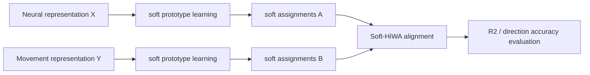
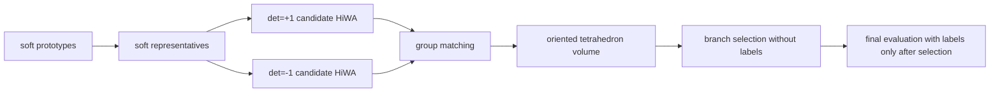

# ROCA-HiWA阶段性研究报告-2026-07-07

## 1. 摘要

本阶段把 Soft-Prototype HiWA 项目收束为 ROCA-HiWA：Representative-Oriented Component-Aware Soft-HiWA。它的核心目的不是追求临时最高 direction accuracy，而是在不使用方向标签的条件下，解决 HiWA / Soft-HiWA 在三维神经—运动对齐中出现的 $O(3)$ 正交分支选择不稳定问题。

当前最重要的证据链是：

- 真实数据 seeds 50-69：ROCA selector 20/20 次选择高 accuracy 分支；
- 坐标单轴符号翻转 seeds 70-79：30/30 次随手性变化自动改变 determinant 分支，并 30/30 次选中高 accuracy 分支；
- 合成真值实验：1600 个条件中 determinant recovery 总准确率 0.995，normal 情况全部正确，失败集中在 learned_soft + near_degenerate 的弱体积边界。

本文是阶段性研究报告，不是最终论文结论。它记录当前方法、证据、失败案例、局限和下一步。

## 2. 研究背景

HiWA 的目标是在无标签条件下对齐多模态分布。在当前项目中，我们把它用于猕猴神经元活动与运动表示之间的对齐，希望自动学习神经表示到运动方向/连续轨迹之间的几何关系。

最初问题是：官方 HiWA 管线可以跑通，连续运动 $R^2$ 较稳定，但 direction accuracy 对随机初始化和正交对齐分支敏感。这说明模型不是完全失败，而是可能存在“连续几何对齐正确、离散方向语义错误”的情况。

## 3. HiWA 复现与问题发现

Python 复现阶段显示：

- 三维 neural representation 与三维 movement representation 可以进入 HiWA 对齐；
- 连续运动 $R^2$ 在多个实验中较稳定；
- direction accuracy 对 seed 和初始化较敏感；
- 某些情况下 $R^2$ 高，但 direction accuracy 低。

这迫使我们把评价拆开看：$R^2$ 更像连续几何轨迹拟合，direction accuracy 更像离散方向语义是否被正确映射。

## 4. TACO soft prototype 的迁移

TACO 给我们的启发不是直接复制模型，而是三个思想：

- soft prototype：用可学习代表点描述局部结构；
- soft assignment：样本不是硬分到某一簇，而是以概率/权重属于多个组；
- group-conditioned OT：对齐不只在点层面发生，也可以借助 group / component 结构。

迁移到 HiWA 后，我们首先尝试用 soft assignments 改进自动分组，希望减少 hard clustering 的不稳定。

## 5. Soft-Prototype HiWA 第一版

Soft-Prototype HiWA 第一版已经实现，基本结构是：



第一版的重要价值是证明 soft grouping 可以接入 HiWA 管线，并产生有结构的 prototypes / representatives。

## 6. 为什么 soft assignment 没有直接提升

实验显示：

- soft random init 不稳定；
- soft warm start 稳定，但初期没有明显提高 direction accuracy；
- temperature sensitivity 和 annealing 没有稳定改善 direction accuracy。

这说明 soft assignment 不是一个简单的“性能增强按钮”。它带来的主要价值后来转向了几何解释：soft representatives 可以作为跨域结构的锚点，用来判断正交分支的 orientation / handedness。

## 7. 温度退火和纯退火为什么失败

温度退火原本想回答：是否因为 assignments 太软或太硬导致语义错位？结果表明温度变化并不能稳定修复 direction accuracy。

seed 7 诊断尤其关键：pure annealing 可以得到较高 $R^2=0.6031$，但 direction accuracy 只有 0.4093；相对地，hard baseline direction accuracy 可到 0.5746，但 $R^2=0.5511$。这说明连续几何和离散方向语义不是同一个指标，优化其中一个不必然优化另一个。

## 8. $O(3)$ determinant branch 问题

三维正交矩阵空间是：

$$
O(3)=\{R:R^\top R=I\}.
$$

纯旋转空间是：

$$
SO(3)=\{R:R^\top R=I,\det(R)=+1\}.
$$

如果 $\det(R)=-1$，变换包含 reflection，会改变坐标手性。HiWA / Soft-HiWA 在当前实现中实际可能搜索整个 $O(3)$，因此会出现两个正交分支：

- $\det(R)=+1$：orientation-preserving；
- $\det(R)=-1$：orientation-reversing / reflection-containing。

真实数据诊断显示，两个分支在 $R^2$ 上可能都合理，但 direction accuracy 明显不同。因此，关键问题变成：不能用测试标签，该如何无标签选择正确 determinant branch？

## 9. ROCA-HiWA 方法

ROCA-HiWA 的核心想法是：用 soft cluster representatives 构造源域和目标域的有向四面体，用 signed volume 判断两个域的 orientation 是否一致，从而选择 $\det(R)=+1$ 或 $\det(R)=-1$ 分支。

源域 representative：

$$
r_k^X= \frac{\sum_n a_{nk}^Xx_n}{\sum_n a_{nk}^X}.
$$

目标域 representative：

$$
r_l^Y= \frac{\sum_m a_{ml}^Yy_m}{\sum_m a_{ml}^Y}.
$$

对于 $K=4,d=3$，构造：

$$
X_{\mathrm{rep}} = [r_2^X-r_1^X,r_3^X-r_1^X,r_4^X-r_1^X],
$$

$$
Y_{\mathrm{rep}} = [r_{\pi(2)}^Y-r_{\pi(1)}^Y,r_{\pi(3)}^Y-r_{\pi(1)}^Y,r_{\pi(4)}^Y-r_{\pi(1)}^Y].
$$

选择规则是：

$$
\hat{s}=\operatorname{sign}\left(\det(X_{\mathrm{rep}})\det(Y_{\mathrm{rep}})\right).
$$

如果任一有向体积接近 0，则代表点接近共面，selector 不应强行给出高置信选择。

完整流程：



## 10. 真实数据验证

在 seeds 50-69 上：

- ROCA selector 20/20 选择高 accuracy 分支；
- selected mean direction accuracy 为 0.577528；
- selected min direction accuracy 为 0.573034；
- selected mean $R^2$ 为 0.599344；
- 相对 hard baseline，paired accuracy mean diff 为 $+0.058909$，$R^2$ mean diff 为 $+0.019496$。

这些结果说明，ROCA selector 在当前真实数据和固定管线中可以稳定降低 determinant branch 引起的方向语义不稳定。

## 11. 坐标符号翻转验证

为了排除 selector 只是机械固定选择某个 determinant，我们做了 source 坐标单轴符号翻转实验。单轴反射会改变坐标手性，因此理论上 selector 应该随之改变 determinant branch。

在 seeds 70-79 与三个 source 坐标轴翻转下：

- 30/30 次 selector 的 expected determinant match 正确；
- 30/30 次选中高 accuracy candidate；
- mean direction accuracy 为 0.576404；
- min direction accuracy 为 0.534510；
- mean $R^2$ 为 0.599123。

这支持 ROCA selector 的选择来自有向几何结构，而不是固定偏好 $\det=+1$ 或 $\det=-1$。

## 12. 合成真值验证

合成实验构造了已知 true determinant 的三维四簇点云：

- seeds：0-49；
- true_det：$+1,-1$；
- noise_level：0.00, 0.02, 0.05, 0.10；
- assignment_mode：oracle_soft, learned_soft；
- degeneracy_mode：normal, near_degenerate。

结果：

| 条件 | cases | determinant recovery |
|---|---:|---:|
| 全部 | 1600 | 0.995 |
| normal + oracle_soft | 400 | 1.000 |
| normal + learned_soft | 400 | 1.000 |
| near_degenerate + oracle_soft | 400 | 1.000 |
| near_degenerate + learned_soft | 400 | 0.980 |

8 个失败案例全部集中在 seed 42、learned_soft、near_degenerate 条件下，且包括两个 true determinant 和所有 noise levels。这说明失败更像是 soft grouping 在弱体积结构附近给出不稳定代表点，而不是噪声单独造成。

需要注意：当前 near_degenerate 在 selector 内部标准化后没有触发 hard degeneracy flag，但 oriented volume margin 明显降低。因此后续需要重新定义“退化”的检测尺度，不能只依赖标准化后的绝对体积阈值。

## 13. 相关工作与新颖性

初步检索覆盖了 Orthogonal Procrustes、determinant-constrained Procrustes、Kabsch reflection correction、Wasserstein Procrustes、Hierarchical OT alignment、signed volume / chirality / oriented simplex 等方向。

目前没有找到完全相同的组合：用 TACO 式 soft representatives 构造有向 simplex，再用于 HiWA / neural alignment 的 determinant branch selection。更谨慎的定位是：

- signed volume / orientation 是经典几何事实；
- determinant-constrained Procrustes 和 Kabsch reflection correction 是经典算法；
- Wasserstein Procrustes 和 HiWA 已有 OT + Procrustes 对齐框架；
- ROCA-HiWA 的新意在于把 soft representatives 作为无标签跨域有向几何锚点，用于解决 HiWA/Soft-HiWA 中被实验发现的 $O(3)$ 分支不稳定问题。

该新颖性仍需更系统全文检索，特别是 TACO、神经流形对齐、点云 registration 的 reflection ambiguity 文献。

## 14. 当前贡献

当前可以谨慎表述的贡献是：

1. 复现并诊断了 HiWA 在猕猴神经—运动数据中的一个隐藏不稳定源：$O(3)$ determinant branch ambiguity。
2. 发现 $R^2$ 与 direction accuracy 可以显著分离，说明连续几何对齐不等价于离散方向语义正确。
3. 借鉴 TACO 式 soft prototype / soft assignment，提出用 soft representatives 构造无标签有向几何选择器。
4. 在真实数据、坐标手性翻转和合成真值实验中形成了初步一致的证据链。
5. 保留了负结果，明确排除了 temperature tuning、annealing、transport objective selector 等不充分解释。

## 15. 局限

- 当前真实数据只覆盖一个猕猴神经—运动数据集。
- 当前公式主要针对 $d=3,K=4$，因为四个代表点刚好构成四面体。
- 合成 near_degenerate 设计在标准化后没有触发 hard degeneracy flag，说明退化检测仍需完善。
- 文献检索仍是初步阶段，不能声称绝对没有相似方法。
- 当前还没有在其他神经数据、session-to-session alignment 或高维表示上验证。
- learned_soft 在 near_degenerate 条件下存在失败案例，说明代表点质量会影响 selector。

## 16. 后续探索建议

优先级最高的后续方向不是追分，而是做三件事：

1. 完成系统文献检索，尤其是 TACO、reflection ambiguity、chirality-aware registration、neural manifold alignment。
2. 改进退化检测，把 volume margin、assignment entropy、representative separation 和 Hungarian matching margin 联合起来。
3. 做一个最小外部验证：换数据集或 session-to-session neural alignment 场景，验证 ROCA 是否仍能无标签选择合理 determinant branch。

其他方向如 $K=5$、自动 $K$、GMM/spherical k-means、unbalanced OT、joint optimization 应作为后续受控消融，不应立刻改变主协议。

## 17. 附录：运行命令与结果文件

主要命令：

```bash
python -m unittest discover -s tests -v
python scripts\run_roca_synthetic_determinant_validation.py --seeds 0 1 2 3 4 5 6 7 8 9 10 11 12 13 14 15 16 17 18 19 20 21 22 23 24 25 26 27 28 29 30 31 32 33 34 35 36 37 38 39 40 41 42 43 44 45 46 47 48 49 --noise-levels 0.00 0.02 0.05 0.10 --true-dets 1 -1 --assignment-modes oracle_soft learned_soft --degeneracy-modes normal near_degenerate
python scripts\analyze_roca_synthetic_determinant_validation.py --raw roca_synthetic_determinant_validation_raw.json
```

关键文件：

- `D:\ai\数学ai\Projects\最优传输\Experiments\hiwa_python_reproduction\results\roca_synthetic_determinant_validation\roca_synthetic_determinant_validation_raw.json`
- `D:\ai\数学ai\Projects\最优传输\Experiments\hiwa_python_reproduction\results\roca_synthetic_determinant_validation\roca_synthetic_determinant_validation_summary.json`
- `D:\ai\数学ai\Projects\最优传输\Experiments\hiwa_python_reproduction\results\roca_synthetic_determinant_validation\roca_synthetic_determinant_validation_report.md`
- `D:\ai\数学ai\Projects\最优传输\Experiments\hiwa_python_reproduction\results\roca_synthetic_determinant_validation\synthetic_failure_cases.md`
- `D:\ai\数学ai\Projects\最优传输\Experiments\hiwa_python_reproduction\figures\roca_synthetic_determinant_validation\synthetic_det_accuracy_by_noise.png`
- `D:\ai\数学ai\Projects\最优传输\Experiments\hiwa_python_reproduction\figures\roca_synthetic_determinant_validation\synthetic_det_accuracy_by_assignment_mode.png`
- `D:\ai\数学ai\Projects\最优传输\Experiments\hiwa_python_reproduction\figures\roca_synthetic_determinant_validation\synthetic_oriented_volume_margin.png`

