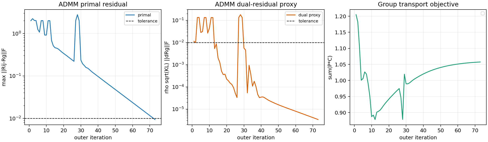

# Soft-GCOT convergence diagnosis

日期：2026-07-11
范围：仅数值收敛诊断；未使用标签，未计算 accuracy/$R^2$，未运行 ROCA，未修改模型、loss、prototype 或 OT formulation。

## 结论

TACO-faithful full-support Soft-GCOT 在神经数据的固定 seed50 smoke 子问题上**已经达到可比较的 ADMM 收敛状态**。关键不是更改模型，而是采用足以约束软组局部旋转共识的 ADMM penalty，并给出足够的外层预算。

推荐设置：

```text
mu = 0.05
rho = mu / d = 0.0166667   (d = 3)
outer maxiter = 200
tol = 1e-2
group Sinkhorn maxiter = 300
local Sinkhorn maxiter = 80
local alternating maxiter = 40
support_mode = full
```

在 seed50，实际第 73 个 outer iteration 满足双条件；因此 200 是保护性预算，不是实际运行轮数。

## Hard 与 Soft 的 stopping criterion

两者的 consensus 更新形式相同：局部子问题接收 $(\mu/d)(R_g-L_{ij})$，随后更新 $L_{ij}\leftarrow L_{ij}+R_{ij}-R_g$。这对应 `src/hiwa/hiwa.py` 与 `src/cc_hiwa/soft_hiwa.py` 的同一 inherited HiWA ADMM 结构。

但**停止判据并不一致**：

| 方法 | 当前停止判据 |
|---|---|
| Hard HiWA | 仅检查 $\|R_g^{k}-R_g^{k-1}\|_F\leq\mathrm{tol}$；没有保存 local-global primal residual。 |
| Soft-GCOT | 同时要求 global rotation change 与 $\max_{ij}\|R_{ij}-R_g\|_F$ 都不大于 tolerance。 |

因此 Hard 的现有 `converged` 不能被解读为与 Soft 同强度的 ADMM consensus 证据。此次先解决 Soft 的双残差收敛；后续性能比较应至少明确报告这项不对称性。

## seed50 数值扫描

固定：96-by-96 等距神经子问题、4 个 soft groups、temperature=1.0、entropy weight=0.05、full support、无标签。只有 $\mu$ 改变；其余数值参数如推荐设置。选择完全基于 residual，不基于评价标签。

| $\mu$ | $\rho=\mu/3$ | 终止轮数 | Global residual | Primal residual | Sinkhorn error | Objective | 收敛 |
|---:|---:|---:|---:|---:|---:|---:|---|
| 0.005 | 0.001667 | 200 (budget) | $1.85\times10^{-4}$ | 0.23588 | $9.85\times10^{-15}$ | 0.91640 | 否 |
| 0.020 | 0.006667 | 178 | $2.97\times10^{-5}$ | 0.009817 | $1.36\times10^{-14}$ | 1.02645 | 是 |
| 0.050 | 0.016667 | 73 | $5.09\times10^{-5}$ | 0.009401 | $4.27\times10^{-14}$ | 1.05749 | 是 |

### seed50 smoke result

选用 $\mu=0.05$：

- outer iterations: 73 / 200
- global rotation residual: $5.09\times10^{-5}$
- ADMM primal residual: $9.40\times10^{-3}$
- ADMM dual-residual proxy: $3.39\times10^{-6}$
- maximum Sinkhorn marginal error: $4.27\times10^{-14}$
- final group transport objective: 1.05749

结论：seed50 已同时通过当前 $10^{-2}$ global 与 primal tolerance。它是收敛 smoke，不是性能结论。

## 曲线与定义



原始数值记录：`experiments/results/soft_gcot_convergence_seed50_20260711.json`。

- **Primal residual**：$r^k=\max_{ij}\|R_{ij}^k-R_g^k\|_F$，直接来自 SoftHiWA diagnostics。
- **Dual residual proxy**：当前实现将 multiplier 以 scaled 形式更新；采用 consensus ADMM 的标准量纲代理
  $$s^k=\rho\sqrt{KL}\,\|R_g^k-R_g^{k-1}\|_F,$$
  其中 $K=L=4$、$\rho=\mu/d$。这不是新增优化项，只是对现有 `Rg_norm` 的诊断重标度。
- **Objective**：每次外层 group Sinkhorn 更新后的 $\sum_{ij}P_{ij}C_{ij}$；通过运行时只读采样记录，未改变计算。

曲线显示 primal 从约 2 下降到阈值以下；dual proxy 也下降。Objective 前几轮下降，尾部从 1.05683 缓慢到 1.05749；ADMM/交替优化不要求该未增广目标逐步单调，不能仅凭轻微回升判为失败。

## 原因分析

### 1. $\rho$ 是否适合 soft cost？

原 $\mu=0.005$ 的实际 $\rho=0.001667$ 对 full-support 的众多重叠 $Q_{ij}$ 过弱：global rotation 已稳定，但 local rotations 在 200 轮后仍相差 0.236。提高到 $\mu=0.02$ 和 $0.05$ 后，local-global consensus 被有效收紧，且 Sinkhorn 精度保持在 $10^{-14}$ 量级。

这里“更适合”只指现有固定 seed50、固定数据子问题上的数值收敛；并不构成使用标签的性能调参。

### 2. outer iteration 是否不足？

是。以原 $\mu=0.005$，200 轮仍未达 primal tolerance；此前 80 轮的 0.53--0.67 residual 因而不能作为 Soft-GCOT 的最终状态。以 $\mu=0.05$，73 轮已经收敛，建议保留 200 的上限而依赖双残差早停。

### 3. consensus update 是否正确？

Soft 的 consensus/multiplier 更新与 Hard HiWA 的 inherited 形式一致，没有发现 Soft 特有的符号、维度或 Sinkhorn marginal 错误。问题是 soft full-support 引入的所有 group pairs 使局部旋转分歧更持久；原 $μ$ 与 80 轮预算不足以消解该分歧。

## 后续边界

现在可以在**同一数值协议**下重新运行 Hard 与 full-support Soft-GCOT 的性能比较，但应：

1. 固定上述 Soft 参数，不以 accuracy 继续选择数值参数；
2. 对每个 seed 报告 global/primal residual 与未收敛标记；
3. 将未达到双残差阈值的 Soft seed 单独报告，而非混入性能均值；
4. 先不接入 ROCA。
