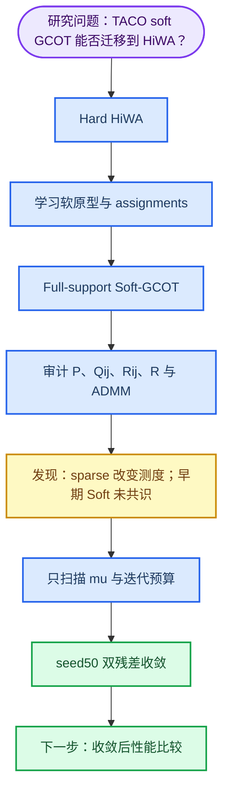

# Soft-GCOT HiWA 项目全流程说明

_面向合作者的项目说明 · 截至 2026-07-11 · 说明已做什么、发现什么、当前能下什么结论_

---

## 🔎 一句话结论

这个项目目前不在扩展新算法，而是在回答一个基础问题：TACO 的软原型与分组最优传输能否忠实地迁移到 HiWA 的猕猴神经—运动对齐任务。

当前已经证明：**full-support Soft-GCOT 可以在 seed50 的无标签神经 smoke 中达到 ADMM 共识收敛。** 因而此前那些在未收敛状态下得到的 Hard-vs-Soft 性能比较不能作为方法优劣结论，必须重跑。

## 🧭 研究问题与方法定位

HiWA 原本先做硬分组：每个样本只属于一个簇。它在每个簇对内计算样本传输 $Q_{ij}$ 和局部旋转 $R_{ij}$，再计算簇级传输 $P$，最后用 ADMM 协调所有局部旋转与一个全局正交旋转 $R$。

TACO 的启发是用可学习 prototype 产生 soft assignment：一个样本可部分属于多个组。我们的主问题是：这些边界信息能否改善神经表示与运动表示的对齐？

| 类别 | 内容 | 当前定位 |
|---|---|---|
| 基线 | Hard HiWA | 原始对照 |
| 基线 | TACO-faithful Soft-GCOT HiWA | 当前主线 |
| 近似 | Sparse-support Soft-GCOT | 速度对照，不能替代 full support |
| 稳定化 | ROCA | 只在收敛的 Soft 基线上检验 |
| 探索 | CC-HiWA、Joint-Prototype、PBMC、GI-CC-HiWA | 保留，但不用于回答主问题 |

## 🗺️ 项目流程



## 📐 纯净 Soft-GCOT baseline 是什么

1. 两个域各自学习 4 个 prototype
2. 样本对 prototype 做 softmax，得到 assignment matrix $A,B$
3. 每一组是完整的加权经验测度，而不是一个代表点
4. 对每一个组对 $(i,j)$，独立求带软边缘的 Sinkhorn coupling $Q_{ij}$
5. 用组间代价求 group transport $P$
6. 沿用 HiWA 的 $R_{ij}$、全局 $R$ 与 ADMM consensus

纯净 baseline 中，representative guidance、representative rotation、component-conditioned cost、rotation anchor、Joint-Prototype 与 ROCA 全部关闭。这样结果只回答“软分组本身是否有价值”。

## 🧪 已经完成的工作

### 忠实迁移审计

已确认实现包含：prototype learning、soft assignment、重构与 entropy regularization、加权组测度、$P$、各自独立的 $Q_{ij}$、局部/全局正交旋转、ADMM 与内外层 Sinkhorn。

同时增加了两项关键诊断：

- `support_mode="full"` 与 `support_mode="sparse"` 的明确区分
- Soft 的 ADMM primal residual

### Full support 与 sparse support

full-support 是正式参照：每个软组保留所有样本，$Q_{ij}$ 的边缘就是完整 assignment column。

sparse-support 只保留 membership 高的样本，再重新归一化。它是计算近似，不是等价算法。在 96-by-96 seed0 诊断中，目标域部分 sparse 组只保留约 84.6% 与 85.7% 的原质量；这会改变 $Q_{ij}$、局部旋转和 ADMM vote。因此 sparse 的早期失败不能用来否定 full-support Soft-GCOT。

### Soft grouping 是否塌缩

没有发现 prototype collapse：

- neural 与 movement 的 assignment entropy 分别约为最大熵的 38% 与 41%
- 四组质量均明显非零
- prototype 与 representative 的最小 pairwise separation 明显大于零

所以早期问题不是“分组过软或所有 prototype 一样”，而是完整 soft 分组进入所有组对后，优化尚未完成共识。

## ⚠️ 为什么早期性能比较无效

初期 full-support Soft-GCOT 的 Sinkhorn marginal error 已接近 $10^{-14}$，说明 OT 边缘约束正确；但 ADMM primal residual 仍约为 0.53--0.67，局部 $R_{ij}$ 与全局 $R$ 没有达成共识。

因此“OT 数值正确”不等于“整个对齐收敛”。此前的 direction accuracy 与 movement $R^2$ 不可用于判断 Hard 与 Soft 的优劣。

## ✅ 收敛诊断与当前推荐参数

Hard 与 Soft 的 consensus 更新形式继承同一 HiWA ADMM 结构，但停止条件不同：Hard 只检查全局旋转变化；Soft 同时检查全局变化与 local-global primal residual。因此两者的 `converged` 标记不能简单等同。

对 seed50 的固定无标签 96-by-96 smoke，只调整数值参数：

| $\mu$ | 实现中的 $\rho=\mu/3$ | 结果 |
|---:|---:|---|
| 0.005 | 0.001667 | 200 轮后 primal residual=0.23588，未收敛 |
| 0.020 | 0.006667 | 178 轮收敛 |
| 0.050 | 0.016667 | 73 轮收敛 |

推荐冻结为：

```text
mu = 0.05
outer maxiter = 200
tol = 1e-2
group Sinkhorn maxiter = 300
local Sinkhorn maxiter = 80
local alternating maxiter = 40
support_mode = full
```

seed50 的最终收敛指标：

- global rotation residual：$5.09\times10^{-5}$
- primal consensus residual：$9.40\times10^{-3}$
- dual-residual proxy：$3.39\times10^{-6}$
- Sinkhorn marginal error：$4.27\times10^{-14}$


_图：seed50 的 primal residual、dual-residual proxy 与 group transport objective。_

## ⚠️ ROCA 目前能说什么

ROCA 用 soft representative 的有向 simplex 来选择三维正交对齐的 determinant branch。早期 ROCA 结果很差，但当时 Soft-GCOT 自身没有 ADMM 收敛，所以不能把结果解释成“ROCA 本身无效”。

目前发现 representative simplex 的 volume 与 condition number 并未退化；但 ROCA 选中的候选分支可能有更差的 consensus residual。准确表述是：**ROCA 尚未在收敛的 Soft-GCOT 基线上被验证，早期负结果不是最终结论。**

## 🎯 当前可信结论与下一步

当前可信：

1. Soft-GCOT 主线已具备 TACO soft-group 与 HiWA ADMM 的核心结构
2. Sparse 是近似，不能作为正式 Soft-GCOT 的性能代表
3. Soft grouping 没有明显 collapse
4. 原始 $\mu=0.005$ 和 80 轮不足以完成 Soft consensus
5. 只通过数值参数调整，seed50 已实现 Soft-GCOT 双残差收敛

当前不能说：Soft 比 Hard 好或差；ROCA 有效或无效；单个 seed50 可代表全部数据。

下一步应固定上述 full-support 与 ADMM 参数，在预先指定的多个 seed 上：先检查 Soft 双残差是否收敛；只汇总已收敛 seed 的 Hard-vs-Soft accuracy 与 $R^2$；最后才重新检验 ROCA。

## 📎 相关文件

| 文件 | 用途 |
|---|---|
| `src/hiwa/hiwa.py` | 原始 Hard HiWA |
| `src/cc_hiwa/soft_groups.py` | prototype 与 soft assignment |
| `src/cc_hiwa/soft_hiwa.py` | full/sparse Soft-GCOT 与 ADMM diagnostics |
| `experiments/hiwa/run_taco_faithful_baseline.py` | 四方法统一入口 |
| `docs/research/TACO-faithful_Soft-GCOT_HiWA_audit_2026-07-11.md` | 忠实迁移审计 |
| `docs/research/Soft-GCOT适用性诊断.md` | soft grouping、sparse、ROCA 诊断 |
| `docs/research/Soft-GCOT convergence diagnosis.md` | seed50 收敛诊断 |
