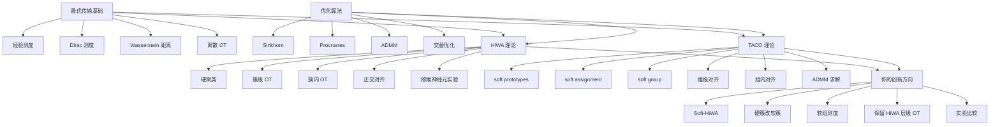
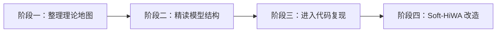
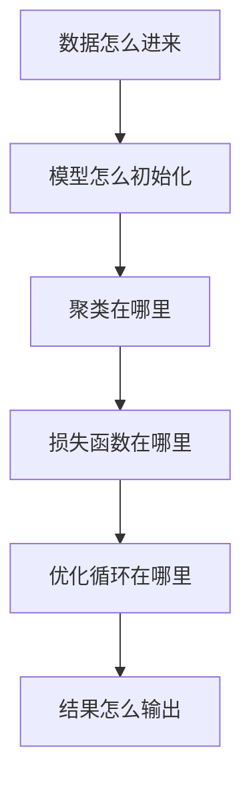
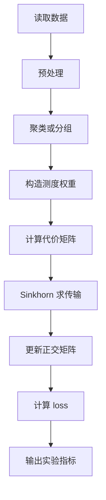
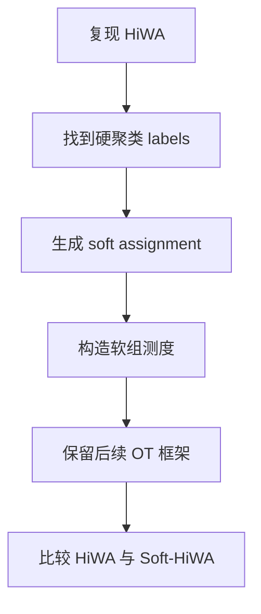
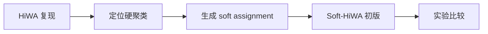

# Soft-HiWA 研究学习计划

## 0. 文档目的

这份计划不是为了继续堆公式，而是为了把已经学过的内容整理成一个稳定的知识网络，并且明确下一阶段如何进入代码复现和自己的研究改造。

完成这份计划后，你应该能够做到：

- 说清楚 HiWA 在做什么；
- 说清楚 TACO 在做什么；
- 理解 Wasserstein、经验测度、Dirac 测度、Sinkhorn、Procrustes、ADMM 在论文中的位置；
- 知道 HiWA 和 TACO 的关系；
- 找到 HiWA 代码中硬聚类、OT 求解、正交更新的位置；
- 初步实现一个 Soft-HiWA 版本；
- 开始围绕猕猴神经元实验做自己的研究内容。

---

## 1. 当前学习状态判断

你现在不是没有学懂，而是概念太多，暂时没有形成层次。

目前已经接触的核心概念包括：

- Wasserstein 距离；
- 经验测度；
- Dirac 测度；
- 离散最优传输；
- Sinkhorn 算法；
- Procrustes 正交对齐；
- ADMM；
- 硬聚类；
- soft assignment；
- soft prototypes；
- soft group；
- 层级 OT；
- HiWA；
- TACO；
- Soft-HiWA 创新方向；
- 猕猴神经元实验复现。

真正的问题是：这些概念处在不同层级。如果不分层，就会越学越乱。

---

## 2. 总知识网络



普通文字版结构：

1. 最优传输基础提供数学语言。
2. Sinkhorn、Procrustes、ADMM 提供优化工具。
3. HiWA 提供层级 OT 框架。
4. TACO 提供 soft assignment 和 soft prototypes 的模型思想。
5. 你的创新方向是把 TACO 的软分组思想迁移到 HiWA 中，形成 Soft-HiWA。

---

## 3. 核心研究主线

你现在的研究主线可以压缩成一句话：

> 借鉴 TACO 的 soft assignment 和 soft prototype 思想，把 HiWA 中固定的硬聚类层级 OT 推广为软分组层级 OT，并在猕猴神经元数据上验证软分组是否能更好地保留神经表示结构、提升对齐效果或下游预测指标。

这句话是之后所有学习、代码、实验、汇报的中心。

---

## 4. 哪些内容需要深学，哪些内容暂时会用即可

### 4.1 必须深学的内容

#### 4.1.1 HiWA 的模型结构

你必须能回答：

- HiWA 输入是什么？
- HiWA 输出是什么？
- 为什么要先聚类？
- 簇级 OT 是什么？
- 簇内 OT 是什么？
- 正交矩阵 $R$ 是什么？
- 最终目标函数每个变量是什么意思？

#### 4.1.2 TACO 的软分组思想

你必须能回答：

- TACO 为什么引入 soft prototypes？
- soft assignment 怎么产生？
- soft group 为什么不是硬集合，而是条件经验测度？
- TACO 的组级对齐和组内对齐分别是什么？
- 它和 HiWA 的层级 OT 有什么相似之处？

#### 4.1.3 你的创新点

你必须能回答：

- 为什么 HiWA 的硬聚类可能不够好？
- 为什么神经元数据适合软分组？
- 软分组矩阵 $S,T$ 怎么构造？
- 软组测度怎么定义？
- 它和 TACO 有什么关系？
- 它和原始 HiWA 有什么不同？

### 4.2 暂时只需要会用的内容

#### Sinkhorn

暂时只需要知道：

> Sinkhorn 是用来快速求带熵正则的 OT 传输矩阵的算法。

不用现在证明 Sinkhorn 的收敛性。

#### ADMM

暂时只需要知道：

> ADMM 是把复杂优化问题拆成多个子问题交替更新的方法。

不用现在完整掌握凸优化理论。

#### Procrustes

暂时只需要知道：

> 固定传输矩阵后，正交矩阵 $R$ 可以通过 SVD 更新。

不用现在反复推导迹运算。

---

## 5. 四阶段学习路线

整体路线分为四个阶段：



每个阶段都有明确目标：

| 阶段 | 目标 | 产出 |
|---|---|---|
| 阶段一 | 把已有概念重新分层 | 最优传输基础卡片 |
| 阶段二 | 理解 HiWA 和 TACO 的模型结构 | HiWA / TACO 模型卡片 |
| 阶段三 | 跑通并读懂原始代码 | 代码结构图和复现实验记录 |
| 阶段四 | 实现 Soft-HiWA 初版 | 软分组实验比较 |

---

## 6. 阶段一：重新整理理论地图

建议用时：2 天。

目标：不学新东西，只整理已经学过的内容。

### 第 1 天：整理概念层级

任务：

- 列出所有概念；
- 把概念分为五类：数学基础、优化算法、模型结构、代码实现、创新想法；
- 在 Obsidian 中新建一页知识地图；
- 不推复杂公式。

概念分类模板：

| 类别 | 概念 | 作用 |
|---|---|---|
| 数学基础 | 经验测度 | 把数据点表示成概率测度 |
| 数学基础 | Wasserstein | 衡量两个测度之间的运输距离 |
| 优化算法 | Sinkhorn | 求熵正则 OT |
| 优化算法 | Procrustes | 更新正交矩阵 $R$ |
| 模型结构 | HiWA | 层级 OT 框架 |
| 模型结构 | TACO | 软分组对齐框架 |
| 创新想法 | Soft-HiWA | 把硬簇改成软组 |

第 1 天结束标准：

> 能说清楚哪些概念是基础，哪些是算法，哪些是模型，哪些是你的创新。

---

### 第 2 天：整理最优传输基础卡片

你只需要写清楚五个对象。

#### 对象 1：经验测度

$$
\mu = \sum_{i=1}^{n} a_i \delta_{x_i}
$$

解释：

- 这是一个离散概率分布；
- 每个点 $x_i$ 上放了质量 $a_i$；
- Dirac 测度表示质量集中在某个点上。

#### 对象 2：Wasserstein 距离

$$
W_2^2(\mu,\nu)
=
\min_{\pi \in \Pi(\mu,\nu)}
\int \|x-y\|^2 d\pi(x,y)
$$

解释：

- 在所有运输方案中寻找总代价最小的方案；
- $\pi$ 表示从 $\mu$ 到 $\nu$ 的联合运输计划。

#### 对象 3：离散 OT

如果：

$$
\mu = \sum_i a_i \delta_{x_i},
\qquad
\nu = \sum_j b_j \delta_{y_j}
$$

则：

$$
W_2^2(\mu,\nu)
=
\min_{P \in U(a,b)}
\sum_{i,j} P_{ij}\|x_i-y_j\|^2
$$

解释：

- $P_{ij}$ 表示从 $x_i$ 到 $y_j$ 传多少质量；
- $U(a,b)$ 表示满足边缘分布约束的传输矩阵集合。

#### 对象 4：Sinkhorn

$$
\min_{P \in U(a,b)}
\langle C,P\rangle
+
\varepsilon H(P)
$$

解释：

- $C$ 是代价矩阵；
- $P$ 是传输矩阵；
- $\varepsilon$ 是熵正则强度；
- 熵正则让问题更平滑，可以用 Sinkhorn 快速求解。

#### 对象 5：Procrustes

$$
\min_{R^\top R=I}
\sum_{i,j}P_{ij}\|Rx_i-y_j\|^2
$$

解释：

- $R$ 是正交矩阵；
- 它把源域空间旋转或反射到目标域空间；
- 固定 $P$ 后，$R$ 可以通过 SVD 更新。

第 2 天结束标准：

> 能解释为什么连续测度上的积分形式，在经验测度情况下会变成矩阵求和形式。

---

## 7. 阶段二：精读 HiWA 和 TACO 模型结构

建议用时：4 天。

目标：不追求记住所有细节，只抓住模型在做什么。

---

### 第 3 天：HiWA 模型卡片

#### HiWA 的输入

- 源域数据 $X$；
- 目标域数据 $Y$；
- 源域样本权重 $a$；
- 目标域样本权重 $b$；
- 预设簇数 $K,L$。

#### HiWA 的中间变量

- 硬聚类结果；
- 源域簇测度；
- 目标域簇测度；
- 簇级传输矩阵；
- 簇内传输矩阵；
- 正交对齐矩阵。

#### HiWA 的输出

- 两个数据集之间的层级对齐关系；
- 簇与簇之间的对应；
- 样本与样本之间的对应；
- 对齐后的表示；
- 下游任务指标。

#### 必须掌握的公式

硬簇测度：

$$
\mu_k
=
\sum_{i \in C_k^X}
a_{i|k}\delta_{x_i}
$$

$$
\nu_l
=
\sum_{j \in C_l^Y}
b_{j|l}\delta_{y_j}
$$

簇内 OT：

$$
D_{kl}(R)
=
\min_{P^{kl}}
\sum_{i,j}P_{ij}^{kl}\|Rx_i-y_j\|^2
$$

簇级 OT：

$$
\min_{\Gamma}
\sum_{k,l}\Gamma_{kl}D_{kl}(R)
$$

第 3 天结束标准：

> 能用 3 分钟说清楚：HiWA 的核心不是普通 OT，而是层级 OT。它先把数据分成簇，每个簇看成经验测度；外层用 OT 匹配簇，内层用 OT 匹配簇内样本，并用正交矩阵保持几何结构。

---

### 第 4 天：TACO 模型卡片

这一天不碰 HiWA，只看 TACO。

#### 问题 1：TACO 为什么不直接做点对点 OT？

因为直接点对点 OT 容易忽略数据里的潜在组结构。很多表示不是孤立点，而是存在语义组、几何组、功能组或结构组。TACO 通过 soft prototypes 和 soft assignment 显式建模这种组结构。

#### 问题 2：soft prototypes 是什么？

$$
c_1,c_2,\dots,c_K
$$

解释：

- prototype 是潜在组的代表向量；
- 它不一定是某个真实样本；
- 它可以是模型学习出来的组中心。

#### 问题 3：soft assignment 怎么来？

$$
S_{ik}
=
\frac{\exp(\operatorname{sim}(x_i,c_k)/\tau)}
{\sum_{r=1}^{K}\exp(\operatorname{sim}(x_i,c_r)/\tau)}
$$

解释：

- 样本 $x_i$ 和每个 prototype 计算相似度；
- 再经过 softmax 得到属于各组的概率；
- 每一行满足 $\sum_k S_{ik}=1$。

#### 问题 4：soft group 是什么？

先定义组质量：

$$
\alpha_k = \sum_i a_iS_{ik}
$$

再定义软组测度：

$$
\mu_k^S
=
\sum_i
\frac{a_iS_{ik}}{\alpha_k}
\delta_{x_i}
$$

解释：

- soft group 不是硬集合；
- soft group 是由 soft assignment 诱导出来的条件经验测度；
- 一个样本可以以不同权重参与多个组。

第 4 天结束标准：

> 能说清楚：TACO 的关键不是简单多了一个矩阵，而是引入 soft prototypes 产生 soft assignment，再由 soft assignment 构造 soft groups，使模型能在组级和样本级同时做对齐。

---

### 第 5 天：HiWA 与 TACO 对照表

你要完成这张表：

| 问题 | HiWA | TACO |
|---|---|---|
| 是否有组结构 | 有 | 有 |
| 组怎么来 | 先验硬聚类 | soft prototypes 学出来 |
| 样本属于几个组 | 一个 | 多个 |
| 组的数学形式 | 硬簇经验测度 | 软组条件经验测度 |
| 是否有组间对齐 | 有 | 有 |
| 是否有组内对齐 | 有 | 有 |
| 主要优化工具 | Sinkhorn, Procrustes | ADMM, 交替优化 |
| 对项目的启发 | 层级 OT 框架 | 软分组机制 |

第 5 天结束标准：

> 能说出：HiWA 给了层级 OT 框架，TACO 给了软分组机制。我的研究不是照搬 TACO，而是把 TACO 的 soft assignment 思想迁移到 HiWA 中。

---

### 第 6 天：写自己的研究假设

任务：写一段自己的研究想法。

建议草稿：

> HiWA 在猕猴神经元数据中使用硬聚类构造层级 OT，但硬聚类假设每个神经元表示或样本状态只属于一个簇。真实神经活动可能具有连续谱系、混合功能群和过渡状态，因此硬聚类可能丢失部分结构信息。TACO 中的 soft prototypes 和 soft assignment 提供了一种软分组机制，使样本可以以不同权重参与多个潜在组。受此启发，我们尝试将 HiWA 中的硬簇经验测度推广为软组条件经验测度，在保留原有簇级 OT、簇内 OT 和正交对齐结构的基础上，构造 Soft-HiWA 模型，并在猕猴神经元数据上比较其与原始 HiWA 的表现。

第 6 天结束标准：

> 能向老师解释为什么硬聚类可能不够，为什么软分组有意义。

---

## 8. 阶段三：进入代码复现

建议用时：5 到 7 天。

代码学习顺序：



不要一开始就看复杂函数。先建立代码地图。

---

### 第 7 天：跑通环境和主程序

任务：

- 找到 README；
- 配置环境；
- 找到 main 文件；
- 找到运行命令；
- 用最小数据跑一次；
- 记录输入文件；
- 记录输出结果。

你只回答五个问题：

1. 代码入口在哪里？
2. 数据文件在哪里？
3. 运行命令是什么？
4. 输出结果保存在哪里？
5. 有没有随机种子？

第 7 天结束标准：

> 代码至少能开始运行，或者你明确知道卡在哪里。

---

### 第 8 天：画代码结构图

你要把代码画成这个结构：



然后在代码里找到每一步对应的文件或函数。

代码结构记录表：

| 流程 | 代码位置 | 作用 | 是否看懂 |
|---|---|---|---|
| 数据读取 | 待填写 | 加载神经元数据 | 否 |
| 预处理 | 待填写 | 标准化或降维 | 否 |
| 聚类 | 待填写 | 得到硬簇 | 否 |
| OT 求解 | 待填写 | Sinkhorn | 否 |
| 正交更新 | 待填写 | Procrustes | 否 |
| 训练循环 | 待填写 | 交替优化 | 否 |
| 指标评估 | 待填写 | 输出 accuracy / loss | 否 |

第 8 天结束标准：

> 知道每个核心模块在哪个文件。

---

### 第 9 天：专门看数据结构

这一天只看数据，不看模型。

你要搞清楚：

- $X$ 的 shape 是什么？
- $Y$ 的 shape 是什么？
- 样本数是多少？
- 特征维度是多少？
- 标签有没有？
- trial 信息有没有？
- session 信息有没有？
- monkey 信息有没有？

记录模板：

```text
X.shape = (?, ?)
Y.shape = (?, ?)
n = ?
m = ?
d = ?
是否有 label = ?
是否有 trial = ?
是否有 time bin = ?
是否有 session = ?
是否有 monkey = ?
```

第 9 天结束标准：

> 知道软分组矩阵 $S$ 的行数到底对应什么对象。

---

### 第 10 天：专门看 HiWA 的硬聚类代码

这一天只看硬簇怎么产生。

你要找到：

- 是否用了 KMeans；
- 簇数 $K,L$ 在哪里设置；
- labels 是什么 shape；
- 源域和目标域是否分别聚类；
- 聚类结果怎么进入后续 OT。

你要定位这个对象：

$$
Z \in \{0,1\}^{n \times K}
$$

代码里可能不叫 $Z$，可能叫：

- labels；
- clusters；
- groups；
- partition；
- assignments。

第 10 天结束标准：

> 知道原始代码如何从数据得到硬簇。

---

### 第 11 天：专门看 OT 求解代码

你要找到：

- 代价矩阵 $C$ 怎么计算；
- 传输矩阵 $P$ 怎么求；
- 边缘分布 $a,b$ 怎么传进去；
- 熵正则参数 $\varepsilon$ 在哪里；
- Sinkhorn 迭代次数在哪里。

把代码和公式对应起来：

$$
\min_{P \in U(a,b)}
\langle C,P\rangle
+
\varepsilon H(P)
$$

记录表：

| 公式对象 | 代码变量 | 说明 |
|---|---|---|
| $C$ | 待填写 | 代价矩阵 |
| $P$ | 待填写 | 传输矩阵 |
| $a$ | 待填写 | 源域边缘分布 |
| $b$ | 待填写 | 目标域边缘分布 |
| $\varepsilon$ | 待填写 | 熵正则参数 |

第 11 天结束标准：

> 能把 OT 代码变量和公式变量对应起来。

---

### 第 12 天：专门看 Procrustes 更新代码

这一天只看正交矩阵 $R$。

你要找到：

- $R$ 初始化在哪里；
- $R$ 的 shape 是什么；
- 是否用了 SVD；
- $M$ 矩阵怎么构造；
- $R$ 是每一对簇一个，还是全局一个；
- $R$ 更新频率是多少。

核心公式：

$$
\min_{R^\top R=I}
\sum_{i,j}P_{ij}\|Rx_i-y_j\|^2
$$

第 12 天结束标准：

> 知道代码里的 $R$ 到底是全局对齐，还是局部簇对齐。

---

### 第 13 天：专门看训练循环

你要写出类似下面的伪代码：

```text
初始化聚类
初始化 R
重复若干轮：
    计算组内代价
    更新组级传输
    更新组内传输
    更新正交矩阵 R
    计算 loss
输出结果
```

你要搞清楚：

- 哪些变量是固定的；
- 哪些变量会更新；
- 更新顺序是什么；
- 停止条件是什么。

第 13 天结束标准：

> 能用伪代码描述原始 HiWA 的训练流程。

---

## 9. 阶段四：Soft-HiWA 改造

建议用时：7 到 10 天。

你的创新不要一开始做太大。最稳路线是：



---

### Version 0：原始 HiWA 复现

必须先完成原始版本。

需要记录：

- 原始 HiWA 的实验指标；
- 原始 HiWA 的运行时间；
- 原始 HiWA 的参数设置；
- 原始 HiWA 的簇数 $K,L$；
- 原始 HiWA 的随机种子。

没有 baseline，就没法证明新方法有意义。

---

### Version 1：固定软分组 Soft-HiWA

这是第一个创新版本。

做法：

- 保留原始 HiWA 的整体结构；
- 只把硬聚类改成软分组；
- $S,T$ 先固定，不参与训练。

软分组可以用：

- PCA + GMM；
- PCA + soft k-means；
- Fuzzy C-means。

第一版建议：

> PCA + GMM。

因为 GMM 可以直接输出：

$$
S_{ik} = p(z_i=k \mid x_i)
$$

也就是软分类矩阵。

---

### Version 1 的数学结构

原来硬簇是：

$$
Z_{ik} \in \{0,1\}
$$

现在改成：

$$
S_{ik} \in [0,1]
$$

并且：

$$
\sum_k S_{ik}=1
$$

源域第 $k$ 个软组质量：

$$
\alpha_k = \sum_i a_i S_{ik}
$$

源域第 $k$ 个软组测度：

$$
\mu_k^S
=
\sum_i
\frac{a_iS_{ik}}{\alpha_k}
\delta_{x_i}
$$

目标域同理：

$$
\beta_l = \sum_j b_j T_{jl}
$$

$$
\nu_l^T
=
\sum_j
\frac{b_jT_{jl}}{\beta_l}
\delta_{y_j}
$$

然后仍然做 HiWA 的层级 OT。

---

### Version 1 的代码任务

新增或修改一个模块：

```text
soft_assignment.py
```

它做三件事：

- 输入 $X,K$；
- 输出 $S$；
- 保证 $S$ 的 shape 是 $(n,K)$，且每一行求和为 $1$。

最小逻辑：

```text
PCA 降维
GMM 拟合 K 个成分
predict_proba 得到 S
```

然后替换原始 hard labels 的使用位置。

---

### Version 1 的验收标准

检查：

- $S$ 是否非负；
- $S$ 每一行是否求和为 $1$；
- $\alpha$ 是否求和为 $1$；
- 每个软组测度是否求和为 $1$；
- 是否仍然能求 OT；
- 是否仍然能输出实验指标。

数学检查：

$$
\sum_k S_{ik}=1
$$

$$
\sum_k \alpha_k=1
$$

$$
\sum_i \frac{a_iS_{ik}}{\alpha_k}=1
$$

这些检查必须写进实验记录。

---

### Version 2：带温度参数的 Soft-HiWA

如果 Version 1 跑通，再加一个温度参数。

对于 soft k-means：

$$
S_{ik}
=
\frac{\exp(-\|x_i-c_k\|^2/\tau)}
{\sum_r \exp(-\|x_i-c_r\|^2/\tau)}
$$

测试：

- $\tau = 0.1$；
- $\tau = 0.5$；
- $\tau = 1.0$；
- $\tau = 2.0$；
- $\tau = 5.0$。

观察：

- 太小是否退化成硬分类；
- 太大是否变成平均分配；
- 中间值是否效果更好。

---

### Version 3：可学习 soft assignment

这个版本先不要做。

可学习版本是：

- $S,T$ 不再由 GMM 固定产生；
- $S,T$ 作为优化变量或者由神经网络输出；
- 它们和 OT 目标一起更新。

它更接近 TACO，但难度更高。等 Version 1 和 Version 2 跑通之后再考虑。

---

## 10. 16 天详细执行表

| 天数 | 主题 | 主要任务 | 产出 | 结束标准 |
|---|---|---|---|---|
| 第 1 天 | 整理概念层级 | 把概念分成五类 | 一页知识地图 | 知道每个概念属于哪一层 |
| 第 2 天 | OT 基础 | 整理经验测度、Wasserstein、Sinkhorn、Procrustes | 最优传输基础卡片 | 能解释积分到矩阵求和 |
| 第 3 天 | HiWA 模型 | 整理输入、输出、硬聚类、层级 OT | HiWA 模型卡片 | 能 3 分钟讲清 HiWA |
| 第 4 天 | TACO 模型 | 整理 prototypes、assignment、soft group | TACO 模型卡片 | 能讲清 TACO 的软分组 |
| 第 5 天 | 对照分析 | 比较 HiWA 和 TACO | HiWA-TACO 对照表 | 能说出二者关系 |
| 第 6 天 | 研究假设 | 写 Soft-HiWA 研究动机 | Soft-HiWA 研究设想 | 能向老师解释创新点 |
| 第 7 天 | 跑通代码 | 配环境，找入口，跑主程序 | 代码运行记录 | 代码能开始运行或定位错误 |
| 第 8 天 | 代码地图 | 找数据、聚类、OT、R 更新位置 | 代码结构图 | 知道核心模块位置 |
| 第 9 天 | 数据结构 | 打印 $X,Y$ shape，确认 $n,m,d$ | 数据结构说明 | 知道 $S$ 的行对应什么 |
| 第 10 天 | 硬聚类代码 | 找 KMeans / labels / clusters | 硬聚类代码说明 | 知道硬簇怎么产生 |
| 第 11 天 | OT 代码 | 找 cost、Sinkhorn、transport | OT 求解代码说明 | 能对应公式变量 |
| 第 12 天 | R 更新 | 找 SVD、$M$、$R$ shape | Procrustes 代码说明 | 知道 $R$ 如何更新 |
| 第 13 天 | 训练循环 | 写算法伪代码 | 训练流程说明 | 能描述更新顺序 |
| 第 14 天 | 原始复现 | 固定种子，跑 baseline | HiWA 复现实验记录 | 得到 baseline |
| 第 15 天 | 软分组 | 写 GMM soft assignment | soft_assignment.py | $S,T$ 正确生成 |
| 第 16 天 | Soft-HiWA 初版 | 接入软组，跑比较实验 | Soft-HiWA 初版实验 | 能比较 hard 和 soft |

---

## 11. 每学完一个模型，都用这 7 个问题检查

对任何论文、模型、代码模块，都问：

1. 它要解决什么问题？
2. 输入是什么？
3. 输出是什么？
4. 核心变量有哪些？
5. 目标函数是什么？
6. 优化算法怎么做？
7. 它有什么局限，我能改哪里？

只要这 7 个问题能回答出来，就可以进入代码阶段。不要等到每个细节都完全懂。

---

## 12. 最低可研究标准

你不需要等到所有理论都完美掌握。只要达到下面标准，就可以开始自己的研究内容。

最低标准：

- 能解释 HiWA 在做什么；
- 能解释 TACO 在做什么；
- 能解释 soft assignment 是怎么产生的；
- 能解释为什么 soft group 是条件经验测度；
- 能说清 HiWA 和 TACO 的关系；
- 能跑通 HiWA 原始代码；
- 能找到硬聚类代码在哪里；
- 能生成软分类矩阵 $S,T$；
- 能把硬簇替换成软组；
- 能比较原始 HiWA 和 Soft-HiWA。

达到这些，就已经可以开始正式研究。

---

## 13. 暂时不要做的事情

为了防止再次头晕，暂时不要做这些：

- 不要继续深挖 ADMM 理论证明；
- 不要继续纠结每个公式是不是完全等同 TACO；
- 不要同时改 $R$ 和软分组；
- 不要一开始做端到端 learnable assignment；
- 不要一边没跑通代码一边设计复杂新模型；
- 不要继续无限读新论文。

当前只做一条线：



---

## 14. 最终要形成的 6 个文档

建议在 Obsidian 中建立以下文件：

1. `01_最优传输基础卡片.md`
2. `02_HiWA模型卡片.md`
3. `03_TACO模型卡片.md`
4. `04_HiWA_TACO对照表.md`
5. `05_Soft-HiWA研究设想.md`
6. `06_代码复现与改造记录.md`

这 6 个文档写完，你的知识网络就稳定了。

---

## 15. 之后问问题的方式

为了避免学习发散，之后所有问题尽量围绕以下句式：

- 这个概念对 Soft-HiWA 有没有用？
- 这个代码位置是不是 hard assignment？
- 这个公式是不是在构造组测度？
- 这个变量是不是传输矩阵？
- 这个实验能不能证明 soft group 比 hard cluster 更好？
- 这个改动会不会破坏 HiWA 原来的层级结构？

只要问题能回到这些句子，就不会散。

---

## 16. 今天只做三件事

今天已经不适合继续学新公式。

只做三件事：

1. 把本文档放进 Obsidian；
2. 新建第 14 节中的 6 个空文档；
3. 在 `05_Soft-HiWA研究设想.md` 里写下第 6 天那段研究动机。

做完就停。

你现在最需要的不是继续往脑子里塞东西，而是把已经学到的内容摆成结构。结构一旦稳住，代码阶段就不会那么可怕。
