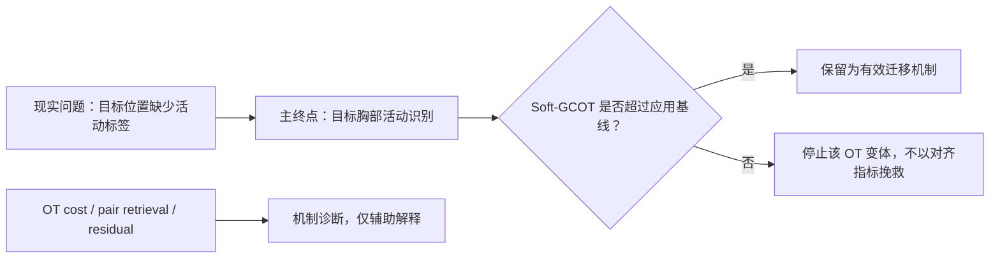

# 应用优先的研究路线修正

_2026-07-13；适用于当前 Soft-GCOT / PAMAP2 工作_

## 决定

从现在起，**不再把“获得更好的对齐”作为主目标**。研究问题改为：

> 在目标佩戴位置没有活动标签时，能否把源位置已学到的活动识别能力可靠地迁移到目标位置？

以 PAMAP2 为例：源域是 wrist IMU 及其活动标签，目标域是 chest
IMU。Soft-GCOT 只是一个候选的迁移机制；它只有在改善严格隔离的
目标胸部活动识别指标时才有价值。

## 已有证据应怎样解释

| 已观察到的事实 | 可以得出的结论 | 不可以得出的结论 |
| --- | --- | --- |
| MiHiA 无标签表示 MVP 可运行，但没有稳定超过固定 Soft-GCOT | 现有无标签重构与对齐信号不足以形成稳定的任务改进 | 表示学习或 Soft-GCOT 在所有协议中都无用 |
| PAMAP2 source-training 同步 wrist--chest 对的弱配对损失在 3 个 seed 中超过匹配的无配对控制 | 在当前小型、时间隔离的 Subject 101 协议中，合法的源训练配对可学习有用的跨视图表示 | Soft-GCOT 带来了该收益 |
| 同一弱配对设置加入当前可微 group/sample OT 后，seed 601 的目标准确率由 83.3% 降至 5.6% | 当前 OT 目标与已知配对锚点冲突；它不能作为该应用的有效组件 | 只需继续调 OT 权重即可恢复应用收益 |

因此，当前唯一正面的 PAMAP2 结果属于 **weak-pair no-OT** 基线，
不是 Soft-GCOT 的成功证据。必须如实保留这个边界。

## 固定的信息契约

当前 PAMAP2 分支的正确名称是：

> **弱监督跨视图活动迁移（weakly supervised cross-view activity transfer）**。

它不是完全无监督域适配，也不是无监督对应恢复。

| 数据或信息 | 允许的作用 |
| --- | --- |
| 源 wrist 活动标签 | 源任务训练与源验证模型选择 |
| 源训练块的同步 wrist--chest 对 | 弱配对表示损失 |
| target-adaptation chest 特征 | 无标签表示或对齐输入 |
| target-test chest 特征、活动标签、同步 pair ID | 模型冻结后的最终评价 |

目标测试窗口不得参与归一化拟合、训练、原型学习、OT、早停或参数选择。

## 主要终点与机制诊断

### 主要终点

目标胸部 held-out test 的：

1. Macro-F1；
2. balanced accuracy；
3. 每类 recall。

Accuracy 可以报告，但不单独作为成功标准，因为活动类别可能不平衡。

### 次要机制指标

以下指标仅用于解释模型为何成功或失败，不能替代主终点：

- paired retrieval（R@1、R@5、MRR）；
- OT objective、coupling entropy、group mass；
- Sinkhorn / ADMM 收敛诊断；
- latent rank、variance 与 collapse 诊断。

## 所有后续方法必须面对的应用对照

任何新的 Soft-GCOT 或 anchor-aware OT 变体都必须在相同的数据划分、
编码器容量、源任务监督和模型选择规则下，与以下对照比较：

| 方法 | 配对信息 | OT | 作用 |
| --- | ---: | ---: | --- |
| Source-only task | 否 | 否 | 源模型直接迁移下限 |
| Matched no-pair representation | 否 | 否 | 控制网络容量与重构训练 |
| Weak-pair no-OT | 是 | 否 | 当前正向应用基线 |
| Weak-pair + candidate OT | 是 | 是 | 只检验 OT 的增量价值 |

核心比较永远是：

$$
\text{weak-pair + candidate OT}
\quad\text{vs}\quad
\text{weak-pair no-OT}.
$$

若前者没有在预先保留的确认受试者 / 时间块上稳定提升主终点，
则该 OT 变体不应被保留为应用方法。

## 接下来的顺序

1. **冻结当前结果。** 不再调现有 group/sample OT 的权重，以避免在 seed 601 的失败上后验优化。
2. **先验证应用基线，而不是开发新 OT。** 用不查看目标测试标签的固定协议，在预先指定的 Subject 102 与 Subject 103 上复现 source-only、matched no-pair 和 weak-pair no-OT。这里回答的是弱配对跨视图迁移是否可重复，而不是 Soft-GCOT 是否有效。
3. **设定 OT 的进入门槛。** 只有当 weak-pair no-OT 在确认受试者上提供非平凡、稳定的目标任务收益时，才值得提出一个新的、可证伪的 anchor-aware OT 假设。
4. **若开发新的 OT，先写机制假设。** 它必须说明怎样保证已知源训练对不会被 transport coupling 拉开，并在实现前固定主终点、对照和停止条件。
5. **若新 OT 不能超过 weak-pair no-OT，则停止。** 可以将结论写成“弱配对跨视图学习有效，而当前层级 OT 在该任务上不增加价值”，不能反过来为 OT 寻找有利指标。

## 这对 Soft-GCOT 主线意味着什么

Soft-GCOT 仍然是一个可审计的层级对齐器，也保留为 MiHiA 上的机制
研究基线。它目前不是已经被验证的通用应用方案。

未来只有两条诚实的路径：

1. 在一个明确需要层级、弱对应恢复的应用中，证明它超过简单的任务迁移或配对表示学习；或
2. 将其定位为方法 / 机制研究，明确报告其成功条件与负迁移边界。

不应把数据、表示或指标不断调整到“看起来更适合 OT”。应用问题和
主终点必须先固定，方法承担被证伪的风险。
