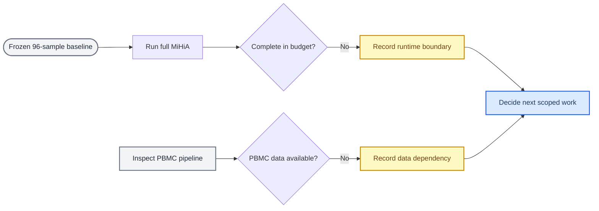

# 完整 MiHiA 与 PBMC 最小验证状态

_2026-07-12 · 冻结 Soft-GCOT HiWA 协议的最小外部验证记录_

---

## 🔎 当前结论

本轮没有修改 Soft-GCOT、ROCA、温度路径或任何超参数。完整 MiHiA 的 full-support 运行在十分钟预算内未完成第一个种子；PBMC 目录存在旧的 CC-HiWA 脚本，但仓库没有可运行的 PBMC 原始或处理后数据。因此，目前不能把这两项写成新的模型效果结论。

| 检查项 | 状态 | 可得出的结论 |
|---|---|---|
| 完整 MiHiA，seeds 90–92 | 未完成 | 当前 NumPy full-support 实现不适合直接进行该规模的三种子验证 |
| PBMC 数据 | 缺失 | 不能运行 Hard vs fixed Soft-GCOT 的最小基线 |
| PBMC 代码 | 部分存在 | 有 RNA–ATAC 预处理与旧 CC-HiWA runner，但不是当前 Soft-GCOT runner |

## 🧪 已执行的最小检查

完整 MiHiA 使用冻结配置：`audit` profile、`0.25 → 0.35 → 0.50` 温度路径、Hard warm start、同 prototype 的 Hard 对照、full-support ROCA，以及 `--max-samples 0`。为避免无关开销，本次显式关闭 sparse 近似。

命令在 604 秒后超时，且尚未输出任一完整种子的结果。该事件只说明当前实现的运行时间边界；它不说明 Hard、Soft-GCOT 或 ROCA 在完整数据上的优劣。

为支持这类聚焦实验，runner 新增了 `--no-include-sparse`。默认仍保留 sparse 诊断，因此既有实验行为不变。

## 📦 PBMC 接入检查

现有脚本中：

- `experiments/pbmc/prepare_pbmc_multiome.py` 需要用户提供 RNA 与 ATAC 的 `.h5ad` 文件，并输出 embedding、soft assignment、cell ID 与可选 cell-type 标签
- `experiments/pbmc/run_cc_hiwa_pbmc.py` 使用这些已准备的输入评估 paired-cell retrieval 与可选 cell-type transfer
- 当前仓库不存在 PBMC `.h5ad` 或处理后的 PBMC `.npz` 数据；唯一的 `data/sg_demo.npz` 不是 PBMC 数据

此外，现有 PBMC runner 对接的是旧的 CC-HiWA 接口，而非当前 MiHiA 的 Soft-GCOT HiWA runner。因此，在数据到位前，不应把它误称为已经建立的 Soft-GCOT 跨数据集验证。

## 🔀 当前决策路径

## ✅ 最小下一步

在不增加无关实验的前提下，下一步需要用户确认两件事之一：

1. 是否允许将完整 MiHiA 的运行预算改为单种子、或先做受控的规模/运行时间诊断；这属于工程可行性检查，不是模型调参
2. 提供或指定 PBMC RNA 与 ATAC 数据的位置；拿到数据后，再建立与当前冻结 Soft-GCOT 协议一致的 Hard vs fixed Soft-GCOT 最小 runner

在这两项之一解决前，尚不具备以完整数据或 PBMC 结果为依据进入联合优化的条件；96×96 的公平结果仍然是目前唯一已完成的可比较基线证据。
