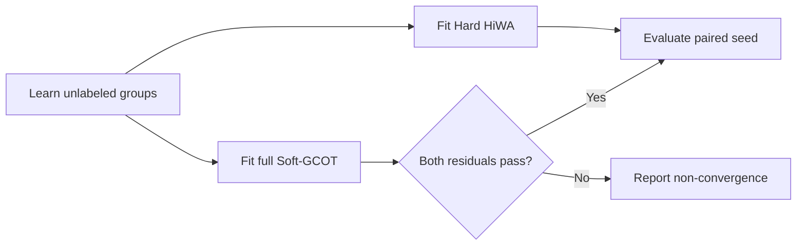

# 收敛后 Hard HiWA 与 Soft-GCOT 对照

_固定数值参数、多 seed 神经 smoke · 2026-07-11_

---

## 🔎 结论

5 个 Soft-GCOT seed 都达到预先固定的双残差阈值，但没有显示稳定性能优势。平均方向准确率差为 −0.025，平均 movement $R^2$ 差为 −0.252。

这是一轮有效的、收敛后的负结果：在当前 96-by-96 神经 smoke 设置中，TACO-faithful full-support Soft-GCOT 不优于 Hard HiWA。

## 🧪 固定协议

- seeds：50--54
- full-support Soft-GCOT；4 组；temperature=1.0；entropy weight=0.05
- Soft：$\mu=0.05$、outer budget=200、tolerance=$10^{-2}$、group Sinkhorn=300、local Sinkhorn=80
- Soft 纳入条件：global residual 与 ADMM primal residual 都不大于 $10^{-2}$
- prototype、OT formulation、ROCA 均未改变；标签只用于最终评价

## 📊 结果

| Seed | Soft iter. | Soft primal | Hard acc. | Soft acc. | Δ acc. | Hard $R^2$ | Soft $R^2$ | Δ $R^2$ |
|---:|---:|---:|---:|---:|---:|---:|---:|---:|
| 50 | 73 | 0.00940 | 0.5208 | 0.1042 | -0.4167 | 0.6117 | -1.5149 | -2.1266 |
| 51 | 77 | 0.00974 | 0.2500 | 0.4063 | +0.1563 | -0.8000 | -0.0447 | +0.7553 |
| 52 | 76 | 0.00948 | 0.2500 | 0.4063 | +0.1563 | -0.8032 | -0.0446 | +0.7587 |
| 53 | 78 | 0.00956 | 0.3958 | 0.3854 | -0.0104 | 0.6009 | -0.0469 | -0.6478 |
| 54 | 74 | 0.00990 | 0.2500 | 0.2396 | -0.0104 | -0.8028 | -0.8003 | +0.0025 |
| Mean | — | — | — | — | **-0.0250** | — | — | **-0.2516** |

所有 Soft run 的 Sinkhorn marginal error 均约为 $10^{-13}$ 至 $10^{-14}$。

## 🎯 解释边界

这否定的是一个具体命题：在这个固定、已收敛的神经 smoke 协议里，full-support Soft-GCOT 没有带来稳定平均提升。

它不证明 soft grouping 在其他任务、噪声或组重叠条件下无用。下一步应扩大到预先指定的更多 seed；在看到稳定增益前，不应把 Soft-GCOT 表述为优于 Hard HiWA。

原始结果：`experiments/results/taco_faithful_converged_full_seeds_50_54.json`。
