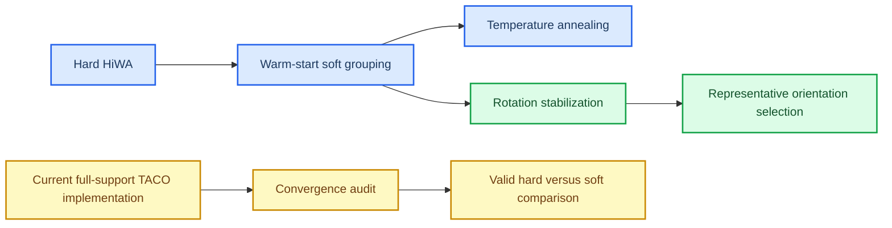

# Soft-GCOT 与 ROCA：既有成果总账

_盘点日期：2026-07-11。目的：区分已经完成的实验结论、当前代码的纯 TACO 实现，以及仍需补齐的可比性记录。_

---

## 🔎 结论先行

- 软分组、温度退火、旋转稳定化和代表点方向选择均已做过；不应重复运行。
- 软分组本身没有稳定地提高方向准确率：warm-start 软分组与 hard 持平，但运动 $R^2$ 略高；退火提高了平均 $R^2$，同时损失方向准确率。
- 最强的稳定性证据来自代表点方向符号选择：20 个确认 seed 全部选中高准确率支路，平均方向准确率 0.5775、平均运动 $R^2$ 0.5993；相对 prototype-hard 的平均提升分别为 +0.0589 和 +0.0195。
- 这些结果含有项目扩展（代表点/分量处理），不能直接宣称为“纯 TACO GCOT”的效果。当前仓库中的 `soft_hiwa.py` 已提供纯 TACO-faithful full-support 参照，但旧实验没有记录当前要求的 ADMM primal/dual residual 曲线。

## 📊 已有证据

| 层级 | 实验与种子 | 方向准确率 | 运动 $R^2$ | 结论 |
|---|---|---:|---:|---|
| Hard/soft 对照 | held-out 5–9 | hard 0.5441；warm soft 0.5441 | hard 0.5756；warm soft 0.5772 | warm soft 稳定，但方向准确率未增益 |
| 温度退火 | held-out 5–9 | annealed 0.5117 | annealed 0.5902 | $R^2$ 提高 +0.0147；方向准确率降低 −0.0324 |
| 旋转稳定化 | confirm 10–29 | hard-start 0.5103；unanchored 0.5023 | hard-start 0.6012 | 稳定化消除灾难性 $R^2$，但不能单独解决反射支路 |
| 代表点方向选择 | confirm 50–69 | 0.5775 | 0.5993 | 20/20 选中高准确率支路；无退化 simplex |
| 坐标翻转验证 | 70–79，3 个翻转条件 | 0.5764 | 0.5991 | 30/30 与预期分支一致 |
| Joint-Prototype 扩展 | 50–54 | −0.0003 vs frozen | −0.0169 vs frozen | 未显示收益，应保持探索性定位 |

来源均为迁移前完整项目的结果 JSON：`D:\ai\数学ai\Projects\最优传输\Experiments\hiwa_python_reproduction\results\`。标签只用于最终评估；其中 oracle 选择器被结果文件明确标为无效方法，未纳入结论。

## 🧭 方法关系与证据边界

### 可直接保留的结论

1. 随机初始化 soft grouping 会失败；从 hard 解 warm-start 后，灾难性失败消失，但方向准确率不提升。
2. 温度退火不是“免费提升”：它换取了更高、更稳定的运动 $R^2$，代价是方向准确率下降。
3. 反射/方向支路才是稳定性问题的关键接口。代表点的、无标签的方向符号规则在独立确认 seed 与显式坐标翻转中均通过。
4. Joint-Prototype 没有带来额外收益，当前不应作为主线。

### 暂不能直接写成最终主张的结论

- 不能把代表点方向选择的收益表述为“纯 TACO soft prototype 的收益”，因为它属于 HiWA/ROCA 的项目扩展。
- 不能用后来 96×96 的数值 smoke 结果推翻或替代上述完整实验；它只验证了当前 full-support 实现可满足残差门槛。
- 在同一记录协议下补齐 ADMM primal/dual residual 前，不能把旧 hard/soft 的性能差异写成严格的“收敛后纯 TACO 比较”。

## ✅ 当前进度

| 项目 | 状态 | 说明 |
|---|---|---|
| 历史实验结果盘点 | 完成 | 已识别温度、旋转、ROCA、坐标翻转、Joint-Prototype 的结果与边界 |
| 纯 TACO-faithful 实现 | 已存在 | 当前 `src/cc_hiwa/soft_hiwa.py` 提供 full-support 与 sparse-support 分支 |
| 统一收敛记录协议 | 已完成 | Hard 与 Soft 均输出 global/primal/dual residual、objective 与边际误差；尚未用该协议重跑完整确认表 |
| ROCA 有效性 | 已有强证据 | 代表点规则的 20-seed 确认及 30-case 坐标翻转验证均成功 |
| 最终主线冻结 | 未完成 | 需要把“纯 TACO”与“带 ROCA 的 HiWA 扩展”做成同协议的最终表 |

## 🎯 建议的下一步

不要再做温度扫描、不要再做新的算法分支。只做一次窄而可审计的补记录：

1. 固定已有的 warm-start soft 与 hard 配置和 seed 列表；不改 loss、原型、OT 或 ROCA。
2. 用统一 runner 对每个运行归档已实现的 ADMM residual、objective、Sinkhorn 误差和停止原因。
3. 只在收敛运行上报告三行最终表：Hard HiWA、Soft-GCOT HiWA、Soft-GCOT HiWA + ROCA。
4. 将 sparse-support 只作为计算近似的负对照，不与 full-support 的科学结论混合。

这一步完成后，研究问题会变得清楚：软原型是否改善了对齐本身；ROCA 是否只解决已收敛对齐的反射歧义。若答案仍是“soft 持平而 ROCA 稳定”，最有价值的后续不是扩模型，而是解释软分组为何只改善几何/回归稳定性而不改善方向判别。
