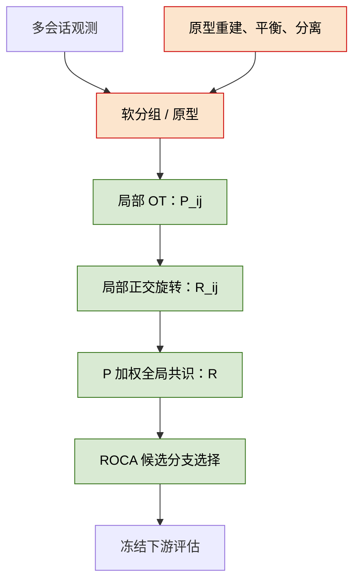

# OT-HiWA / ROCA 研究进展总结与论文就绪度

*更新日期：2026-07-23。本文只陈述已经保存的代码、固定协议和实验输出；“开发集结果”“重复初始化”和“独立泛化”严格区分。*

---

## 🧭 一句话结论

目前已经形成了一个可复现的 Soft-GCOT/HiWA 基线、一个在固定开发协议上带来增益的 ROCA 旋转分支选择规则，以及一组明确的反证结果：ROCA 的现有置信度判据不能在冻结的跨子样本检验中识别错误选择；现有真实神经—运动任务也尚未表现出稳定的迁移几何。与此同时，GC-HiWA v2 的数学合同已经修正并有部分代码落地，但完整的端到端模型尚未实现和验证。

因此，**现在可以写一篇诚实的研究进展稿或技术报告；尚不适合把当前版本作为“完整方法已被充分验证”的正式投稿论文。**

## 📦 已经完成的工作

| 模块 | 已完成内容 | 可追溯证据 |
|---|---|---|
| HiWA 基线 | 实现并固定 Hard HiWA、Soft-GCOT HiWA、全支持（full-support）局部 OT 与 ADMM 旋转求解；保留边际误差与收敛诊断。 | `experiments/hiwa/run_taco_faithful_baseline.py`，`src/cc_hiwa/soft_hiwa.py` |
| ROCA | 对两个合法正交候选旋转进行分支选择；在开发协议中比较几何方向、目标值与下游准确率。 | `experiments/roca/`，`tests/test_roca_candidate_disagreement.py` |
| 固定开发结果 | 在随机种子 80--89 的同一开发协议下汇总了 Hard、Soft-GCOT 与 Soft-GCOT+ROCA 的结果。 | `experiments/results/taco_faithful_baseline_full_support_roca_seeds_80_84.json` 与 `..._85_89.json` |
| ROCA 反证 | 提出了“几何方向与目标方向冲突且相对差距足够大”的候选冲突标记；随后在冻结跨子样本检验中证明它不能作为可靠置信度机制。 | `docs/research/ROCA_置信度分支停止决策_2026-07-20.md` |
| 跨子样本协议 | 为基线加入 `--subset-seed`，将抽样索引写入结果，以便在不改变算法配置的前提下复现实验子集。 | `experiments/roca/roca_cross_subsample_protocol_20260720.json`，`tests/test_baseline_runner.py` |
| PAMAP2 外部任务 | 建立了 Subject 101 的泄漏安全时间域协议；检验 task-aware OT 与弱配对设置。 | `docs/research/PAMAP2_temporal_domain_adaptation_protocol_2026-07-13.md` |
| GC-HiWA v2 修正 | 修正了原设计中熵项符号、原型分离无界、共识加权和“在线更新”表述等问题，并写出可执行的数学合同。 | `docs/research/GC-HiWA_v2_修正数学合同.md` |
| 原型分离代码 | 加入有界的余弦间隔原型分离损失；默认权重为 0，因此不会改变历史实验。 | `src/cc_hiwa/joint_prototypes.py`，`tests/test_joint_prototypes.py` |
| 回归检查 | 原有核心回归检查通过 48 项；加入原型分离后，相关模块的 30 项定向测试通过。 | 测试记录与上述测试文件 |

## 📊 已确认的数值结果及其含义

### 1. 固定开发协议上的 ROCA 增益

下表是种子 80--89 的聚合结果。三种方法使用相同的固定开发数据与评估方式；因此它说明 ROCA 在这一开发协议上的有效性，**不等同于独立泛化性能**。

| 方法 | HiWA Accuracy | 下游 $R^2$ | 相对 Soft-GCOT 的 Accuracy 变化 |
|---|---:|---:|---:|
| Hard HiWA | 0.4188 | 0.1908 | -0.0083 |
| Soft-GCOT HiWA | 0.4271 | 0.1947 | 0.0000 |
| Soft-GCOT HiWA + ROCA | **0.4792** | **0.3364** | **+0.0521** |

在这 10 个开发种子中，ROCA 选择了下游准确率较高的候选分支 8 次。这是当前最主要的正向结果，但它只能表述为：**ROCA 在固定开发协议中改善了候选旋转分支的选择。**

### 2. 对 ROCA 置信度机制的必要反证

开发集上曾出现两次错误选择（种子 85、86）。据此构造的“候选冲突”标记能够标出这两次错误，但该规则来自同一开发证据，不能把它当作泛化结论。

冻结跨子样本协议使用五个未参与上述规则形成过程的子样本（子样本种子 1001--1005），固定求解器种子为 0。结果为：

| 结论 | 数值 | 应有的解释 |
|---|---:|---|
| ROCA 分支选择正确 | 4 / 5 | 有限的、一次性冻结检验结果；样本数很小。 |
| 候选冲突标记触发 | 0 / 5 | 该标记没有识别任何不确定情形。 |
| 唯一错误选择是否被标记 | 否 | 该置信度机制在此协议下失败，不能作为自动拒绝/相信 ROCA 的依据。 |

这是一项有价值的边界结论：不要继续围绕该置信度阈值调参，也不要在论文中把它描述为可靠的置信度估计。

### 3. 当前真实神经—运动任务的限制

在同一冻结跨子样本检验中，各方法的准确率大多很低，且下游 $R^2$ 为负值。这表明当前任务切分下，神经表征到速度的迁移关系本身不稳定；旋转选择并不是当前瓶颈。这里不能把 Soft-GCOT 或 ROCA 的开发集提升推广成稳健的神经—运动迁移结论。

### 4. PAMAP2 的外部可迁移性探索

PAMAP2 使用 Subject 101 的时间域切分：训练/验证阶段不使用目标测试标签，目标域标签仅用于最终评价。

| 设置 | 目标测试准确率 | 结论 |
|---|---:|---|
| Source-only（胸部传感器） | 0.5000 | 作为无适配基线。 |
| 标签无关目标归一化 | 0.5000 | 没有带来改善。 |
| 可微 task-aware OT | 0.3148 | 相对 task-only 的配对变化为 -0.2037；3 个种子中 0 次更好，应停止该方向的参数扫描。 |
| 弱配对、无 OT | 0.7407 | 相对 task-only 的变化为 +0.2407；仅限 Subject 101 的探索性结果，不能声称跨受试者泛化。 |

这组结果说明：在这个任务上，弱配对提供的身份/时序对应信息可能比无监督 OT 更关键；但目前只有单受试者数据，必须先扩展到多受试者协议再讨论外部泛化。

## 🗂️ 其他数据集：已有工作、结果与定位

仓库中并不只有主神经任务和 PAMAP2。下表把所有已经有代码或结果的数据集一并列出。这里的关键不是“数据集数量”，而是每个数据集是否满足当前方法的可识别性假设、评估是否独立，以及结果能否支持论文主张。

| 数据集 | 任务与已有工作 | 当前结果 | 能否进入主论文证据链 |
|---|---|---|---|
| MiHiA / TACO-faithful 神经—运动 | 同一任务内的 Soft-GCOT/HiWA 与 ROCA；固定 96 样本审计子集与跨子样本检验。 | 有 ROCA 的开发集提升；跨子样本中下游 $R^2$ 不稳定且常为负。 | 可作为**方法开发与边界分析**，不能单独证明泛化。 |
| Indy-Loco | 2016-09-15 到 2016-09-21 的跨会话神经—速度迁移；已比较 source-only、Hard、Soft-GCOT 和显式配对 oracle。 | 一个 pilot 中 Soft-GCOT 的速度 $R^2=0.0176$，高于 source-only 的 $-0.1110$，但显式 oracle 也仅为 $0.1277$；其他冻结诊断没有显示稳定改善。 | 重要的**适用性反证**：当前全局正交几何不足以解释跨会话神经—行为差异。 |
| PAMAP2 | 单受试者（101）胸部/腕部时间域适配；含 source-only、task-aware OT、弱配对。 | task-aware OT 失败；弱配对在 Subject 101 有正向信号。资格审计显示本地仅有 101，102 缺少原始文件。 | 适合作为**有条件的外部案例**；取得更多受试者后才能成为泛化实验。 |
| PBMC RNA–ATAC | 配对细胞的跨模态对齐；已运行 Hard HiWA 与固定 Soft-GCOT，评估 paired recall 和细胞类型转移。 | 96-cell 子集上 Recall@1 约为 0--0.0208，细胞类型转移也很低，且 3 个种子中有一个未收敛。 | 当前不支持正向主张；可作为“跨模态条件下失配”的失败案例，或在完整预处理审计后重做。 |
| Paderborn 轴承 | 工况迁移的固定 Soft-GCOT 与 Hard HiWA。 | 仅速度变化时未对齐准确率已达 0.9375，而对齐后约 0.32--0.33；速度加轴承条件变化时各方法约为 0.333。 | 当前协议不适合作为方法验证：一种切分过于容易，另一种没有有效信号。应先重新设计工况/故障类别切分。 |

### 对“其他数据集”的实际决策

1. **Indy-Loco 应保留。** 它的价值是检验假设是否成立：连显式配对 oracle 都只能达到有限的 $R^2$，说明不能把失败简单归因于 OT 求解器。论文中应作为适用条件/反例，而不是硬凑正向结果。
2. **PAMAP2 是最优先的真实外部验证候选。** 现有代码和泄漏安全协议已经具备，但本地只有 Subject 101。多受试者原始文件到位前，不能把它写成跨受试者结果。
3. **PBMC 不应直接重跑或调参。** 先审计 RNA、ATAC、共享基因活性三种表示的尺度、细胞配对和标签分布，再决定是否存在可识别的线性/正交对齐目标；否则只会重复低 Recall。
4. **Paderborn 暂停作为主实验。** 先修复实验问题而不是优化模型：同一协议必须既有真实域偏移，又让 source-only 不能已经接近饱和。

## 🧩 GC-HiWA v2：哪些已经落地，哪些还没有

原始“完全无监督”结构不是直接可宣称完成的模型。我们已经将其修正为一个有明确边界的 v2 数学合同：使用有界的原型分离项、正确方向的负熵正则、按传输质量加权的全局共识，并将“交替优化”与“端到端可微优化”明确区分。

已实现的是 Soft-GCOT/ADMM 旋转核心、ROCA、以及原型分离损失的安全实现。尚未完成的是：把可学习原型、样本级内外层传输、交替优化/可微梯度和完整消融串成一个可运行、可复现、经合成真值验证的 GC-HiWA v2 系统。因此，v2 应被称为**已修正的设计与部分实现**，而不是已完成的新方法。

## 🛣️ 接下来应做什么

下一阶段不应继续在已被否定的置信度阈值或 task-aware OT 上扫参数。优先级如下：

1. **完成可运行的 GC-HiWA v2 坐标优化版本。** 先实现冻结软分组/原型、局部传输、局部旋转、$P$ 加权共识和受控原型更新的闭环；每一轮输出目标值、边际误差、正交误差和原型使用率。
2. **建立带已知真值的合成验证。** 数据必须显式控制真实旋转、组结构、噪声和错配率。只有在已知真值下验证旋转恢复、组恢复和失配鲁棒性，才进入真实数据。
3. **预先冻结消融协议。** 比较固定软分组、坐标优化原型、以及（如有必要）端到端可微版本；不得用评价标签选择模型或阈值。
4. **补齐多受试者 PAMAP2。** 在获得其他受试者原始数据后，先运行受试者资格审计，再复现弱配对结果并报告每位受试者、平均值和方差；若无法复现，保留负结果。
5. **按数据集的有效性筛选外部实验。** Indy-Loco 用于检验适用边界，PAMAP2 用于多受试者验证，PBMC 先做表示可识别性审计，Paderborn 先重建切分；不要把四者拼成未经验证的“多数据集胜利”。
6. **更新论文草稿。** 把当前跨子样本反证、v2 尚未完成状态、各外部数据集的证据等级写入主文；删除任何超出证据的“完全无监督已验证”表述。

## 📝 现在可以写论文吗？

可以，但应按用途区分。

| 用途 | 当前是否适合 | 建议的写法 |
|---|---|---|
| 组会汇报、阶段总结、技术报告 | **适合** | 以“已完成基线、固定开发结果、反证边界和 v2 路线”为主线。 |
| 论文式研究草稿 | **适合启动** | 可写背景、问题、基线、ROCA 开发结果、负结果、局限与下一步；所有正向结论需限定在固定协议。 |
| 宣称完整 GC-HiWA 已验证的正式方法投稿 | **尚不适合** | 必须先完成 v2 端到端实现、合成真值验证、冻结消融和至少一个独立的多主体/多受试者检验。 |

现有的论文式文档和 LaTeX 稿可作为写作起点，但需要先纳入最新的跨子样本反证与 GC-HiWA v2 的实现状态，才可用于对外交流。最稳妥的当前定位是：**一项有明确正向开发结果、也有清晰失败边界的研究工作；下一步是把修正后的模型放进可证伪的验证链条，而非扩大结论。**

## ✅ 论文质量门槛清单

| 门槛 | 当前状态 | 缺口 |
|---|---|---|
| 问题与基线定义 | 已具备 | 需在稿件中统一术语。 |
| ROCA 开发结果 | 已具备 | 需明确它不是独立测试结果。 |
| 置信度机制 | 已有反证 | 应停止作为主张，而不是继续补调参。 |
| GC-HiWA v2 完整实现 | 未具备 | 需要端到端坐标优化闭环与测试。 |
| 合成真值验证 | 不足 | 需要包含困难错配/噪声条件的冻结基准。 |
| 外部真实数据验证 | 不足 | PAMAP2 目前仅 Subject 101；需多受试者。 |
| 可复现性 | 部分具备 | 已有种子、配置、结果文件；应补齐 v2 的统一运行入口。 |
| 结论边界 | 已具备 | 对外稿中必须保留负结果与限制。 |

## 📚 关键本地材料

- [ROCA 论文式研究综述](ROCA-HiWA_论文式研究综述.md)：现有草稿，需按本文结论更新。
- [ROCA 失败机制与有效验证协议](ROCA_失败机制与有效验证协议_2026-07-20.md)
- [ROCA 置信度分支停止决策](ROCA_置信度分支停止决策_2026-07-20.md)
- [GC-HiWA v2 修正数学合同](GC-HiWA_v2_修正数学合同.md)
- [GC-HiWA 结构与现有结果融合](GC-HiWA_结构与现有结果融合.md)
- [PAMAP2 时间域适配协议](PAMAP2_temporal_domain_adaptation_protocol_2026-07-13.md)
- [PAMAP2 class-conditional transport 停止决策](PAMAP2_class_conditional_transport_stop_decision_2026-07-13.md)
