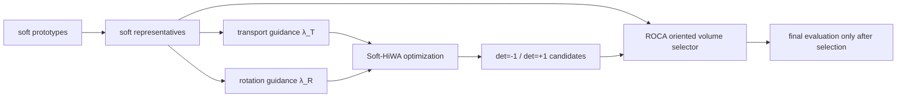

# 神经数据完整 TACO-SoftHiWA 流程审计与纠偏

## 1. 本次纠偏结论

这次需要明确纠偏：当前主线应该先回到猕猴神经元—运动数据，把 TACO 启发的 Soft-HiWA 流程做完整，再讨论第二、第三数据集迁移。

PBMC RNA-ATAC 子项目不是没有价值，但它目前只是第二数据集迁移前的诊断性预研，不能替代神经数据上的主方法开发，也不能把 one-shot CC-HiWA 结果当成完整 TACO-HiWA 结果。

## 2. 已经在神经数据上完成的部分

| 模块 | 是否已接入神经数据 | 证据文件 | 当前判断 |
|---|---:|---|---|
| HiWA Python 复现 | 是 | `Experiments/hiwa_python_reproduction/scripts/run_neural.py` | 可跑通，是全部工作的起点 |
| soft prototype / soft assignment | 是 | `scripts/soft_groups.py`, `scripts/run_soft_neural.py` | 已用于神经和运动两端分组 |
| Soft-HiWA alternating pipeline | 是 | `scripts/soft_hiwa.py` | 已有局部 rotation、group transport、global rotation 迭代 |
| hard-start / annealing | 是 | `scripts/run_rotation_stabilized.py` | 用于降低随机初始化不稳定 |
| det=+1 / det=-1 双候选 | 是 | `scripts/run_component_aware.py` | 已发现 O(3) 分支问题 |
| ROCA branch selector | 是 | `scripts/run_component_aware.py` | 代表点有向体积无标签选分支 |
| 坐标符号翻转验证 | 是 | `scripts/run_coordinate_flip_validation.py` | 支持 ROCA 不是机械固定某一 determinant |
| 合成 determinant 真值验证 | 是 | `scripts/run_roca_synthetic_determinant_validation.py` | 支持 selector 在合成真值上有效 |
| representative-guided group transport | 是 | `scripts/run_rgca_roca.py` | 代表元影响 group transport，但效果不稳定 |
| representative-guided global rotation | 本次补上 | `scripts/soft_hiwa.py` | 代表元现在可直接进入 $R$ 更新 |

## 3. 之前漏掉的关键点

之前实现的 RGCA 主要是让代表元影响组间运输代价：

$$
C_{kl}^{\mathrm{guided}}
=
C_{kl}^{\mathrm{local}}
+
\lambda_T s(C^{\mathrm{local}})
\widetilde C_{kl}^{\mathrm{rep}}.
$$

其中：

$$
C_{kl}^{\mathrm{rep}}=\|Rr_k^X-r_l^Y\|^2.
$$

这说明代表点影响的是 $P$，也就是 group transport。

但是 TACO 思想里更强的一点是：代表元不只是给 transport 加 cost，还可以直接参与对齐变换的估计。之前这一块没有完整接到神经数据 Soft-HiWA 里。

## 4. 本次补上的 representative-rotation 项

现在新增了一个独立参数：

$$
\lambda_R=\texttt{representative\_rotation\_weight}.
$$

旧的参数保留为：

$$
\lambda_T=\texttt{representative\_guidance\_weight}.
$$

它们的区别是：

| 参数 | 控制对象 | 数学作用 | 默认值 |
|---|---|---|---:|
| $\lambda_T$ | group transport $P$ | 代表点改变组间运输代价 | 0 |
| $\lambda_R$ | global rotation $R$ | 代表点直接进入正交矩阵更新 | 0 |

直接代表元旋转项对应的目标可以写成：

$$
\min_{R^\top R=I}
\sum_{ij} T_{ij}\|Rx_i-y_j\|^2
+
\lambda_R\sum_{kl}P_{kl}\|Rr_k^X-r_l^Y\|^2.
$$

在当前 Soft-HiWA 的全局 rotation consensus 更新中，代表元产生的 cross-covariance 是：

$$
M_{\mathrm{rep}}
=
(R_Y)^\top P^\top R_X,
$$

其中 $R_X$ 是 source representatives 矩阵，$R_Y$ 是 target representatives 矩阵。

新的全局更新形式是：

$$
R
=
\operatorname{Polar}
\left(
\bar A
+
\lambda_{\mathrm{anchor}}R_{\mathrm{anchor}}
+
\lambda_R M_{\mathrm{rep}}
\right).
$$

这里 $\bar A$ 是原 Soft-HiWA 的 local rotations consensus 矩阵。

## 5. 为什么要把 $\lambda_T$ 和 $\lambda_R$ 分开

因为它们回答的问题不同：

- $\lambda_T$ 问的是：代表元能不能让 group transport 更合理？
- $\lambda_R$ 问的是：代表元能不能让正交对齐本身更稳定？
- ROCA 问的是：两个 determinant 分支跑完后，能不能无标签选对分支？

因此三个东西可以共存，但必须分别消融：



## 6. 本次最小验证

运行了：

```bash
python -m py_compile scripts\soft_hiwa.py scripts\run_soft_neural.py scripts\run_rotation_stabilized.py scripts\run_rgca_roca.py
```

```bash
python -m unittest discover -s tests -v
```

结果：

```text
Ran 38 tests
OK
```

随后做了两个神经数据 smoke：

```bash
python scripts\run_rgca_roca.py --profile quick --seeds 50 51 --guidance-weights 0.0 0.01 --rotation-weights 0.0 0.01 --tag neural_rep_rotation_smoke_2026_07_10
```

```bash
python scripts\run_rgca_roca.py --profile quick --seeds 50 51 --guidance-weights 0.0 --rotation-weights 0.0 0.001 0.003 --tag neural_rep_rotation_tiny_smoke_2026_07_10
```

## 7. smoke 结果解释

### 7.1 baseline

在 seeds 50-51 上，$\lambda_T=0,\lambda_R=0$ 的 ROCA baseline：

| 设置 | Mean direction accuracy | Mean movement $R^2$ | ROCA 选中高 accuracy 分支 |
|---|---:|---:|---:|
| $\lambda_T=0,\lambda_R=0$ | 0.592295 | 0.601457 | 2/2 |

这说明旧主线仍然稳定。

### 7.2 只开代表元 rotation 项

| 设置 | Mean direction accuracy | 相对 baseline | Mean movement $R^2$ | 相对 baseline |
|---|---:|---:|---:|---:|
| $\lambda_R=0.001$ | 0.592295 | 0.000000 | 0.601375 | -0.000082 |
| $\lambda_R=0.003$ | 0.589888 | -0.002408 | 0.601042 | -0.000416 |
| $\lambda_R=0.010$ | 0.582665 | -0.009631 | 0.593445 | -0.008012 |

解释：

- 直接代表元 rotation 项已经可运行；
- 小权重 $\lambda_R=0.001$ 基本不破坏 baseline；
- 权重变大后开始轻微下降；
- 当前不能声称它提升了精度；
- 但它补齐了“代表元参与 $R$ 更新”的完整流程。

### 7.3 开启 transport guidance 的风险

在 seed 50，$\lambda_T=0.01$ 出现灾难性失败：

| 设置 | Seed 50 selected accuracy | Seed 50 selected $R^2$ |
|---|---:|---:|
| $\lambda_T=0,\lambda_R=0$ | 0.611557 | 0.597722 |
| $\lambda_T=0.01,\lambda_R=0$ | 0.313002 | -0.804036 |
| $\lambda_T=0.01,\lambda_R=0.01$ | 0.313002 | -0.804077 |

这说明不能粗暴地把 TACO 里的 group-conditioned 思想加进 HiWA；当前数据上 group transport guidance 可能会破坏连续运动几何。

## 8. 图片

![[rgca_roca_summary_neural_rep_rotation_smoke_2026_07_10.png]]

![[rgca_roca_summary_neural_rep_rotation_tiny_smoke_2026_07_10.png]]

## 9. 当前判断

### 事实

1. 神经数据上的完整流程已经从“soft grouping + ROCA”补到“soft grouping + representative transport guidance + representative rotation guidance + ROCA”。
2. 代表点现在不只是用于事后 selector，也不只是影响 $P$，还可以直接影响 $R$。
3. 默认权重为 0，因此旧 ROCA 结果仍可复现。
4. 小 smoke 显示 $\lambda_R$ 很小的时候可控，但没有提升。
5. $\lambda_T=0.01$ 在 seed 50 可能导致灾难性失败。

### 解释

当前神经数据中，HiWA 原本的连续几何对齐已经很强，强行加入 group-level representative guidance 可能会改变 transport 结构，反而破坏运动几何。

也就是说，我们现在学到的不是“代表点没用”，而是：

> 代表点最稳的用途仍然是无标签确定 O(3) 分支；代表点进入优化过程可以做，但必须非常弱、可诊断、可消融。

## 10. 下一步

先不要换数据、也不要大规模追分。建议下一步在神经数据上做三个受控检查：

1. 固定 $\lambda_T=0$，只检查 $\lambda_R \in \{0,0.0005,0.001,0.002\}$ 在 seeds 50-69 上是否稳定；
2. 对 seed 50 的 $\lambda_T=0.01$ 灾难性失败做诊断，检查是 group transport 变坏、local/global rotation 不一致，还是 ROCA selector 在该设置下失效；
3. 如果 $\lambda_R$ 只是“不破坏但不提升”，论文主方法仍应以 ROCA 为核心，把 representative-guided optimization 作为扩展/消融，而不是主贡献。

