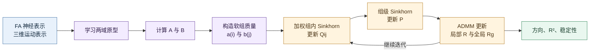

# 软分组尝试计划

_Soft-Prototype HiWA 实验设计 · 2026-07-05 · 先设计、后编码、再验证_

---

> [!note] 实施状态
> 第一版实验已完成。结果与解释见 [[软分组首次实验结果解释-2026-07-05]]。当前结论是随机软优化不稳定，硬解暖启动能够稳定软细化，但尚未获得平均方向准确率提升。

## 📋 先给结论

本次改进不准备直接重写整个 HiWA，而是分成两个可验证阶段：

1. **第一阶段：冻结软分组的 Soft-HiWA。** 借鉴 TACO，用可学习原型产生软归属矩阵；固定这些归属后，把 HiWA 的硬簇集合替换成带权经验分布，再运行加权的层级最优传输。
2. **第二阶段：原型与 HiWA 联合迭代。** 只有第一阶段证明软分组本身有效后，才让原型、软归属和 $P,Q,R$ 互相更新。

第一阶段是当前要实现的主实验。这样设计的原因是：一次只改变一个主要机制，才能知道结果提升究竟来自软分组、原型初始化，还是其他代码变化。

> [!important] 核心研究问题
> 在不使用真实运动方向标签进行分组的条件下，TACO 式软原型分组能否比自动硬聚类获得更高的平均方向准确率、更低的随机种子方差，同时保持运动 $R^2$？

本实验暂时固定软组数量 $K=4$，目的是先隔离“硬分组与软分组”的差异。**自动选择组数**是下一阶段问题，不在第一版同时解决。

## 🧠 TACO 中真正要借鉴的部分

TACO 原文的 Group-Conditioned Optimal Transport 采用以下机制：

1. 为两个模态分别建立一组可学习原型；
2. 用样本与原型的相似度经过逐行 softmax，得到软归属；
3. 用重构损失和熵正则学习原型，避免无意义分组；
4. 每个软组不是一份硬切片，而是“全体样本上的带权概率分布”；
5. 外层 $P$ 匹配软组，内层 $Q_{ij}$ 匹配每对软组中的样本，$R$ 负责空间对齐。

这里“选取每个分组的代表”应准确理解为：**为每组学习一个 prototype 向量作为代表**。它不一定是数据中真实存在的某个样本，也不是把整组只压缩成一个点后就丢掉其他样本。

在最终 OT 中，组内所有样本仍然存在，只是各自质量由软归属决定。原型负责定义分组和提供粗粒度代表，$Q_{ij}$ 仍负责细粒度样本匹配。

| 内容 | TACO 原文 | 本项目第一版 |
|---|---|---|
| 两个模态 | 文本、几何 | 神经表示、运动表示 |
| 分组方式 | 可学习软原型 | 可学习软原型 |
| 归属函数 | 点积 + softmax | 点积 + 带温度 softmax |
| 原型目标 | 重构损失 - 熵奖励 | 保留相同主干，增加数值保护 |
| 外层传输 | 软组间 $P$ | 软组间 $P$ |
| 内层传输 | 带权样本 $Q_{ij}$ | 带权样本 $Q_{ij}$ |
| 表示编码器 | 文本/几何神经网络 | 沿用 FA 与运动三维表示 |
| 第一版是否端到端 | 原文用于联合训练框架 | 否，先冻结软组以隔离变量 |

> [!note] 事实与改造的边界
> “软原型、softmax 归属、重构与熵目标、带权软组测度”来自 TACO 原文；温度参数、两阶段冻结策略、原型辅助初始化和神经数据评价协议是我们为 HiWA 设计的改造。

## 📐 硬分组怎样改成软分组

### 原始 HiWA 的硬分组

原始代码接收标签向量：

$$
z_k^X\in\{1,\ldots,K_X\},
\qquad
z_l^Y\in\{1,\ldots,K_Y\}.
$$

第 $i$ 个源簇是一个集合：

$$
X_i=\{x_k:z_k^X=i\}.
$$

代码通过布尔掩码 `X_labels == i` 把点硬切出来，并在该簇内部给每个点相同质量 $1/|X_i|$。

问题在于：一个边界样本只能被放进一个簇，分错后无法在后续优化中修正。

### TACO 式软归属

设源域样本矩阵为 $X=[x_1,\ldots,x_n]^\top\in\mathbb{R}^{n\times d}$，建立 $K_X$ 个源原型：

$$
C^X=[c_1^X,\ldots,c_{K_X}^X]\in\mathbb{R}^{d\times K_X}.
$$

本项目采用带温度的软归属：

$$
A_{ki}
=
\frac{\exp(\langle x_k,c_i^X\rangle/\tau_X)}
{\sum_{r=1}^{K_X}\exp(\langle x_k,c_r^X\rangle/\tau_X)}.
$$

同理，目标域有原型 $C^Y$ 和软归属：

$$
B_{lj}
=
\frac{\exp(\langle y_l,c_j^Y\rangle/\tau_Y)}
{\sum_{r=1}^{K_Y}\exp(\langle y_l,c_r^Y\rangle/\tau_Y)}.
$$

其中：

- $A_{ki}$ 表示源样本 $x_k$ 属于第 $i$ 个软组的程度；
- 每一行满足 $A_{ki}\ge0$ 且 $\sum_i A_{ki}=1$；
- $\tau$ 小时归属接近 one-hot，趋近硬分组；
- $\tau$ 大时归属更平均，保留更多边界不确定性。

TACO 原公式没有显式温度；这里加入 $\tau$ 是为了可以连续研究“多软才合适”，同时改善不同数据尺度下的数值控制。

### 学习每组的代表原型

源域原型使用 TACO 式重构与熵目标：

$$
\mathcal L_{\mathrm{proto}}^X
=
\frac{1}{n}\left\lVert A(C^X)(C^X)^\top-X\right\rVert_F^2
-\lambda_H\frac{1}{n}\sum_{k=1}^{n}H(A_{k,:}),
$$

其中：

$$
H(A_{k,:})=-\sum_i A_{ki}\log(A_{ki}+\varepsilon).
$$

目标域同样计算 $\mathcal L_{\mathrm{proto}}^Y$。重构项要求多个原型能组合还原样本，熵奖励允许边界样本保持不确定性。

第一版将在标准化后的三维表示中用 SciPy 优化少量原型参数。$d=3,K=4$ 时每个模态只有 12 个原型参数，不需要先引入大型深度学习框架。

### 从归属矩阵构造软组概率分布

第 $i$ 个源软组中，第 $k$ 个样本的归一化质量为：

$$
a_k^{(i)}=rac{A_{ki}}{\sum_{r=1}^{n}A_{ri}}.
$$
于是第 $i$ 个软组不再是一个硬集合，而是带权经验测度：

$$
\mu_i=\sum_{k=1}^{n}a_k^{(i)}\delta_{x_k}.
$$

目标域对应为：

$$
b_l^{(j)}=rac{B_{lj}}{\sum_{r=1}^{m}B_{rj}},
\qquad
\nu_j=\sum_{l=1}^{m}b_l^{(j)}\delta_{y_l}.
$$

这意味着每个软组都包含全部样本，但低归属样本只携带极少质量。

### Soft-HiWA 的内层与外层 OT

内层传输计划改为满足软组质量边缘：

$$
Q_{ij}\mathbf 1_m=a^{(i)},
\qquad
Q_{ij}^\top\mathbf 1_n=b^{(j)},
\qquad
Q_{ij}\ge0.
$$

总体目标保持 HiWA 的层级结构：

$$
\min_{P,R,\{Q_{ij}\}}
\sum_{i=1}^{K_X}\sum_{j=1}^{K_Y}
P_{ij}
\sum_{k=1}^{n}\sum_{l=1}^{m}
Q_{ij}(k,l)\lVert Rx_k-y_l\rVert_2^2,
$$

其中第一版按照 TACO 使用均匀组级边缘：

$$
P\mathbf1_{K_Y}=\frac{1}{K_X}\mathbf1_{K_X},
\qquad
P^\top\mathbf1_{K_X}=\frac{1}{K_Y}\mathbf1_{K_Y}.
$$

后续消融再比较由归属频率得到的经验边缘：

$$
\alpha_i=\frac{1}{n}\sum_k A_{ki},
\qquad
\beta_j=\frac{1}{m}\sum_l B_{lj}.
$$

当 $A,B$ 变成 one-hot 矩阵时，$a^{(i)},b^{(j)}$ 就退化为原始 HiWA 簇内的均匀质量。因此硬分组是该软分组公式的特例，这也将成为实现正确性的核心单元测试。

## 🏗️ 代码将怎样改

原则是：**不修改作者原始 `PyHiWA` 文件。** 新实现放入复现实验目录，通过独立类和运行器调用，便于与原方法逐行比较和随时回退。



### 计划新增的文件

| 文件 | 责任 | 不负责什么 |
|---|---|---|
| `scripts/soft_groups.py` | 原型初始化、softmax、原型损失、软归属诊断 | 不求 HiWA |
| `scripts/soft_hiwa.py` | 接收 $A,B$，构造带权软组并求 $P,Q,R$ | 不读取数据、不画图 |
| `scripts/run_soft_neural.py` | 猴神经实验入口、多种子运行、保存 JSON | 不修改作者 Notebook |
| `scripts/run_soft_synthetic.py` | 合成数据正确性与压力测试 | 不作为最终神经结论 |
| `tests/test_soft_groups.py` | 行和为 1、列质量非零、熵与 one-hot 极限 | 不测试最终精度 |
| `tests/test_soft_hiwa.py` | $Q$ 边缘、one-hot 退化、旋转正交性 | 不挑选最好种子 |

### `soft_groups.py` 的接口计划

```python
result = learn_soft_groups(
    features,
    n_groups=4,
    temperature=1.0,
    entropy_weight=0.1,
    seed=0,
)

prototypes = result.prototypes      # shape: (d, K)
assignments = result.assignments    # shape: (n, K)
group_weights = result.group_weights  # shape: (n, K)，每列归一化
```

原型初值采用可复现的 K-means++，优化采用稳定 softmax 与 `scipy.optimize.minimize`。所有损失曲线、组质量、平均熵和原型间距离都写入结果文件。

### `soft_hiwa.py` 的核心改动

原代码的关键语句是：

```python
X_i = X_mbed[X_labels == cluster_i]
Y_j = Y_mbed[Y_labels == cluster_j]
```

软版本不再切片，而是每对组都使用完整点集和不同边缘质量：

```python
p_i = normalize(A[:, i])
q_j = normalize(B[:, j])
R_ij, Q_ij, C_ij = weighted_subspace_alignment(
    X_mbed, Y_mbed, p_i, q_j, P[i, j], T_ij
)
```

原 `_subspace_alignment_solver()` 内部把簇内质量固定为均匀分布。新函数将显式接收 `p_i` 和 `q_j`，再传给已有 Sinkhorn 计算。外层 $P$、局部旋转、全局旋转和 ADMM 结构先保持不变。

### 原型怎样参与优化

第一版中，原型有两个作用：

1. 产生 $A,B$，从而决定每个 $Q_{ij}$ 的边缘质量；
2. 可选地用原型间距离初始化组级代价和 $P$，检查是否能缓解随机初始化问题。

原型不会替代所有样本，也不会直接删除内层 $Q_{ij}$。如果只在 prototype 点之间做 OT，就变成了压缩版组级匹配，无法检验 TACO/HiWA 的完整层级结构。

## 🧪 实验怎样设计

### 第一阶段：实现正确性，不比较高分

先在小型合成数据上通过以下检查：

1. $A,B$ 每行之和为 1；
2. 每个软组的 $a^{(i)},b^{(j)}$ 分别和为 1；
3. $Q_{ij}$ 的行和、列和满足指定软边缘；
4. $R^\top R\approx I$；
5. one-hot 的 $A,B$ 能在数值容差内退化回硬分组 HiWA；
6. 温度降低时平均归属熵下降；
7. 软组没有全部坍缩为同一个原型。

只有这些测试通过，才运行猴神经结果。否则更高准确率也不能视为可信改进。

### 第二阶段：最小对照实验

| 编号 | 方法 | 分组信息 | 目的 |
|---|---|---|---|
| B0 | No alignment | 无 | 对齐前下限 |
| B1 | Oracle hard HiWA | 真实方向标签 | 已知正确硬组的参考上界，不属于自动方法 |
| B2 | K-means hard HiWA | 自动硬簇 | 自动硬分组基线 |
| B3 | GMM-soft HiWA | GMM responsibilities | 最简单软分组基线 |
| A1 | Prototype-hard HiWA | 对 TACO 原型归属取 `argmax` | 与 A2 共用原型，单独隔离“软”带来的作用 |
| A2 | TACO-style Soft-HiWA | 连续 $A,B$ | 本次主方法 |
| A3 | Soft-HiWA + prototype init | 连续 $A,B$ | 检查代表原型能否改善初始化稳定性 |

最关键的比较不是 A2 对 B1，而是：

- A2 对 A1：同一套原型下，软权重是否优于硬化归属；
- A2 对 B2/B3：TACO 式原型学习是否优于常规自动分组；
- A3 对 A2：原型辅助初始化是否进一步降低方差。

Oracle hard HiWA 使用真实标签，只作为参考上界。自动软分组即使没有超过它，也可能是有效结果，因为真实任务中通常没有真实分组标签。

### 第三阶段：软度与正则消融

第一轮固定 $K=4$。只改变两个因素：

| 因素 | 候选设置 | 回答的问题 |
|---|---|---|
| 温度 $\tau$ | 低、中、高三个预先固定水平 | 太硬、适中、太软分别怎样 |
| 熵权重 $\lambda_H$ | 0、弱、强三个水平 | 熵奖励是否防止不稳定或造成过度平均 |

具体数值将在实现后根据标准化特征和初始损失量级确定，并在正式看标签结果前冻结。第一轮不同时搜索 $K$、Sinkhorn 熵、ADMM 参数和原型参数，避免无法归因。

如果第一轮有效，再扩展 $K\in\{3,4,5,6\}$，研究错误组数下的鲁棒性和自动 $K$ 选择。

### 随机种子与配对设计

Soft-HiWA 有两类随机性：原型初值和 HiWA 旋转初值。实验采用配对种子，使不同方法共享同一组随机条件。

1. 冒烟阶段：5 组预先固定种子，快速发现错误；
2. 正式阶段：至少 20 组预先固定的 `(prototype_seed, hiwa_seed)`；
3. 如果方差仍大，再做 $5\times5$ 的交叉设计，分解“原型初始化方差”和“HiWA 初始化方差”；
4. 不允许根据方向标签挑选最好种子。

这相当于把随机种子当作区组：同一组种子下比较 A1、A2、A3，使方法差异不被随机初值差异掩盖。

## 📊 怎样判断结果是否更好

### 主要指标

主要终点是猴神经方向 1-NN 准确率的**多种子平均值**。因为本次改动直接针对组结构，方向语义是最敏感的评价。

主要比较量为配对差：

$$
\Delta_s
=
\operatorname{Acc}_{\mathrm{soft},s}
-
\operatorname{Acc}_{\mathrm{hard},s}.
$$

报告 $\Delta_s$ 的均值、标准差和配对 bootstrap 置信区间，不只报告最好一次。

### 次要指标

| 类型 | 指标 | 解释 |
|---|---|---|
| 连续对齐 | 运动 $R^2$ | 软分组不能以破坏连续运动对齐为代价 |
| 稳定性 | 跨种子标准差、最差值、成功率 | 是否减少初始化敏感性 |
| 优化 | 收敛率、迭代数、最终残差、目标值 | 是否更容易优化 |
| 计算 | 运行时间、内存 | 使用全样本软组会增加成本 |
| 软组 | 平均熵、最小组质量、有效组数 | 是否过硬、过软或坍缩 |
| 可解释性 | 原型间距离、$P$、软组方向纯度 | 真实标签仅用于事后解释 |

### 第一轮继续推进标准

Soft-HiWA 被视为值得继续研究，需要同时满足：

1. 相比 A1 或最佳自动硬基线，平均方向准确率至少提高 2 个百分点；
2. 配对差的区间主要位于 0 以上，而不是只由一个幸运种子拉高；
3. 运动 $R^2$ 平均下降不超过 0.01；
4. 方向准确率标准差不明显恶化，或最差种子得到改善；
5. 没有软组坍缩、NaN、边缘质量错误或大量不收敛。

“提高 2 个百分点”是项目内部的首轮 go/no-go 门槛，不是统计学定律。最终论文判断仍应同时看效应量、区间、稳定性和计算代价。

## ⚠️ 主要风险与预案

| 风险 | 表现 | 第一预案 |
|---|---|---|
| 所有原型相同 | 组间距离接近 0 | 多初值、K-means++、原型距离诊断 |
| 归属过软 | 每行接近 $1/K$ | 降低 $\tau$ 或熵权重 |
| 归属过硬 | 退化成 K-means | 提高 $\tau$，检查边界样本熵 |
| 某组质量接近 0 | Sinkhorn 数值不稳 | 质量下限、重新初始化、记录失败 |
| 全样本进入每个组导致变慢 | $K_XK_Ynm$ 成本上升 | 后续再做 top-k 稀疏化，不在第一版混入 |
| 软分组使用标签调参 | 结果泄漏 | 参数在合成数据或无标签准则上冻结 |
| 准确率提高但 $R^2$ 下降 | 只改善离散语义 | 同时报告两类指标，不隐瞒权衡 |
| 软组比硬组方差更大 | 原型随机性叠加 | A3 原型初始化、交叉种子方差分解 |

### 关于计算复杂度

硬 HiWA 的每对簇只处理簇内子集；朴素软版本中每个组对都处理完整的 $n\times m$ 传输矩阵，计算量约随 $K_XK_Ynm$ 增长。

第一版先保证数学正确，不提前稀疏化。若确认有效，再尝试：

- 每组只保留归属最高的 top-k 样本；
- 低于阈值的质量置零后重新归一化；
- 原型层筛掉 $P_{ij}$ 极小的组对；
- mini-batch 或低秩 OT。

这些属于第二轮效率改进，不能和首次有效性实验混在一起。

## 🗺️ 执行顺序

### 阶段 0：冻结协议

- [ ] 确定第一轮 $K=4$、温度与熵权重候选水平
- [ ] 固定 20 组配对随机种子
- [ ] 明确标签只用于 Oracle 上界和最终评价
- [ ] 保存当前 HiWA 基线结果与环境

### 阶段 1：软分组模块

- [ ] 实现稳定 softmax、prototype loss 和 K-means++ 初始化
- [ ] 输出 $A,B$、原型、重构损失、平均熵和组质量
- [ ] 验证温度变化与 one-hot 极限
- [ ] 检测空组和原型坍缩

### 阶段 2：加权 HiWA

- [ ] 新建 `SoftHiWA`，不修改作者源文件
- [ ] 将硬标签切片改为软组边缘质量
- [ ] 修改组内 Sinkhorn 接收任意 $p_i,q_j$
- [ ] 验证 $Q_{ij}$ 边缘和 $R$ 正交性
- [ ] 验证 one-hot 软分组退化回原 HiWA

### 阶段 3：小规模实验

- [ ] 合成数据验证边界样本、重叠簇和不平衡簇
- [ ] 猴神经 5 组种子冒烟测试
- [ ] 生成逐种子结果和失败日志
- [ ] 确认无标签选择协议没有泄漏

### 阶段 4：正式比较

- [ ] 完成 B0-B3、A1-A3 的配对多种子运行
- [ ] 报告准确率、$R^2$、方差、收敛率与运行成本
- [ ] 完成温度和熵权重消融
- [ ] 根据预设标准决定进入联合优化还是停止

### 阶段 5：只有第一版有效才做

- [ ] 交替更新原型与 $P,Q,R$
- [ ] 研究经验组级边缘 $\alpha,\beta$
- [ ] 研究自动 $K$ 或可变组数
- [ ] 研究稀疏化与计算加速

## ✅ 预期产出

完成第一版后，应得到：

1. 一个不修改原作者代码的 `SoftHiWA` 独立实现；
2. 一套能让硬分组退化测试通过的数学与代码证据；
3. TACO 原型软分组、GMM 软分组和自动硬聚类的公平对照；
4. 至少 20 组配对随机种子的方向准确率与 $R^2$；
5. 软归属熵、组质量、原型和组级传输 $P$ 的解释图；
6. 一个明确结论：软分组有效、无效，或只在特定软度/噪声条件下有效。

无论结果是否提升，这套实验都能回答一个有研究价值的问题：HiWA 的性能限制究竟来自硬簇边界，还是主要来自后续非凸对齐与初始化。

## 🔗 对照材料

- [TACO 原论文](<../Taco/_TPAMI__Learning_Geometric_Knowledge_from_Text_for_Effective_Geometry_Free_Adsorption_Configuration_Screening (2).pdf>)
- [TACO / HiWA 软分组公式推导](../Taco/Taco公式推导.md)
- [TACO 数学基础](../Taco/TACO数文本笔记学基础.md)
- [HiWA 代码意义、复现结果与改进切口](./HiWA代码意义、复现结果与改进切口-2026-07-04.md)
- [HiWA 复现指标数学解释](./HiWA复现指标数学解释-准确率、R平方与稳定性-2026-07-05.md)
- [作者 HiWA 实现](../../PyHiWA/src/hiwa.py)
- [当前猴神经运行器](../../../Experiments/hiwa_python_reproduction/scripts/run_neural.py)

## 🚀 最终方法定位

如果第一阶段得到正结果，方法可以暂时命名为：

> **Soft-Prototype Hierarchical Wasserstein Alignment，Soft-Prototype HiWA。**

它的核心不是重新发明 Sinkhorn 或 ADMM，而是把 HiWA 依赖的固定硬簇，推广为由 TACO 式原型学习诱导的软组条件分布，并用带权 $Q_{ij}$ 保留组内样本的不确定性。

第一轮成功的最低证据不是“出现一个更高的最好分数”，而是：**在不使用真实分组标签的前提下，多种子平均方向准确率提高，稳定性不恶化，运动 $R^2$ 基本保持，并且数学退化测试全部通过。**
