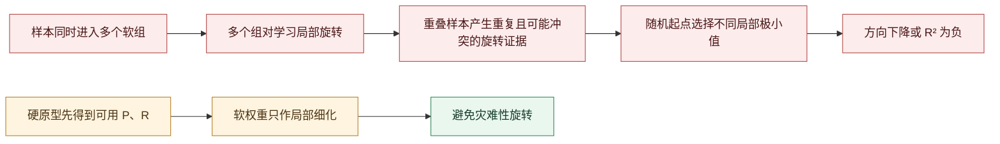

# 软分组首次实验结果解释

_Soft-Prototype HiWA 首次实现与配对种子试验 · 2026-07-05_

---

## 📋 最终结论先说清楚

这次尝试完成了，但结论不是简单的“软分组更好”。更准确的结论分成三层：

1. **TACO 式原型学习是有用的。** 它能够在不使用真实方向标签分组的情况下，产生结构清楚、质量不坍缩的四组表示。
2. **把软权重直接接入随机初始化的 HiWA 不稳定。** 在未参与温度选择的种子 5–9 上，随机初始化 Soft-HiWA 的平均方向准确率为 $47.29\%$，低于相同原型硬化后的 $54.41\%$；平均 $R^2$ 也因一个灾难性失败降到 $0.2966$。
3. **从硬原型 HiWA 的解暖启动，可以安全加入软权重，但暂时没有带来方向准确率提升。** 暖启动软版本的平均方向准确率仍为 $54.41\%$，平均 $R^2$ 从 $0.5756$ 小幅变为 $0.5772$，差异接近零。

因此，当前不能宣称“软分组已经改善 HiWA”。可以宣称的是：

> 我们实现并验证了 Soft-Prototype HiWA 的第一版；发现软度和初始化存在强耦合。随机软优化会产生坏局部解，而硬解暖启动可以消除灾难性失败，但第一轮尚未获得稳定性能增益。

这不是一次无效实验。它把问题从模糊的“软分组会不会更好”，缩小成了更具体的研究问题：

> 怎样让软分组在不破坏硬原型好解的条件下，真正利用边界样本的不确定性？

## 🧠 这次究竟实现了什么

### 软原型学习

对神经三维表示 $X$ 和运动三维表示 $Y$ 分别学习四个原型。以源域为例：

$$
A_{ki}
=
\frac{\exp(\langle x_k,c_i\rangle/\tau)}
{\sum_r\exp(\langle x_k,c_r\rangle/\tau)}.
$$

$A_{ki}$ 是样本 $k$ 属于软组 $i$ 的概率。原型通过重构损失与熵奖励优化：

$$
\mathcal L_{\mathrm{proto}}
=
\frac{1}{n}\lVert AC-X\rVert_F^2
-\lambda_H\frac{1}{n}\sum_k H(A_{k,:}).
$$

实现中没有用真实运动方向标签学习 $A$ 或原型；标签只在最终计算方向准确率时使用。

### 加权 Soft-HiWA

第 $i$ 个软组的组内质量为：
$$
a_k^{(i)}= \frac{A_{ki}}{\sum_r A_{ri}}.
$$

内层传输不再使用均匀质量，而满足：

$$
Q_{ij}\mathbf1=a^{(i)},
\qquad
Q_{ij}^{\top}\mathbf1=b^{(j)}.
$$

由于完整软组会让每个组对都处理全部 $803\times623$ 个样本组合，第一版采用稀疏近似：每组保留最高归属样本，目标是保留约 $90\%$ 的概率质量，再重新归一化。

实际平均每个神经软组保留约 204.5 个样本，每个运动软组保留约 160.3 个样本；保留质量分别约为 $90.11\%$ 和 $89.86\%$。加权 Sinkhorn 的最大边缘误差低于 $2.5\times10^{-17}$，说明数值边缘约束正确。

### 三个比较方法

| 方法 | 分组 | HiWA 起点 | 作用 |
|---|---|---|---|
| Prototype hard | 对软归属取 `argmax` | 随机 | 自动硬分组基线 |
| Soft random init | 使用连续软权重 | 随机 | 检验直接软化是否有效 |
| Soft warm start | 使用连续软权重 | 从 Prototype hard 的 $P,R$ 开始 | 检验软化作为细化是否有效 |

三者使用相同原型。这样可以把“原型学习的效果”和“连续软权重的效果”分开。

## 🔍 编码前发现并修正的逻辑漏洞

### 完整软组计算量不可直接承受

如果每个软组保留所有样本，16 个组对中的每一个都需要大型 Sinkhorn。直接实现会比硬簇版本昂贵许多。

处理方式：保留每组约 $90\%$ 主要质量，并记录被保留的样本数与质量。该方案是工程近似，不属于 TACO 原公式，不能隐瞒。

### 同一个种子不一定代表相同随机初值

原 HiWA 使用 `np.random.RandomState`，最初 Soft-HiWA 使用了新的 `default_rng`。即使都写 `seed=0`，产生的随机矩阵也不同。

处理方式：统一使用与原实现相同的 `RandomState` 随机流，使硬、软方法从相同旋转抽样开始。

### 调参结果不能直接当验证结果

温度 $\tau=0.5$ 是查看种子 0–4 后选出的。如果仍用这五个种子宣布改进，就属于选择偏差。

处理方式：种子 0–4 只作开发集；冻结 $\tau=0.5$ 后，使用未参与选择的种子 5–9 做独立随机种子确认。

> [!warning] “独立确认”的边界
> 种子 5–9 只是未参与调参的新随机初值，不是新的猴子、新 session 或新的数据样本。因此它检验的是初始化泛化，不是数据泛化。

### 收敛不等于对齐正确

$\tau=1.0$ 的软模型大多很快满足旋转残差阈值，但 $R^2$ 可能为负。这说明它稳定停在了错误局部解，而不是数值程序没有结束。

处理方式：同时报告残差、收敛率、方向准确率和 $R^2$，不以“已收敛”代替“结果正确”。

## 📊 开发阶段：温度决定软分组是否失控

种子 0–4 的温度试验如下：

| 温度 $\tau$ | 归一化平均熵 | 方向准确率 | 运动 $R^2$ | 解释 |
|---:|---:|---:|---:|---|
| 1.00 | 约 0.398 | $36.89\%\pm4.14\%$ | $-0.539\pm0.564$ | 组重叠过强，多次进入错误旋转 |
| 0.50 | 约 0.205 | $54.19\%\pm6.79\%$ | $0.580\pm0.017$ | 开发种子中最均衡 |
| 0.25 | 更接近硬分组 | $52.46\%\pm8.97\%$ | $0.325\pm0.564$ | 四次较好，一次灾难性失败 |

![[软分组温度敏感性图-2026-07-05.png]]

_图 1：点为 5 个开发种子的均值，误差棒为标准差。温度过高时软组过度重叠；温度太低时接近硬分组，但仍可能发生坏局部解。_

这里最关键的不是 $\tau=0.5$ 得到最高开发均值，而是温度从 1.0 改到 0.5 后，$R^2$ 从大量负值恢复为稳定正值。这证明软度会改变整个非凸优化的解，而不只是轻微调整簇边界。

## 🧪 未参与选择的种子 5–9

### 总体结果

| 方法 | 方向准确率 | 运动 $R^2$ | 收敛 | 平均本阶段耗时 |
|---|---:|---:|---:|---:|
| Prototype hard | $54.41\%\pm6.66\%$ | $0.5756\pm0.0151$ | 5/5 | 38.54 秒 |
| Soft random init | $47.29\%\pm8.66\%$ | $0.2966\pm0.5559$ | 4/5 | 17.09 秒 |
| Soft warm start | $54.41\%\pm6.66\%$ | $0.5772\pm0.0144$ | 5/5 | 额外 1.84 秒 |

暖启动软版本必须先获得硬版本的解，因此总耗时约为 $38.54+1.84=40.38$ 秒，不能把 1.84 秒误写成完整训练成本。

![[软分组heldout对比图-2026-07-05.png]]

_图 2：每条灰线表示同一个随机种子。黑色菱形和误差棒表示均值与标准差。随机软初始化在部分种子上发生严重下降，暖启动基本回到硬原型结果。_

### 配对差异

随机软初始化相对硬原型：

$$
\Delta\operatorname{Accuracy}
=-7.13\text{ 个百分点},
$$

5 个配对种子的 bootstrap 95% 区间约为 $[-15.25,0.26]$ 个百分点。样本数很小，该区间只作描述，但没有支持稳定正增益。

暖启动软版本相对硬原型：

$$
\Delta\operatorname{Accuracy}=0.00\text{ 个百分点},
$$

$$
\Delta R^2=+0.00157.
$$

方向差异的 bootstrap 区间约为 $[-0.35,0.29]$ 个百分点，$R^2$ 差异区间约为 $[-0.019,0.023]$。这些结果与“没有可辨认改善”一致。

> [!important] 正确结论
> 暖启动证明了软权重可以被安全接入，但没有证明软权重提高了任务效果。它解决的是稳定性问题，不是精度问题。

## 🎨 软组实际上长什么样

![[软分组归属结构图-2026-07-05.png]]

_图 3：颜色表示最大归属对应的原型，透明度随最大归属概率变化，黑边 X 是原型。右图是所有样本最大归属概率的分布。_

图中可以看到：

- 神经表示与运动表示都形成了四个可辨认区域；
- 运动空间的四组更接近四个方向扇区；
- 大量样本最大归属概率接近 1，说明 $\tau=0.5$ 时多数样本已经接近硬分组；
- 只有边界附近样本真正携带明显软不确定性。

这解释了为什么暖启动软版本与硬原型几乎相同：绝大多数样本的权重本来就很尖锐，软化只改变少量边界点。

## 🔬 为什么随机软分组会失败

原 HiWA 的硬簇互不重叠，一个样本只参与一个源簇。软组中，同一个样本可能进入多个组对。当前全局旋转更新沿用原 HiWA 的共识结构，它没有显式区分“高可信组对”和“低可信重叠组对”。因此随机开始时，多个局部旋转可能互相拉扯。

暖启动先让硬原型确定粗粒度 $P,R$，再加入软质量，避免了从完全随机的旋转中同时解决“组对应、局部对应和软边界”三个问题。

## ⚠️ 本次结果不能证明什么

1. 不能证明所有软分组都无效；这里只检验了一种原型目标和稀疏 Soft-HiWA。
2. 不能证明 TACO 方法无效；TACO 中原型和表示编码器处于联合训练框架，而本实验冻结了 FA/运动表示与原型。
3. 不能证明硬原型在新数据上一定优于真实标签；当前确认只改变随机种子，没有新 session 或新猴子。
4. 不能把开发种子中的 57%–58% 单次结果当作最终成绩。
5. 不能把暖启动额外 1.84 秒当成完整成本，因为它依赖先运行硬原型 HiWA。
6. 不能声称 $R^2$ 的 $+0.00157$ 是有效提升；区间跨 0 且样本只有 5 个种子。

## 🚀 下一步最合理的理论改进

### 软度退火而不是固定温度

从近似硬分组的低温开始，在保持 $P,R$ 稳定时逐步增大温度：

$$
\tau_0<\tau_1<\cdots<\tau_T.
$$

这比直接在 $\tau=0.5$ 下随机开始更符合“先找到组结构，再释放边界不确定性”的逻辑。

### 用 $P_{ij}$ 加权全局旋转共识

当前局部旋转对全局共识的影响没有直接按组对应置信度加权。软组重叠时，可以考虑：

$$
R_g
=
\operatorname{Proj}_{\mathcal O(d)}
\left(
\sum_{i,j}P_{ij}(R_{ij}+L_{ij})
\right).
$$

这样低可信组对不会与高可信组对具有同等影响。这是当前最值得检查的数学改动之一，但它同时改变 HiWA 的优化器，必须单独消融。

### 联合更新原型与对齐

当前原型分别在神经域和运动域独立学习，然后冻结。真正的 TACO 式方向应让组对应代价反向影响原型：

$$
\mathcal L
=
\mathcal L_{\mathrm{proto}}^X
+\mathcal L_{\mathrm{proto}}^Y
+\lambda_{\mathrm{align}}\mathcal L_{\mathrm{SoftHiWA}}.
$$

这样原型不只重构各自模态，还要学成跨域可对应的组。

### 先解决结构，再扩大实验

当前不建议立即把种子扩到 100 个。下一步应先验证“退火”或“$P$ 加权共识”能否让软权重在同一批种子上产生可辨认增益；只有机制成立后，再用更多种子、新 session 或新数据做确认。

## ✅ 当前项目决策

| 判断 | 决定 |
|---|---|
| TACO 原型是否值得保留 | 是，自动分组结果具有结构且硬化基线较强 |
| 随机初始化 Soft-HiWA 是否继续作为主方法 | 否，存在灾难性局部解 |
| 暖启动 Soft-HiWA 是否保留 | 是，作为稳定实现基线 |
| 是否已经证明软分组提高准确率 | 否 |
| 下一优先方向 | 温度退火，随后检查 $P$ 加权旋转共识 |
| 是否马上加入任务标签损失 | 否，先保持无标签分组，避免混淆来源 |

## 🔗 代码、数据与结果入口

- [软分组尝试计划](./软分组尝试计划.md)
- [软原型实现](../../../Experiments/hiwa_python_reproduction/scripts/soft_groups.py)
- [加权 SoftHiWA 实现](../../../Experiments/hiwa_python_reproduction/scripts/soft_hiwa.py)
- [猴神经软分组运行器](../../../Experiments/hiwa_python_reproduction/scripts/run_soft_neural.py)
- [汇总与绘图脚本](../../../Experiments/hiwa_python_reproduction/scripts/summarize_soft_experiment.py)
- [正确性测试](../../../Experiments/hiwa_python_reproduction/tests/test_soft_hiwa.py)
- [机器可读汇总](../../../Experiments/hiwa_python_reproduction/results/soft_group_experiment_summary.json)
- [随机软初始化确认结果](../../../Experiments/hiwa_python_reproduction/results/soft_neural_pilot_tau05_confirm.json)
- [暖启动软分组确认结果](../../../Experiments/hiwa_python_reproduction/results/soft_neural_pilot_tau05_warm_confirm.json)

## 📌 一句话总结

本次实验没有得到“软分组直接提高结果”的正结论，却得到了更重要的结构判断：**TACO 式原型能形成有效自动分组，但软组重叠会放大 HiWA 的非凸初始化问题；硬解暖启动可以让软优化稳定，却还需要退火或置信度加权，才能把边界不确定性真正转化为性能收益。**
