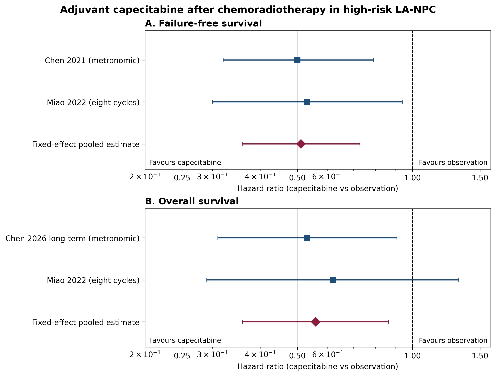

# 鼻咽癌辅助卡培他滨：随机证据更新 Meta 分析

_范围：高危局晚期鼻咽癌完成根治性放化疗后，辅助卡培他滨与观察相比的随机证据；检索截至 2026-07-27。_

> [!warning] 研究用途边界
>
> 本笔记是基于公开报道效应量的可复现试验层 Meta 分析，不是临床决策建议。纳入试验均来自中国高危局晚期人群，不能直接外推至所有鼻咽癌患者或替代指南与个体化诊疗。

## 研究问题与预先规定的方法

### PICO

| 要素 | 预先规定 |
|---|---|
| 人群 | 已完成根治性同期放化疗、无进展的高危局部晚期鼻咽癌成人 |
| 干预 | 放化疗后口服辅助卡培他滨，包括节拍方案或标准周期方案 |
| 对照 | 观察或不增加卡培他滨的标准随访 |
| 主要结局 | Failure-free survival（FFS），以 Cox HR 表示 |
| 次要结局 | Overall survival（OS）；≥3 级治疗相关不良事件；依从性 |
| 设计 | 仅纳入随机对照试验；同一试验的多次报告合并为一个试验单元 |

研究问题为：在上述人群中，辅助卡培他滨是否改善 FFS 与 OS，且其毒性代价是什么？

### 检索与纳入规则

PubMed 检索式记录为：

```text
(nasopharyngeal carcinoma[Title/Abstract] OR nasopharyngeal cancer[Title/Abstract])
AND (capecitabine[Title/Abstract] OR xeloda[Title/Abstract])
AND (adjuvant[Title/Abstract] OR maintenance[Title/Abstract])
AND (randomized[Title/Abstract] OR randomised[Title/Abstract] OR trial[Title/Abstract])
```

纳入条件是随机分配、卡培他滨在根治性放化疗之后开始、报告 FFS/PFS/OS 或安全性。排除单臂研究、复发/转移一线治疗、没有比较组的维持治疗，以及同一随机试验的重复早期报告。

本次快速更新检出两项独立随机试验；2026 年 Nature Cancer 论文是 Chen 2021 试验的长期随访，因此**不作为第三项研究计入**。[^陈-2021] [^苗-2022] [^陈-2026]

### 为什么只有两项随机试验

“两项”只针对这个非常窄的 PICO：**根治性放化疗后、单药辅助卡培他滨、与观察直接随机比较、局部晚期高危 NPC**。2025 年的同行评议 Meta 采用相同核心问题，也确认仅有两项 III 期 RCT、共 586 名患者，支持本次没有漏计独立随机试验的判断。[^旧Meta-2025]

下列文献不会增加该 Meta 的独立研究数：

| 文献类型 | 不纳入的原因 |
|---|---|
| Chen 2026 长期随访 | 与 Chen 2021 是同一 406 人随机队列；仅用于替换同一结局的旧随访 |
| Miao 2021 ASCO 摘要 | 是 Miao 2022 正式全文的早期会议报告 |
| 残留病灶卡培他滨维持研究 | 为单臂 II 期研究，没有随机观察对照 |
| 回顾性真实世界队列 | 存在治疗选择混杂，不能与随机 HR 混合 |
| 其他辅助方案（GP、PF、S-1、PD-1） | 干预不是单药卡培他滨；应另设网络 Meta 或不同 PICO |

这意味着该课题可以做成严格、透明的**更新/复现型 Meta**，但不应虚构成含有大量独立试验的新证据合并。

## 纳入研究与数据审计

| 试验单元 | 方案与样本量 | 主要效应量 | 本次使用规则 |
|---|---|---|---|
| Chen 2021 / 2026 | 406 名高危局晚期患者；节拍卡培他滨 $650\ \mathrm{mg/m^2}$、每日两次、1 年 vs 观察 | 初报 FFS HR 0.50（95% CI 0.32--0.79）；长期 OS HR 0.53（0.31--0.91） | FFS 用初报；OS 用最长随访，不重复计入 |
| Miao 2022 | 180 名高危局晚期患者；$1000\ \mathrm{mg/m^2}$、每日两次、14 天/21 天、8 周期 vs 观察 | FFS HR 0.53（0.30--0.94）；OS HR 0.62（0.29--1.32） | FFS 与 OS 均纳入 |

两个试验的共同点是：均为随机、开放标签、在放化疗完成且未进展后才开始辅助治疗。关键差异是卡培他滨剂量与疗程、入组的高危定义、随访长度。因此，下述合并结果应被理解为“**辅助卡培他滨策略**”的平均效应，而不能证明任一剂量方案彼此等效。

### 重复报告规则

Chen 2021 与 Chen 2026 使用相同的 406 人随机队列。若把二者都作为独立研究纳入，会人为缩小置信区间并夸大证据量。本更新对每个结局只选该试验可获得的最长、且有完整 HR 与置信区间的报告：FFS 采用 2021 初报，OS 采用 2026 长期报告。

## 统计模型

时间结局以对数 HR 合并。对第 $i$ 项试验，设

$$
y_i=\log(\mathrm{HR}_i),
\qquad
SE_i=\frac{\log(U_i)-\log(L_i)}{2\times1.96},
$$

其中 $L_i,U_i$ 是已发表 95% CI 的下、上限。固定效应权重为 $w_i=1/SE_i^2$，合并估计为

$$
\hat\theta=
\frac{\sum_iw_iy_i}{\sum_iw_i},
\qquad
SE(\hat\theta)=\sqrt{\frac{1}{\sum_iw_i}},
\qquad
\mathrm{HR}_{\mathrm{pooled}}=\exp(\hat\theta).
$$

异质性用 Cochran $Q=\sum_iw_i(y_i-\hat\theta)^2$ 和 $I^2=\max\{0,(Q-(k-1))/Q\}\times100\%$ 描述。由于仅有两项试验，$I^2=0\%$ 不应被误解为“完全没有临床异质性”；它只表示在已报告 HR 的统计尺度上没有检测到明显差异。随机效应在 $k=2$ 时方差估计很不稳定，因此本笔记预先指定固定效应为主分析，并将临床差异以叙述方式保留。

## 初步合并结果

### Failure-free survival

| 试验 | HR（95% CI） | 对数 HR | SE | 固定效应权重 |
|---|---:|---:|---:|---:|
| Chen 2021 | 0.50（0.32--0.79） | -0.693 | 0.231 | 61.5% |
| Miao 2022 | 0.53（0.30--0.94） | -0.635 | 0.291 | 38.5% |
| **合并** | **0.51（0.36--0.73）** | **-0.671** | **0.181** | **100%** |

异质性：$Q=0.025$，$I^2=0\%$。在两项随机研究中，辅助卡培他滨与更低的 FFS 瞬时风险相关；合并 HR 0.51 对应约 49% 的相对 hazard 降低，但不能直接把 HR 解释为任一固定时间点的绝对生存获益。

### Overall survival

| 试验 | HR（95% CI） | 对数 HR | SE | 固定效应权重 |
|---|---:|---:|---:|---:|
| Chen 2026 长期随访 | 0.53（0.31--0.91） | -0.635 | 0.275 | 66.5% |
| Miao 2022 | 0.62（0.29--1.32） | -0.478 | 0.387 | 33.5% |
| **合并** | **0.56（0.36--0.87）** | **-0.582** | **0.224** | **100%** |

异质性：$Q=0.109$，$I^2=0\%$。OS 合并估计方向与 FFS 一致；但它只有两项开放标签试验，其中 Miao 2022 的 OS CI 跨越无效值，证据精度有限。



*图 1：辅助卡培他滨相对于观察的固定效应森林图。菱形为合并 HR，虚线为无效线 HR=1；图由 `experiments/meta_analysis/run_npc_adjuvant_capecitabine_meta.py` 生成。*

### 安全性与依从性

不能把不同定义和观察窗口的不良事件直接强行合并。Chen 长期报告中，≥3 级不良事件为 17%（35/201）对 6%（11/200），最常见的治疗相关严重事件包括手足综合征；Miao 报告的治疗期间 ≥3 级 TRAE 为 60.0%（54/90）对 51.1%（46/90），其统计口径包含更多放化疗相关事件。[^陈-2026] [^苗-2022]

因此，安全性结论应写为：**卡培他滨有明确毒性与依从性负担；因两个试验的 AE 定义和时间窗不同，当前不报告一个误导性的合并 RR。**

## 偏倚与适用性判断

| 维度 | 判断 | 对结论的影响 |
|---|---|---|
| 随机证据 | 两项均为多中心开放标签随机试验 | 支持疗效比较，但不能消除开放标签对主观 AE 报告的影响 |
| 结局客观性 | FFS/OS 为时间结局，较不易受知情分组影响 | 对生存结论的检测偏倚风险较低 |
| 重复报告 | Chen 2021 与 2026 为同一试验 | 已按结局选择单一报告，避免重复计数 |
| 临床异质性 | 剂量、疗程和高危定义不同 | 不可将结果外推为“任何卡培他滨方案都等效” |
| 外部效度 | 试验人群均来自中国、且为选择后的高危局晚期患者 | 不应直接推广到低危、老年脆弱或非相似医疗环境人群 |
| 发表偏倚 | 仅两项研究 | 漏斗图和 Egger 检验无效，不能据此排除发表偏倚 |

## 可以写出的结论与不能写出的结论

可以写：在两项独立随机试验的公开 HR 中，完成放化疗后的辅助卡培他滨与更好的 FFS（合并 HR 0.51，95% CI 0.36--0.73）和 OS（0.56，0.36--0.87）相关，但伴随额外毒性负担。

不能写：

- 不能称其为所有鼻咽癌患者的标准治疗或个体化处方建议
- 不能比较节拍与标准周期方案谁更优，因为没有直接随机比较
- 不能以 $I^2=0\%$ 声称不存在临床异质性
- 不能把 Chen 2021 和 Chen 2026 当作两项独立试验
- 不能把 FFS 的相对风险降低转换成未报告基线时间点上的绝对生存获益

## 下一步质量控制

1. 将 PubMed 检索扩展到 Embase、Cochrane Central、ClinicalTrials.gov 与主要会议摘要
2. 双人独立筛选、提取和 RoB 2 评价；当前笔记是单人可复核初稿
3. 从全文确认 Chen 长期报告的 FFS HR；若提供更新 HR，则以更新值替换初报并重算
4. 按预先规定的高危定义、既往诱导化疗和方案强度做叙述性亚组，不在两项研究上做不稳定 Meta 回归
5. 以 PRISMA 2020 流程图、RoB 2 表和可执行计算脚本形成正式投稿级版本

## 全文可得性

| 文献 | 当前可读范围 | 可用于什么 |
|---|---|---|
| Miao 2022 | PMC 开放全文与补充材料可访问 | 可核查方法、HR、事件数、AE 定义与 RoB 2 信息 |
| Chen 2021 | PubMed/ScienceDirect 的完整摘要与结构化结果可访问；期刊全文可能受订阅限制 | 可核查入组、随机、FFS HR 和主要安全性；正式 RoB 2 前应取得 PDF/机构访问全文 |
| Chen 2026 | 出版商页面可访问摘要、长期 OS 与安全性信息 | 用于长期 OS 更新；正式分析前应核对全文中的更新 FFS HR 与方案细节 |

因此，我可以直接阅读开放全文；对订阅墙后的文章，我只能可靠使用摘要、开放补充材料或你提供的 PDF，不能假装已经看过受限全文。

## 参考文献

[^陈-2021]: Chen Y-P, et al. *Metronomic capecitabine as adjuvant therapy in locoregionally advanced nasopharyngeal carcinoma: a multicentre, open-label, parallel-group, randomised, controlled, phase 3 trial.* Lancet. 2021. PMID: 34111416. https://pubmed.ncbi.nlm.nih.gov/34111416/

[^苗-2022]: Miao J, et al. *Adjuvant Capecitabine Following Concurrent Chemoradiotherapy in Locoregionally Advanced Nasopharyngeal Carcinoma: A Randomized Clinical Trial.* JAMA Oncology. 2022. PMID: 36227615. https://pmc.ncbi.nlm.nih.gov/articles/PMC9562101/

[^陈-2026]: Chen Y-P, et al. *Long-term outcomes of adjuvant metronomic capecitabine in locoregionally advanced nasopharyngeal carcinoma: a randomized, controlled, multicenter, phase 3 study.* Nature Cancer. 2026. PMID: 42380630. https://pubmed.ncbi.nlm.nih.gov/42380630/

[^旧Meta-2025]: Kridis B, et al. *Efficacy and Safety of Adjuvant Capecitabine in Locoregionally Advanced Nasopharyngeal Carcinoma: A Meta-Analysis of Phase III Randomized Trials With Subgroup Analysis by Neoadjuvant Chemotherapy.* Head & Neck. 2025. https://doi.org/10.1002/hed.70034
