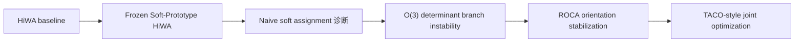

# TACO-inspired HiWA 项目主线重构与下一步计划

## 1. 项目当前状态总判断

一句话判断：

> 当前项目已经完成了从 HiWA 复现到 TACO-inspired Soft-Prototype HiWA 的第一轮迁移，并发现 ROCA 是当前最可靠的创新模块；但项目尚未完成 TACO 的核心部分，也就是 prototype / assignment / alignment 的联合优化。

当前最合理主线是：



这个骨架是合理的，但需要修正一句：ROCA 不是 TACO 的全部，也不是主线终点。ROCA 应定位为 TACO-inspired Soft-HiWA 框架中的 **orientation stabilization module**。

## 2. Codex 到底做了什么

| 层次 | 已完成事项 | 判断 |
|---|---|---|
| HiWA 复现 | 跑通神经—运动 3D 对齐，理解 accuracy / $R^2$ | 有效基线 |
| TACO 迁移第一步 | soft prototypes、soft assignments、soft group measure 接入 HiWA | 做了骨架，但冻结 |
| 软分组诊断 | random init、warm start、temperature、annealing、seed 7 | 有价值负结果 |
| 分支不稳定发现 | 发现 $O(3)$ 中 $\det=+1/-1$ 分支对应方向语义差异 | 核心发现 |
| ROCA | soft representatives + signed volume 无标签选 determinant branch | 当前最强创新模块 |
| CC-HiWA | $S=A P B^\top$ 与 component-conditioned sample OT | 接入了，但神经和 PBMC 上未形成提升 |
| PBMC / GI-CC-HiWA | RNA-ATAC、Procrustes warm-start、gene activity | 外部诊断，不是主线 |
| representative 进 $P$ / $R$ | RGCA、rotation guidance | 消融有效，提升不足 |

Codex 的主要问题不是“没做”，而是做完 ROCA 后一度把项目扩散成 CC-HiWA / PBMC / GI-CC-HiWA，偏离了最初目标：**把 TACO 迁移到 HiWA 神经—运动任务，再在这个骨架上创新。**

## 3. TACO 吸收程度审计

| TACO 层次 | 当前实现程度 | 判断 | 下一步 |
|---|---|---|---|
| soft prototype | 已实现 | 神经和运动两端都有 prototype | 保留 |
| soft assignment | 已实现 | 可生成 $A^X,A^Y$ | 保留 |
| soft group empirical measure | 已实现 | 加权组内 OT 可运行 | 保留 |
| group-level OT | 已实现 | HiWA / Soft-HiWA 本身已有 | 保留 |
| sample-level OT | 已实现 | HiWA 本身已有，CC 也做了后处理版 | 保留但重构 |
| group-conditioned sample transport | 外壳已做 | $S=A P B^\top$ 后处理效果弱 | 作为消融 |
| prototype / assignment / alignment 联合优化 | 基本没做 | 当前最大缺口 | 立刻做最小版 |
| representation learning / encoder 训练 | 未做 | 现在不该做 | 暂停 |
| task-aware prediction / downstream objective | 只做评价 | 不使用 direction label 训练是对的 | 暂不加入训练 |

Codex 只是部分吸收了 TACO。它吸收了 TACO 的 soft prototype、soft assignment、soft group 和 group-conditioned cost 外形，但没有吸收 TACO 最关键的“分组结构与对齐目标共同优化”。当前多数实验是 frozen assignment + HiWA/ROCA，而不是 TACO-style joint optimization。

为什么联合优化有用：

$$
A^X,A^Y \rightarrow \alpha,\beta,p^{(k)},q^{(l)} \rightarrow P,Q,R
$$

如果 $A^X,A^Y$ 固定，它们只反映各自域内重构结构，不一定反映跨域可对齐结构。联合优化的作用是让 prototype 和 assignment 不只服务本域重构，还要服务跨域 alignment。

为什么一直没真正做：

| 原因 | 具体表现 |
|---|---|
| 技术风险高 | 联合优化会耦合 $C^X,C^Y,A^X,A^Y,P,Q,R$ |
| 先做了冻结版 | soft group 接入后先诊断稳定性 |
| ROCA 发现转移注意力 | determinant branch 成为更强、更清楚的发现 |
| 后续扩散到 PBMC | CC-HiWA 变成外部框架探索 |
| 缺少最小目标函数 | 没有先定义冻结 $X,Y$ 下的 prototype-only joint loss |

## 4. 已有方法和结果审计表

| 方法 | 属于哪条线 | 做了什么 | 结果如何 | 是否保留 | 是否主线 |
|---|---|---|---|---|---|
| HiWA baseline | 基线 | 原始硬簇层级 OT | 可跑通，seed 敏感 | 是 | 是 |
| Soft-Prototype HiWA | TACO 迁移 | soft prototype / assignment 接入 | 可运行，未稳定涨分 | 是 | 是 |
| prototype-hard | 基线 | soft assignment 硬化 | acc 约 0.54 | 是 | 是 |
| soft random init | 软分组 | 随机起点软 HiWA | 不稳定，$R^2$ 可崩 | 作为负结果 | 否 |
| soft warm start | 软分组 | hard 解暖启动 | 稳定但几乎不涨 | 是 | 是 |
| temperature sensitivity | 诊断 | 扫 $\tau$ | 不是核心旋钮 | 记录 | 否 |
| annealing | 诊断 | 温度路径 | 未提高 accuracy | 记录 | 否 |
| pure annealing | 诊断 | 固定 prototype 后退火 | $R^2$ 升，accuracy 降 | 重要负结果 | 是，诊断 |
| seed 7 diagnosis | 诊断 | 查高 $R^2$ 低 accuracy | 发现连续几何与方向语义分离 | 是 | 是 |
| rotation-stabilized Soft-HiWA | 稳定性 | hard-start / anchor | 稳定性改善 | 保留 | 过渡 |
| determinant-constrained Procrustes | ROCA | 显式生成 det 双分支 | 关键技术 | 是 | 是 |
| double-branch candidate | ROCA | det=+1/-1 两候选 | 暴露分支问题 | 是 | 是 |
| transport objective selector | selector | 用 OT loss 选分支 | 7/20 成功，失败 | 负结果 | 是，消融 |
| bidirectional / cycle selector | selector | 双向目标 / cycle | 不可靠 | 负结果 | 消融 |
| ROCA selector | 创新 | 有向体积选 determinant | seeds 50-69 20/20 | 是 | 是 |
| coordinate flip validation | 验证 | 坐标单轴反射 | 30/30 符合预期 | 是 | 是 |
| synthetic determinant validation | 验证 | 已知 true det | 1600 cases 0.995 | 是 | 是 |
| confidence / condition warning | 诊断 | condition number > 80 | 可抓低置信合成失败 | 是 | 辅助 |
| RGCA | 代表元进 $P$ | representative cost 加到 group cost | 小提升或风险 | 消融 | 否 |
| representative 进 $R$ | 代表元进优化 | $\lambda_R$ 加入 rotation update | 可控但未涨 | 消融 | 否 |
| CC-HiWA | 通用化 | $S=A P B^\top$ sample OT | 神经后处理弱 | 暂停主推 | 否 |
| PBMC CC-HiWA | 外部探索 | RNA-ATAC 1k | 不如 Procrustes | 暂停扩展 | 否 |
| Procrustes warm-start CC-HiWA | PBMC 修正 | 加无标签 rotation | 接近 Procrustes，仍不超 | 记录 | 否 |
| gene activity / GI-CC-HiWA | PBMC 结构先验 | peak-gene graph | cell-type 信号增强，OT 仍弱 | 记录 | 否 |

## 5. 哪些方向有效，哪些方向暂停

保留为主线：

1. HiWA baseline；
2. frozen Soft-Prototype HiWA；
3. soft assignment 失败诊断；
4. $O(3)$ determinant branch instability；
5. ROCA；
6. 最小 TACO-style joint optimization。

保留为负结果或消融：

1. soft random init；
2. temperature / annealing；
3. pure annealing；
4. transport objective selector；
5. RGCA；
6. component-conditioned sample OT；
7. representative rotation guidance。

必须暂停：

1. 更多 PBMC；
2. 更大 PBMC；
3. 图像文本；
4. 自动 $K$；
5. 大量 beta 扫描；
6. 端到端 encoder；
7. 把 CC-HiWA 吹成主方法。

## 6. 当前最合理论文骨架

一句话研究主线：

> 我们将 TACO 的 soft prototype / soft assignment 思想迁移到 HiWA 神经—运动对齐中，发现 naive frozen soft assignment 不能直接提升性能，却揭示了 HiWA 在三维正交对齐中的 determinant branch instability；据此提出 ROCA 作为无标签 orientation stabilization，并进一步设计 TACO-style joint optimization 使 prototypes 与 alignment 共同学习。

方法总名称建议：

> TACO-inspired Representative-Stabilized Soft-HiWA

简称可用：

> TRS-HiWA

模块定义：

$$
A^X_{ik}=\frac{\exp(\langle x_i,c_k^X\rangle/\tau)}
{\sum_{r=1}^K\exp(\langle x_i,c_r^X\rangle/\tau)}
$$

$$
r_k^X=\frac{\sum_i A^X_{ik}x_i}{\sum_i A^X_{ik}},
\qquad
r_l^Y=\frac{\sum_j A^Y_{jl}y_j}{\sum_j A^Y_{jl}}
$$

$$
\mu_k^X=\sum_i \frac{a_i A^X_{ik}}{\alpha_k}\delta_{x_i},
\qquad
\nu_l^Y=\sum_j \frac{b_j A^Y_{jl}}{\beta_l}\delta_{y_j}
$$

$$
P^\star=\arg\min_{P\in\Pi(\alpha,\beta)}
\sum_{kl}P_{kl}D_{kl}(R)+\varepsilon H(P)
$$

ROCA：

$$
\hat{s}=\operatorname{sign}
\left(\det(X_{\mathrm{rep}})\det(Y_{\mathrm{rep}})\right)
$$

可写进论文的结果：

| 结果 | 写法 |
|---|---|
| Soft-Prototype HiWA 可运行 | 方法骨架与可行性 |
| soft random / warm / annealing | 负结果与诊断 |
| $R^2$ 与 accuracy 分离 | 重要分析 |
| determinant branch instability | 核心发现 |
| ROCA 20/20、coordinate flip、synthetic | 当前创新结果 |
| CC-HiWA / PBMC | 附录或未来工作，不作主结果 |

## 7. ROCA 的正确位置

ROCA 应放在方法体系中这里：

```text
soft prototypes
→ soft representatives
→ determinant-constrained candidates
→ ROCA branch selection
→ evaluation
```

它不是替代 TACO 的模块，而是回答：

> 在 TACO-inspired Soft-HiWA 的 3D 神经—运动场景中，soft representatives 除了定义组，还能否提供无标签 orientation signal？

答案是可以。ROCA 是当前最可写、最可信的创新模块。

## 8. PBMC / CC-HiWA 的正确位置

PBMC / CC-HiWA / GI-CC-HiWA 应定位为：

> 外部迁移预研和负结果诊断，不是当前论文主线。

它们给出的有效信息是：

1. 后处理式 $S=A P B^\top$ 不够；
2. 独立 assignment 不保证跨域语义一致；
3. Procrustes warm-start 很重要；
4. graph-informed representation 有用；
5. 真正缺的是 joint representation / prototype / alignment learning。

因此它们可以写入“为何下一步回到 joint optimization”的动机，而不是扩展成新主线。

## 9. 下一步最小联合优化模型

目标：固定神经和运动低维表示 $X,Y$，只优化 prototypes / assignments，不训练 encoder，不用真实 direction label 训练。

变量：

$$
C^X=\{c_k^X\}_{k=1}^K,\quad
C^Y=\{c_l^Y\}_{l=1}^K
$$

由 prototypes 诱导：

$$
A^X=A^X(C^X;X),\qquad A^Y=A^Y(C^Y;Y)
$$

保留 HiWA / ROCA 作为评价和稳定模块。

推荐目标函数：

$$
\mathcal L
=
\mathcal L_{\mathrm{proto}}^X
+
\mathcal L_{\mathrm{proto}}^Y
+
\lambda_{\mathrm{align}}\mathcal L_{\mathrm{align}}
+
\lambda_{\mathrm{bal}}\mathcal L_{\mathrm{balance}}
+
\lambda_{\mathrm{ent}}\mathcal L_{\mathrm{entropy}}.
$$

各项定义：

$$
\mathcal L_{\mathrm{proto}}^X
=
\frac{1}{n}\sum_i
\left\|x_i-\sum_k A^X_{ik}c_k^X\right\|^2
$$

$$
\mathcal L_{\mathrm{proto}}^Y
=
\frac{1}{m}\sum_j
\left\|y_j-\sum_l A^Y_{jl}c_l^Y\right\|^2
$$

alignment-aware loss 用 ROCA 选定或当前候选 rotation $R$：

$$
\mathcal L_{\mathrm{align}}
=
\sum_{kl}P_{kl}
\left\|Rr_k^X-r_l^Y\right\|^2
$$

其中：

$$
P=\operatorname{Sinkhorn}
\left(
\|Rr_k^X-r_l^Y\|^2
\right).
$$

balance loss：

$$
\mathcal L_{\mathrm{balance}}
=
\left\|\alpha-\frac{1}{K}\mathbf 1\right\|^2
+
\left\|\beta-\frac{1}{K}\mathbf 1\right\|^2
$$

entropy 项建议写成控制项，而不是盲目越大越好：

$$
\mathcal L_{\mathrm{entropy}}
=
-\frac{1}{n}\sum_i H(A^X_{i,:})
-\frac{1}{m}\sum_j H(A^Y_{j,:})
$$

如果发现 assignment 太硬，可令 $\lambda_{\mathrm{ent}}>0$；如果太软，则降低或改为目标熵惩罚：

$$
\mathcal L_{\mathrm{entropy-target}}
=
\left(\bar H_X-h_0\right)^2+\left(\bar H_Y-h_0\right)^2.
$$

最小优化步骤：

1. 用现有 soft prototype 初始化 $C^X,C^Y$；
2. 固定 $C^X,C^Y$ 计算 $A^X,A^Y,r^X,r^Y$；
3. 用 ROCA 或 determinant-constrained Procrustes 得到稳定 $R$；
4. 计算 $P$ 和 $\mathcal L_{\mathrm{align}}$；
5. 用 L-BFGS 或 Adam 更新 $C^X,C^Y$；
6. 每隔若干步重新计算 $A,r,P,R$；
7. 最后冻结 learned assignments，跑原 Soft-HiWA + ROCA；
8. 只在最终评价 direction accuracy / $R^2$。

Baseline：

| Baseline | 用途 |
|---|---|
| HiWA hard | 原始基线 |
| frozen Soft-Prototype HiWA | 证明 joint 是否有用 |
| ROCA with frozen assignments | 当前最强稳定版本 |
| Joint-Prototype + ROCA | 新方法 |

判断有没有用：

| 指标 | 成功标准 |
|---|---|
| assignment collapse | 不坍缩，min group mass 不接近 0 |
| alignment loss | 相对 frozen prototype 下降 |
| ROCA warning | 不进入低置信 simplex |
| direction accuracy | 不低于 ROCA baseline，最好配对提升 |
| movement $R^2$ | 不显著下降 |
| seed stability | 方差不增大 |

现在不该做：

- encoder 训练；
- direction label loss；
- 自动 $K$；
- PBMC 扩展；
- 大规模调参。

## 10. 给 Codex 的下一条精确任务提示词

```text
请在 D:\ai\数学ai\Projects\最优传输 的 HiWA 神经数据项目中，实现一个最小 TACO-style joint prototype optimization 实验。

目标：
1. 固定已有 neural embedding X 和 movement embedding Y，不训练 encoder；
2. 只优化 neural prototypes C^X 和 movement prototypes C^Y；
3. assignments A^X,A^Y 由 prototypes 通过 softmax 产生；
4. loss 包含：
   L_proto^X、L_proto^Y、L_align、L_balance、L_entropy 或 target-entropy；
5. L_align 使用 soft representatives r^X,r^Y、group OT P 和当前 rotation R；
6. 不使用真实 direction label 训练、调参或选择模型；
7. 优化后把 learned assignments 接入现有 Soft-HiWA + ROCA pipeline；
8. 对比 HiWA hard、frozen Soft-Prototype HiWA、frozen ROCA；
9. 先只跑 seeds 50-54，不扩大数据集，不做 PBMC，不做自动 K；
10. 输出 JSON、Markdown 实验笔记和 collapse / entropy / group mass / alignment loss / ROCA warning / final accuracy / R2 诊断。

请保持现有代码向后兼容；新增脚本优先命名为 run_joint_prototype_hiwa.py；新增核心函数独立放入 soft_groups.py 或新文件 joint_prototypes.py；所有标签只能用于最终评价。
```
