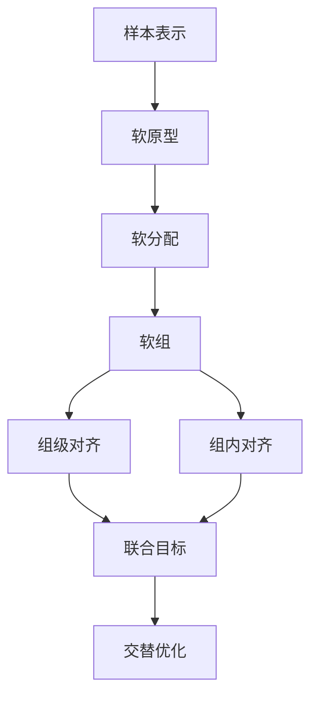
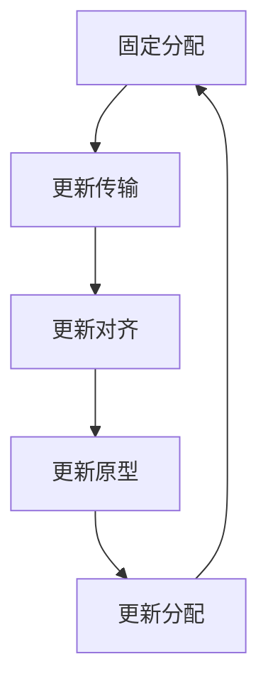
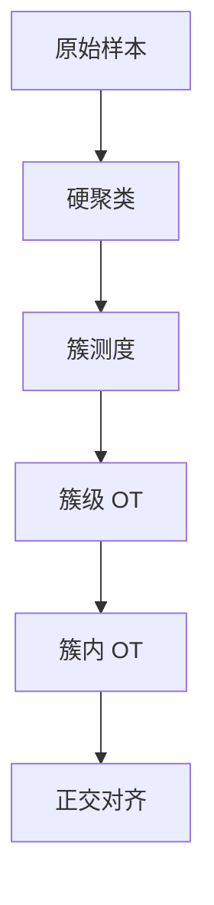

# TACO 模型思想、公式推导与对 HiWA 软分组推广的启发

## 0. 修订说明

这份文档的重点顺序调整为：

1. 先解释 TACO 的模型思想；
2. 再解释 TACO 中 soft prototypes 与 soft group assignment 的公式含义；
3. 然后说明这些思想如何启发我们改造 HiWA；
4. 最后给出 Soft-HiWA 的严格公式版本。

需要先强调一点：

> 本文不是逐字复述 TACO 原论文的所有符号，而是按照我们前面学习时形成的理解，把 TACO 的核心思想重新整理成适合迁移到 HiWA 的数学表达。

也就是说，本文的目的不是证明“HiWA 改软分组以后就等于 TACO”，而是说明：

> TACO 提供了一种把硬分组变成可学习软分组的建模思想；我们可以借助这个思想，把 HiWA 中依赖固定硬聚类的层级最优传输结构推广成 Soft-HiWA。

---

## 1. TACO 试图解决什么问题

TACO 的核心问题可以概括为：

> 两类不同来源的表示空间之间，不应该只做简单的点对点对齐，而应该先识别出潜在的组结构，再在组结构的帮助下完成跨空间对齐。

在 TACO 的语境中，两类表示可以理解为：

- 文本表示空间；
- 几何表示空间；
- 化学结构、分子图或其他模态表示空间；
- 经过神经网络编码后的高维表征空间。

为了统一记号，我们用两个域表示：

$$
X = \{x_1,x_2,\dots,x_n\}, \qquad x_i \in \mathbb{R}^d,
$$

$$
Y = \{y_1,y_2,\dots,y_m\}, \qquad y_j \in \mathbb{R}^d.
$$

可以把 $X$ 理解为源域表示，把 $Y$ 理解为目标域表示。

如果直接做普通最优传输，就会考虑：

$$
\min_{\Gamma \in \Pi(a,b)}
\sum_{i=1}^n \sum_{j=1}^m
\Gamma_{ij}\|x_i-y_j\|^2.
$$

这里的问题是：

1. 点级对齐太细，容易受噪声影响；
2. 不同模态或不同数据集之间未必有天然一一对应；
3. 高维表示往往存在潜在功能组、语义组或结构组；
4. 直接点对点传输没有显式利用这些组结构。

TACO 的模型思想就是：

> 不直接把所有样本混在一起做 OT，而是先通过 soft prototypes 学出一组潜在组，再通过 soft assignment 让每个样本以不同权重归属于这些组，最后在组级别和样本级别之间建立协调的最优传输。

---

## 2. TACO 的模型思想：从样本到软组，再到传输

TACO 的整体结构可以理解为下面这个过程：



普通文字版：

1. 先有两组样本表示 $X$ 和 $Y$；
2. 在每个表示空间中引入若干 soft prototypes；
3. 每个样本根据它和 prototypes 的相似度得到 soft assignment；
4. soft assignment 诱导出若干 soft groups；
5. soft groups 之间做组级对齐；
6. soft groups 内部做样本级对齐；
7. 把分组、传输、对齐矩阵和原型更新放进同一个优化框架。

这就是 TACO 和传统硬聚类方法最大的不同：

> 传统方法通常先聚类，然后固定簇结构；TACO 则把组结构变成可以学习、可以更新、可以和对齐目标相互作用的变量。

---

## 3. soft prototypes：TACO 如何产生潜在组

### 3.1 原型变量

TACO 首先为源域引入 $K$ 个原型：

$$
c_1^X,c_2^X,\dots,c_K^X \in \mathbb{R}^d.
$$

为目标域引入 $L$ 个原型：

$$
c_1^Y,c_2^Y,\dots,c_L^Y \in \mathbb{R}^d.
$$

这些原型不是普通意义上的硬聚类标签，而是潜在组的代表向量。它们可以来自：

1. K-means 或 GMM 初始化；
2. 随机初始化后作为参数学习；
3. 神经网络输出的可学习 prototype；
4. 数据中的任务标签、语义标签或结构标签诱导出来的初始中心。

所以，soft prototypes 的本质是：

> 用一组可学习代表向量来定义潜在组，而不是提前把样本强行分进固定簇。

---

## 4. soft assignment：从原型得到软分类矩阵

### 4.1 源域软分配

对源域样本 $x_i$ 和源域原型 $c_k^X$，先定义相似度分数：

$$
s_{ik}^X = \frac{\langle x_i,c_k^X\rangle}{\tau_X}.
$$

其中 $\tau_X>0$ 是温度参数。然后用 softmax 得到：

$$
S_{ik}
=
\frac{\exp(s_{ik}^X)}
{\sum_{r=1}^{K}\exp(s_{ir}^X)}.
$$

于是得到源域软分配矩阵：

$$
S \in \mathbb{R}^{n\times K}.
$$

它满足：

$$
S_{ik}\geq 0,
$$

$$
\sum_{k=1}^K S_{ik}=1.
$$

所以 $S$ 的每一行都是一个概率分布。$S_{ik}$ 表示样本 $x_i$ 属于第 $k$ 个源域软组的程度。

### 4.2 目标域软分配

目标域同理：

$$
s_{jl}^Y = \frac{\langle y_j,c_l^Y\rangle}{\tau_Y},
$$

$$
T_{jl}
=
\frac{\exp(s_{jl}^Y)}
{\sum_{r=1}^{L}\exp(s_{jr}^Y)}.
$$

于是：

$$
T \in \mathbb{R}^{m\times L},
$$

并且：

$$
T_{jl}\geq 0,
$$

$$
\sum_{l=1}^L T_{jl}=1.
$$

这里 $T_{jl}$ 表示样本 $y_j$ 属于第 $l$ 个目标域软组的程度。

---

## 5. TACO 中 soft assignment 的概率解释

TACO 的关键不是简单得到一个矩阵 $S$，而是把这个矩阵解释成条件概率。

对源域，令 $Z_X$ 表示潜在组变量，则：

$$
S_{ik} = \mathbb{P}(Z_X=k \mid X=x_i).
$$

对目标域，令 $Z_Y$ 表示潜在组变量，则：

$$
T_{jl} = \mathbb{P}(Z_Y=l \mid Y=y_j).
$$

如果源域样本权重是：

$$
a=(a_1,\dots,a_n), \qquad \sum_{i=1}^n a_i=1,
$$

目标域样本权重是：

$$
b=(b_1,\dots,b_m), \qquad \sum_{j=1}^m b_j=1,
$$

那么源域样本和组的联合质量为：

$$
\rho_{ik}^X = a_i S_{ik}.
$$

目标域样本和组的联合质量为：

$$
\rho_{jl}^Y = b_j T_{jl}.
$$

这一步很重要，因为它说明：

> soft assignment 不是一个随便的权重表，而是在构造“样本—潜在组”的联合分布。

---

## 6. 从 soft assignment 到 soft group

### 6.1 组级质量

源域第 $k$ 个软组的总质量是：

$$
\alpha_k
=
\mathbb{P}(Z_X=k)
=
\sum_{i=1}^n a_i S_{ik}.
$$

目标域第 $l$ 个软组的总质量是：

$$
\beta_l
=
\mathbb{P}(Z_Y=l)
=
\sum_{j=1}^m b_j T_{jl}.
$$

由于 $S$ 和 $T$ 的每一行都是概率分布，所以：

$$
\sum_{k=1}^K \alpha_k = 1,
$$

$$
\sum_{l=1}^L \beta_l = 1.
$$

因此：

$$
\alpha \in \Delta_K, \qquad \beta \in \Delta_L.
$$

### 6.2 组内条件分布

给定源域第 $k$ 个软组，样本 $x_i$ 在该软组内部的条件权重为：

$$
p_i^{(k)}
=
\mathbb{P}(X=x_i \mid Z_X=k)
=
\frac{a_iS_{ik}}{\alpha_k}.
$$

给定目标域第 $l$ 个软组，样本 $y_j$ 在该软组内部的条件权重为：

$$
q_j^{(l)}
=
\mathbb{P}(Y=y_j \mid Z_Y=l)
=
\frac{b_jT_{jl}}{\beta_l}.
$$

如果 $a_i=1/n$，那么：

$$
p_i^{(k)}
=
\frac{S_{ik}}{\sum_{r=1}^n S_{rk}}.
$$

如果 $b_j=1/m$，那么：

$$
q_j^{(l)}
=
\frac{T_{jl}}{\sum_{r=1}^m T_{rl}}.
$$

### 6.3 软组测度

于是源域第 $k$ 个 soft group 可以写成：

$$
\mu_k^S
=
\sum_{i=1}^n p_i^{(k)}\delta_{x_i}.
$$

目标域第 $l$ 个 soft group 可以写成：

$$
\nu_l^T
=
\sum_{j=1}^m q_j^{(l)}\delta_{y_j}.
$$

这就是 TACO soft group 思想的数学核心：

> soft group 不是一个硬集合，而是由 soft assignment 诱导出的条件经验测度。

这也解释了为什么 soft assignment 可以和最优传输结合：因为每个 soft group 本身就是一个概率测度。

---

## 7. TACO 的组级对齐思想

有了软组之后，TACO 需要决定源域软组和目标域软组之间如何对应。

定义组级传输矩阵：

$$
\Pi \in \mathbb{R}_+^{K\times L}.
$$

它满足：

$$
\Pi\mathbf{1}_L=\alpha,
$$

$$
\Pi^\top\mathbf{1}_K=\beta.
$$

也就是：

$$
\Pi \in \Pi(\alpha,\beta).
$$

其中 $\Pi_{kl}$ 表示源域第 $k$ 个软组向目标域第 $l$ 个软组传输多少质量。

组级代价可以有两种常见形式。

### 7.1 原型间代价

最直接的组级代价是 prototype 之间的距离。例如，如果存在一个对齐矩阵 $R$，可以定义：

$$
C_{kl}^{\mathrm{proto}}(R)
=
\|Rc_k^X-c_l^Y\|_2^2.
$$

于是组级 OT 可以写成：

$$
\min_{\Pi\in\Pi(\alpha,\beta)}
\sum_{k=1}^K\sum_{l=1}^L
\Pi_{kl}C_{kl}^{\mathrm{proto}}(R).
$$

这个版本强调的是：

> 先对齐 prototype，再通过 prototype 牵引样本组对齐。

### 7.2 软组测度间代价

另一种更接近 HiWA 的写法是：先计算软组测度之间的 OT 代价：

$$
D_{kl}(R)
=
W_2^2(R\#\mu_k^S,\nu_l^T).
$$

离散展开后是：

$$
D_{kl}(R)
=
\min_{\gamma^{kl}\in\Pi(p^{(k)},q^{(l)})}
\sum_{i=1}^n\sum_{j=1}^m
\gamma_{ij}^{kl}\|Rx_i-y_j\|_2^2.
$$

然后组级 OT 写成：

$$
\min_{\Pi\in\Pi(\alpha,\beta)}
\sum_{k=1}^K\sum_{l=1}^L
\Pi_{kl}D_{kl}(R).
$$

这个版本强调的是：

> 每个 prototype 定义一个 soft group，而真正的组间距离由 soft group 内部的样本分布决定。

这正是它和 HiWA 可以接上的地方。

---

## 8. TACO 的联合目标：不是只把矩阵改软

从 TACO 的思想看，完整模型通常不是只固定 $S,T$，然后做一次 OT，而是把下面几类变量一起考虑：

1. prototypes：$c_k^X,c_l^Y$；
2. soft assignment：$S,T$；
3. 组级传输：$\Pi$；
4. 组内传输：$\gamma^{kl}$；
5. 表示空间对齐矩阵：$R$；
6. 熵正则、平衡约束、结构约束等正则项。

一个适合理解的抽象目标可以写成：

$$
\begin{aligned}
\min_{R,S,T,\Pi,\{\gamma^{kl}\},C^X,C^Y}
&\quad
\sum_{k=1}^K\sum_{l=1}^L
\Pi_{kl}
\sum_{i=1}^n\sum_{j=1}^m
\gamma_{ij}^{kl}\|Rx_i-y_j\|_2^2 \\
&\quad + \lambda_{\mathrm{proto}}\mathcal{L}_{\mathrm{proto}}(S,T,C^X,C^Y) \\
&\quad + \lambda_{\mathrm{reg}}\mathcal{R}(S,T,\Pi,\gamma,R).
\end{aligned}
$$

约束为：

$$
S\mathbf{1}_K=\mathbf{1}_n,
\qquad
T\mathbf{1}_L=\mathbf{1}_m,
$$

$$
S\geq 0,
\qquad
T\geq 0,
$$

$$
\Pi\in\Pi(\alpha,\beta),
$$

$$
\gamma^{kl}\in\Pi(p^{(k)},q^{(l)}),
$$

$$
R^\top R=I.
$$

这里的 $\mathcal{L}_{\mathrm{proto}}$ 可以约束样本和原型之间的关系，例如让样本更靠近自己高权重归属的 prototype；$\mathcal{R}$ 可以包含熵正则、平衡正则、稀疏正则或结构一致性正则。

这个抽象公式体现了 TACO 的核心：

> soft assignment 不是预处理结果，而是和传输、原型、对齐矩阵共同参与优化的结构变量。

---

## 9. 为什么 TACO 需要 ADMM 或交替优化

上面的目标中，变量之间高度耦合。

例如：

- $S$ 决定 $\alpha$ 和 $p^{(k)}$；
- $T$ 决定 $\beta$ 和 $q^{(l)}$；
- $\alpha,\beta$ 决定组级传输 $\Pi$ 的边缘约束；
- $p^{(k)},q^{(l)}$ 决定组内传输 $\gamma^{kl}$ 的边缘约束；
- $R$ 决定所有点对代价 $\|Rx_i-y_j\|^2$；
- prototypes 又会反过来影响 $S,T$。

因此它不是一个简单凸优化问题。自然的求解方式是交替优化或 ADMM 类分裂方法。

可以理解为以下更新循环：



普通文字版：

1. 固定 $S,T,R$，用 Sinkhorn 更新组级传输 $\Pi$ 和组内传输 $\gamma^{kl}$；
2. 固定传输变量，更新正交矩阵 $R$，这一步通常类似 Procrustes；
3. 固定传输和 $R$，更新 prototypes；
4. 根据新的 prototypes 更新 soft assignment；
5. 如果使用 ADMM，还会引入辅助变量和拉格朗日乘子来处理约束分裂。

所以 TACO 真正做的工作不是单纯写出一个软分组公式，而是：

> 设计一套可优化的机制，使 soft group、prototype、transport plan 和 alignment map 能够相互协调。

---

## 10. TACO 的关键贡献可以概括为三句话

### 10.1 第一，TACO 把组从硬集合变成软测度

传统硬聚类中，一个组是一个集合：

$$
G_k = \{x_i:x_i\text{ 属于第 }k\text{ 组}\}.
$$

TACO 的 soft group 中，一个组更自然地表示为条件经验测度：

$$
\mu_k^S
=
\sum_{i=1}^n
\frac{a_iS_{ik}}{\alpha_k}\delta_{x_i}.
$$

### 10.2 第二，TACO 把分组从预处理变成模型变量

传统做法是：

```text
先聚类，再对齐。
```

TACO 更像是：

```text
一边学习组，一边对齐。
```

这意味着分组会受到最终对齐目标的影响，而不是聚类结束后就固定不动。

### 10.3 第三，TACO 把 prototype、assignment 和 OT 耦合起来

TACO 不只是用了 softmax，也不只是用了 OT，而是把两者结合：

- prototype 决定 soft assignment；
- soft assignment 决定 soft group；
- soft group 决定组级和组内传输；
- 传输结果又反过来影响 prototype 和 assignment 的更新。

这才是 TACO 最值得借鉴的地方。

---

# 第二部分：TACO 思想如何启发 HiWA 改造

## 11. HiWA 原始结构回顾

HiWA 的原始思想可以写成：



对于源域，硬分类矩阵为：

$$
Z\in\{0,1\}^{n\times K}.
$$

其中：

$$
Z_{ik}=1
$$

表示 $x_i$ 属于第 $k$ 个簇。

目标域硬分类矩阵为：

$$
W\in\{0,1\}^{m\times L}.
$$

原始 HiWA 中，每个点只属于一个簇：

$$
\sum_{k=1}^K Z_{ik}=1,
$$

$$
\sum_{l=1}^L W_{jl}=1.
$$

这就是 hard assignment。

---

## 12. 用 TACO 思想改造 HiWA：从硬簇到软组

TACO 给我们的启发是：

> 不必把一个神经元或一个神经活动状态强行放进唯一一个簇；它可以以不同权重参与多个潜在组。

因此我们把 HiWA 的硬分类矩阵：

$$
Z\in\{0,1\}^{n\times K}
$$

推广为软分配矩阵：

$$
S\in[0,1]^{n\times K}.
$$

同理，把：

$$
W\in\{0,1\}^{m\times L}
$$

推广为：

$$
T\in[0,1]^{m\times L}.
$$

它们满足：

$$
S\mathbf{1}_K=\mathbf{1}_n,
$$

$$
T\mathbf{1}_L=\mathbf{1}_m.
$$

这一步不是简单换符号，而是把 HiWA 的簇结构从硬集合变成了概率条件分布。

---

## 13. Soft-HiWA 的软组测度

给定源域样本权重 $a_i$ 和目标域样本权重 $b_j$，定义：

$$
\alpha_k=\sum_{i=1}^n a_iS_{ik},
$$

$$
\beta_l=\sum_{j=1}^m b_jT_{jl}.
$$

然后定义组内条件权重：

$$
p_i^{(k)}=\frac{a_iS_{ik}}{\alpha_k},
$$

$$
q_j^{(l)}=\frac{b_jT_{jl}}{\beta_l}.
$$

于是 soft group 测度为：

$$
\mu_k^S
=
\sum_{i=1}^n p_i^{(k)}\delta_{x_i},
$$

$$
\nu_l^T
=
\sum_{j=1}^m q_j^{(l)}\delta_{y_j}.
$$

这一步说明：

> 即使没有硬簇集合，HiWA 的“簇测度”仍然可以存在，只不过它变成了由 soft assignment 诱导的条件经验测度。

---

## 14. Soft-HiWA 的组内 OT

对于每一对软组 $(k,l)$，定义组内传输矩阵：

$$
\gamma^{kl}\in\mathbb{R}_+^{n\times m}.
$$

约束为：

$$
\gamma^{kl}\mathbf{1}_m=p^{(k)},
$$

$$
(\gamma^{kl})^\top\mathbf{1}_n=q^{(l)}.
$$

也就是：

$$
\gamma^{kl}\in\Pi(p^{(k)},q^{(l)}).
$$

若保留 HiWA 中的正交对齐矩阵 $R$，则组内代价为：

$$
D_{kl}(R)
=
\min_{\gamma^{kl}\in\Pi(p^{(k)},q^{(l)})}
\sum_{i=1}^n\sum_{j=1}^m
\gamma_{ij}^{kl}\|Rx_i-y_j\|_2^2.
$$

这就是 soft group 版本的组内 Wasserstein 代价。

---

## 15. Soft-HiWA 的组级 OT

组级质量为：

$$
\alpha=(\alpha_1,\dots,\alpha_K),
$$

$$
\beta=(\beta_1,\dots,\beta_L).
$$

定义组级传输矩阵：

$$
\Pi\in\mathbb{R}_+^{K\times L},
$$

满足：

$$
\Pi\mathbf{1}_L=\alpha,
$$

$$
\Pi^\top\mathbf{1}_K=\beta.
$$

于是：

$$
\Pi\in\Pi(\alpha,\beta).
$$

完整的 Soft-HiWA 目标可以写成：

$$
\begin{aligned}
\min_{R,\Pi,\{\gamma^{kl}\}}
&\quad
\sum_{k=1}^K\sum_{l=1}^L
\Pi_{kl}
\sum_{i=1}^n\sum_{j=1}^m
\gamma_{ij}^{kl}\|Rx_i-y_j\|_2^2 \\
\text{s.t.}
&\quad R^\top R=I, \\
&\quad \Pi\in\Pi(\alpha,\beta), \\
&\quad \gamma^{kl}\in\Pi(p^{(k)},q^{(l)}).
\end{aligned}
$$

如果 $S,T$ 是固定的，这就是固定软分组版本的 Soft-HiWA。

如果 $S,T$ 也作为变量一起优化，则更接近 TACO 的思想：

$$
\begin{aligned}
\min_{R,S,T,\Pi,\{\gamma^{kl}\}}
&\quad
\sum_{k=1}^K\sum_{l=1}^L
\Pi_{kl}
\sum_{i=1}^n\sum_{j=1}^m
\gamma_{ij}^{kl}\|Rx_i-y_j\|_2^2
+\mathcal{R}(S,T) \\
\text{s.t.}
&\quad S\mathbf{1}_K=\mathbf{1}_n,
\quad T\mathbf{1}_L=\mathbf{1}_m, \\
&\quad S\geq0,
\quad T\geq0, \\
&\quad R^\top R=I, \\
&\quad \Pi\in\Pi(\alpha,\beta), \\
&\quad \gamma^{kl}\in\Pi(p^{(k)},q^{(l)}).
\end{aligned}
$$

---

## 16. 硬分组是软分组的特殊情况

如果 $S$ 退化为 $0/1$ 矩阵，也就是：

$$
S_{ik}\in\{0,1\},
$$

并且每个样本只属于一个组，那么：

$$
\alpha_k=\sum_{i=1}^n a_iS_{ik}.
$$

当 $a_i=1/n$ 时：

$$
\alpha_k=\frac{|G_k^X|}{n}.
$$

组内条件权重变成：

$$
p_i^{(k)}=
\begin{cases}
\frac{1}{|G_k^X|}, & x_i\in G_k^X, \\
0, & x_i\notin G_k^X.
\end{cases}
$$

于是：

$$
\mu_k^S
=
\frac{1}{|G_k^X|}
\sum_{x_i\in G_k^X}\delta_{x_i}.
$$

这正是 HiWA 中的硬簇经验测度。

所以：

> HiWA 是 Soft-HiWA 在 soft assignment 退化为 hard assignment 时的特殊情况。

---

## 17. TACO 与 Soft-HiWA 的区别

| 维度 | TACO 思想 | Soft-HiWA 迁移版本 |
|---|---|---|
| 出发点 | 异构表示空间对齐 | HiWA 神经元层级 OT |
| 组的来源 | soft prototypes 诱导 | 可以由 GMM、soft k-means 或 prototype 诱导 |
| 分组方式 | soft assignment | soft assignment |
| 组的数学形式 | 条件经验测度 | 条件经验测度 |
| 传输层次 | 组级与样本级耦合 | 保留 HiWA 的外层组 OT 与内层组 OT |
| 优化方式 | 通常联合优化或 ADMM | 第一版可固定 $S,T$，第二版再联合优化 |
| 创新重点 | 学习软组并与 OT 耦合 | 用 TACO 的软组思想推广 HiWA 硬聚类 |

最重要的区别是：

> TACO 的重点是“如何学习 soft groups 并让它们参与对齐”；Soft-HiWA 的重点是“如何把 HiWA 中固定硬簇的层级 OT 结构推广到软组测度”。

---

## 18. 对我们项目最合理的技术路线

### 18.1 第一阶段：复现 HiWA

先保持原文设定：

```text
硬聚类 + 层级 OT + 正交 Procrustes
```

这一阶段不要改模型。目标是确认原始代码、数据和指标都能跑通。

### 18.2 第二阶段：固定软分组版本

用 GMM、soft k-means 或 fuzzy c-means 得到 $S,T$，然后固定 $S,T$，只替换 HiWA 中的硬簇测度。

这一版是：

```text
固定 soft assignment + HiWA 层级 OT
```

它最适合作为第一版创新，因为实现难度适中，而且和原 HiWA 对比清楚。

### 18.3 第三阶段：TACO-style 可学习软分组

进一步引入 prototypes：

$$
c_1^X,\dots,c_K^X,
\qquad
c_1^Y,\dots,c_L^Y.
$$

通过 softmax 得到 $S,T$，再让 $S,T$ 和传输目标一起更新。

这一版是：

```text
learnable prototypes + soft assignment + hierarchical OT
```

它更接近 TACO 的思想，但实现难度更高。

---

## 19. 最适合写进项目文档的表述

可以这样写：

> TACO 的核心思想不是简单地把硬分类矩阵替换成软分类矩阵，而是通过 soft prototypes 构造可学习的 soft group assignment，使每个样本能够以概率权重参与多个潜在组。由 soft assignment 诱导出的每个 soft group 可以表示为条件经验测度，因此它仍然可以自然进入最优传输框架。受此启发，我们将 HiWA 中依赖硬聚类的簇测度推广为由软分配矩阵诱导的条件经验测度，在保留 HiWA 外层组级 OT 和内层组内 OT 结构的基础上，使神经元表示能够以软权重参与多个潜在功能组。

更短的版本是：

> 我们借鉴 TACO 中 soft prototypes 与 soft group assignment 的思想，将 HiWA 的硬簇经验测度推广为由软分配矩阵诱导的条件经验测度，从而得到一个 Soft-HiWA 框架。该框架保留 HiWA 的层级 OT 结构，同时允许神经元样本以连续权重参与多个潜在组。

---

## 20. 一句话总结

TACO 在这里真正提供的不是某一个单独公式，而是一种建模思想：

> 用 soft prototypes 产生 soft assignment，再把 soft assignment 解释为潜在组条件分布，从而构造可学习的 soft groups，并让这些 soft groups 参与最优传输对齐。

把这个思想迁移到 HiWA，就是：

> 不再把 HiWA 的簇看成固定硬集合，而是把簇看成由软分配矩阵诱导的条件经验测度；这样既保留 HiWA 的层级 OT 结构，又引入了 TACO 式的可学习软分组机制。
