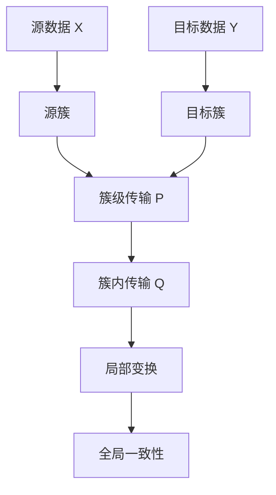

# TACO 相比 HiWA 的创新点分析

> 目的：这份文档专门回答一个问题：**TACO 相比 HiWA 到底新在哪里？它做出了什么新的东西？哪些部分可以迁移到你的猕猴神经元 HiWA 复现与改进项目中？**
>
> 阅读方式：你先不要急着看公式，先看第 1、2、7、8 节。它们直接对应“创新点”和“我能用什么”。后面的公式只是帮助你把逻辑想清楚。

---

## 0. 先说明边界：本文中的 TACO 指什么

这里的 TACO 指你在另一个对话中阅读的那篇与 **HiWA 思路相关** 的 TACO / AI for Chemistry / GCOT 方向论文：它把 HiWA 风格的“层级对齐”思想迁移到 **text representation 与 geometry representation 的对齐** 中，并且引入了 **soft group assignment**。

我目前能看到的是另一对话的摘要信息，而不是完整论文全文。因此本文会非常谨慎地区分三类内容：

1. **HiWA 原论文确定有的内容**：层级 Wasserstein 对齐、cluster-level transport、within-cluster transport、Sinkhorn、ADMM、局部变换与全局一致性。
2. **你那篇 TACO 阅读笔记中明确出现的内容**：soft group assignment、text-geometry alignment、类似 HiWA 的 group-level 和 instance-level 对齐结构。
3. **我建议你用于自己项目的迁移设计**：例如 task-aware loss、uncertainty-aware soft grouping、Soft-Prototype HiWA。这些不是我声称 TACO 原文已经完整做出的公式，而是我们可以从 TACO 得到的研究启发。

一句话：**不要把本文里所有公式都当成 TACO 原文公式；本文的核心用途是帮你判断 TACO 的真实方法增量和可迁移价值。**

---

## 1. 最直接结论

TACO 相比 HiWA 的创新，不是重新发明 Wasserstein、Sinkhorn、Procrustes 或 ADMM。

更准确地说：

> **HiWA 的核心是：给定或预处理得到 hard clusters 后，在 cluster 层和 cluster 内部做层级最优传输对齐。**
>
> **TACO 的核心增量是：不再完全依赖预先固定的 hard clusters，而是通过 soft group assignment / soft prototypes 来构造可学习的组结构，然后再进行类似 HiWA 的层级对齐。**

所以你之前说“TACO 后面的很多操作和 HiWA 很像”，这个判断是对的。真正要抓住的是：

- **HiWA 新在层级最优传输框架本身。**
- **TACO 新在把层级对齐前面的“分组结构”变成 soft、可学习、可嵌入下游任务的结构。**

如果用最简短的话总结：

> **TACO 不是新的 OT 求解器，而是一个把 HiWA 式层级对齐接到 soft grouping 与任务表示学习上的方法改造。**

---

## 2. HiWA 已经做了什么

HiWA 的目标是对齐两个数据集，比如神经活动数据 $X$ 和行为数据 $Y$。它的基本假设是：数据不是一整团混在一起的，而是有簇结构。

可以写成：

$$
X = \bigcup_{i=1}^{K_X} X_i,
\qquad
Y = \bigcup_{j=1}^{K_Y} Y_j.
$$

其中 $X_i$ 是源数据的第 $i$ 个簇，$Y_j$ 是目标数据的第 $j$ 个簇。

HiWA 做了两层事情：

### 2.1 第一层：簇和簇之间怎么对齐

它先问：

> $X$ 里面的第 $i$ 个簇，应该对应 $Y$ 里面的哪个簇？

这对应一个 cluster-level transport plan，常记作 $P$。

直观理解：

$$
P_{ij} \approx \text{源簇 } X_i \text{ 和目标簇 } Y_j \text{ 的对应强度}.
$$

如果 $P_{ij}$ 大，说明 $X_i$ 和 $Y_j$ 很可能是一对应该对齐的簇。

### 2.2 第二层：每一对簇内部的点怎么对齐

如果 $X_i$ 和 $Y_j$ 需要对齐，那么还要继续问：

> $X_i$ 里面每个点应该对应 $Y_j$ 里面哪个点？

这对应 within-cluster transport plan，常记作 $Q_{ij}$。

直观理解：

$$
Q_{ij}(a,b) \approx \text{源簇 } X_i \text{ 中第 } a \text{ 个点和目标簇 } Y_j \text{ 中第 } b \text{ 个点的对应强度}.
$$

### 2.3 第三层：每一对簇有局部变换，但又要服从全局一致性

HiWA 中还有局部变换 $R_{ij}$ 和全局变换 $R_g$。

你可以这样理解：

- $R_{ij}$：为了把 $X_i$ 对齐到 $Y_j$，这一对簇自己需要的旋转 / 正交变换。
- $R_g$：整个数据集层面共享的全局旋转 / 正交变换。
- ADMM：用来协调“每一对簇想怎么转”和“整体应该保持一致”之间的矛盾。

所以 HiWA 的结构是：

普通文字版结构说明：

1. 先把 $X$ 和 $Y$ 看成由多个簇组成。
2. 先求簇和簇之间的对应关系。
3. 再求每一对对应簇内部点和点之间的对应关系。
4. 再通过局部变换与全局变换保持一致。
5. Sinkhorn 负责求带熵正则的传输计划，ADMM 负责协调局部与全局变量。

---

## 3. HiWA 的关键限制：它很依赖 hard clusters

HiWA 很强，但它有一个明显前提：

> 你需要先有簇结构。

这个簇结构可以是：

1. 真实标签给出的；
2. 人工定义的；
3. 用 SSC、GMM、K-means 等聚类算法预处理出来的。

也就是说，HiWA 通常是：

这里的核心问题是：**聚类结果本身可能不可靠。**

特别是对你的猕猴神经元实验来说，这个问题很重要。神经元群体活动通常有以下特点：

- trial-to-trial variability 很强；
- 神经响应模式可能是连续变化的，不一定天然分成几个干净类别；
- 同一个 movement direction 下面也可能存在多个 latent neural states；
- 不同 session / 不同 monkey 之间的簇边界可能发生漂移；
- 预处理聚类如果错了，后面的 HiWA 会被错误簇结构牵着走。

所以 HiWA 的弱点不是 OT 部分，而是：

> **它把“簇是什么”当成对齐之前已经解决的问题。**

这正是 TACO 可以给你启发的地方。

---

## 4. TACO 的第一处创新：从 hard cluster 改成 soft group assignment

### 4.1 hard cluster 是什么

在 HiWA 中，一个样本通常属于一个确定簇。

例如：

$$
x_i \in X_3.
$$

这句话的意思是：第 $i$ 个样本就是属于第 3 个簇。

这叫 hard assignment。

它的特点是：

- 一个点只能属于一个簇；
- 簇边界是硬的；
- 如果聚类错了，这个错误会直接传递给后面的对齐算法。

### 4.2 soft group assignment 是什么

TACO 的关键变化是：一个点不再被强行分到某一个簇，而是被赋予一个概率向量。

设有 $K$ 个潜在组，则第 $i$ 个样本的 soft assignment 可以写成：

$$
a_i = (a_{i1}, a_{i2}, \dots, a_{iK}).
$$

其中：

$$
a_{ik} \geq 0,
\qquad
\sum_{k=1}^{K} a_{ik} = 1.
$$

这里 $a_{ik}$ 表示：

> 第 $i$ 个样本属于第 $k$ 个 latent group 的程度。

例如：

$$
a_i = (0.70, 0.20, 0.10)
$$

表示这个样本主要属于第 1 组，但也带有第 2 组和第 3 组的特征。

### 4.3 这到底新在哪里

这一步的新意在于：

> **TACO 不再把“分组”当成固定输入，而是把“分组”变成模型内部可以学习、可以调整、可以参与对齐的结构。**

这就是它和 HiWA 最大的区别之一。

对比一下：

| 问题 | HiWA | TACO |
|---|---|---|
| 样本怎么分组 | 先验簇或外部聚类 | soft group assignment |
| 一个样本能否属于多个组 | 通常不能 | 可以 |
| 分组是否参与学习 | 通常不作为核心学习对象 | 是方法核心之一 |
| 聚类错误的影响 | 容易直接传给对齐 | 可以通过软权重缓冲 |
| 是否适合连续变化的数据 | 一般 | 更适合 |

所以，TACO 做出的第一个新东西就是：

> **一个 soft group assignment 模块，用来替代 HiWA 中固定的 hard cluster 输入。**

---

## 5. TACO 的第二处创新：用 soft prototypes 组织 group-level alignment

soft group assignment 通常会自然引出 prototype 的概念。

假设源域数据是：

$$
X = \{x_1, x_2, \dots, x_n\}.
$$

每个样本 $x_i$ 对第 $k$ 个组的权重是 $a_{ik}^{X}$。

那么第 $k$ 个源域 prototype 可以理解为一个加权中心：

$$
c_k^X = \frac{\sum_{i=1}^{n} a_{ik}^{X} x_i}{\sum_{i=1}^{n} a_{ik}^{X}}.
$$

目标域也类似：

$$
c_l^Y = \frac{\sum_{j=1}^{m} a_{jl}^{Y} y_j}{\sum_{j=1}^{m} a_{jl}^{Y}}.
$$

这些 $c_k^X$ 和 $c_l^Y$ 就可以看作源域和目标域的 group prototypes。

然后 TACO 可以在 prototype 层面做类似 HiWA 的 group-level alignment。

也就是说，它不一定直接拿 hard cluster $X_i$ 和 $Y_j$ 来比，而是比较：

$$
c_k^X \quad \text{和} \quad c_l^Y.
$$

这一步的直观意义是：

> 先不要急着对齐所有样本，而是先对齐两边学出来的 latent groups / prototypes。

这和 HiWA 的 cluster-level transport 很像，但对象变了：

| 层级 | HiWA | TACO |
|---|---|---|
| 上层对象 | hard clusters | soft groups / prototypes |
| 上层 transport | cluster-to-cluster transport | prototype-to-prototype transport |
| 下层对象 | cluster 内的样本 | group 权重影响下的样本 |

这就是为什么你会觉得 TACO 和 HiWA 很像。因为它确实继承了 HiWA 的“先组级，再组内”的思想。

但区别在于：

> **HiWA 的组是事先给定的；TACO 的组是软生成 / 软学习出来的。**

---

## 6. TACO 的第三处创新：把对齐对象从普通数据簇迁移到表示空间

HiWA 原本做的是比较一般的分布对齐问题。它可以应用到神经数据、行为数据、多模态分布等。

在你的阅读笔记中，TACO 的背景更像是：

> 把一种模态的表示和另一种模态的表示进行对齐，例如 text representation 与 geometry representation。

这意味着 TACO 不是只在原始数据空间中做对齐，而是在 learned representation space 中做对齐。

例如可以抽象成：

$$
z_i^{text} = f_{text}(t_i),
\qquad
z_i^{geo} = f_{geo}(g_i).
$$

其中：

- $t_i$ 是文本输入；
- $g_i$ 是几何 / 图结构 / 结构信息输入；
- $f_{text}$ 是文本编码器；
- $f_{geo}$ 是几何编码器；
- $z_i^{text}$ 和 $z_i^{geo}$ 是两个模态的 latent representations。

TACO 的问题就变成：

> 怎么让 text representation 和 geometry representation 在 latent space 中对齐？

这和 HiWA 的问题不同。

HiWA 主要问：

> 两个点云 / 两个经验分布怎么对齐？

TACO 问的是：

> 两种不同来源的表征空间怎么对齐，并且这种对齐能不能服务于下游任务？

所以 TACO 的第二个重要贡献是：

> **把 HiWA 风格的层级 OT 从“数据集对齐”迁移到了“表征空间对齐”。**

这对你有用，因为神经数据项目中你也可以把原始 spike / firing rate / latent factor 先编码成 representation，然后再对齐。

---

## 7. TACO 到底做出了什么新的东西

这一节直接回答你的问题：**TACO 到底做出了什么新的东西？**

### 7.1 新东西一：soft group assignment matrix

TACO 引入了类似下面这样的分组矩阵：

$$
A_X \in \mathbb{R}_{+}^{n_X \times K},
\qquad
A_X \mathbf{1}_K = \mathbf{1}_{n_X}.
$$

这里 $A_X$ 的第 $i$ 行就是样本 $x_i$ 对 $K$ 个 group 的归属权重。

目标域也有：

$$
A_Y \in \mathbb{R}_{+}^{n_Y \times K},
\qquad
A_Y \mathbf{1}_K = \mathbf{1}_{n_Y}.
$$

这个东西是你最应该记住的。

因为它直接把 HiWA 的 hard clusters 替换成了 soft groups。

### 7.2 新东西二：soft prototypes / group representatives

有了 soft assignment 之后，就可以构造每个 group 的代表点：

$$
c_k^X = \frac{\sum_i a_{ik}^{X} x_i}{\sum_i a_{ik}^{X}},
\qquad
c_l^Y = \frac{\sum_j a_{jl}^{Y} y_j}{\sum_j a_{jl}^{Y}}.
$$

这些 prototypes 相当于“软簇中心”。

这比 K-means 的硬中心更灵活，因为一个样本可以同时影响多个 prototype。

### 7.3 新东西三：prototype-level / group-level transport

TACO 可以在 prototypes 之间构造代价矩阵。

例如：

$$
C_{kl}^{group} = d(c_k^X, c_l^Y).
$$

然后求一个 group-level transport plan：

$$
P^* = \arg\min_{P \in U(\alpha,\beta)}
\langle C^{group}, P \rangle + \varepsilon H(P).
$$

这里：

- $P$ 表示 group 和 group 之间的对应关系；
- $C^{group}$ 是 group 之间的代价矩阵；
- $H(P)$ 是熵正则项；
- $\varepsilon$ 控制传输计划的平滑程度；
- $U(\alpha,\beta)$ 表示满足边缘分布约束的 transport polytope。

这一步和 HiWA 很像，但不是完全一样，因为 HiWA 对齐的是 hard cluster，TACO 对齐的是 soft prototype。

### 7.4 新东西四：instance-level alignment 被 soft group 权重调制

在 HiWA 中，如果 $X_i$ 和 $Y_j$ 是一对簇，那么就在这对簇内部求 $Q_{ij}$。

在 TACO 中，一个样本不再只属于一个簇，所以 instance-level alignment 需要被 soft group 权重调制。

直观上，两个样本 $x_i$ 和 $y_j$ 的对应强度不只取决于它们本身有多像，还取决于：

> $x_i$ 属于哪些 group，$y_j$ 属于哪些 group，以及这些 group 是否被上层 transport plan 认为应该对应。

可以抽象理解成：

$$
\text{score}(x_i,y_j)
\approx
\sum_{k,l} a_{ik}^{X} P_{kl} a_{jl}^{Y} \cdot s(x_i,y_j).
$$

这里 $s(x_i,y_j)$ 是样本之间的相似度或负距离。

这不是要求你现在背公式，而是理解机制：

> **上层 group 对齐会影响下层 instance 对齐；下层 instance 对齐又依赖 soft group assignment。**

这就是 TACO 的层级结构。

### 7.5 新东西五：把对齐服务于下游预测或表征学习

HiWA 更偏向 unsupervised distribution alignment。

TACO 的应用背景更像 representation learning：对齐不是最终目的，最终目的是让 text / geometry / multimodal representation 对下游任务更有用。

所以它的创新叙事可以概括为：

> 不是为了对齐而对齐，而是为了得到更好的任务表征。

这点对你的项目很重要，因为你的目标不是只让 Wasserstein distance 变小，而是希望提高：

- movement direction decoding accuracy；
- velocity prediction performance；
- cross-session generalization；
- cross-monkey generalization；
- alignment stability；
- 算法鲁棒性。

---

## 8. 哪些东西你可以用

这一节是最重要的。你要做的是 HiWA 的猕猴神经元实验复现与创新，所以不是 TACO 的所有东西都要用。

### 8.1 最值得用：soft group assignment

这是最值得迁移的部分。

原始 HiWA 可能是：

你可以改成：

普通文字版结构说明：

1. 不先强制把每个 trial 分到一个簇。
2. 先让每个 trial 对多个 latent neural groups 有不同权重。
3. 用这些 soft groups 构造 prototypes。
4. 在 prototypes 上做 group-level alignment。
5. 在样本层面做 weighted instance-level alignment。

这可以直接变成你的项目创新点：

> **HiWA assumes reliable hard clusters, which may be unstable for noisy neural population data. We replace hard clustering with soft group assignment to learn latent neural response modes and perform hierarchical alignment on these soft groups.**

中文解释：

> 原始 HiWA 默认簇结构可靠，但神经群体数据噪声大、trial 变化强、簇边界不稳定。因此我们用 soft group assignment 学习潜在神经响应模式，再在这些软组结构上做层级对齐。

### 8.2 值得用：soft prototypes

你可以为每个 session / monkey 学出若干个 latent neural prototypes。

例如：

$$
c_k^{session1},
\qquad
c_l^{session2}.
$$

然后比较这些 prototypes，而不是直接比较所有样本。

这有三个好处：

1. 降低噪声影响；
2. 提高跨 session 对齐稳定性；
3. 让模型具有解释性，因为每个 prototype 可以被解释成一种 neural response mode。

你可以在实验中可视化这些 prototypes：

- 看它们是否对应不同运动方向；
- 看它们是否对应不同速度区间；
- 看它们在不同 session 中是否稳定；
- 看它们和原始 HiWA 的 hard clusters 是否一致。

### 8.3 值得用：group-level alignment 先行

原始 OT 直接在所有样本之间对齐，容易受到噪声和局部错误匹配影响。

HiWA 和 TACO 都给你一个共同启发：

> 先做粗粒度 group-level alignment，再做细粒度 instance-level alignment。

你的神经数据项目可以采用这个逻辑：

1. 先学 latent neural groups；
2. 先对齐这些 neural groups；
3. 再在 group 对应关系的约束下对齐单个 trial 或 time bin。

这比直接全局 OT 更稳。

### 8.4 值得用：uncertainty score

soft assignment 自带不确定性。

如果一个样本的 assignment 是：

$$
a_i = (0.98, 0.01, 0.01),
$$

说明它很确定地属于第 1 组。

如果一个样本的 assignment 是：

$$
a_i = (0.34, 0.33, 0.33),
$$

说明它很不确定。

你可以用熵衡量这种不确定性：

$$
\mathrm{Ent}(a_i) = -\sum_{k=1}^{K} a_{ik} \log a_{ik}.
$$

这对神经数据很有价值。因为你可以分析：

- 哪些 trial 很稳定；
- 哪些 trial 位于多个 neural modes 之间；
- 高不确定性的 trial 是否更容易被错误解码；
- soft group 是否能提升 noisy trial 的对齐效果。

这可以成为你论文或项目报告里的一个亮点。

### 8.5 可以用但要谨慎：task-aware alignment

我之前提到的 task-aware loss 属于**研究迁移建议**，不是你现在必须马上做的东西。

原始 HiWA 偏无监督对齐，TACO 的启发是：对齐可以服务于下游任务。

对你的项目，可以设计成：

$$
\mathcal{L}_{total}
=
\mathcal{L}_{align}
+
\lambda \mathcal{L}_{decode}.
$$

其中：

- $\mathcal{L}_{align}$ 是 HiWA / soft-HiWA 的对齐损失；
- $\mathcal{L}_{decode}$ 是运动方向分类或速度预测损失；
- $\lambda$ 控制任务目标的重要程度。

但是注意：这不是第一阶段要做的。第一阶段应该先复现 HiWA，再做 soft group 改造。task-aware alignment 可以作为后续增强版。

---

## 9. 哪些东西不建议你直接用

### 9.1 不建议直接照搬 TACO 的化学 / text-geometry 前端

如果 TACO 的应用背景是 text-geometry / AI for Chemistry，那么里面很多输入表示方式并不适合猕猴神经元数据。

例如：

- 文本编码器；
- 几何结构编码器；
- adsorption configuration 描述方式；
- chemistry-specific downstream task；
- 催化剂筛选指标。

这些东西和你的神经数据项目不是同一个 domain。

你真正需要的是它的思想：

> 用 soft group 和 prototype 对齐替代 hard cluster 对齐。

而不是直接搬它的输入管线。

### 9.2 不建议声称 TACO 发明了 HiWA 式层级 OT

这点一定要小心。

在项目汇报或论文写作中，不要说：

> TACO 提出了层级 Wasserstein alignment。

更准确的说法应该是：

> TACO 借鉴或继承了类似 HiWA 的层级对齐思想，并将其与 soft group assignment / representation alignment 结合。

因为层级 OT 对齐的核心思想，HiWA 已经明确提出了。

### 9.3 不建议一开始就把所有创新堆上去

你现在项目最稳的路线不是一口气做：

- soft group；
- task-aware loss；
- neural network encoder；
- graph regularization；
- uncertainty weighting；
- end-to-end training；
- new ADMM solver。

这样很容易做崩。

更合理的路线是逐步做 ablation。

推荐顺序是：

1. 复现原始 HiWA。
2. 用 GMM responsibilities 替代 hard cluster，做最简单的 soft group HiWA。
3. 加入 soft prototypes 和 group-level transport。
4. 加入 uncertainty analysis。
5. 最后再考虑 task-aware decoding loss。

---

## 10. TACO 与 HiWA 的逐项对比

| 比较维度 | HiWA | TACO | 对你项目的意义 |
|---|---|---|---|
| 核心问题 | 多模态 / 多簇分布对齐 | 表征空间中的软分组对齐 | 你要做跨 session / 跨 monkey 神经对齐 |
| 分组方式 | hard clusters | soft group assignment | 这是最值得迁移的创新点 |
| 上层对齐 | cluster-level transport | group / prototype-level transport | 可以保留 HiWA 的层级结构 |
| 下层对齐 | within-cluster transport | soft group 调制下的 instance alignment | 可以做 weighted within-group matching |
| 求解工具 | Sinkhorn + ADMM | 可能仍借用 OT / Sinkhorn / 类似分解 | 不要把求解器当成主要创新 |
| 对任务的关系 | 更偏纯对齐 | 更偏任务表征学习 | 可启发你加入 decoding 指标 |
| 理论主干创新 | 强 | 相对 HiWA 不强 | 不要把 TACO 当主理论来源 |
| 建模创新 | 中等 | 中等到较强 | soft grouping 对神经数据有用 |
| 迁移价值 | 已经是你的主线 | 作为改进 HiWA 的工具箱 | 最适合做项目创新模块 |

---

## 11. 可以如何把 TACO 思想改造成你的项目

你可以把你的项目命名为类似下面的方向：

> **Soft-Group Hierarchical Wasserstein Alignment for Neural Population Alignment**

或者中文：

> **面向神经群体数据的软分组层级 Wasserstein 对齐方法**

### 11.1 原始 HiWA baseline

先复现：

$$
X \rightarrow \text{hard clusters} \rightarrow \text{HiWA} \rightarrow \text{decoding}.
$$

你要记录：

- alignment cost；
- movement direction accuracy；
- velocity prediction performance；
- runtime；
- 不同随机种子稳定性。

### 11.2 Soft-HiWA version 1

最简单的改法：不用 hard labels，而是用 GMM 得到 soft responsibilities。

例如：

$$
a_{ik} = \Pr(z_i = k \mid x_i).
$$

然后用 $a_{ik}$ 构造 soft prototypes，再做 group-level alignment。

这一步不需要马上训练复杂神经网络，比较稳。

### 11.3 Soft-HiWA version 2

进一步做 weighted instance alignment。

也就是说，样本 $x_i$ 和 $y_j$ 的对齐权重不仅由距离决定，还由它们的 group assignment 决定。

直观形式：

$$
w_{ij}^{group} = \sum_{k,l} a_{ik}^{X} P_{kl} a_{jl}^{Y}.
$$

然后用 $w_{ij}^{group}$ 调制样本之间的匹配代价。

例如：

$$
\widetilde{C}_{ij} = C_{ij} - \tau \log(w_{ij}^{group} + \delta).
$$

这里：

- $C_{ij}$ 是原始样本距离；
- $w_{ij}^{group}$ 表示 group 层面支持这两个样本匹配的程度；
- $\tau$ 是权重强度；
- $\delta$ 是防止取对数时数值出错的小常数。

这可以作为一个很具体的算法创新。

### 11.4 Soft-HiWA version 3

再加入 decoding task。

例如运动方向分类：

$$
\mathcal{L}_{decode} = \mathrm{CE}(f(z_i), y_i).
$$

总体目标可以写成：

$$
\mathcal{L}_{total}
=
\mathcal{L}_{align}
+
\lambda \mathcal{L}_{decode}
+
\beta \mathcal{L}_{reg}.
$$

这里再次强调：

> 这个总体公式是我们基于 TACO 启发设计的项目扩展，不是 HiWA 或 TACO 原文必须有的公式。

---

## 12. 最推荐的实验对照设计

你后续做项目时，可以设计以下实验组：

| 实验组 | 方法 | 目的 |
|---|---|---|
| Baseline 1 | No alignment | 看不对齐时效果有多差 |
| Baseline 2 | Wasserstein Procrustes | 看普通 OT 对齐效果 |
| Baseline 3 | 原始 HiWA | 复现论文主结果 |
| Ours 1 | GMM-soft HiWA | 检验 soft group 是否优于 hard cluster |
| Ours 2 | Prototype soft HiWA | 检验 prototype-level alignment 是否有效 |
| Ours 3 | Uncertainty-weighted soft HiWA | 检验不确定性建模是否提升鲁棒性 |
| Ours 4 | Task-aware soft HiWA | 检验加入 decoding 目标是否提升最终任务指标 |

指标可以包括：

1. movement direction decoding accuracy；
2. velocity prediction $R^2$；
3. mean squared error；
4. alignment cost；
5. cross-session generalization；
6. cross-monkey generalization；
7. seed stability；
8. runtime；
9. transport plan sparsity；
10. soft assignment entropy。

---

## 13. 你应该怎么向老师解释 TACO 的作用

你可以这样说：

> HiWA 已经提出了基于 cluster-level 与 within-cluster transport 的层级 Wasserstein 对齐框架，并通过 Sinkhorn 和 ADMM 进行求解。但是 HiWA 对簇结构有较强依赖，通常需要预先给定或通过聚类算法得到 hard clusters。我们阅读的 TACO 给我们的主要启发是：可以用 soft group assignment 和 soft prototypes 替代固定 hard clusters，从而使分组结构本身更适合 noisy、连续变化、簇边界不稳定的数据。对于猕猴神经元群体活动数据，这一点尤其重要，因为神经响应模式未必天然形成清晰离散簇。因此，我们计划在复现 HiWA 的基础上，尝试构造 soft-group HiWA，并用运动方向解码等下游指标检验其有效性。

这段话比较稳，因为它没有夸大 TACO，也没有否定它的价值。

---

## 14. 最核心的判断

你现在应该形成一个清晰判断：

> **TACO 对 HiWA 的方法论创新不是“重新设计 OT 求解”，而是“重新设计 HiWA 所依赖的分组结构”。**

换句话说：

- HiWA 解决的是：**有簇结构时，怎么做层级对齐。**
- TACO 启发我们的是：**簇结构不一定要硬给，可以用 soft group / prototype 学出来。**
- 你的项目可以做的是：**把 soft group 思想接回 HiWA 的猕猴神经元实验。**

最值得你记住的三个可用点是：

1. **soft group assignment**：替代 hard cluster。
2. **soft prototypes**：作为 group-level alignment 的对象。
3. **uncertainty-aware / task-aware evaluation**：用不确定性和下游解码指标证明你的方法比原始 HiWA 更适合神经数据。

---

## 15. 最后给你一句项目定位

你的项目不应该叫“复现 TACO”。

更合理的定位是：

> **复现 HiWA 的猕猴神经元实验，并借鉴 TACO 的 soft group assignment 思想，提出一种更适合神经群体数据的 Soft-Group HiWA。**

这个定位是清楚的：

- 主线是 HiWA；
- 创新来自 TACO 的 soft grouping 启发；
- 应用场景是 macaque neural population alignment；
- 实验指标是 neural decoding / alignment stability / robustness。

---

## 参考资料

1. John Lee, Max Dabagia, Eva L. Dyer, Christopher J. Rozell. *Hierarchical Optimal Transport for Multimodal Distribution Alignment*. NeurIPS 2019. https://arxiv.org/abs/1906.11768
2. HiWA MATLAB repository. https://github.com/siplab-gt/hiwa-matlab
3. Janghoon Ock, Srivathsan Badrinarayanan, Rishikesh Magar, Akshay Antony, Amir Barati Farimani. *Multimodal Language and Graph Learning of Adsorption Configuration in Catalysis*. https://arxiv.org/abs/2401.07408
4. Gabriel Peyré, Marco Cuturi. *Computational Optimal Transport*. https://arxiv.org/abs/1803.00567

---

## 自检记录

- 数学公式已统一使用 `$...$` 和 `$$...$$`。
- 未使用旧式括号公式分隔符。
- Mermaid 图均使用 `mermaid` 代码块。
- 表格列数已检查，保持一致。
- 未保留 ChatGPT 专用引用标记。
- 复杂公式没有放进 Markdown 表格。
- 代码块均已闭合。
