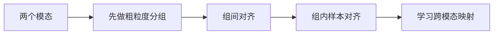
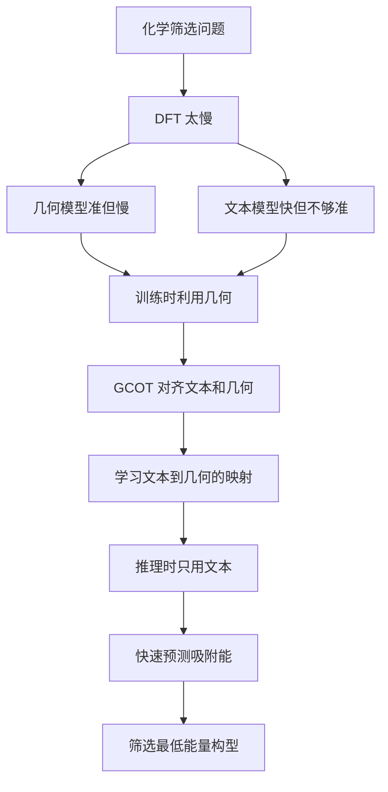

# Taco 精读笔记 00：论文总览与问题背景

> 本章目标：先弄清楚这篇论文到底在解决什么问题、为什么要把“文本”和“几何”放在一起、为什么会自然想到 Optimal Transport。暂时不追公式，不进入 ADMM、Stiefel 流形和理论证明。

## 1. 一句话总览

这篇论文提出的模型叫 **Taco**。它想解决的问题是：

> 在催化剂吸附构型筛选中，能不能在训练阶段向三维几何模型学习，到了推理阶段只用文本描述，就快速预测吸附能并筛出最稳定构型？

更直白一点：

- DFT 准，但太慢。
- 几何深度学习模型比较准，但推理时还要处理三维原子图，也不够快。
- 文本模型很快，但因为丢掉了精细三维几何，准确率通常受损。
- Taco 的想法是：训练时用几何教文本，让文本表示学到几何知识；测试时不再跑昂贵的几何编码器，只用文本描述完成能量预测和构型排序。

这就是题目里 **Geometry-Free Adsorption Configuration Screening** 的含义：不是说化学问题本身没有几何，而是说模型部署时尽量不依赖显式三维几何图输入和几何神经网络推理。

## 2. 化学背景：什么是 adsorption configuration screening

### 2.1 吸附构型是什么

在催化问题里，我们常常关心一个小分子、原子或反应中间体如何吸附在催化剂表面上。

这里通常有三类对象：

- **adsorbate**：被吸附的物种，例如 $*\mathrm{CH}$、$*\mathrm{NH}_2$ 等。
- **catalyst surface**：催化剂表面，例如某种金属或合金表面。
- **adsorption configuration**：吸附构型，即吸附物种在表面上的具体位置、姿态和局部原子排布。

同一个 adsorbate-catalyst pair 可能有很多候选构型。它们可能只差一点点，例如：

- 吸附在 top site 还是 bridge site；
- 分子朝向不同；
- 邻近原子的局部排列不同；
- 初始结构经过弛豫后落到不同局部极小值。

这些差异看起来细微，但吸附能可能明显不同。

### 2.2 为什么要找最低吸附能构型

论文关注的是 relaxed adsorption energy，也就是经过结构弛豫后的吸附能。一般来说，在一个候选构型集合中，吸附能最低的构型被视为更稳定的构型。

这件事可以概念性地写成：

$$
C^\star = \operatorname*{arg\,min}_{C_m\in\mathcal C}\widehat E_{\mathrm{ads},m}.
$$

但这里先不要把重点放在公式上。它只是说：

> 给定一批候选构型，模型给每个构型预测一个吸附能，然后选择预测能量最低的那个。

这就是 adsorption configuration screening。

## 3. 为什么传统方法慢

最直接的方法是对每个候选构型都做 DFT structural relaxation 和 energy calculation。

问题在于：

- 候选构型很多；
- 每个构型的 DFT 弛豫都很贵；
- 高通量筛选需要在大量 adsorbate-catalyst system 上重复这个过程；
- 如果每个候选都做精确量子化学计算，整体成本非常高。

所以 AI for Chemistry 里的一个核心目标就是：

> 用机器学习模型作为 surrogate model，尽量替代大量重复的 DFT 计算。

这里的 surrogate model 不是要取代化学规律，而是要在大量候选中先做快速筛选，把真正值得精算的对象留下来。

## 4. 现有路线的根本矛盾：准确率与效率

论文把现有方法大致放在两条路线里。

| 路线 | 输入 | 优点 | 局限 |
|---|---|---|---|
| 几何模型 | 三维原子图、坐标、距离、角度 | 能捕捉精细结构，准确率强 | 推理时要处理复杂 3D 图，成本高 |
| 文本模型 | 化学文本描述、结构化 descriptor | 推理快，便于高通量 | 丢掉显式几何，精度和泛化可能下降 |
| 传统多模态对齐 | 文本与几何嵌入共同训练 | 利用两种信息 | 若只做对比学习，未必学到一一映射 |

这篇论文的核心矛盾就是：

> 几何模型有 accuracy，文本模型有 efficiency。Taco 想同时要这两者。

## 5. 文本描述到底包含什么

论文中的 textual descriptor 不是自然语言小作文，而是结构化化学字段按固定顺序拼接后 tokenization。原文明示包括：

- adsorbate formula：吸附物种公式；
- surface elements：表面元素组成；
- Miller indices：晶面指数；
- primary atoms：主要相关原子；
- site types：吸附位点类型；
- secondary atoms：次级相关原子。

例如 Figure 1 中出现的示意信息包括：

- `NH`；
- `Al20Rh8`；
- `(2 1 1)`；
- `Bridge`；
- `N Al ... N`。

这些 descriptor 能告诉模型“这大概是什么化学环境”，但它们不是完整三维坐标。因此，纯文本模型可能知道“bridge site”和“某些邻近原子”，却不一定知道精细的键长、角度、局部扭转和真实三维排布。

> 注意：论文的 Preliminaries 明确列出上述字段；Methodology 里又说 ordered concatenation of seven handcrafted chemical attributes。这里存在一个口径需要后续精读时核对。当前先按 Preliminaries 明示字段理解，不强行补出第七项。

## 6. 几何表示是什么

几何表示把吸附系统看成一个 atomistic graph。

可以先这样理解：

- 节点是原子；
- 节点带有三维坐标；
- 边表示一定截断半径内的邻居关系；
- 周期性边界条件下，还要考虑晶胞平移；
- 复杂几何模型会进一步利用距离、角度、方向和旋转等变换规律。

这类表示很适合化学，因为吸附能确实强烈依赖局部几何。但是它的推理成本也高，因为模型要在原子图上进行多层消息传递、等变注意力或几何卷积。

## 7. Taco 的核心想法

Taco 的训练和推理逻辑可以拆成两阶段。

### 7.1 训练阶段：文本向几何学习

训练时，模型同时看到两种输入：

- 3D geometry；
- textual descriptor。

它分别用两个 encoder 得到两种 token：

- geometry tokens；
- text tokens。

然后通过 **Group-Conditioned Optimal Transport** 对齐两种 token。这个模块不是只把 paired embedding 拉近，而是试图建立更细的 text-to-geometry correspondence。

### 7.2 推理阶段：只用文本快速预测

推理时，模型主要走文本通道：

- 输入候选构型的文本 descriptor；
- semantic encoder 得到 text tokens；
- text-geometry projector 生成类似几何 token 的表示；
- energy head 输出吸附能；
- 对候选构型排序，选择能量最低者。

也就是说：

> 训练阶段，几何是老师；推理阶段，文本是学生，但这个学生已经学过几何老师的知识。

## 8. 为什么这里会自然想到 Optimal Transport

你之前学过 HiWA，所以这篇论文的入口其实很顺。

HiWA 的故事是：

> 两个数据集 $X$ 和 $Y$ 来自不同模态或不同坐标系。我们不知道簇怎么对应，也不知道点怎么对应，于是用 hierarchical optimal transport 同时处理簇级对应和点级对应。

Taco 的故事是：

> 文本 token 和几何 token 是两个模态。我们希望知道哪些文本语义结构对应哪些几何结构，还希望进一步知道具体样本之间如何匹配，于是也用层级式 OT。

二者的共同思想是：

但是二者也有差别：

| 对比项 | HiWA | Taco |
|---|---|---|
| 对齐对象 | 两个点云或多模态数据分布 | 文本表示与几何表示 |
| 粗层结构 | cluster correspondence | soft group alignment |
| 细层结构 | point-wise transport | instance-level text-geometry matching |
| 几何变换 | 正交变换、Procrustes、Stiefel | text-to-geometry projector 与几何特征对齐 |
| 应用目标 | 多模态分布对齐 | 吸附能预测与构型筛选 |

所以你可以把 Taco 理解成：

> 把 HiWA 的“层级分布对齐思想”迁移到 AI for Chemistry 中，用来让文本表示学习几何表示。

## 9. 为什么 GAP 不够

论文特别强调，它与 GAP 这类 CLIP-style alignment 不一样。

CLIP-style alignment 通常做的是：

> paired text embedding 和 geometry embedding 应该更近，不配对的应该更远。

这种方法能让两个模态进入同一个 shared space，但它未必保证：

- 每个文本 descriptor 都唯一对应自己的几何结构；
- 不同构型之间的细粒度几何差异被保留下来；
- 文本表示能生成足够接近几何 token 的结构化表示。

Taco 认为，吸附构型筛选不是粗糙分类，而是细粒度 ranking。两个候选构型可能非常相似，但最低能量只属于其中一个。因此，它需要更强的 instance-level correspondence，而不只是 embedding proximity。

## 10. 这篇论文的主线

整篇论文可以按下面这条线读：

## 11. 读论文时要抓住的五个问题

接下来逐章精读时，始终围绕五个问题：

1. **表示问题**：文本 descriptor 和几何 graph 分别保留了什么信息？丢掉了什么信息？
2. **对齐问题**：为什么 text tokens 和 geometry tokens 不能只靠普通 contrastive learning 对齐？
3. **OT 问题**：group-level OT 与 instance-level OT 分别在解决什么歧义？
4. **优化问题**：为什么会出现 Stiefel manifold 和 ADMM？它们和 HiWA 的关系是什么？
5. **实验问题**：Taco 的优势到底来自文本先验、几何教师、OT 对齐，还是三者共同作用？

## 12. 本章小结

本章只需要记住一句话：

> Taco 不是单纯的文本模型，也不是普通几何模型，而是一个“训练时几何监督、推理时文本执行”的跨模态吸附能预测框架。它用层级最优传输把文本语义结构和三维几何结构对齐，从而在高通量吸附构型筛选中兼顾准确率与速度。

下一章可以进入 **Preliminaries**：具体看论文如何定义 $G$、$S$、候选构型集合、IS2RE 任务，以及为什么这个任务可以被转化为一个最低预测能量的筛选问题。

## 13. 来源说明

- 主要来源：上传压缩包中的论文 `Learning Geometric Knowledge from Text for Effective Geometry-Free Adsorption Configuration Screening`。
- 对照来源：上传压缩包中的 `HiWA 精读笔记：Hierarchical Optimal Transport for Multimodal Distribution Alignment`。
- 本笔记为精读讲解笔记，采用解释性转述，不保留论文长段原文。
