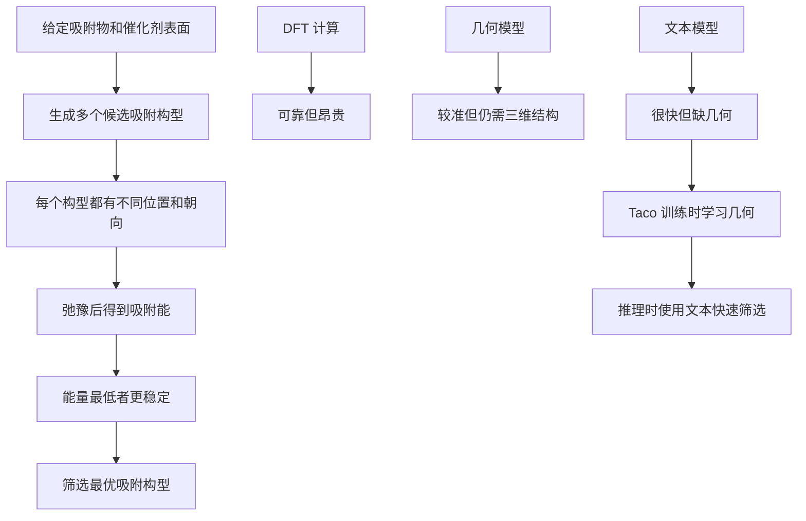

# Taco 精读笔记 01：化学任务背景

## 0. 本章目标

这一章先不进入模型公式，也不讨论最优传输。我们只解决一个问题：

> 这篇论文到底在解决哪个化学计算问题？

如果这一层没有听懂，后面的文本编码器、几何编码器、GCOT、ADMM 都会变成空中楼阁。

本章只需要掌握六个词：

| 术语 | 中文理解 | 本章直觉 |
|---|---|---|
| adsorbate | 吸附物 | 贴到表面上的小分子或原子团 |
| catalyst surface | 催化剂表面 | 被吸附物贴上去的材料表面 |
| adsorption site | 吸附位点 | 表面上可能被贴住的位置 |
| adsorption configuration | 吸附构型 | 吸附物在表面上的一种具体摆法 |
| adsorption energy | 吸附能 | 衡量这种摆法是否稳定的能量指标 |
| screening | 筛选 | 从很多候选构型中找出最可能稳定的那个 |

---

## 1. 从催化剂设计说起

催化剂的作用可以粗略理解为：

> 让某些化学反应更容易发生，同时自身在反应前后大体保持不变。

在很多催化反应中，反应物并不是悬在空中完成反应，而是会先靠近并附着到催化剂表面。这个“附着到表面”的过程，就是吸附。

比如我们可以想象一个小分子落到一块金属表面上：

- 它可以落在某个单独原子正上方；
- 也可以落在两个表面原子之间；
- 还可以落在多个表面原子围成的空位附近；
- 它可以平躺、倾斜、竖直；
- 它可以用不同原子端去接触表面。

这些不同的落点和姿态，就构成了不同的吸附构型。

---

## 2. 什么是 adsorbate？

**adsorbate** 可以翻译为“吸附物”。

它是被放到催化剂表面上的对象。它可以是：

- 一个原子；
- 一个小分子；
- 一个分子片段；
- 一个反应中间体。

在论文图 1 里，例子中出现了 `NH`，这就可以看成一个吸附物。

直觉上：

> adsorbate 就是“要贴到催化剂表面上的那个小东西”。

---

## 3. 什么是 catalyst surface？

**catalyst surface** 是催化剂表面。

在实际催化问题中，分子并不是和整个无限大的材料一起反应，而是主要和材料表面附近的原子发生相互作用。

论文里会用一些信息描述这个表面，例如：

| 信息 | 含义 |
|---|---|
| surface elements | 表面由哪些元素组成，例如 Al、Rh |
| Miller indices | 晶面指数，用来描述切出来的是哪个晶面 |
| nearby atoms | 吸附位点附近有哪些原子 |

这里的 Miller indices 暂时不用深究。你可以先把它理解成：

> 同一种晶体材料，从不同方向切开，会露出不同的表面；Miller indices 就是在标记“这是哪一种表面”。

---

## 4. 什么是 adsorption site？

**adsorption site** 是吸附位点，也就是表面上可能发生吸附的位置类型。

常见说法包括：

| 位点类型 | 直觉解释 |
|---|---|
| top site | 吸附物靠近一个表面原子正上方 |
| bridge site | 吸附物位于两个表面原子之间 |
| hollow site | 吸附物位于多个表面原子围成的空洞附近 |

论文图 1 里示例使用了 `Bridge`，表示这是一个 bridge site。

注意：site type 只是一个粗略描述。它告诉我们“这大概是哪一类位置”，但它没有告诉我们精确的三维坐标、键长、键角和局部形变。

---

## 5. 什么是 adsorption configuration？

**adsorption configuration** 是吸附构型。

它比 adsorption site 更具体。

同一个吸附位点类型下面，也可能有很多不同构型。因为构型不仅包括“在哪里吸”，还包括：

- 吸附物具体坐标；
- 吸附物朝向；
- 哪个原子更靠近表面；
- 表面局部原子如何排列；
- 周围元素环境如何；
- 经过结构弛豫后最终会变成什么样。

所以可以这样区分：

| 概念 | 粗细程度 | 例子 |
|---|---|---|
| adsorption site | 较粗 | bridge site |
| adsorption configuration | 更细 | 某个 NH 分子以某个角度吸在 Al-Rh 表面某两个原子之间 |

一句话：

> adsorption configuration 是“吸附物贴在表面上的一种具体姿势”。

---

## 6. 为什么同一个体系会有很多候选构型？

给定一个 adsorbate-catalyst pair，也就是固定：

- 吸附物是什么；
- 催化剂表面是什么。

仍然会有很多候选构型。原因是：

1. 表面上有很多可能位置；
2. 每个位置附近可能有不同元素环境；
3. 分子可以有不同朝向；
4. 初始构型经过 relaxation 后可能落到不同稳定状态；
5. 有些构型看起来相似，但吸附能可能明显不同。

这就是论文开头说的核心场景：

> 对同一个吸附物和催化剂表面，候选结构数量可能很多，而我们想找出最稳定的那个。

---

## 7. 什么是 adsorption energy？

**adsorption energy** 是吸附能。

暂时不急着写严格公式。先抓住物理直觉：

> 吸附能用来衡量吸附物和催化剂表面结合之后，这种状态有多稳定。

一般来说，在同一套定义下：

> 能量越低，系统越稳定。

所以如果我们有很多候选构型：

```text
C1, C2, C3, ..., CM
```

每个构型都有一个对应的吸附能预测值，那么筛选任务就可以理解为：

> 找出预测吸附能最低的那个构型。

这就是论文里说的 optimal adsorption configuration。

注意这里有一个很重要的点：

> 论文关心的不只是预测一个能量数值，更关心能不能根据能量排序找出最稳定构型。

这就是为什么它叫 configuration screening，而不只是 energy prediction。

---

## 8. 什么是 relaxation？

**relaxation** 可以翻译为结构弛豫。

初始构型往往只是人为或程序生成的初始猜测。真实物理系统不会严格停留在这个初始位置，而是会调整到附近能量更低的位置。

可以类比成：

> 你把一个球放在山坡上，它不会停在你刚放下的位置，而是会滚到附近较低的地方。

吸附构型也是这样。初始结构经过 DFT relaxation 后，会得到一个 relaxed structure，并得到对应的 relaxed adsorption energy。

论文任务中很重要的一点是：

> 从初始结构或文本描述出发，预测 relaxed adsorption energy。

也就是说，模型要预测的是“弛豫之后的能量”，而不是初始摆放那一刻的能量。

---

## 9. 为什么不用 DFT 全部算完？

DFT 是 density functional theory，密度泛函理论。它是计算材料和分子能量的经典量子化学方法之一。

它的优点是：

- 物理基础强；
- 结果相对可靠；
- 可以计算结构弛豫和能量。

但它的缺点也很明显：

- 计算成本高；
- 每个候选构型都要弛豫和算能量；
- 如果候选构型很多，成本会迅速爆炸；
- 高通量筛选时难以承受。

所以 AI 模型在这里扮演的角色不是替代化学理论，而是做一个快速代理模型：

> 先用模型快速估计哪些构型可能更好，再把真正有价值的候选交给更昂贵、更可靠的计算方法。

---

## 10. 为什么几何模型准，但贵？

几何深度学习模型会直接读取三维结构，例如：

- 原子坐标；
- 原子之间距离；
- 键角；
- 局部邻域；
- 周期性边界条件下的邻接关系。

这些信息非常关键，因为吸附能对局部结构很敏感。

但是代价也很高：

- 要构造原子图；
- 要处理三维坐标；
- 要进行多层 message passing；
- 要考虑旋转、平移、对称性；
- 推理速度相对较慢。

因此几何模型像一个“看得很细的专家”：

> 它能看见微小几何差别，所以更准；但每次都要仔细检查三维结构，所以慢。

---

## 11. 为什么文本模型快，但不够准？

文本模型不直接看三维坐标，而是看结构化描述，例如：

```text
NH | Al20Rh8 | (2 1 1) | N Al ... N | Bridge
```

这些描述很轻量，推理很快，也包含一些化学语义。

但问题是：

> 文本描述是粗粒度的，它无法完整记录三维几何细节。

比如两个构型都叫 bridge site，但真实坐标可能不同：

- 一个键长更短；
- 一个分子角度更倾斜；
- 一个附近原子环境更拥挤；
- 一个 relaxation 后更稳定。

这些差异可能不会完整写进文本里，但会显著影响吸附能。

所以文本模型像一个“看摘要的学生”：

> 它读得快，但容易漏掉局部几何细节。

---

## 12. Taco 想解决的真正矛盾

现在可以重新理解 Taco 的出发点。

| 方法 | 优点 | 缺点 |
|---|---|---|
| DFT | 可靠 | 太慢，无法大规模筛选 |
| 几何深度学习 | 准确率高 | 需要三维几何，推理成本仍高 |
| 文本模型 | 推理快 | 丢失显式几何信息，准确率较低 |
| Taco | 训练时学习几何，推理时主要用文本 | 需要设计文本到几何表示的对齐机制 |

Taco 的目标不是说“文本本身已经足够”。它真正想做的是：

> 训练时让文本表示向几何表示学习，使文本在推理时尽量携带几何知识。

---

## 13. 用流程图理解本章任务



文字版结构说明：

1. 一个吸附物和一个催化剂表面会产生许多候选构型。
2. 每个候选构型弛豫后有一个吸附能。
3. 筛选任务就是找出吸附能最低的候选构型。
4. DFT 可靠但太慢。
5. 几何模型更准但仍依赖三维结构。
6. 文本模型更快但容易丢失几何细节。
7. Taco 试图让文本在训练中学到几何知识，从而实现 geometry-free screening。

---

## 14. 本章最重要的三句话

第一句：

> 吸附构型就是吸附物在催化剂表面上的一种具体摆法。

第二句：

> 构型筛选就是从很多候选摆法中，找出弛豫后吸附能最低、最稳定的那个。

第三句：

> Taco 的出发点是：几何信息重要但昂贵，所以希望训练时学几何，推理时少依赖几何。

---

## 15. 自检问题

读完本章后，可以尝试回答下面几个问题：

1. adsorbate 和 catalyst surface 分别是什么？
2. adsorption site 和 adsorption configuration 有什么区别？
3. 为什么同一个 adsorbate-catalyst pair 会有很多候选构型？
4. 为什么最低吸附能通常对应更稳定的构型？
5. DFT 为什么不能直接用于大规模候选构型筛选？
6. 几何模型和文本模型各自的优缺点是什么？
7. Taco 为什么要强调 geometry-free，而不是完全不要 geometry？

---

## 16. 下一章预告

下一章可以进入论文的 Problem Definition，但仍然先不深挖模型公式。

我们要搞清楚论文中的三个对象：

- 几何图 $G$：三维原子结构如何变成图；
- 文本描述 $S$：论文到底把哪些化学信息拼成文本；
- 候选构型集合 $C$：筛选任务如何变成找最低能量构型。

下一章的重点是：

> 论文到底把一个吸附构型表示成了什么数据？
