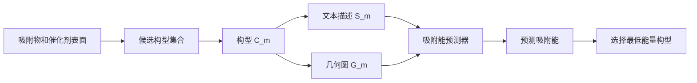

# Taco 精读笔记 02：Problem Definition 问题定义

## 0. 本节在论文中的位置

本节对应论文 **II. Preliminaries** 里的 **Problem definition**。

这一节不是正式提出 Taco 模型，而是在规定：

> 一个吸附构型在论文里到底被表示成什么？模型要预测什么？筛选任务又是什么意思？

先把对象定义清楚，后面的文本编码器、几何编码器、optimal transport、GCOT 才有意义。

---

## 1. 一句话概括本节

论文认为同一个吸附构型可以有两种表示方式：

| 表示方式 | 论文记号 | 直觉理解 | 信息特点 |
|---|---|---|---|
| 几何表示 | $G$ | 真实三维结构图 | 精细，但需要坐标 |
| 文本描述 | $S$ | 结构化化学描述 | 便宜，但比较粗糙 |

所以问题定义可以概括为：

> 对于每一个候选吸附构型 $C_m$，我们可以用几何图 $G_m$、文本描述 $S_m$，或者二者结合来表示它；模型要预测这个构型的吸附能，然后从所有候选构型中选出预测吸附能最低的那个。

---

## 2. 先用生活比喻理解：同一个构型的两张“身份证”

一个吸附构型就像一个人，它可以有两种身份证明。

第一种是“高清照片”：

> 原子在哪里，谁和谁靠得近，空间距离是多少，局部几何形状是什么。

这就是几何图 $G$。

第二种是“文字档案”：

> 这个吸附物是什么，表面元素是什么，晶面是什么，吸附位点是什么，哪些原子参与吸附。

这就是文本描述 $S$。

高清照片信息多，但是拍摄和处理成本高。文字档案信息少，但是获取和使用都更方便。Taco 后面要做的事，就是让模型训练时看过高清照片，之后尽量只看文字档案也能判断得不错。

---

## 3. 文本描述 $S$：它不是自然语言作文

论文里的 textual descriptor 不是一段随意写的自然语言，而是一组固定字段拼接成的结构化文本。

论文使用的字段包括：

| 字段 | 记号 | 含义 | 直觉作用 |
|---|---|---|---|
| adsorbate formula | $Ad$ | 吸附物分子式 | 告诉模型“谁在吸附” |
| surface elements | $Su$ | 催化剂表面元素 | 告诉模型“吸在哪种表面上” |
| Miller indices | $Mi$ | 晶面指数 | 告诉模型“表面切面方向” |
| primary atoms | $Pr$ | 主要吸附相关原子 | 提供局部化学线索 |
| site types | $Si$ | 吸附位点类型 | 提供 top、bridge、hollow 等位点信息 |
| secondary atoms | $Se$ | 次级相关原子 | 补充局部环境线索 |

这些字段按固定顺序拼接，然后送入 tokenizer：

$$
S = \operatorname{Tokenizer}(Ad \oplus Su \oplus Mi \oplus Pr \oplus Si \oplus Se)
$$

这里的 $\oplus$ 可以先理解为“拼接”。也就是说，模型不是直接读一句完整的中文或英文描述，而是读一个结构化的化学字符串。

### 3.1 为什么文本描述有用？

因为这些字段包含了很多化学先验信息。例如：

- 不同吸附物的成键倾向不同；
- 不同表面元素的电子结构不同；
- 不同晶面会暴露不同的原子排列；
- top、bridge、hollow 等位点会影响吸附稳定性；
- primary atoms 和 secondary atoms 可以提示局部吸附环境。

所以文本不是“空话”。它虽然没有精确坐标，但确实包含与吸附能相关的线索。

### 3.2 文本描述的局限

论文中特别强调：$Pr$ 和 $Se$ 提供的是 chemical and site-level cues，而不是 explicit atom coordinates 或 atom-level masks。

也就是说，文本可以告诉模型：

> 哪些原子或位点比较重要。

但它不能直接告诉模型：

> 每个原子的三维坐标是多少，键长是多少，角度是多少，弛豫后会变成什么样。

这就是文本模型的根本限制。

---

## 4. 几何表示 $G$：把吸附体系看成原子图

几何表示把一个吸附体系建模成 atomistic graph，也就是原子级图：

$$
G = (V, E)
$$

其中：

- $V = \{v_1, \dots, v_N\}$ 是原子集合；
- 每个原子 $v_i$ 有一个三维坐标 $x_i$；
- 所有坐标组成矩阵 $X \in \mathbb{R}^{N \times 3}$；
- $E$ 是边集合，表示哪些原子在局部几何上被认为是邻居。

### 4.1 这里的图不是普通社交网络图

在数学或计算机里，我们经常说图 $G=(V,E)$。在这里：

| 图论对象 | 化学含义 |
|---|---|
| 节点 $V$ | 原子 |
| 节点特征 | 原子种类、可能还有其他化学属性 |
| 坐标 $X$ | 原子的三维位置 |
| 边 $E$ | 局部邻近关系 |

要注意，论文里的边不一定等同于严格化学键。很多几何深度学习模型会根据距离截断半径 $R_{cut}$ 和最近邻规则构造边。

### 4.2 为什么要考虑 periodic boundary condition？

催化剂表面通常来自晶体结构。晶体不是孤立的一小块，而是周期性重复的。

所以在构造邻居时，不能只看当前晶胞里面的原子，还要考虑相邻晶胞的周期性副本。论文用 periodic boundary conditions 处理这个问题。

直觉上就是：

> 如果一个原子在晶胞边界附近，它真正的邻居可能出现在旁边那个周期性复制的晶胞里。

所以构图时要考虑晶胞平移。

### 4.3 几何图为什么强？

几何图直接保留了原子坐标和局部邻接结构，因此模型可以学习：

- 原子间距离；
- 键角；
- 局部配位环境；
- 表面暴露结构；
- 吸附物和表面的相对位置。

这些都是吸附能预测中非常重要的信息。

但问题也在这里：

> 几何图很有用，但推理阶段需要显式三维结构，这会限制高通量筛选效率。

---

## 5. 候选构型集合 $\mathcal{C}$：筛选不是凭空生成结构

对于一个给定的 adsorbate-catalyst pair，论文假设有一组候选吸附构型：

$$
\mathcal{C} = \{C_1, C_2, \dots, C_M\}
$$

这些候选构型可能在以下方面不同：

- 吸附位点不同；
- 分子朝向不同；
- 局部原子排布不同；
- 吸附物与表面的接触方式不同。

每一个候选构型 $C_m$ 都可以对应：

- 一个几何图 $G_m$；
- 一个文本描述 $S_m$；
- 或者同时有 $G_m$ 和 $S_m$。

这里一定要注意：论文的 screening 不是说模型在连续空间里从零开始生成所有可能构型，而是说：

> 已经有一批候选构型，模型要从中快速挑出最可能稳定的那个。

这是理解任务边界的关键。

---

## 6. 预测目标：吸附能 $\hat{E}_{ads,m}$

模型要训练一个预测器 $f_\theta$，对每个候选构型 $C_m$ 预测吸附能：

$$
\hat{E}_{ads,m} = f_\theta(C_m)
$$

更具体地说，输入可以是：

- $G_m$：几何图；
- $S_m$：文本描述；
- $(G_m, S_m)$：几何和文本的组合。

输出是该构型的预测吸附能 $\hat{E}_{ads,m}$。

在读这篇论文时，你可以先把 $f_\theta$ 理解成一个黑箱函数：

> 输入一个构型的表示，输出这个构型大概有多稳定。

后面 Taco 的模型设计，就是在解释这个黑箱函数具体怎么构造。

---

## 7. 筛选规则：选择预测吸附能最低的构型

有了每个候选构型的预测吸附能后，筛选任务就变成：

$$
C^* = \arg\min_{C_m \in \mathcal{C}} \hat{E}_{ads,m}
$$

这句话的含义是：

> 在所有候选构型里，找出预测吸附能最低的那个。

为什么是最低？因为通常来说，能量越低，结构越稳定。

所以 $C^*$ 就被看作这个 adsorbate-catalyst system 中最稳定的候选吸附结构。

---

## 8. 用一张流程图串起来

文字版结构说明：

1. 先给定一个吸附物和一个催化剂表面；
2. 生成或收集多个候选吸附构型；
3. 每个构型可以被表示成文本描述和几何图；
4. 模型预测每个构型的吸附能；
5. 最后选择预测吸附能最低的构型。

---

## 9. 这一节和 HiWA 的连接

你之前学 HiWA 时，核心对象是两个模态或两个分布之间的对齐。

在 Taco 里，也有两个模态：

| HiWA 中的感觉 | Taco 中的对应 |
|---|---|
| 两个模态或两个分布 | 文本模态 $S$ 与几何模态 $G$ |
| 样本之间不知道如何对应 | 文本 token 与几何 token 的语义结构不容易直接对应 |
| 需要在结构层面对齐 | 需要让文本表示学习几何结构知识 |
| 层级 OT | 后面的 group-conditioned optimal transport |

现在还不用进入 OT。你只需要先建立这个意识：

> Taco 后面做 optimal transport，不是为了炫技，而是因为文本表示和几何表示之间存在跨模态结构差异，需要一种对齐机制。

---

## 10. 本节最容易误解的地方

### 10.1 误解一：Geometry-Free 就是不需要几何知识

不对。

Taco 的意思更准确地说是：

> 推理阶段不需要显式几何输入，但训练阶段仍然利用几何表示来教文本模型。

所以 geometry-free 主要是 inference-time geometry-free，而不是 completely geometry-ignorant。

### 10.2 误解二：文本描述就是普通自然语言

也不对。

这里的文本描述是结构化字段拼接出来的化学 descriptor，不是随便写一句话。

### 10.3 误解三：边 $E$ 就是化学键

不完全对。

在原子图神经网络里，边经常是根据空间邻近关系构造的。两个原子在图里相连，通常表示它们在截断半径内或属于近邻，而不一定表示它们之间有传统意义上的化学键。

### 10.4 误解四：模型是在生成最优构型

不是。

本节的问题定义是 screening：

> 从已有候选构型集合中选择预测能量最低的构型。

它不是从连续空间中直接优化生成一个全新构型。

---

## 11. 本节你需要真正记住的三句话

第一：

> 同一个吸附构型可以用几何图 $G$ 或文本描述 $S$ 来表示。

第二：

> 几何图包含三维坐标和局部邻接结构，文本描述包含吸附物、表面、晶面、位点和相关原子等结构化化学信息。

第三：

> 筛选任务就是对候选集合 $\mathcal{C}$ 中每个构型预测吸附能，然后选择预测吸附能最低的构型 $C^*$。

---

## 12. 下一节预告

下一节可以继续读 **Graph-based models** 和 **Text-based models**。

也就是论文接下来要说明：

- 为什么传统几何图模型很强；
- 为什么它们推理时成本高；
- 为什么文本模型更快；
- 为什么纯文本又不够；
- Taco 为什么要站在二者之间。

这会自然引出 Taco 的核心设计：

> 训练时用几何模态提供监督和对齐目标，推理时让文本模态承担主要预测任务。
