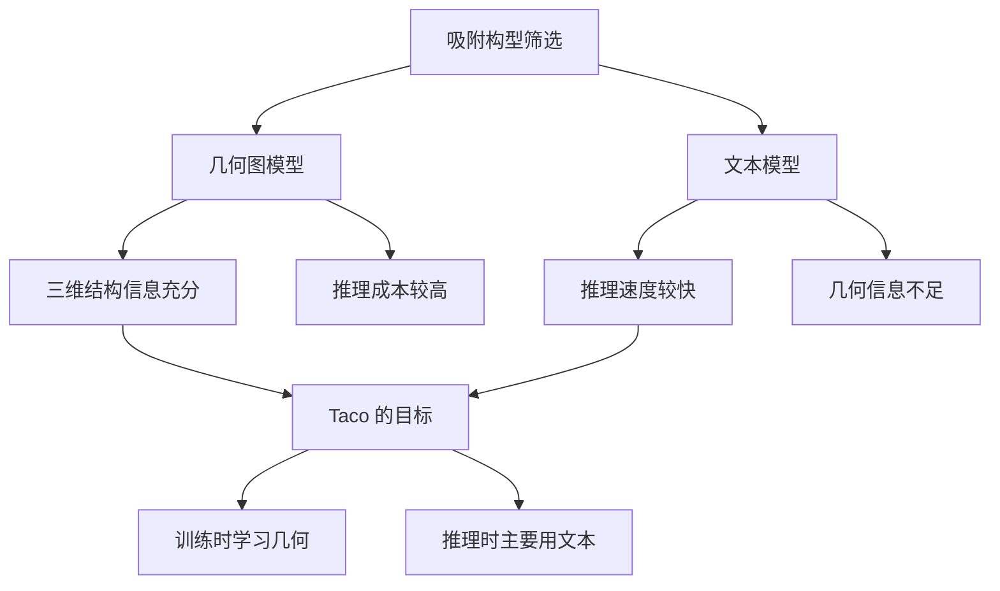

# Taco 精读笔记 03：Graph-based Models 与 Text-based Models

## 0. 本节在论文中的位置

本节对应论文 **II. Preliminaries** 中的两段：

- **Graph-based models**
- **Text-based models**

上一节我们已经知道，一个吸附构型可以有两种表示：

- 几何图 $G$：保留原子三维坐标和邻接结构；
- 文本描述 $S$：用结构化字段描述吸附物、表面、晶面、位点等信息。

这一节论文要比较两条路线：

> 如果模型看几何图 $G$，它通常更准，但推理更慢；如果模型只看文本描述 $S$，它通常更快，但几何信息损失更大。

Taco 的出场逻辑，就是为了缓解这个矛盾。

---

## 1. 一句话概括本节

本节可以概括为：

> 图模型把吸附体系当成三维原子图来学习，能捕捉精细几何结构，因此准确率强；文本模型把吸附体系当成结构化文本来学习，推理更快，但难以表达精细三维几何，因此准确性和泛化能力受限。

这不是单纯的模型分类，而是在铺垫 Taco 的核心问题：

> 能不能训练时利用几何模型的知识，推理时保留文本模型的速度？

---

## 2. Graph-based models：看三维结构的模型

### 2.1 先用直觉理解

Graph-based models 可以理解为：

> 模型直接看原子三维结构，把每个原子当成节点，把局部空间邻近关系当成边，然后通过图神经网络学习吸附能。

它像是在看一张“高清三维结构图”。

这类模型会关心：

- 原子种类是什么；
- 原子之间距离多远；
- 某个原子周围有哪些邻居；
- 键角、二面角、局部方向关系是什么；
- 分子和催化剂表面的相对空间位置如何。

这些信息对吸附能很重要。因为吸附能不是只由“是什么分子”和“是什么金属”决定，还强烈依赖局部空间构型。

---

## 3. 为什么几何图模型准确率高？

吸附能对局部结构非常敏感。

同一个吸附物和同一个催化剂表面，可能只是分子稍微转了一个角度，或者吸附原子距离表面稍微近一点，能量就会发生明显变化。

所以几何图模型的优势在于：

> 它直接把三维坐标、距离、角度、局部邻域等信息交给模型，让模型有机会学习真正影响吸附能的几何因素。

你可以把它理解为：

> 文本模型知道“这个人住在哪个小区”，几何模型知道“这个人住在哪栋楼、哪一层、哪个房间、窗户朝向哪里”。

前者有用，但后者更细。

---

## 4. 论文中提到的典型几何模型

论文列了一批常见的几何深度学习模型。我们现在不需要掌握每个模型的细节，只要知道它们大概在强化什么几何信息。

| 模型 | 主要思想 | 直觉理解 |
|---|---|---|
| DimeNet | directional message passing，引入键角信息 | 不只看距离，也看方向和角度 |
| DimeNet++ | 更快、更省内存的 DimeNet 改进版 | 保留方向建模，同时提升效率 |
| GemNet | 使用 two-hop message passing 和二面角信息 | 进一步看更复杂的局部几何关系 |
| PaiNN | 旋转等变消息传递 | 旋转分子后，表示按物理规律变化 |
| eSCN | 高阶张量等变卷积 | 更高效处理复杂方向特征 |
| EquiformerV2 | 结合 SO(3) 等变结构和注意力机制 | 强大的三维原子图编码器 |

这一堆名字不用死记。你只需要记住它们共同代表一条路线：

> 显式处理三维几何结构，并尽量尊重物理空间中的旋转、平移和局部相互作用规律。

---

## 5. 这里的“等变”先怎么理解？

论文后面会使用 EquiformerV2 作为几何编码器，所以这里提前给一个直觉。

在三维化学结构里，一个合理的几何模型应该满足一些物理对称性。

### 5.1 平移不变性

如果把整个吸附体系整体平移一下，吸附能不应该变。

也就是说：

> 原点放在哪里不重要，原子之间的相对位置才重要。

### 5.2 旋转相关性

如果把整个体系旋转一下，能量这种标量性质不应该变；但某些方向性特征应该随着结构一起旋转。

这就是几何模型里经常说的：

- invariant：不变；
- equivariant：等变。

不用急着形式化。你现在只需要知道：

> 等变模型不是随便把坐标塞进神经网络，而是要求模型对三维空间变换有正确的响应方式。

这就是 EquiformerV2、PaiNN、eSCN 等模型重要的原因。

---

## 6. 几何图模型的问题：推理时太重

几何图模型虽然强，但有一个大问题：

> 测试和筛选时仍然需要显式三维几何输入。

这会带来几个成本。

### 6.1 需要候选三维结构

模型不是只看一个分子式就能预测。它需要每个候选构型的三维原子坐标和图结构。

### 6.2 图神经网络推理本身也重

几何模型通常需要在原子图上做多层消息传递：

- 每个原子和邻居交换信息；
- 计算距离、角度、方向特征；
- 反复聚合局部结构信息；
- 如果是等变模型，还要处理更复杂的张量表示。

这比普通文本 Transformer 或 MLP 推理更重。

### 6.3 高通量筛选时成本会放大

如果一个体系有很多候选构型，或者有成千上万个 adsorbate-catalyst pair，要对每个候选结构都跑几何模型，成本就会被放大。

所以论文说几何图模型限制了 high-throughput screening。

你可以记成：

> 几何模型不是不能用，而是大规模筛选时不够轻。

---

## 7. Text-based models：看结构化文本的模型

### 7.1 先用直觉理解

Text-based models 不直接输入完整三维结构，而是把吸附体系转成结构化文本描述。

比如上一节讲过的：

- 吸附物分子式；
- 表面元素；
- Miller indices；
- primary atoms；
- site types；
- secondary atoms。

然后用语言模型或文本编码器处理这些 token，最后预测吸附能。

这类方法像是在看一份“化学档案”。

它不看高清三维照片，而是看文字记录。

---

## 8. 为什么文本模型更快？

文本模型的优势在于：

> 它避开了显式三维图结构处理。

它不需要在每个候选构型上做复杂的几何消息传递，也不需要处理 SO(3) 等变张量。输入只是 token sequence，经过文本编码器以后做预测。

所以它更适合快速筛选。

尤其在高通量场景里，推理成本的差异会非常重要。

---

## 9. 文本模型为什么不是完全没道理？

很多同学容易误解：

> 既然文本没有坐标，那文本模型是不是纯粹瞎猜？

不是。

文本描述里仍然包含很多化学先验。

比如：

| 文本字段 | 对吸附能的潜在影响 |
|---|---|
| adsorbate formula | 不同吸附物成键能力不同 |
| surface elements | 不同金属表面电子性质不同 |
| Miller indices | 不同晶面暴露的原子排列不同 |
| site types | top、bridge、hollow 等位点稳定性不同 |
| primary atoms | 提示直接参与吸附的关键原子 |
| secondary atoms | 提示局部环境中的辅助原子 |

所以文本不是没有信息，而是信息粒度比较粗。

---

## 10. 论文中提到的典型文本模型

论文提到了一批科学文本或材料文本相关模型，包括：

- SciBERT；
- BioBERT；
- MatSciBERT；
- MOFormer；
- Molecular Transformer；
- CatBERTa；
- GAP。

对这篇论文来说，最重要的是后两个：

### 10.1 CatBERTa

CatBERTa 证明了一件事：

> 结构化化学文本描述本身可以用于 relaxed adsorption energy prediction。

也就是说，只看文本不是完全不可行。

这为 Taco 提供了一个重要前提：

> 如果文本描述完全没用，那么 geometry-free prediction 根本不可能成立。

### 10.2 GAP

GAP 在 CatBERTa 的基础上更进一步，尝试对齐几何描述和文本描述。

它使用的是类似 CLIP 的对比学习框架。

直觉上就是：

> 成对的文本和几何表示应该靠近，不匹配的文本和几何表示应该远离。

这比纯文本模型更进一步，因为它试图让文本表示吸收一些几何信息。

---

## 11. 为什么论文说 GAP 还不够？

这一点非常关键，因为 Taco 很大程度上就是针对 GAP 的不足来设计的。

GAP 的 CLIP-style alignment 主要做的是：

> 把匹配的文本 embedding 和几何 embedding 拉近，把不匹配的拉远。

这是一种“相似性层面”的对齐。

但是 Taco 认为，仅仅拉近还不够。因为吸附构型筛选需要更细的对应关系：

> 每一个文本描述都应该精确对应到它自己的几何结构，而不是只是在共享空间里大概靠近。

换句话说，GAP 更像是让两个模态“认识彼此”；Taco 想让文本表示能够“生成或映射到对应的几何表示”。

这就是论文反复强调的：

> instance-level one-to-one correspondence。

---

## 12. 用一个比喻区分 GAP 和 Taco

假设有一批学生和他们的身份证照片。

GAP 做的事情像是：

> 让每个学生的文字档案和照片在特征空间里尽量靠近。

这能说明“这个档案大概和这张照片有关”。

但 Taco 想做的是：

> 从每个学生的文字档案中恢复出和他本人照片对应的关键视觉特征。

也就是说，Taco 不满足于“靠近”，而是想建立更明确的映射关系。

这就是为什么 Taco 后面要引入 optimal transport，尤其是 group-conditioned optimal transport。

---

## 13. 几何模型和文本模型的根本矛盾

这一节的核心矛盾可以整理成表格：

| 路线 | 输入 | 优点 | 缺点 |
|---|---|---|---|
| 几何图模型 | 原子坐标和三维图 $G$ | 准确，能捕捉精细局部结构 | 推理成本高，需要显式三维结构 |
| 文本模型 | 结构化文本 $S$ | 推理快，适合大规模筛选 | 缺失精细几何，准确率通常较低 |
| CLIP-style 对齐模型 | 文本和几何 embedding | 能让两种模态靠近 | 不保证精确一一对应 |
| Taco | 训练时用 $G$ 和 $S$，推理时主要用 $S$ | 想兼顾准确率和效率 | 需要解决文本到几何表示的精细对齐 |

这张表基本就是 Taco 的论文动机。

---

## 14. 和 HiWA 的连接

你之前学过 HiWA，所以这一节可以用一个熟悉的视角来看。

HiWA 关注的问题是：

> 两个分布之间存在结构差异，不能只做粗糙匹配，需要层级对齐。

Taco 的问题是：

> 文本表示和几何表示之间也存在结构差异，不能只让 paired embedding 靠近，而要建立 group-level 和 instance-level 的精细对应。

所以在感觉上：

| HiWA | Taco |
|---|---|
| 两个分布之间做层级对齐 | 文本模态和几何模态之间做层级对齐 |
| cluster-level alignment | group-level text-geometry alignment |
| sample-level alignment | instance-level text-geometry alignment |
| 解决跨分布结构错位 | 解决跨模态表示错位 |

现在你还不用进入 GCOT 的公式。你只要先意识到：

> Taco 不是随便用了 OT，而是因为它要比 CLIP-style 对齐更精细地建立文本和几何之间的对应关系。

---

## 15. 这一节最容易误解的地方

### 15.1 误解一：文本模型比几何模型高级

不是。

文本模型的主要优势是推理快，不是一定更强。

在吸附能预测中，几何信息非常重要，所以纯文本方法通常会损失精度。

### 15.2 误解二：几何模型只要慢一点，无所谓

在小规模任务里可能无所谓，但高通量筛选不是只预测一个结构。

它可能要快速评估大量候选构型。每个构型都跑复杂几何模型，成本会迅速累积。

### 15.3 误解三：CLIP-style alignment 已经解决了文本和几何对齐

不完全。

CLIP-style alignment 主要把匹配样本拉近，但 Taco 认为这不足以建立精确的一一映射。

对于构型筛选来说，很多候选构型的文本描述可能很相似，但几何细节不同。只靠“靠近”不一定能区分这些细微差异。

### 15.4 误解四：Taco 推理时完全不需要构型信息

也不对。

Taco 推理时仍然需要候选构型的文本描述。它不是只给一个化学体系就凭空猜最优构型，而是对候选构型的文本 descriptor 进行能量预测和筛选。

---

## 16. 本节你需要真正记住的三句话

第一：

> 几何图模型直接处理三维原子结构，所以通常更准确，但推理成本高。

第二：

> 文本模型只处理结构化化学描述，所以推理更快，但丢失精细几何信息。

第三：

> Taco 的核心动机是：训练时借助几何模型学习精细结构知识，推理时尽量用文本模型完成快速筛选。

---

## 17. 一张图串联本节逻辑

文字版结构说明：

1. 吸附构型筛选可以走几何图模型路线，也可以走文本模型路线；
2. 几何图模型准确但慢；
3. 文本模型快但丢几何；
4. Taco 希望训练时用几何知识提升文本表示；
5. 推理时主要使用文本，从而提高筛选效率。

---

## 18. 下一节预告

下一节就可以进入 **III. Methodology: Overview Pipeline**。

也就是正式看 Taco 的整体流程：

- 训练阶段输入什么；
- 几何编码器输出什么；
- 文本编码器输出什么；
- GCOT 在哪里起作用；
- text-geometry projector 是什么；
- 为什么测试时可以 geometry-free inference。

下一节仍然先不深入公式，而是先把整张 Figure 1 讲清楚。
