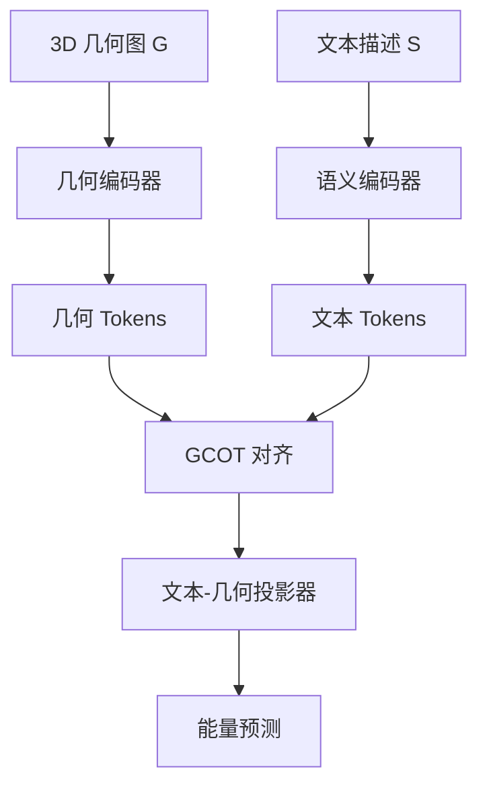
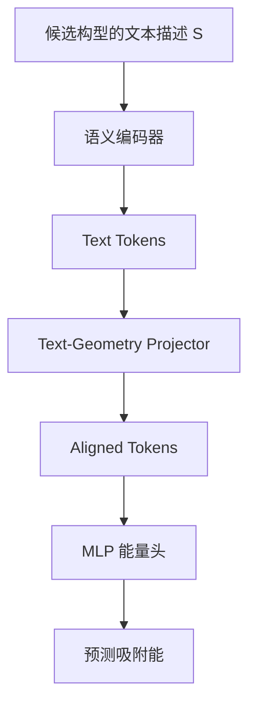

# Taco 精读笔记 04：整体流程图与训练-推理逻辑

## 0. 本节定位

这一节对应论文 **Methodology - Overview Pipeline**，主要看 Figure 1。

这一节不要急着理解所有公式，也不要马上进入 EquiformerV2、SO(3)、GCOT 的细节。我们先把整篇方法的主线讲清楚：

> Taco 的核心不是单独做文本模型，也不是单独做几何模型，而是让文本表示在训练阶段向几何表示学习，最后在推理阶段绕开昂贵的几何神经网络。

换句话说，Taco 的方法可以概括为：

> 训练时：文本 + 几何一起用。  
> 推理时：主要用文本，生成几何风格的隐表示，再预测吸附能。

---

## 1. Figure 1 分成三块

论文 Figure 1 大致分成三部分：

| 模块 | 名称 | 作用 |
|---|---|---|
| Figure 1(a) | Training Pipeline | 训练阶段，同时输入 3D 几何和文本描述 |
| Figure 1(b) | Group-Conditioned Optimal Transport | 对齐文本 token 和几何 token |
| Figure 1(c) | Inference Pipeline | 推理阶段，只走文本路径，快速预测能量 |

这一张图其实就是全文方法的路线图。

可以先用下面这张简化图理解：



这个图对应的是训练阶段。

---

## 2. 训练阶段：为什么要同时看几何和文本？

训练阶段，Taco 有两个输入：

$$
G = (V, E)
$$

和

$$
S = \text{textual descriptor}
$$

其中：

- $G$ 是几何图，包含原子、空间坐标、近邻关系、周期性结构等；
- $S$ 是文本描述，包含吸附物、表面元素、晶面指数、吸附位点、primary atoms、secondary atoms 等。

训练阶段的想法是：

> 我既然有真实几何结构，就让文本表示去学习几何表示。

这就像老师教学生：

- 几何编码器是老师，看到真实三维结构；
- 文本编码器是学生，只看到文字描述；
- GCOT 是教学过程，负责把学生的文本理解和老师的几何理解对齐；
- Text-Geometry Projector 是最终学出来的转换器。

这个转换器学会之后，推理阶段就可以用文本表示去生成“像几何表示一样有用”的 token。

---

## 3. 几何编码器：把 3D 结构变成 geometry tokens

训练时，几何图 $G$ 会送入一个几何神经网络。

论文中使用的是 EquiformerV2 这一类几何模型。现在不需要理解它的 SO(3) 表示论细节，只要先知道：

> 几何编码器的作用，是把原子三维结构编码成一组 geometry tokens。

这些 geometry tokens 不是原始坐标，而是模型提取出来的几何特征。

它们可能包含的信息包括：

- 原子之间的距离关系；
- 吸附物和表面的相对位置；
- 局部配位环境；
- 空间方向信息；
- 表面附近的几何 motif。

所以几何编码器可以理解成：

> 读一张三维结构图，然后写出一份高维几何摘要。

---

## 4. 语义编码器：把文本描述变成 text tokens

文本描述 $S$ 会送入语义编码器。

文本描述不是普通自然语言，而是结构化化学字段，比如：

```text
NH | Al20Rh8 | (2 1 1) | N Al ... N | Bridge
```

语义编码器的作用是：

> 把这些结构化字段变成 text tokens。

text tokens 里面包含的是化学语义信息，例如：

- 吸附物是什么；
- 催化剂表面是什么元素组成；
- 晶面是什么；
- 吸附位点是什么类型；
- 哪些原子与吸附有关。

但是它的缺点也明显：

> text tokens 本身没有显式三维坐标，因此不天然知道精细的键长、角度、方向和局部空间形状。

所以它需要向 geometry tokens 学习。

---

## 5. GCOT：中间的对齐器

Figure 1(b) 是这篇论文最重要的技术核心之一：

> Group-Conditioned Optimal Transport，简称 GCOT。

这一节先不展开公式，只讲它在整体流程里的功能。

GCOT 要解决的问题是：

> text tokens 和 geometry tokens 来自两个不同模态，它们不是天然对齐的。我们需要设计一种方式，让文本表示知道自己应该对应哪一类几何表示。

论文说 GCOT 做两层对齐：

| 层次 | 直觉 | 作用 |
|---|---|---|
| group-level alignment | 组和组之间对齐 | 让文本分布和几何分布在同类结构上接近 |
| instance-level alignment | 样本和样本之间对齐 | 让某个文本描述对应自己的几何构型 |

这一步和你之前学 HiWA 的地方很像。

HiWA 里我们关心的是：

> 簇和簇怎么对齐，点和点怎么对齐。

Taco 里我们关心的是：

> 文本组和几何组怎么对齐，文本样本和几何样本怎么对齐。

所以可以暂时这样类比：

| HiWA | Taco |
|---|---|
| cluster-level alignment | group-level alignment |
| sample-level alignment | instance-level alignment |
| 两个分布的结构对齐 | 两个模态的表示对齐 |
| 点云或经验测度之间的对应 | 文本 token 与几何 token 之间的对应 |

现在只需要记住：

> GCOT 是 Taco 用来让文本表示学习几何表示的核心对齐模块。

---

## 6. Text-Geometry Projector：真正学出来的“翻译器”

GCOT 对齐之后，模型会学习一个 **Text-Geometry Projector**。

这个 projector 可以理解为：

> 一个从文本特征空间到几何特征空间的翻译器。

它输入的是 text tokens，输出的是 aligned tokens。

这里要注意一个容易误解的点：

> aligned tokens 不是直接重建出的真实三维坐标，而是更像几何编码器输出的隐表示。

也就是说，它不是在生成一张新的原子坐标图，而是在生成一种“几何风格的特征表示”。

这个思想很关键，因为 Taco 的目标不是做 3D reconstruction，而是做 adsorption energy prediction。

它只需要生成对预测吸附能有用的几何隐特征。

---

## 7. 推理阶段：为什么可以 geometry-free？

推理阶段如 Figure 1(c) 所示。

这时 Taco 不再走完整几何编码器路径。

推理流程变成：



这就是 Taco 被称为 geometry-free 的主要原因。

它不是说完全没有几何思想，而是说：

> 推理阶段不再需要昂贵的几何神经网络做图结构聚合，而是用文本描述生成几何风格的隐表示。

所以 geometry-free 更准确地说是：

> inference-time geometry-encoder-free。

也就是：

> 推理时不跑几何编码器。

---

## 8. 整体任务重新串起来

对于一个候选吸附构型，Taco 最终还是要预测吸附能：

$$
\hat{E}_{ads} = f_\theta(\text{aligned tokens})
$$

对于一组候选构型：

$$
\mathcal{C} = \{C_1, C_2, \dots, C_M\}
$$

Taco 会分别预测它们的吸附能：

$$
\hat{E}_{ads,1}, \hat{E}_{ads,2}, \dots, \hat{E}_{ads,M}
$$

然后选择预测吸附能最低的构型：

$$
C^* = \arg\min_{C_m \in \mathcal{C}} \hat{E}_{ads,m}
$$

这就是 adsorption configuration screening。

因此 Taco 的完整逻辑是：

> 先用文本快速预测每个候选构型的能量，再选出预测能量最低的构型。

---

## 9. 为什么这个流程有意义？

这个流程有三个好处。

### 9.1 保留几何模型的知识

训练时 Taco 使用真实几何图 $G$，所以它不是完全丢掉三维结构。

它通过几何编码器和 GCOT，把几何知识迁移到文本路径中。

### 9.2 推理速度更快

推理时 Taco 不需要处理复杂的 3D graph aggregation。

所以相比完整几何神经网络，它更适合做大规模候选构型筛选。

### 9.3 比普通文本模型更强

普通文本模型只看文本，缺少几何监督。

Taco 的文本路径经过几何对齐训练，因此文本表示里会包含更多几何相关信息。

所以 Taco 想达到的是：

> 接近几何模型的准确性，同时保留文本模型的效率。

---

## 10. 三个常见误解

### 10.1 误解一：geometry-free 就是不需要几何知识

不是。

Taco 仍然非常依赖几何知识。只是这些几何知识主要在训练阶段被学习，并在推理阶段以隐表示的形式发挥作用。

更准确的说法是：

> 训练阶段有几何监督，推理阶段不跑几何编码器。

### 10.2 误解二：Text-Geometry Projector 会生成真实三维坐标

也不是。

它生成的是 aligned tokens，不是原子坐标。

这些 tokens 的目标是服务于吸附能预测，而不是重建真实结构。

### 10.3 误解三：GCOT 只是让两个 embedding 靠近

不完全是。

如果只是让匹配样本靠近、不匹配样本远离，那更像 CLIP-style contrastive learning。

Taco 更强调：

> 在 group 层面和 instance 层面建立更细的对齐关系。

这也是它和 GAP 的一个重要区别。

---

## 11. 和 HiWA 的关系再压缩一次

如果用你已经学过的 HiWA 来理解 Taco，可以这样说：

> HiWA 是在两个分布之间做层级结构对齐；Taco 是在文本模态和几何模态之间做层级结构对齐。

两者都不是只看单点距离，而是关心：

- 大结构怎么对应；
- 小样本怎么对应；
- 对齐之后如何让下游任务变得更好。

但是两者的任务不同：

| 论文 | 对齐对象 | 下游目的 |
|---|---|---|
| HiWA | 两个分布或两个点集 | 学习跨分布结构关系 |
| Taco | 文本 token 和几何 token | 预测吸附能并筛选构型 |

所以 Taco 可以看成：

> 把层级最优传输对齐思想用于 AI for Chemistry 的跨模态表示学习。

---

## 12. 本节小结

这一节你只需要记住四句话。

第一：

> Taco 训练时同时输入几何图 $G$ 和文本描述 $S$。

第二：

> 几何编码器产生 geometry tokens，语义编码器产生 text tokens。

第三：

> GCOT 负责把 text tokens 和 geometry tokens 在 group 和 instance 两个层面上对齐。

第四：

> 推理时 Taco 只走文本路径，用 Text-Geometry Projector 生成几何风格的 aligned tokens，再预测吸附能。

如果用一句话总结：

> Taco 的整体流程就是：训练时借几何教文本，推理时让文本代替几何完成快速筛选。

---

## 13. 下一节预告

下一节可以进入 **Encoders**。

我们会分别讲：

- Geometric Encoder 是什么；
- 为什么论文使用 EquiformerV2；
- 为什么几何模型要考虑平移、旋转和周期性；
- Semantic Encoder 是什么；
- 为什么文本描述要经过 BERT 类模型编码。

下一节会开始接触一点公式，但重点仍然是解释每个公式背后的物理和机器学习含义。
