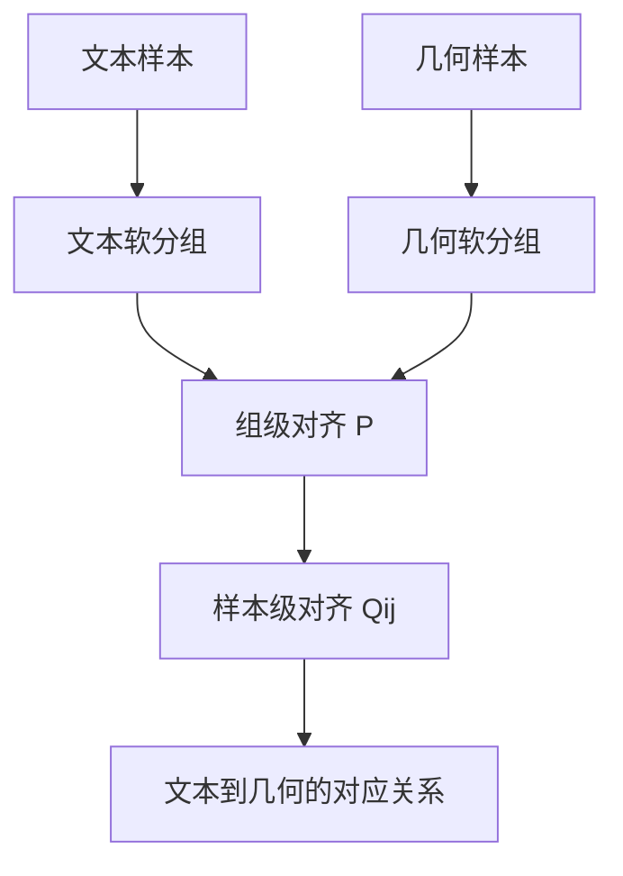

# Taco 精读笔记 06：GCOT 的直觉与软分组

## 0. 本节定位

这一节对应论文中的 **Group-Conditioned Optimal Transport**，中文可以译为：**组条件最优传输**。

这部分是 Taco 论文最接近你之前学过的 HiWA 的地方。

但是先不要急着把它看成一堆公式。它真正想解决的问题是：

> 文本表示和几何表示是两个模态。模型怎样知道哪一类文本特征应该对应哪一类几何特征，并且进一步知道每个具体文本样本应该对应哪个具体几何样本？

一句话概括本节：

> GCOT 先做“组与组”的粗对齐，再做“样本与样本”的细对齐。

---

## 1. 为什么需要 GCOT

经过前面的两个 encoder，Taco 已经得到了两堆向量。

第一堆来自 **Semantic Encoder（语义编码器）**：

$$
\bar U = [u_1, u_2, \dots, u_N]
$$

这里每个 $u_k$ 是一个文本样本的语义表示。

第二堆来自 **Geometric Encoder（几何编码器）**：

$$
\bar G = [g_1, g_2, \dots, g_N]
$$

这里每个 $g_l$ 是一个几何样本的几何表示。

现在问题变成：

> 如何把文本向量空间里的点，对齐到几何向量空间里的点？

如果直接做所有样本之间的匹配，会有一个问题：

> 样本特征很散，直接匹配容易不稳定，也容易陷入错误对应。

所以 Taco 不直接一上来匹配每个样本，而是先做一个更稳的中间步骤：

> 先把样本软分组，再在组之间做对齐，最后在组内细化样本匹配。

---

## 2. 英文术语卡片

| 英文 | 中文 | 直觉解释 |
|---|---|---|
| Group-Conditioned Optimal Transport, GCOT | 组条件最优传输 | 在组结构约束下做文本和几何的最优传输对齐 |
| Soft Group Assignment | 软分组 / 软组分配 | 一个样本不是只属于一个组，而是以不同概率属于多个组 |
| Prototype | 原型 / 组中心 | 一类样本的代表性中心向量 |
| Membership Score | 隶属度分数 | 样本属于某个组的程度 |
| Group-level Alignment | 组级对齐 | 先判断哪类文本组对应哪类几何组 |
| Instance-level Alignment | 实例级对齐 / 样本级对齐 | 再判断具体文本样本对应具体几何样本 |
| Transport Plan | 传输计划 | 描述从一堆点到另一堆点如何搬运概率质量 |
| Birkhoff Polytope | Birkhoff 多面体 | 双随机矩阵集合，用来表达软的一一组匹配 |

---

## 3. 什么叫软分组

普通分组是硬分组。

比如一个样本只能属于第 1 组、或者第 2 组、或者第 3 组。

但是 Taco 采用的是 **Soft Group Assignment（软分组）**。

这意味着：

> 一个样本可以同时带有多个组的特征，只是属于每个组的程度不同。

例如某个文本样本可能有这样的隶属度：

| 组 | 隶属度 |
|---|---:|
| group 1 | 0.70 |
| group 2 | 0.20 |
| group 3 | 0.10 |

这表示它主要属于 group 1，但也带有一点 group 2 和 group 3 的特征。

这比硬分组更适合化学数据，因为很多吸附构型并不一定能被干净地分到某个单一类别里。

---

## 4. 文本侧的软分组

论文先给文本特征设置一组可学习的语义原型：

$$
C_{text} = [c_1^{text}, c_2^{text}, \dots, c_S^{text}]
$$

这里的 $S$ 是组的数量。

然后对每个文本样本 $u_k$，计算它属于第 $i$ 个文本组的程度：

$$
A_{ki}
=
\frac{\exp(u_k^\top c_i^{text})}{\sum_{i'=1}^S \exp(u_k^\top c_{i'}^{text})}
$$

这里 $A_{ki}$ 就是文本样本 $k$ 对文本组 $i$ 的隶属度。

你可以把它理解成：

> 如果 $u_k$ 和某个原型 $c_i^{text}$ 越相似，那么它属于这个组的概率就越大。

---

## 5. 几何侧的软分组

几何侧也做同样的事情。

设置几何原型：

$$
C_{geo} = [c_1^{geo}, c_2^{geo}, \dots, c_S^{geo}]
$$

对每个几何样本 $g_l$，计算它属于第 $j$ 个几何组的程度：

$$
B_{lj}
=
\frac{\exp(g_l^\top c_j^{geo})}{\sum_{j'=1}^S \exp(g_l^\top c_{j'}^{geo})}
$$

这里 $B_{lj}$ 表示几何样本 $l$ 属于几何组 $j$ 的程度。

所以现在 Taco 得到了两个软分组矩阵：

| 矩阵 | 中文 | 作用 |
|---|---|---|
| $A$ | 文本软分组矩阵 | 记录每个文本样本属于各个文本组的程度 |
| $B$ | 几何软分组矩阵 | 记录每个几何样本属于各个几何组的程度 |

---

## 6. 为什么要把组看成概率分布

最优传输处理的是两个概率分布之间如何搬运质量。

因此 Taco 把每个组都看成一个经验测度。

文本第 $i$ 个组可以写成：

$$
\mu_i = \sum_{k=1}^N a_k^{(i)} \delta_{U_i(k)}
$$

几何第 $j$ 个组可以写成：

$$
\nu_j = \sum_{l=1}^N b_l^{(j)} \delta_{G_j(l)}
$$

这里不用怕，意思其实很简单：

> 一个组不是一个单点，而是一堆样本点组成的概率分布。每个样本点的权重由它对这个组的隶属度决定。

其中 $\delta_x$ 是 Dirac 测度，可以理解成“质量集中在点 $x$ 上”。

这和你之前学 Wasserstein、经验测度时的思想是一致的。

---

## 7. 组级对齐：先判断哪类文本组对应哪类几何组

现在有了文本组分布：

$$
\mu_1, \mu_2, \dots, \mu_S
$$

也有了几何组分布：

$$
\nu_1, \nu_2, \dots, \nu_S
$$

Taco 要学习一个组对应矩阵：

$$
P \in \mathbb{R}^{S \times S}
$$

其中 $P_{ij}$ 越大，表示：

> 文本第 $i$ 组越应该对应几何第 $j$ 组。

论文要求 $P$ 属于 Birkhoff 多面体：

$$
P \in \mathcal{B}_S
$$

这里的意思是 $P$ 是一个双随机矩阵：

- 每一行加起来相同；
- 每一列加起来相同；
- 所有元素非负。

直觉上，这代表一种“软的一一匹配”：

> 每个文本组要分配给几何组，每个几何组也要被文本组解释，但这种对应允许是软的。

---

## 8. 样本级对齐：再判断具体样本怎么对应

组和组之间对齐以后，还要看组内部的具体样本如何匹配。

对于文本组 $i$ 和几何组 $j$，Taco 使用一个传输矩阵：

$$
Q_{ij}
$$

其中 $Q_{ij}(k,l)$ 表示：

> 在文本组 $i$ 和几何组 $j$ 的对齐中，文本样本 $k$ 有多少质量被传输到几何样本 $l$。

这就是 **Instance-level Alignment（样本级对齐）**。

所以整体结构是：

普通文字版结构说明：

1. 文本样本先被软分到多个文本组。
2. 几何样本先被软分到多个几何组。
3. 矩阵 $P$ 负责判断文本组和几何组之间的对应关系。
4. 矩阵 $Q_{ij}$ 负责判断某个组对内部的具体样本对应关系。

---

## 9. GCOT 的目标函数先看直觉

论文里的核心优化可以写成：

$$
\min_{P, T}
\sum_{i=1}^S \sum_{j=1}^S
P_{ij} W_2^2(T(\mu_i), \nu_j)
$$

先不要急着拆它。

这句话的意思是：

> 找到一个文本到几何的变换 $T$，同时找到组对应矩阵 $P$，使得对应组之间的 Wasserstein 距离尽量小。

逐项翻译：

| 符号 | 中文解释 |
|---|---|
| $P_{ij}$ | 文本组 $i$ 和几何组 $j$ 的对应强度 |
| $T$ | 把文本特征变换到几何特征空间的映射 |
| $T(\mu_i)$ | 变换后的文本组分布 |
| $\nu_j$ | 几何组分布 |
| $W_2^2$ | 两个分布之间的平方 Wasserstein 距离 |

所以它本质上是在说：

> 如果文本组 $i$ 应该对应几何组 $j$，那经过变换之后，它们的分布距离就应该小。

---

## 10. 和 HiWA 的类比

你之前学过 HiWA，所以这里可以直接类比。

| HiWA | Taco |
|---|---|
| 两个模态或两个数据分布 | 文本模态和几何模态 |
| cluster-level alignment | group-level alignment，组级对齐 |
| sample-level alignment | instance-level alignment，样本级对齐 |
| $P$ 表示簇对应 | $P$ 表示文本组和几何组对应 |
| $Q_{ij}$ 表示组内样本传输 | $Q_{ij}$ 表示文本样本到几何样本的传输 |
| 学习跨分布结构对应 | 学习文本到几何的表示对应 |

所以 GCOT 可以看成：

> 把 HiWA 那种“先对齐簇，再对齐样本”的思想，放到了文本表示和几何表示之间。

---

## 11. 为什么 GCOT 比简单 CLIP 对齐更细

GAP 这类 CLIP-style alignment 更像是在说：

> 配对的文本向量和几何向量应该靠近，不配对的应该远离。

这有用，但不够细。

Taco 想要的是：

> 文本特征不仅要和几何特征靠近，还要能通过一个明确的映射进入几何特征空间。

因此 GCOT 不只是做“相似度拉近”，而是做：

1. 文本组和几何组的结构对应；
2. 具体文本样本和具体几何样本的传输对应；
3. 文本空间到几何空间的映射学习。

---

## 12. 本节最重要的三句话

第一：

> GCOT 不是直接乱匹配所有样本，而是先软分组，再对齐组，最后对齐组内样本。

第二：

> $P$ 负责 group-level alignment，即文本组和几何组之间的对应。

第三：

> $Q_{ij}$ 负责 instance-level alignment，即具体文本样本和具体几何样本之间的传输。

---

## 13. 一句话版

> GCOT 的作用是把文本 token 和几何 token 的对应关系学出来：先粗看哪类文本对应哪类几何，再细看每个文本样本对应哪个几何样本。

---

## 14. 下一节预告

下一节可以继续讲 **Optimization for GCOT（GCOT 的优化）**。

那一节会出现：

- Stiefel manifold，Stiefel 流形；
- orthogonal matrix，正交矩阵；
- entropic regularization，熵正则；
- Sinkhorn；
- ADMM。

那部分和你之前学的 Procrustes、Sinkhorn、ADMM 联系非常强。
