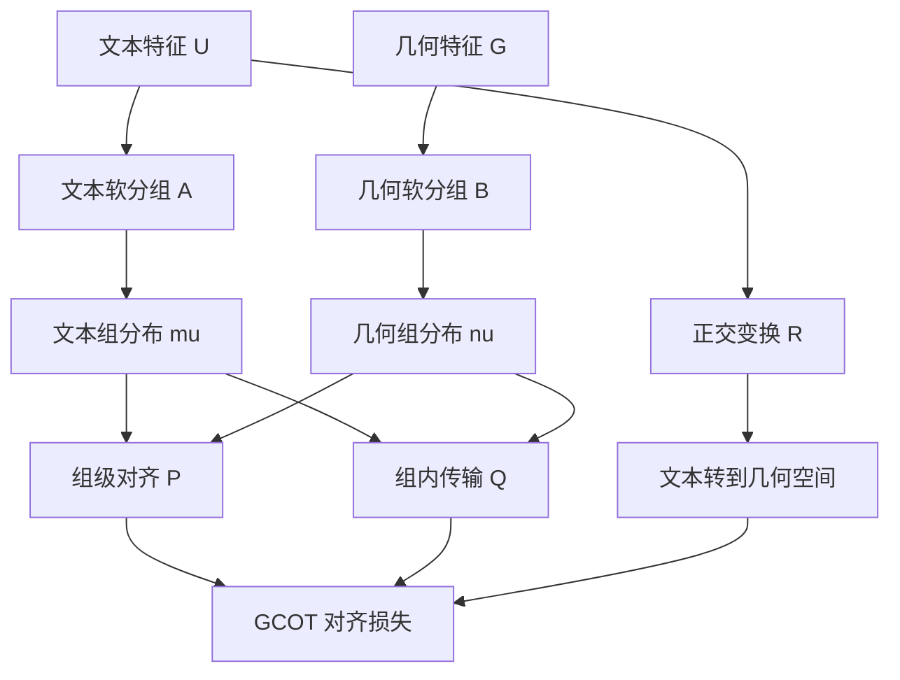

# Taco 精读笔记 07：GCOT 详细解释

论文：Learning Geometric Knowledge from Text for Effective Geometry-Free Adsorption Configuration Screening

本节主题：Group-Conditioned Optimal Transport，简称 GCOT，中文可以译为“组条件最优传输”或“组条件 OT”。

---

## 1. 这一节先解决什么问题

前面我们已经知道，Taco 有两条表示路线：

| 英文术语 | 中文 | 含义 |
|---|---|---|
| Text tokens | 文本标记 | 由 Semantic Encoder 从文本描述中提取出的向量 |
| Geometry tokens | 几何标记 | 由 Geometric Encoder 从三维结构中提取出的向量 |
| Alignment | 对齐 | 让两种模态的表示建立对应关系 |
| Optimal Transport | 最优传输 | 用最小代价把一个分布搬运到另一个分布 |
| GCOT | 组条件最优传输 | 先对齐组，再对齐组内样本 |

这节的核心问题是：

> 文本 token 和几何 token 都是一堆向量，如何让文本向量学到几何向量里的结构知识？

如果只说“让它们靠近”，太粗糙。Taco 希望做得更细：

> 先判断哪一类文本特征对应哪一类几何特征，再判断具体样本之间如何对应。

这就是 GCOT 的作用。

---

## 2. 为什么不是直接一一匹配

假设现在有 $N$ 个样本。每个样本既有文本表示，也有几何表示。

文本特征矩阵可以写成：

$$
\bar{U} = [u_1, u_2, \dots, u_N] \in \mathbb{R}^{d \times N}
$$

几何特征矩阵可以写成：

$$
\bar{G} = [g_1, g_2, \dots, g_N] \in \mathbb{R}^{d \times N}
$$

其中：

- $u_k$ 是第 $k$ 个样本的文本向量；
- $g_k$ 是第 $k$ 个样本的几何向量；
- $d$ 是向量维度；
- $N$ 是样本数量。

最简单的想法是：

> 第 $k$ 个文本向量 $u_k$ 应该对应第 $k$ 个几何向量 $g_k$。

但论文没有只做这么简单的对应。原因是：

1. 文本模态和几何模态的信息粒度不同；
2. 文本描述可能很粗，几何结构更细；
3. 两个特征空间可能整体发生旋转、错位或局部结构扰动；
4. 直接逐点匹配容易被噪声和异常点影响。

所以 Taco 采用一种更稳定的策略：

> 不先匹配单个样本，而是先把样本软分到若干组，再做组级对齐和组内对齐。

---

## 3. Soft Group Assignment：软分组

**Soft Group Assignment（软分组）** 是 GCOT 的第一步。

它不是把每个样本硬塞进某一个唯一类别，而是让每个样本对多个组都有不同程度的隶属度。

例如某个文本样本可能属于三个组的程度是：

| 组 | 隶属度 |
|---|---:|
| group 1 | 0.70 |
| group 2 | 0.20 |
| group 3 | 0.10 |

这表示它主要属于 group 1，但也带有一点 group 2 和 group 3 的特征。

这对化学体系很自然。因为一个吸附构型可能不是绝对属于某一种模式，而可能同时带有几种局部环境特征。

---

## 4. Semantic prototypes：语义原型

论文给文本模态设置一组可以学习的语义原型：

$$
C^{\text{text}} = [c_1^{\text{text}}, c_2^{\text{text}}, \dots, c_S^{\text{text}}] \in \mathbb{R}^{d \times S}
$$

这里：

- $S$ 是组的数量；
- $c_i^{\text{text}}$ 是第 $i$ 个文本组的中心或原型；
- prototype 可以译为“原型”或“组中心”。

每个文本样本 $u_k$ 会和所有文本原型比较相似度，然后经过 softmax 得到隶属度：

$$
A_{ki} = \frac{\exp(u_k^\top c_i^{\text{text}})}{\sum_{s=1}^{S}\exp(u_k^\top c_s^{\text{text}})}
$$

这里 $A_{ki}$ 的含义是：

> 第 $k$ 个文本样本属于第 $i$ 个文本组的程度。

注意 $A_{k,:}$ 是一个概率分布，所以：

$$
\sum_{i=1}^{S} A_{ki} = 1
$$

---

## 5. 为什么要有重构损失和熵正则

论文不是随便学这些原型，而是通过一个目标函数来学习：

$$
\min_{C^{\text{text}}}
\left\| A(C^{\text{text}})^\top - \bar{U}^\top \right\|_F^2
- \lambda_h \frac{1}{N}\sum_{k=1}^{N} H(A_{k,:})
$$

这个式子看起来复杂，但拆开很简单。

### 5.1 第一项：重构损失

$$
\left\| A(C^{\text{text}})^\top - \bar{U}^\top \right\|_F^2
$$

意思是：

> 用若干个组原型加权组合，能不能还原原来的文本样本特征？

如果能还原，说明这些 prototype 确实捕捉到了文本特征中的主要结构。

直观理解：

> 每个文本样本都被表示成若干个组中心的加权平均。

### 5.2 第二项：熵正则

$$
- \lambda_h \frac{1}{N}\sum_{k=1}^{N} H(A_{k,:})
$$

这里 $H(\cdot)$ 是 Shannon entropy，香农熵。

它的作用是：

> 防止所有样本都塌缩到同一个组里。

如果没有这一项，模型可能偷懒：所有样本都分到同一个 prototype，表面上优化了某些项，但分组没有任何意义。

所以这项鼓励分组保持一定多样性。

---

## 6. 几何模态也做同样的软分组

文本有语义原型，几何也有几何原型：

$$
C^{\text{geo}} = [c_1^{\text{geo}}, c_2^{\text{geo}}, \dots, c_S^{\text{geo}}] \in \mathbb{R}^{d \times S}
$$

然后得到几何样本的软分组矩阵：

$$
B_{lj} = \frac{\exp(g_l^\top c_j^{\text{geo}})}{\sum_{s=1}^{S}\exp(g_l^\top c_s^{\text{geo}})}
$$

这里 $B_{lj}$ 表示：

> 第 $l$ 个几何样本属于第 $j$ 个几何组的程度。

到这里，我们有两个软分组矩阵：

| 矩阵 | 中文 | 含义 |
|---|---|---|
| $A$ | 文本软分组矩阵 | 文本样本属于各文本组的程度 |
| $B$ | 几何软分组矩阵 | 几何样本属于各几何组的程度 |

---

## 7. 从“分组”变成“概率测度”

最优传输要比较的是两个概率分布。因此 Taco 下一步把每个组看成一个离散概率测度。

对于第 $i$ 个文本组，定义：

$$
\mu_i := \sum_{k=1}^{N} a_k^{(i)} \delta_{U_i(k)}
$$

对于第 $j$ 个几何组，定义：

$$
\nu_j := \sum_{l=1}^{N} b_l^{(j)} \delta_{G_j(l)}
$$

这里：

- $\mu_i$ 是第 $i$ 个文本组对应的概率测度；
- $\nu_j$ 是第 $j$ 个几何组对应的概率测度；
- $\delta_x$ 是集中在点 $x$ 上的 Dirac 测度；
- $a_k^{(i)}$ 是文本样本 $k$ 在文本组 $i$ 里的归一化权重；
- $b_l^{(j)}$ 是几何样本 $l$ 在几何组 $j$ 里的归一化权重。

这里的关键是：

> 每一个 group 不是一个单点，而是一整个带权样本分布。

也就是说，文本组 $i$ 不是只有一个中心点，而是由很多文本样本按不同权重组成。几何组 $j$ 也是如此。

---

## 8. Group-level alignment：组级对齐

现在我们有很多文本组：

$$
\mu_1, \mu_2, \dots, \mu_S
$$

也有很多几何组：

$$
\nu_1, \nu_2, \dots, \nu_S
$$

问题变成：

> 哪个文本组应该对应哪个几何组？

这就是 **Group-level Alignment（组级对齐）**。

论文用一个矩阵 $P$ 表示组和组之间的对应关系：

$$
P \in \mathbb{R}^{S \times S}
$$

其中 $P_{ij}$ 表示：

> 文本组 $i$ 和几何组 $j$ 的对应强度。

如果 $P_{ij}$ 大，说明文本组 $i$ 很可能对应几何组 $j$。

论文要求 $P$ 属于 Birkhoff polytope：

$$
\mathcal{B}_S = \mathcal{U}\left(\frac{1_S}{S}, \frac{1_S}{S}\right)
$$

这表示 $P$ 是一个双随机矩阵：

$$
\sum_j P_{ij} = \frac{1}{S}, \qquad \sum_i P_{ij} = \frac{1}{S}, \qquad P_{ij} \geq 0
$$

直觉是：

> 文本组和几何组之间不是随便乱连，而是要形成一个比较均衡的软匹配。

---

## 9. Instance-level alignment：样本级对齐

组级对齐只回答：

> 文本组 $i$ 对应几何组 $j$ 的程度是多少？

但一个组内部仍然有很多样本。所以还需要回答：

> 在文本组 $i$ 和几何组 $j$ 内部，具体哪个文本样本应该搬到哪个几何样本？

这就是 **Instance-level Alignment（实例级对齐 / 样本级对齐）**。

论文用 $Q_{ij}$ 表示组 $i$ 和组 $j$ 内部的传输方案：

$$
Q_{ij} \in \mathbb{R}^{N \times N}
$$

其中 $Q_{ij}(k,l)$ 表示：

> 在文本组 $i$ 和几何组 $j$ 的匹配中，有多少质量从文本样本 $k$ 搬到几何样本 $l$。

$Q_{ij}$ 要满足边缘约束：

$$
\sum_l Q_{ij}(k,l) = a_k^{(i)}, \qquad
\sum_k Q_{ij}(k,l) = b_l^{(j)}, \qquad
Q_{ij}(k,l) \geq 0
$$

这表示：

> 搬出去的总质量要等于文本组里的权重，搬进来的总质量要等于几何组里的权重。

---

## 10. Wasserstein 距离：衡量两个组有多像

文本组 $\mu_i$ 和几何组 $\nu_j$ 的差异，用平方 2-Wasserstein 距离衡量：

$$
W_2^2(\mu_i, \nu_j)
:=
\min_{Q \in \mathcal{U}(a^{(i)}, b^{(j)})}
\sum_{k=1}^{N}\sum_{l=1}^{N}
Q(k,l)\left\|U_i(k)-G_j(l)\right\|_2^2
$$

这个式子的意思是：

> 把文本组 $\mu_i$ 的质量搬到几何组 $\nu_j$，最小总搬运成本是多少。

如果这个值小，说明两个组很像；如果这个值大，说明它们差异很大。

这里的成本是欧氏距离平方：

$$
\left\|U_i(k)-G_j(l)\right\|_2^2
$$

即文本样本 $k$ 和几何样本 $l$ 在特征空间里的距离平方。

---

## 11. Stiefel manifold：Stiefel 流形上的正交对齐

论文并不是直接比较 $U_i(k)$ 和 $G_j(l)$，而是先学习一个变换 $R$，把文本特征转到几何特征空间。

它要求：

$$
R \in \mathcal{V}_{d,d}
$$

其中：

$$
\mathcal{V}_{d,d} := \{R \in \mathbb{R}^{d \times d} : R^\top R = I\}
$$

这就是 **Stiefel manifold（Stiefel 流形）**。在 $d \times d$ 的情形下，它就是所有正交矩阵的集合。

正交矩阵的直觉是：

> 它可以旋转或反射向量，但不会拉伸、压缩或扭曲距离。

因此如果用 $R$ 变换文本特征：

$$
U_i(k) \mapsto R U_i(k)
$$

那么文本特征内部的距离和角度结构会被保留。

这和你之前学过的 Procrustes 很像：

> 找一个正交矩阵，把一个点云旋转到另一个点云附近，同时尽量不破坏原来点云的形状。

---

## 12. GCOT 的核心优化问题

加入正交变换 $R$ 后，文本组 $i$ 到几何组 $j$ 的代价定义为：

$$
C_{ij}(R, Q_{ij})
:=
\sum_{k,l} Q_{ij}(k,l)
\left\| R U_i(k) - G_j(l) \right\|_2^2
$$

然后整体优化问题是：

$$
\min_{P,R,\{Q_{ij}\}}
\sum_{i,j} P_{ij} C_{ij}(R,Q_{ij})
$$

约束为：

$$
P \in \mathcal{B}_S, \qquad
R \in \mathcal{V}_{d,d}, \qquad
Q_{ij} \in \mathcal{U}(a^{(i)}, b^{(j)})
$$

这就是 GCOT 的核心：

> 用 $P$ 解决组和组之间怎么匹配，用 $Q_{ij}$ 解决组内样本怎么匹配，用 $R$ 解决文本空间和几何空间怎么旋转对齐。

---

## 13. 为什么加熵正则

直接求上面的最优传输问题比较难，而且解可能太尖锐。论文因此加入熵正则：

$$
\min_{P,R,\{Q_{ij}\}}
\sum_{i,j}\left(P_{ij}C_{ij}(R,Q_{ij}) + \lambda_2 H(Q_{ij})\right)
+ \lambda_1 H(P)
$$

其中 $\lambda_1, \lambda_2 > 0$。

这里要注意论文的记号：它把

$$
H(P) := \sum_{i,j} P_{ij}\log P_{ij}
$$

称为 entropy term。严格来说，这个形式是 Shannon entropy 的相反数。因为 $0 < P_{ij} < 1$ 时，$P_{ij}\log P_{ij}$ 通常是负数。

它的实际作用是：

> 让传输方案更平滑，避免过早变成非常僵硬的一一匹配。

当 $\lambda_1, \lambda_2 \to 0$ 时，问题逐渐接近原始的、没有熵正则的最优传输问题。

当 $\lambda_1, \lambda_2$ 较大时，传输方案更平滑，优化更稳定，但可能引入额外偏差。

---

## 14. ADMM：为什么要用交替方向乘子法

论文说这个问题不能简单直接求解，因为它同时包含：

- $P$：组级传输矩阵；
- $Q_{ij}$：组内传输矩阵；
- $R$：Stiefel 流形上的正交矩阵。

这些变量互相耦合，而且约束复杂。因此论文采用 **ADMM（Alternating Direction Method of Multipliers，交替方向乘子法）**。

ADMM 的直觉是：

> 不要一次性把所有变量一起解，而是拆成几个子问题，轮流优化，再通过约束把它们协调起来。

论文引入局部旋转变量 $R_{ij}$，让每个组对 $(i,j)$ 先有自己的局部对齐变换，然后要求它们最后达成一个共同的全局变换 $\tilde{R}$：

$$
R_{ij} = \tilde{R}, \qquad \forall i,j
$$

这个思路可以理解为：

> 每个组对先自己找到一个局部旋转方案，最后大家投票或协调出一个统一的全局旋转方案。

这样原本非常耦合的问题就可以分块优化。

---

## 15. 和 HiWA 的对应关系

这一节和 HiWA 的关系非常明显。

| HiWA | Taco / GCOT |
|---|---|
| cluster | group，组 |
| cluster-level alignment | group-level alignment，组级对齐 |
| sample-level alignment | instance-level alignment，样本级对齐 |
| $P$ 表示簇之间的匹配 | $P$ 表示文本组和几何组之间的匹配 |
| $Q_{ij}$ 表示簇内样本传输 | $Q_{ij}$ 表示组内文本样本到几何样本的传输 |
| Procrustes / orthogonal alignment | Stiefel manifold 上的正交变换 $R$ |
| Sinkhorn / entropy regularization | 熵正则化的 OT 近似 |
| ADMM | 用于分块求解耦合优化问题 |

所以你可以把 GCOT 看成：

> HiWA 思想在文本-几何跨模态对齐里的一个应用版本。

---

## 16. 一张流程图记住 GCOT

文字版结构：

1. 文本编码器产生文本特征 $U$；
2. 几何编码器产生几何特征 $G$；
3. 文本特征通过软分组得到文本组分布 $\mu_i$；
4. 几何特征通过软分组得到几何组分布 $\nu_j$；
5. $P$ 负责文本组和几何组的组级匹配；
6. $Q_{ij}$ 负责某一组对内部的样本级匹配；
7. $R$ 负责把文本特征整体旋转到几何特征空间；
8. 最终形成 GCOT 对齐损失。

---

## 17. 本节最重要的三句话

第一：

> GCOT 不是直接把文本样本和几何样本硬匹配，而是先软分组，再做组级和样本级两层对齐。

第二：

> $P$ 管“哪个文本组对应哪个几何组”，$Q_{ij}$ 管“组内具体样本怎么搬运”。

第三：

> $R$ 是 Stiefel 流形上的正交变换，作用是把文本特征旋转到几何特征空间，同时尽量不破坏文本特征内部结构。

---

## 18. 这一节暂时不必完全掌握的内容

你现在不必完全掌握：

- ADMM 的每一步具体更新公式；
- Stiefel 流形优化的数值细节；
- Sinkhorn 迭代的实现细节；
- 熵正则化后每个变量的精确求解过程。

现阶段只要明白：

> Taco 用 GCOT 把文本表示和几何表示做层级对齐，从而让文本在训练中吸收几何知识。

下一节可以继续讲 **Prediction Head（预测头）** 和 **Geometry-Free Inference（无几何推理）**：即对齐后的文本特征如何真正用于预测吸附能。
