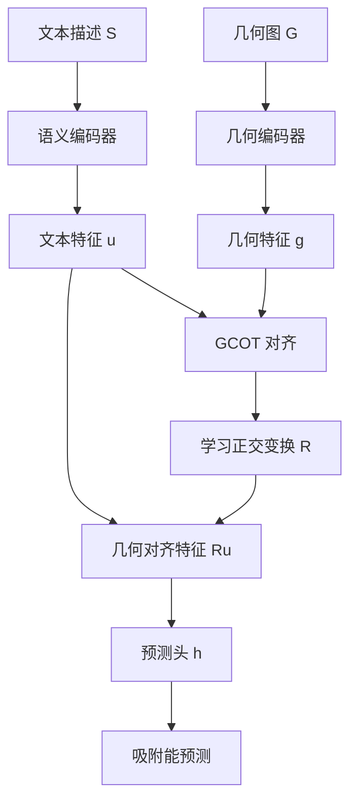
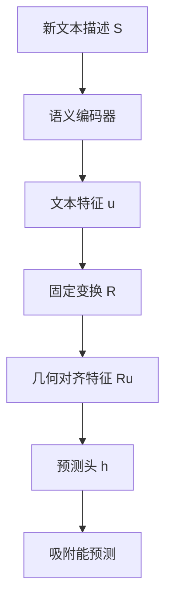

# Taco 精读笔记 08：Prediction Head 与 Geometry-Free Inference

## 0. 本节位置

前面我们已经看懂了 Taco 的核心对齐模块：

> GCOT（Group-Conditioned Optimal Transport，组条件最优传输）本质上是 HiWA 风格的层级最优传输：先软分组，再用 $P$ 做组级对齐，用 $Q_{ij}$ 做组内样本传输，用 $R$ 做文本空间到几何空间的正交变换，并通过 Sinkhorn 与 ADMM 求解。

这一节要回答的问题是：

> GCOT 对齐完之后，Taco 到底怎样预测 adsorption energy（吸附能）？为什么推理阶段可以做到 geometry-free（无几何推理）？

本节对应论文中的两个小节：

- **Prediction Head**：预测头；
- **Geometry-Free Inference**：无几何推理。

---

## 1. 先说结论

Taco 在训练阶段学到了一个从文本特征到几何特征空间的映射：

$$
\hat{g}_i = R u_i
$$

其中：

- $u_i$ 是第 $i$ 个样本的 semantic embedding（语义嵌入 / 文本向量）；
- $R$ 是 GCOT 学到的 Stiefel transformation（Stiefel 变换 / 正交变换）；
- $\hat{g}_i$ 是 geometry-aligned feature（几何对齐特征）。

然后 Taco 用一个轻量的 predictor（预测器），通常是 MLP（多层感知机），把 $\hat{g}_i$ 映射成一个吸附能预测值：

$$
\hat{y}_i = h(\hat{g}_i)
$$

其中 $h(\cdot)$ 就是 prediction head（预测头）。

所以这一节的主线非常简单：

> 文本特征 $u_i$ 经过 $R$ 变成几何对齐特征 $\hat{g}_i$，再经过预测头 $h$ 输出吸附能 $\hat{y}_i$。

---

## 2. Prediction Head 是什么？

**Prediction Head（预测头）** 是深度学习论文里常见的说法。

它不是人的头，而是模型最后接上的一个小模块。

可以这样理解：

> 前面的编码器和对齐模块负责提取特征，prediction head 负责把这些特征转换成最终任务需要的输出。

在 Taco 里，最终任务是预测 adsorption energy（吸附能），所以 prediction head 的作用就是：

> 把 geometry-aligned feature（几何对齐特征）变成一个标量能量值。

这里的“标量”意思是输出一个数，比如预测吸附能为 $-1.25$ eV。

---

## 3. 从 text feature 到 geometry-aligned feature

论文这里最关键的一句话是：

> GCOT 不仅对齐了两个模态的分布，还产生了一个能把文本特征运输到几何潜在空间的具体映射。

这个映射就是 $R$。

前面 GCOT 学到的是：

$$
R^\top R = I
$$

也就是说，$R$ 是一个正交变换。

对任意文本样本，它先经过 Semantic Encoder（语义编码器）得到文本向量：

$$
u_i
$$

然后用 $R$ 做变换：

$$
\hat{g}_i = R u_i
$$

这里的 $\hat{g}_i$ 不是原始三维坐标，也不是直接的原子结构图，而是：

> text-derived geometry-aligned feature（由文本生成的几何对齐特征）。

也可以更口语地说：

> 它是“带几何味道的文本向量”。

---

## 4. 为什么 $R$ 要是正交的？

这是和 HiWA / Procrustes 最接近的地方。

如果 $R$ 是任意神经网络，它可能会把文本空间随意拉伸、压扁、扭曲。这样虽然训练损失可能下降，但原来的文本特征结构可能被破坏。

正交矩阵的好处是：

$$
R^\top R = I
$$

这意味着它主要做旋转或反射，不改变向量长度，也不破坏向量之间的内积结构。

所以论文这里的直觉是：

> 文本空间和几何空间之间不是完全乱映射，而是尽量通过刚性变换把文本特征旋转到几何潜在空间。

这就很像 Procrustes 问题：

> 给定两组点，找一个正交变换，让它们尽量对齐。

在 Taco 中，这个正交变换通过 GCOT 和 ADMM 学到。

---

## 5. 吸附能预测变成普通回归问题

得到 $\hat{g}_i$ 之后，后面的任务就很普通了：

$$
\hat{y}_i = h(\hat{g}_i)
$$

其中：

- $h$ 是 prediction head（预测头）；
- $\hat{g}_i$ 是几何对齐特征；
- $\hat{y}_i$ 是预测出来的 normalized adsorption energy（归一化吸附能）。

这一步没有复杂的最优传输了。

最优传输已经在前面把文本表示对齐到了几何表示，现在只需要做 energy regression（能量回归）。

---

## 6. 为什么要做 z-score normalization？

论文说，为了让训练更稳定，会先把真实吸附能做 z-score normalization（z 分数归一化）：

$$
\bar{y}_i = \frac{y_i - \mu}{\sigma}
$$

其中：

- $y_i$ 是原始吸附能；
- $\mu$ 是训练集吸附能的均值；
- $\sigma$ 是训练集吸附能的标准差；
- $\bar{y}_i$ 是归一化后的吸附能标签。

直觉上，就是把能量值统一到比较稳定的尺度上。

这样做的好处是：

> 防止能量数值尺度太大或分布太偏，导致神经网络训练不稳定。

模型预测的是归一化后的吸附能 $\hat{y}_i$，训练完成后如果需要原始单位，可以再反归一化。

---

## 7. 为什么用 MAE loss？

论文使用 MAE（Mean Absolute Error，平均绝对误差）作为能量预测损失：

$$
\mathcal{L}_{\text{energy}}
= \frac{1}{|\mathcal{B}|} \sum_{i \in \mathcal{B}} |\hat{y}_i - \bar{y}_i|
$$

其中：

- $\mathcal{B}$ 是当前 mini-batch（小批量样本）；
- $\hat{y}_i$ 是模型预测值；
- $\bar{y}_i$ 是归一化后的真实值。

MAE 的直觉是：

> 预测值和真实值差多少，就罚多少。

论文提到 MAE 对 outliers（离群点）更 robust（稳健）。

如果用平方误差，特别大的错误会被平方放大，可能让少数异常样本过度影响训练。MAE 更直接地衡量平均预测误差。

---

## 8. 总损失函数

Taco 的训练目标由两部分组成：

$$
\mathcal{L} = \mathcal{L}_{\text{map}} + \lambda \mathcal{L}_{\text{energy}}
$$

其中：

- $\mathcal{L}_{\text{map}}$ 是 GCOT alignment loss（GCOT 对齐损失）；
- $\mathcal{L}_{\text{energy}}$ 是 energy regression loss（能量回归损失）；
- $\lambda$ 是权重系数，用来平衡两部分损失。

这说明 Taco 同时在做两件事：

1. 让文本表示和几何表示对齐；
2. 让对齐后的文本表示能够预测吸附能。

所以它不是单纯做 representation alignment（表示对齐），也不是单纯做 energy prediction（能量预测），而是把两者结合起来。

---

## 9. Selective Fine-Tuning：选择性微调

论文还提到一个重要训练策略：**Selective Fine-Tuning（选择性微调）**。

它的意思是：

> 不是所有模块都一起继续训练，而是冻结一部分模块，只更新另一部分模块。

论文中选择冻结：

- Geometric Encoder（几何编码器）；
- GCOT alignment modules（GCOT 对齐模块）；
- Stiefel transformation $R$（正交变换矩阵 $R$）。

继续更新：

- Semantic Encoder（语义编码器）；
- Energy Regression Head（能量回归头 / 预测头）。

为什么这样做？

因为吸附数据通常有限，如果所有模块一起训练，可能过拟合。

而几何编码器和 GCOT 对齐已经学到了比较有价值的几何结构知识，论文希望保留它们，不要在小数据上被破坏。

所以它的策略是：

> 几何知识和跨模态映射保持稳定，只让文本处理部分和最终预测器适应吸附能预测任务。

---

## 10. Geometry-Free Inference 是什么？

**Geometry-Free Inference（无几何推理）** 是 Taco 的核心卖点之一。

它不是说模型完全没有学过几何，也不是说几何不重要。

准确说，它的意思是：

> 推理阶段不需要输入对应的三维原子结构，也不需要运行几何编码器。

训练时：

$$
G \rightarrow \text{Geometric Encoder} \rightarrow \text{Geometry Tokens}
$$

$$
S \rightarrow \text{Semantic Encoder} \rightarrow \text{Text Tokens}
$$

然后通过 GCOT 对齐。

推理时：

$$
S^* \rightarrow \text{Semantic Encoder} \rightarrow u^* \rightarrow R u^* \rightarrow h(Ru^*) \rightarrow \hat{y}^*
$$

也就是说，新样本只需要文本描述 $S^*$。

不再需要：

$$
G^* \rightarrow \text{Geometric Encoder}
$$

这就是 geometry-free 的含义。

---

## 11. Geometry-Free 到底 free 掉了什么？

这里一定要分清楚。

Taco 不是 free 掉了所有几何知识。

它 free 掉的是推理阶段的显式几何输入和几何编码器计算。

| 项目 | 训练阶段 | 推理阶段 |
|---|---|---|
| 文本描述 $S$ | 使用 | 使用 |
| 三维几何图 $G$ | 使用 | 不使用 |
| Geometric Encoder（几何编码器） | 使用 | 不使用 |
| Semantic Encoder（语义编码器） | 使用 | 使用 |
| GCOT 对齐 | 用于学习映射 | 不重新求解 |
| 正交变换 $R$ | 学习得到 | 直接使用 |
| Prediction Head（预测头） | 训练 | 使用 |

所以更精确的说法是：

> Taco 是 inference-time geometry-free，而不是 training-time geometry-free。

也就是：

> 训练时借几何，推理时省几何。

---

## 12. 这和前面的 GCOT 怎么接起来？

现在我们可以把整篇方法的逻辑串起来：

推理阶段可以简化成：

文字版结构说明：

1. 训练时，文本和几何都进入模型；
2. GCOT 学会文本表示到几何表示的对齐；
3. 对齐后得到变换 $R$；
4. 推理时，只输入文本；
5. 文本特征经过 $R$ 得到几何对齐特征；
6. 预测头输出吸附能。

---

## 13. 这一节和 HiWA 的关系

GCOT 部分和 HiWA 高度同构。

但是 Prediction Head 和 Geometry-Free Inference 是 Taco 自己面向化学任务的关键落地部分。

HiWA 主要关心：

> 两个分布如何对齐。

Taco 更关心：

> 对齐之后，能不能让文本模型在推理时替代几何模型，用于吸附构型筛选。

所以 Taco 的应用逻辑是：

1. 用 HiWA-style GCOT 对齐文本和几何；
2. 得到文本到几何潜在空间的映射 $R$；
3. 用 $R u$ 作为预测吸附能的特征；
4. 推理阶段只用文本，跳过几何图和几何编码器。

---

## 14. 你现在应该形成的判断

Taco 的方法可以分成两层贡献：

### 第一层：数学工具层

GCOT 这部分基本继承了 HiWA 风格的层级 OT 框架。

这一层你已经学过，所以不需要重新恐惧。

### 第二层：化学任务落地层

Taco 把这个对齐工具用于吸附构型筛选。

它真正想证明的是：

> 只要训练阶段用几何监督文本，推理阶段只靠文本也可以较好地预测吸附能，从而实现高效的 adsorption configuration screening。

这才是论文相对于 HiWA 的任务价值。

---

## 15. 本节术语卡片

| 英文 | 中文 | 直觉 |
|---|---|---|
| Prediction Head | 预测头 | 模型最后输出任务结果的小模块 |
| Energy Regression Head | 能量回归头 | 专门预测吸附能的预测头 |
| MLP | 多层感知机 | 常见的小型神经网络模块 |
| Geometry-Aligned Feature | 几何对齐特征 | 文本经过 $R$ 映射后的几何风格特征 |
| Stiefel Transformation | Stiefel 变换 | 满足正交约束的变换矩阵 |
| Z-score Normalization | z 分数归一化 | 把标签减均值、除标准差 |
| MAE | 平均绝对误差 | 预测值和真实值的平均绝对差 |
| Fine-Tuning | 微调 | 在已有模型基础上继续训练 |
| Selective Fine-Tuning | 选择性微调 | 只更新部分模块，冻结其余模块 |
| Geometry-Free Inference | 无几何推理 | 推理时不输入三维几何结构 |

---

## 16. 本节只记三句话

第一：

> Prediction Head（预测头）负责把几何对齐特征 $\hat{g}_i = R u_i$ 映射成吸附能预测值 $\hat{y}_i$。

第二：

> Taco 的总训练目标包含 GCOT 对齐损失和能量回归损失，即既要对齐文本和几何，也要准确预测吸附能。

第三：

> Geometry-Free Inference（无几何推理）不是完全不要几何，而是训练时借几何，推理时只用文本和固定的映射 $R$ 来预测吸附能。

