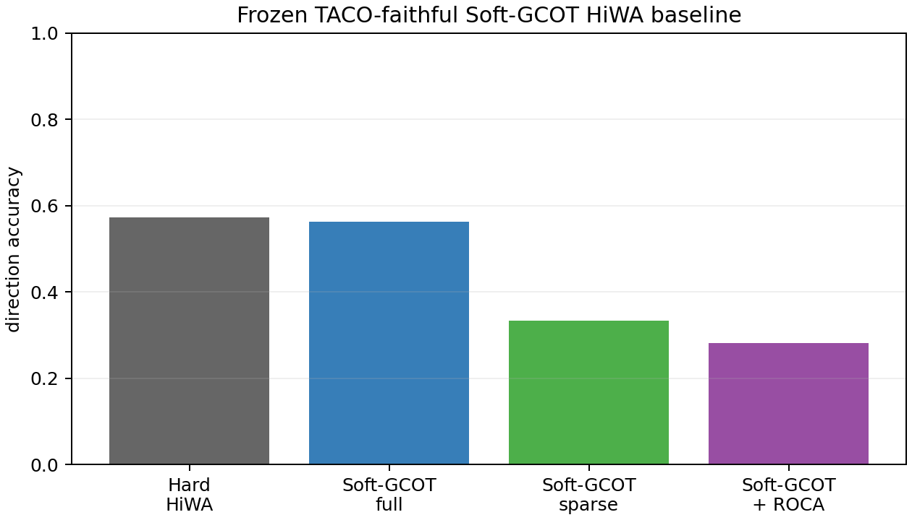

# TACO-faithful Soft-GCOT HiWA: minimal neural result

Command: `python experiments/hiwa/run_taco_faithful_baseline.py --seeds 0 --tag 20260711_minimal`.

This is a deterministic 96-by-96 neural smoke experiment. Labels were used only after fitting and branch selection to compute direction accuracy and movement $R^2$.

| Method | Accuracy | Movement $R^2$ | Max Sinkhorn error | ADMM primal residual | Runtime (s) |
|---|---:|---:|---:|---:|---:|
| Hard HiWA | 0.5729 | 0.5587 | n/a | n/a | 0.535 |
| Soft-GCOT full | 0.5625 | 0.5307 | $1.62\times10^{-4}$ | 2.8280 | 0.763 |
| Soft-GCOT sparse | 0.3333 | 0.1973 | $2.40\times10^{-5}$ | 2.5373 | 0.478 |
| Soft-GCOT + ROCA | 0.2813 | -1.2193 | $7.36\times10^{-6}$ | 2.8098 | 0.651 |

The bounded budget did not converge (large residuals); therefore this is only an execution/contrast check. Full support was close to Hard HiWA, while sparse support differed sharply. ROCA selected det$=-1$ without labels; source/target simplex condition numbers were 2.33/3.93, volume-product margin 26.79, and the diagnostic warning was `high_assignment_entropy`. It did not improve performance.

